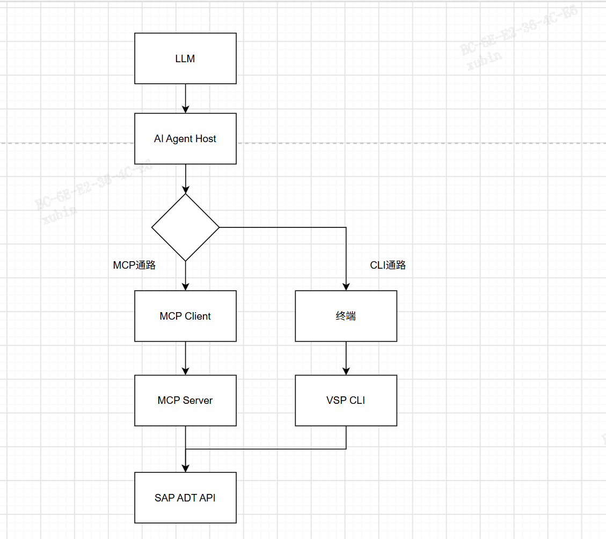
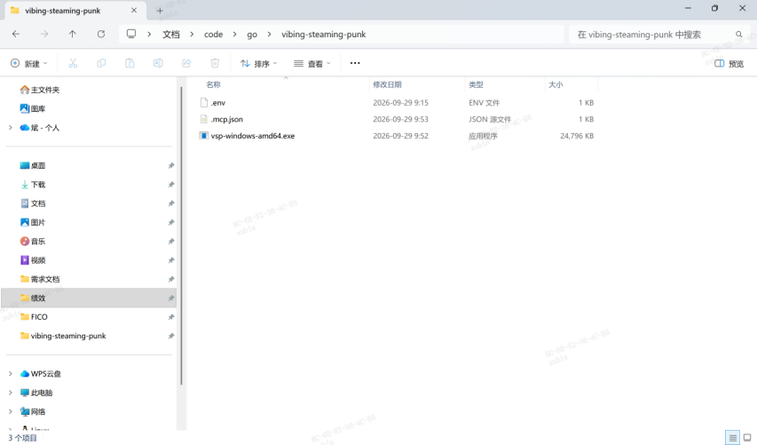
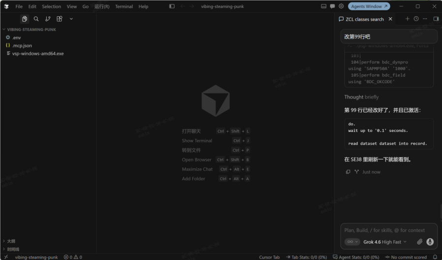
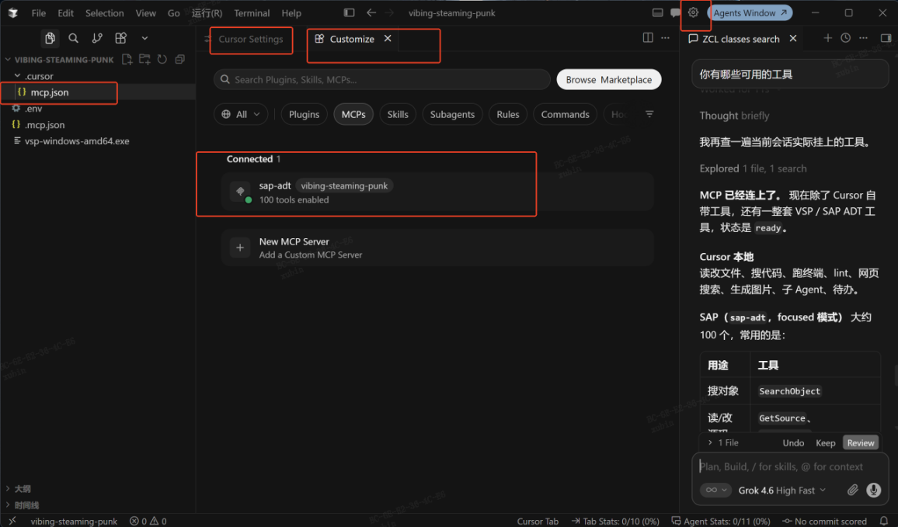
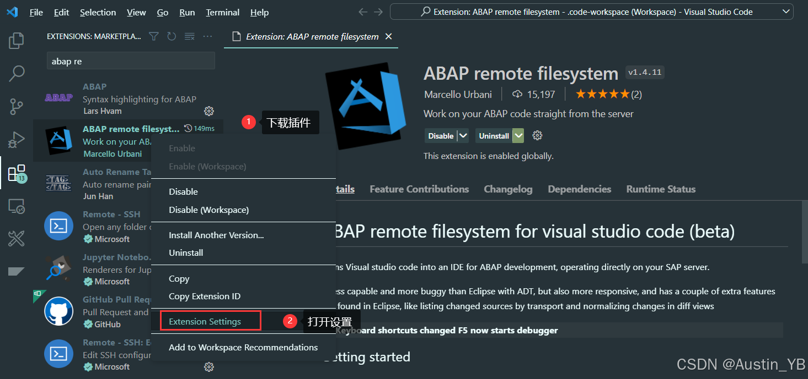
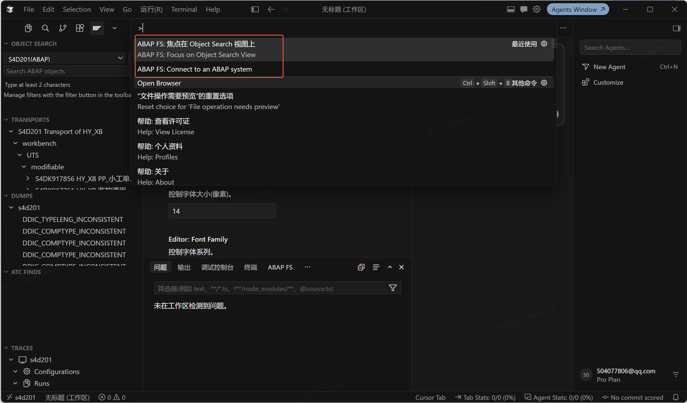

# vsp与abapfs配置
<!-- more -->
只要支持tool calling的agent配置好mcp就能用
abap fs跟vibing-steampunk走的一个方案，都是sap adt的api。但是abap fs要捆绑着用才行，没有vsp轻便:sparkle:				

## vibing-steampunk配置
### 1.vsp介绍
连上MCP后就可以使用VSB的内置的go写的各种工具

| | MCP | CLI |
|---|---|---|
| 进程 | 常驻：Cursor 拉起一份 VSP，后续工具调用复用同一进程 | 每次执行都新起一份 VSP，结束即退出 |
| SAP 会话 | 可复用（cookie / CSRF 留在进程里） | 多半每次重新登录 |
| Agent 怎么调 | 直接选 MCP 工具（如 GetSource、EditSource） | 在终端里拼 `vsp source` / `vsp query` 等命令 |
| 返回结果 | 结构化（JSON 参数和返回） | 文本表格，模型再自己解析 |
| 模型上下文 | 长期挂着大量工具定义（focused 模式约 100 个） | 几乎不占工具列表 |
| 可脚本化 | 弱 | 强，管道、批处理都方便 |
| 依赖 | 必须在 Cursor 里把 MCP Server 连上（例如 `sap-adt` 为 ready） | 不依赖 MCP 是否在线 |
| Windows 下的坑 | 参数走协议，少踩引号和换行 | PowerShell 转义容易写错 |

#### MCP 通路

| 环节 | 实际是谁 | 所有者 | 干什么 |
|---|---|---|---|
| LLM | 对话里的模型 | Cursor / 模型提供方 | 读意图，决定调哪个工具、传什么参数 |
| Agent Host | Cursor Agent 运行时 | Cursor | 管回合、权限、工具列表，执行工具调用 |
| MCP Client | Cursor 内置 MCP 客户端 | Cursor | 读 `.cursor/mcp.json`（不是根目录 `.mcp.json`），拉起并连接 Server，把工具暴露给 LLM |
| MCP Server | `vsp-windows-amd64.exe --mode focused` | VSP | 把搜对象/读源码/改程序做成 MCP 工具，转成 ADT 请求 |
| SAP ADT API | `/sap/bc/adt/...` | SAP | 真正改 SE38、查 TADIR、激活 |

#### CLI 通路

| 环节 | 实际是谁 | 所有者 | 干什么 |
|---|---|---|---|
| LLM | 对话里的模型 | Cursor / 模型提供方 | 读意图，决定敲哪条 `vsp` 命令 |
| Agent Host | Cursor Agent 运行时 | Cursor | 批准并执行终端命令 |
| 终端 | PowerShell / Shell | 操作系统 + Cursor | 启动进程、传参数、回传文本 |
| VSP CLI | 同一份 `vsp-windows-amd64.exe` | VSP | 直接解析 CLI（`source` / `query` / `edit`），再转成 ADT 请求 |
| SAP ADT API | `/sap/bc/adt/...` | SAP | 和 MCP 打同一套接口 |

### 2.vsp下载配置
1. 了解github的[vibing-steampunk项目](https://github.com/oisee/vibing-steampunk/issues)
2. 参考[教程](https://community.sap.com/t5/technology-blog-posts-by-members/try-vibing-steampunk-to-generate-abap-setting-up-vsp-with-a-cal-instance/ba-p/14341656#1)进行[vsb的下载](https://github.com/oisee/vibing-steampunk/releases/tag/v2.58.0)使用
3. .env文件
```env
SAP_URL=https://你的真实SAP地址:端口
SAP_USER=你的用户名
SAP_PASSWORD=你的密码
SAP_CLIENT=300
```
4. .mcp.json
mcp连接配置文件
```json
{
  "mcpServers": {
    "sap-adt": {
      "command": "你的vsp.exe完整路径，比如 D:\\code\\go\\vibing-steaming-punk\\vsp.exe",
      "args": ["--mode", "focused"],
      "env": {
        "SAP_PASSWORD": "你的密码"
      }
    }
  }
}
```

我用的是cursor（任意支持tool calling的agent配置好mcp就能用），他的mcp文件要放在.cursor下的.mcp.json




好的配完了，你可以去用了:frog::frog::frog:

## abap fs配置
### 1.下载cursor，按VSCODE配置ABAP
[cursor 下载安装使用（保姆教程）](https://blog.csdn.net/qq_39172792/article/details/147045027)
[Vscode中搭建ABAP开发环境](https://blog.csdn.net/qq_45824905/article/details/142065562)

#### 1.1安装ABAP Remote filesystem

配置ABAP Remote filesystem设置中settings.json，配置如下的环境
```json
{
    "window.restoreWindows": "one",
    "workbench.editor.empty.hint": "hidden",
    "files.encoding": "utf8",
    "claudeCode.preferredLocation": "panel",
    "abapfs.cleaner": {

    },
    "files.associations": {
    "*.txt": "abap",
    "*.abap": "abap"},
    "abapfs.remote": {
        "DEV200": {
            "url": "http://xxxx",
            "username": "",
            "password": "",
            "client": "",
            "language": "en",
            "allowSelfSigned": false,
            "diff_formatter": "ADT formatter",
            "maxDebugThreads": 4,
            "sapGui": {
                "disabled": true,
                "guiType": "WEBGUI_UNSAFE_EMBEDDED"
            }
        },
    },
    "abapfs.autoOpenUnsupportedInGui": false,
    "abapfs.feedSubscriptions": {

    },
    "abapfs.heartbeat.activeHours": null,
    "cursor.general.disableHttp2": true
}
```
### 2. system连接SAP
ctrl+shift+p
connect to an ABAP system连接SAP
Focus on Object search view 搜索对象:程序,接口啥的


## 参考资料

[githubvibing-steampunk](https://github.com/oisee/vibing-steampunk/issues)
[vsp教程](https://community.sap.com/t5/technology-blog-posts-by-members/try-vibing-steampunk-to-generate-abap-setting-up-vsp-with-a-cal-instance/ba-p/14341656#1)
[cursor 下载安装使用（保姆教程）](https://blog.csdn.net/qq_39172792/article/details/147045027)
[Vscode中搭建ABAP开发环境](https://blog.csdn.net/qq_45824905/article/details/142065562)