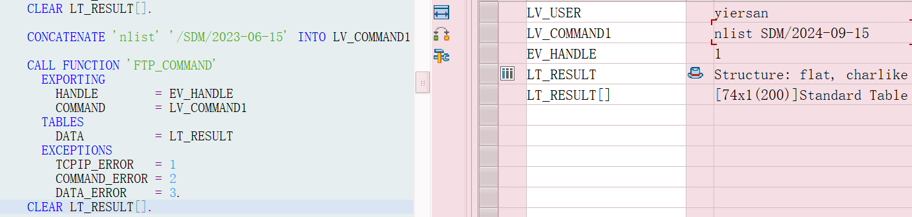
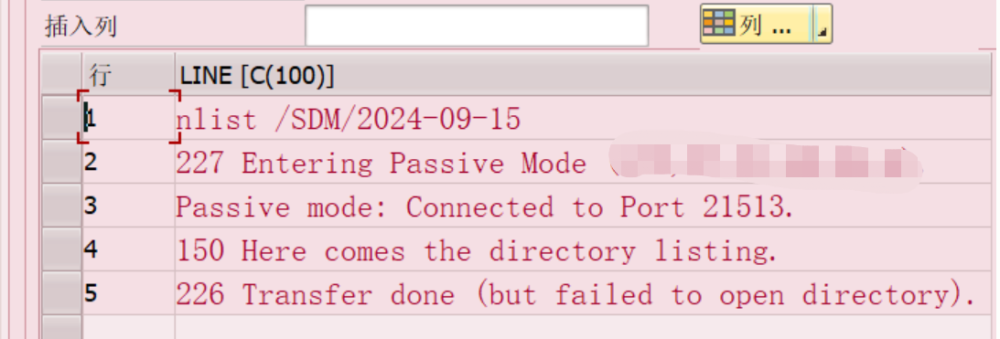

# FTP服务器连接
:::tip
FTP服务器
:::
<!-- 摘要截止标签 -->
<!-- more -->
目标:已有FTP服务器IP和账号密码，通过sap与服务器连接，下载对应的文件并下载至PC并在浏览器显示内容。
- 连接服务器还可以用webservice方式。
- pdf档案可以转换成字符串传输到其它系统(ps:没试过)
xstring字节流？
- sm30维护SAPFTP_SERVERS_V配置表
- 连接ftp服务器可能还需要VPN，测试和正式不一样(寻求basis帮忙配置):balloon:。
- 当FTP服务器方面没有对应文件时，SAP进行FTP_SERVER_TO_R3函数从FTP将文件读取到内表时，如果FTP没有此目录文件会报错->FTP 子命令: 服务器报表错误
经排查不是用户权限和网关防火墙等原因
- SDM是目录
是你ftp账号的根目录
执行此命令nlist SDM/2024-09-15，如果没有这个文件会报错226 transfer done(but failed to open directory)

- 踩坑测试的目录和正式的目录不一样
SDM/2024-09-15/20240914_20701010253_4344832_2.pdf正式
/SDM/2023-05-07/20230506_20701010253_3795391_2.pdf测试



## 代码
```abap
   CASE P_UCOMM.
    WHEN '&IC1'.
      CASE RS_SELFIELD-FIELDNAME.
        WHEN 'ZPDF'.
          IF SY-MANDT = '800'.
*            LV_USER = 'yes'.
            LV_USER = '******'.
            LV_PWD  = '******'.
            LV_HSOT = '******'."最新的正式
          ELSEIF SY-MANDT = '300'.
            LV_USER = '******'.
            LV_PWD  = '******'.
            LV_HSOT = '******'."测试
*          LV_HSOT = '******'."之前的正式
          ENDIF.
          LV_SLEN  = STRLEN( LV_PWD ).

          READ TABLE GT_DATA INTO GS_DATA INDEX RS_SELFIELD-TABINDEX.
          IF GS_DATA-ZPDF IS NOT INITIAL.

            LV_COMMAND =  GS_DATA-ZPDF.

            CALL FUNCTION 'HTTP_SCRAMBLE'
              EXPORTING
                SOURCE      = LV_PWD
                SOURCELEN   = LV_SLEN
                KEY         = KEY
              IMPORTING
                DESTINATION = LV_PWD.

***打开 FTP 服务器
            CALL FUNCTION 'FTP_CONNECT'
              EXPORTING
                USER            = LV_USER
                PASSWORD        = LV_PWD
                HOST            = LV_HSOT
                RFC_DESTINATION = 'SAPFTPA'
              IMPORTING
                HANDLE          = EV_HANDLE
              EXCEPTIONS
                NOT_CONNECTED   = 1
                OTHERS          = 2.

            IF  SY-SUBRC NE 0 .
              MESSAGE 'FTP连接失败，请联系IT部门' TYPE 'E' .
            ENDIF.

***获取FTP 指定目录文件名称
            LV_SLEN = STRLEN( LV_COMMAND ).

            CALL FUNCTION 'FTP_COMMAND'
              EXPORTING
                HANDLE        = EV_HANDLE
                COMMAND       = 'set passive on'
              TABLES
                DATA          = LT_RESULT
              EXCEPTIONS
                COMMAND_ERROR = 1
                TCPIP_ERROR   = 2.
            CLEAR LT_RESULT[].

            CONCATENATE 'nlist' '/SDM/2023-06-15' INTO LV_COMMAND1 SEPARATED BY SPACE.

            CALL FUNCTION 'FTP_COMMAND'
              EXPORTING
                HANDLE        = EV_HANDLE
                COMMAND       = LV_COMMAND1
              TABLES
                DATA          = LT_RESULT
              EXCEPTIONS
                TCPIP_ERROR   = 1
                COMMAND_ERROR = 2
                DATA_ERROR    = 3.
            CLEAR LT_RESULT[].

            CLEAR P_STATUS.
            CALL FUNCTION 'WS_QUERY'
              EXPORTING
                FILENAME       = '/SDM'
                QUERY          = 'DE'
              IMPORTING
                RETURN         = P_STATUS
              EXCEPTIONS
                INV_QUERY      = 1
                NO_BATCH       = 2
                FRONTEND_ERROR = 3
                OTHERS         = 4.

            IF P_STATUS = 0.
              CALL FUNCTION 'GUI_CREATE_DIRECTORY'
                EXPORTING
                  DIRNAME = '/SDM'
                EXCEPTIONS
                  FAILED  = 1
                  OTHERS  = 2.
            ENDIF.
            CLEAR P_STATUS.

            SELECT SINGLE * INTO @DATA(LS_002) FROM ZFIR002 WHERE BELNR  = @GS_DATA-BELNR.
            IF SY-SUBRC = 0.
              LS_002-BUDAT = LS_002-BUDAT + 1.
              P_FILENAME = '/SDM/' && LS_002-BUDAT+0(4) && '-' && LS_002-BUDAT+4(2) && '-' &&
                             LS_002-BUDAT+6(2).
            ENDIF.

            CALL FUNCTION 'WS_QUERY'
              EXPORTING
                FILENAME       = P_FILENAME
                QUERY          = 'DE'
              IMPORTING
                RETURN         = P_STATUS
              EXCEPTIONS
                INV_QUERY      = 1
                NO_BATCH       = 2
                FRONTEND_ERROR = 3
                OTHERS         = 4.

            IF P_STATUS = 0.
              P_DIRNAME = P_FILENAME.
              CALL FUNCTION 'GUI_CREATE_DIRECTORY'
                EXPORTING
                  DIRNAME = P_DIRNAME
                EXCEPTIONS
                  FAILED  = 1
                  OTHERS  = 2.
            ENDIF.
            CLEAR P_STATUS.
            IF LV_COMMAND IS NOT INITIAL AND SY-MANDT = '800'..
              LV_COMMAND = LV_COMMAND+1(98).
            ENDIF.
*          lv_command = '/SDM/2023-06-15/20230606_20701010006_3844645_2.pdf'.
            CLEAR BLOB[].
            CALL FUNCTION 'FTP_SERVER_TO_R3'
              EXPORTING
                HANDLE      = EV_HANDLE
                FNAME       = LV_COMMAND
              IMPORTING
                BLOB_LENGTH = BLOB_LENGTH
              TABLES
                BLOB        = BLOB.
            IF LV_COMMAND IS NOT INITIAL AND SY-MANDT = '800'..
              LV_COMMAND = '/' && LV_COMMAND.
            ENDIF.
            LV_COMMAND2 = LV_COMMAND.
            CALL FUNCTION 'GUI_DOWNLOAD'
              EXPORTING
                FILENAME = LV_COMMAND2
                FILETYPE = 'BIN'
              TABLES
                DATA_TAB = BLOB.

            CALL FUNCTION 'FTP_DISCONNECT'
              EXPORTING
                HANDLE = EV_HANDLE.

            CALL FUNCTION 'RFC_CONNECTION_CLOSE'
              EXPORTING
                DESTINATION = 'SAPFTP'
              EXCEPTIONS
                OTHERS      = 1.

            CALL METHOD CL_GUI_FRONTEND_SERVICES=>EXECUTE
              EXPORTING
                APPLICATION = LV_COMMAND2.
          ENDIF.
        WHEN OTHERS.
      ENDCASE.
```

<!-- <Catalog base='/' hideHeading/> -->

