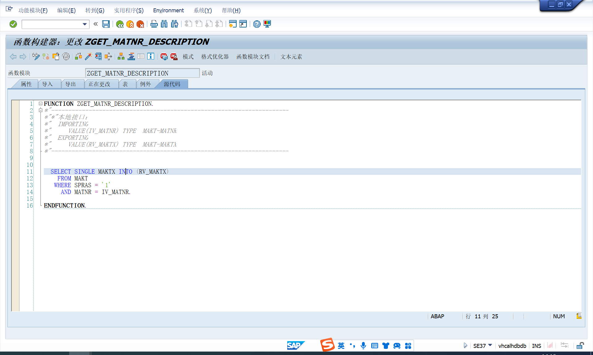
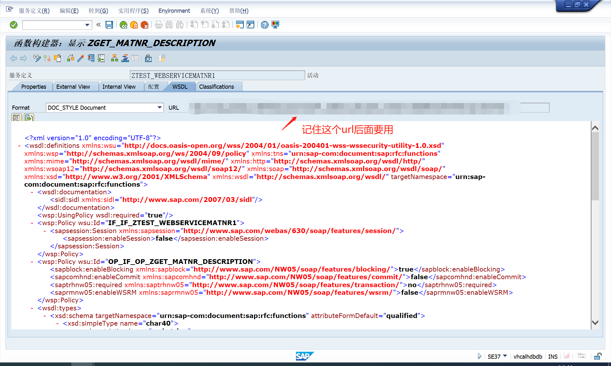
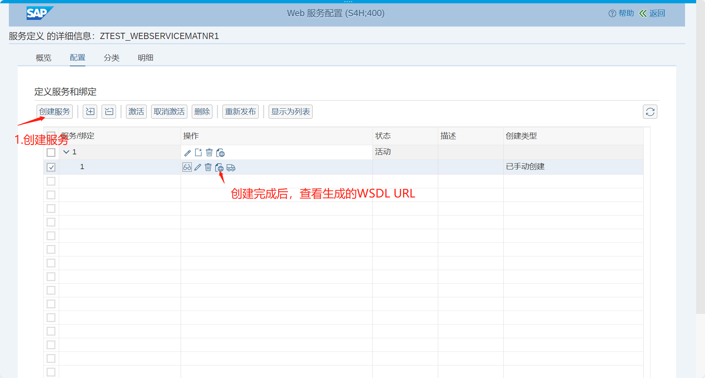
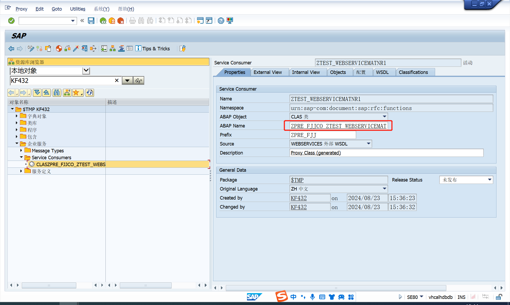
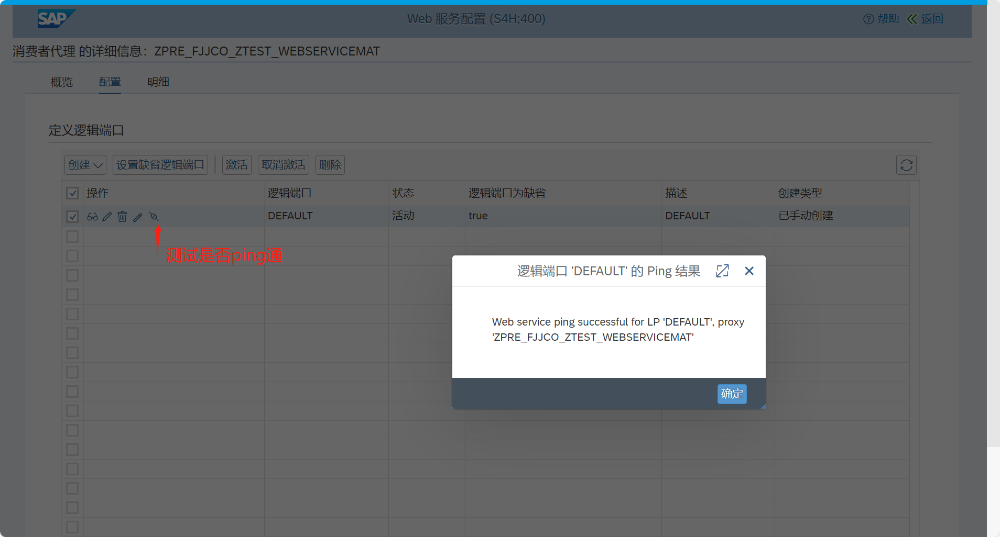
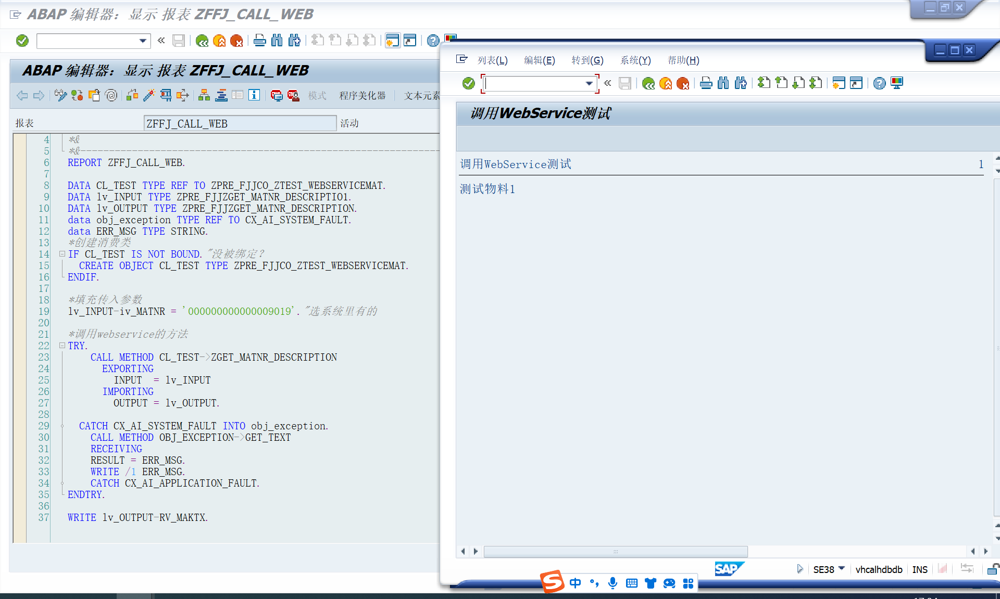

# 接口类型
<!-- 下面的语句的作用是引入文本里的内容：WebService，Http等 -->
<!-- @include: ../../file/111.txt --> 

<!-- more -->

## WebService
WebService通过网络将某种功能或资源的服务发布出来，供其他应用程序调用和使用。
Web Service 的实现依赖于一组标准和协议，这些标准确保了服务的互操作性和跨平台兼容性。下面是一些关键的技术标准：

* `XML（eXtensible Markup Language）数据格式`
* `SOAP（Simple Object Access Protocol）`
SOAP是基于XML的消息传递协议。SOAP协议支持通过HTTP、SMTP等多种传输协议，因此它具有高度的灵活性
* `WSDL（Web Services Description Language）`
WSDL是一种 XML 文档，用于描述 Web Service 的接口、方法、参数和返回值等详细信息。通过 WSDL，服务的提供者可以明确地定义服务的功能，而服务的使用者则可以通过解析 WSDL 文件，了解如何正确地调用该服务
* `UDDI（Universal Description, Discovery, and Integration）`
UDDI 是一个用于注册和发现 Web Service 的标准。它类似于一个目录服务，允许企业注册其 Web Service，并使其他企业能够查找和使用这些服务。UDDI 提供了一个集中式的目录，使得服务的发布和发现更加便捷。

### 创建WebService-服务定义
1. SE37创建Function Module.创建接口

2. 实用程序->更多实用程序->创建Web服务->来自函数模块Create WebService->From the FunctionModule：生成服务定义，记录生成的WSDL的url

3. 在创建WebService的集团输入事物代码：SOAMANAGER，以下操作会因版本的不同而有所不同（或者SICF找APPL_SOAP_MANAGEMENT右键测试服务），完成webservice的配置。进行适当的配置和权限控制，以确保安全性和正确的访问权限。测试时可以设置无密码登录，正式时最好要设置密码

### 调用WebService-消费者代理
1. 进入事务码SE80，在EnterpriseServicesBrowser里，创建一个新的ServiceConsumerProxy：客户端代理

2. 通过SOAMANAGER配置端口信息

3. 编写ABAP程序调用外部WebService

## http
cl_http_client

## 参考资料
[SAP ABAP Web Service 的创建与消费：保姆级教程-汪子熙](https://mp.weixin.qq.com/s/alqWjZLRFpTZR-jDqFOnfQ)
[SAP配置发布WebService接口并调用（超级详细）-xiao贱贱](https://blog.csdn.net/Li958172829/article/details/140065795)
[下载WebService.docx文档](/file/WebService.docx '下载文档')