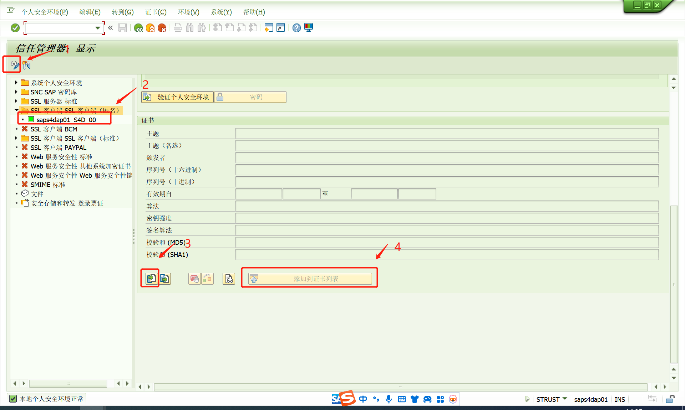
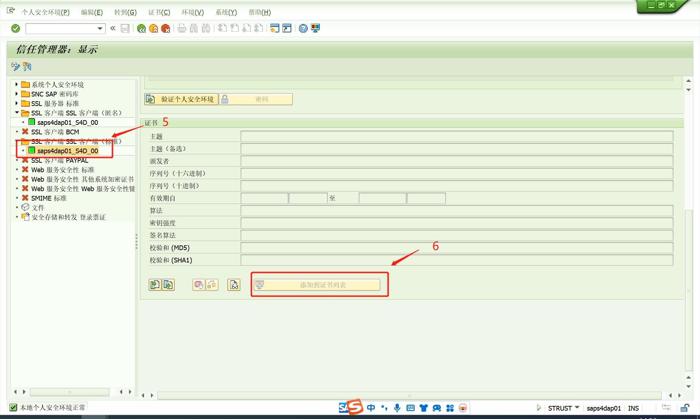

# 网站SSL证书导入SAP
<!-- more -->
https地址协议需要证书，http不要
返回500，有可能是网络不好，也有可能是SSL加密证书没有导入SAP，导入下
<!-- <VidStack
  src="../../.vuepress/public/medium/SSL证书导入.mp4"
  poster="https://files.vidstack.io/sprite-fight/poster.webp"
/> -->
## 导入步骤
导入是每个系统单独进行的，不是通过请求传输的
- 准备一下证书(向对方索要，或者自己去下我不会下问对方要的)
- 事物代码STRUST

## 参考资料
