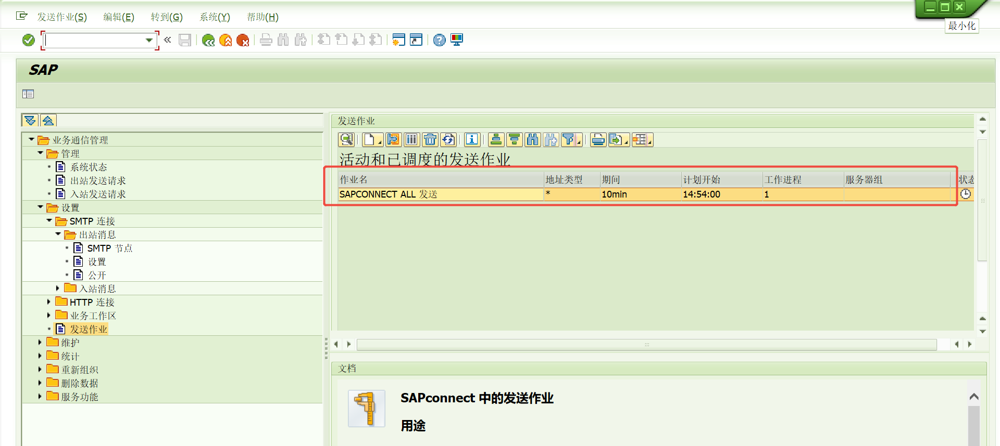

# 邮件
<!-- more -->
邮件邮件

## 导入步骤
https://blog.csdn.net/woniu_maggie/article/details/141561991


## 遇到的问题
### 1. 因为网络问题导致一直出现连接SMTP节点连接不上
邮箱地址用户端网页可以登录，但sap就是连接不上，首先确认url和端口是否正确，然后确认用户是否正常密码是否修改。url可以ping通， 加上端口就不行，最后确定是网络的策略使端口不通。
用户是前端进的，sap连是后端连的，方式不一样


### 2. 最近进行邮箱地址的迁移改成了QQ邮箱(mail.***.com->smtp.exmail.qq.com)，不知道为啥smtp.exmail.qq.com 25端口成功，465端口(SSL)加密端口就不行


### 3. 501 mail from address must be same as authorization user 
发送邮件的用户的电子邮件地址(标准号码)设置必须和节点地址相同，当然用户电子邮件地址可以维护多个

### 4. 用户想使用标准消息类型发送邮件，因为nace标准的是通过script，现在通过smartforms行不通，他们使用的是OPEN_FORM函数。ADOBE FORM应该可以但是这里没有启用所以没有测试过
使用标准的消息类型需要复制SAPFM06P，然后改写其中的ENTRY_NEU子例程，打印和发送均需重新改写

### 5. 通过地址号码和人员编号等获取邮箱地址
用户通信电子邮件地址:USR21->ADR6;BP通信E-MAIL:BUT020->ADR6;BP独立地址通信电子邮件:BUT000->ADR6

### 6. 设置定时任务来发送请求


### 7. 发送邮件，很长时间都不成功，有成功有失败。

XS756(连接错误导致消息当前无法传输到节点 &)->XS718(收件人 *** @ **.us 有效。已尝试发送)
XS756(连接错误导致消息当前无法传输到节点 &)->XS612(当前没有到 *** @ **.us 的投递)
把重复发送尝试过程的最长等待时间设长一点，多次重发就会有成功
可以用hmailserver重新搭建一套测试

可能原因:单纯网络问题、域名解析、路由、防火墙
简单点的做法，在服务器上先按照匿名方式试一下，第一步，
telnet smtp.exmail.qq.com 25
如果SAP服务器对SMTP服务器域名解析、路由都正确的话，你首先是能收到服务器的响应的，这个是最基本的。服务器能连接的话，就可以试试用你们公司的邮箱做测试了，我这里随便写了个mysap.com


在SAP服务器上先执行一下 smpt.exmail.qq.com 25端口的测试，看看能否连通。SAP里面发邮件，其实挺简单的，它类似于你在服务器上用telnet命令行一样的过程。一般我的做法是服务器上telnet通了就算通了。
To test SMTP authentication via telnet:
In a telnet client such as PuTTY, connect to the SMG appliance:

telnet <SMG_IP_address>  587
 
Greet the mail server:

EHLO mailserver.com
 
Tell SMG you want to authenticate with it:

AUTH LOGIN

The server should return the following, which is a base64 encoded string that requires your username:

334 VXNlcm5hbWU6
 
Paste the base64 encoded username. For example:

dXNlcm5hbWUuY29t

The server should return the following, which is a base64 encoded string that requires your password:

334 UGFzc3dvcmQ6
 
Paste the base64 encoded password for the username. For example:

bXlwYXNzd29yZ$4
Note: If you receive an error from this point forward, double-check the password and encoding.

Additional information
If you need to manually convert the username and password, search online for a base64 encode and decode tool.


mail from:<mymail@my.com>
rcpt to:<rec1@cust1.com>
rcpt to:<rec2@cust2.com>
data
from:老猫<mymail@my.com>
to:金主一号<rec1@cust1.com>;金主二号<ec2@cust2.com>;
subject:Test via telnet

This is a test mail via telnet. Wish you good luck.

.
解决方法:
1. 把SAP的服务器IP加个白名单。

之前可能成功的原因：
1. 公司的防火墙能力看来有所不足，估计扛不了多少DDOS负荷，流量多的话会有漏网之鱼。
2. 可能是对某些流量拦截，不是直接阻断所有(最简单是ips上抓包看看)

## 事务代码
SICF 
SPROXY
SMICM
RZ10
SBWP
SCOT
SOST
SE78
SMARTFORMS
SE71      SAPscript 格式
SFP       表格构建器(adobe)
NACE      WFMC：初始定制屏幕
ME9F      消息输出: 采购订单

## ABAP测试程序
<!-- <details>
  <summary>点击展开/折叠代码</summary>
  ```javascript
  console.log("这是一个可折叠的代码块");
  console.log("这是一个可折叠的代码块");
  console.log("这是一个可折叠的代码块");
  console.log("这是一个可折叠的代码块");
   ```
  </details>  -->
 
### SMARTFORMS获取pdf发送邮件

<!-- <details>
  <summary>点击展开/折叠代码:SMARTFORMS获取pdf发送邮件</summary> -->
```ABAP:SMARTFORMS获取pdf发送邮件
*&---------------------------------------------------------------------*
*& Report ZTEST_036
*&---------------------------------------------------------------------*
*&
*&---------------------------------------------------------------------*
REPORT ZTEST_036.
DATA: FM_NAME      TYPE RS38L_FNAM.
DATA: GWA_RESULT  TYPE SSFCRESCL,
      GWA_OUTPUT  TYPE SSFCOMPOP,
      GWA_CONTROL TYPE SSFCTRLOP.
*DATA: LS_HEAD TYPE ZMMS010, "定义表头内表
*      LT_ITEM TYPE TABLE OF ZMMS010 WITH HEADER LINE. "定义表值内表
DATA: GV_SIZE       TYPE I.
DATA: GZ_LINES      TYPE TABLE OF TLINE.
DATA: GS_LINES      TYPE SOLIX_TAB .
DATA:LV_XSTRING     TYPE XSTRING.                 "pdf附件
DATA: LO_BCS        TYPE REF TO CL_BCS,
      LO_DOC_BCS    TYPE REF TO CL_DOCUMENT_BCS,
      L_SENDER      TYPE REF TO CL_SAPUSER_BCS,
      L_SEND_RESULT TYPE OS_BOOLEAN,
      L_SUBJECT     TYPE SO_OBJ_DES.


DATA: LO_RECIPIENT   TYPE REF TO IF_RECIPIENT_BCS. "收件人
DATA: L_TO TYPE ADR6-SMTP_ADDR."收件人地址
DATA: L_FILE_SIZE_CHAR TYPE SO_OBJ_LEN.

DATA: LT_SOLISTI1 TYPE  SOLI_TAB ,         "定义邮件内容
      LS_SOLISTI1 TYPE SOLI.
DATA : LO_MIME_HELPER    TYPE REF TO CL_GBT_MULTIRELATED_SERVICE.

CREATE OBJECT LO_DOC_BCS.
* 邮件标题
L_SUBJECT = '邮件标题'.


* 邮件正文
LS_SOLISTI1 = '<html xmlns="http://www.w3.org/1999/xhtml" xmlns:xfa="http://www.xfa.org/schema/xfa-template/2.1/"> <head> <meta http-equiv = "Content-Type" content = "text/html; charset = utf-8"></head>'.
APPEND LS_SOLISTI1 TO LT_SOLISTI1.
LS_SOLISTI1 = '<BODY>'.
APPEND LS_SOLISTI1 TO LT_SOLISTI1.
CLEAR LS_SOLISTI1.
LS_SOLISTI1  = '<SPAN style="font-family:Calibri;font-size:小四;">'.
APPEND LS_SOLISTI1 TO LT_SOLISTI1.
CONCATENATE  '备注:'  '<BR><BR>' INTO LS_SOLISTI1.
APPEND LS_SOLISTI1 TO LT_SOLISTI1.
CONCATENATE  '重要提示：此邮件及附件具有保密性质，包含商业秘密，受法律保护不得泄露.'  '<BR><BR>' INTO LS_SOLISTI1.
APPEND LS_SOLISTI1 TO LT_SOLISTI1.
CLEAR LS_SOLISTI1.
LS_SOLISTI1 ='</SPAN>'.
APPEND LS_SOLISTI1 TO LT_SOLISTI1.


*CREATE THE DOCUMENT WITH CONTENTS
CREATE OBJECT LO_MIME_HELPER.
CALL METHOD LO_MIME_HELPER->SET_MAIN_HTML
  EXPORTING
    CONTENT     = LT_SOLISTI1
    DESCRIPTION = 'Automatic payment'.  "title


LO_DOC_BCS = CL_DOCUMENT_BCS=>CREATE_FROM_MULTIRELATED( I_SUBJECT = L_SUBJECT I_MULTIREL_SERVICE = LO_MIME_HELPER I_LANGUAGE = SY-LANGU I_IMPORTANCE = '1' ).


"附件PDF参数
GWA_CONTROL-NO_DIALOG = 'X'.
GWA_CONTROL-NO_CLOSE = ' '.
GWA_CONTROL-PREVIEW = ' '.
GWA_CONTROL-GETOTF = 'X'.
GWA_CONTROL-LANGU     = SY-LANGU.
GWA_OUTPUT-TDNEWID   = 'X'.
GWA_OUTPUT-TDIMMED   = 'X'.
GWA_OUTPUT-TDDELETE   = 'X'.
GWA_OUTPUT-TDDEST  = 'LP01'.


"调用smartforms
CALL FUNCTION 'SSF_FUNCTION_MODULE_NAME'
  EXPORTING
*    FORMNAME           = 'ZMMF001'
    FORMNAME           = 'ZTEST01'
*   VARIANT            = ' '
*   DIRECT_CALL        = ' '
  IMPORTING
    FM_NAME            = FM_NAME
  EXCEPTIONS
    NO_FORM            = 1
    NO_FUNCTION_MODULE = 2
    OTHERS             = 3.
IF SY-SUBRC <> 0.
* Implement suitable error handling here
ENDIF.


"smartforms数据处理
*DATA: LS_HEAD TYPE ZMMS016,
*      LS_ITEM TYPE ZMMS016,
*      LT_ITEM TYPE TABLE OF ZMMS016.
*LS_HEAD-EBELN = '4100000206'.
*LS_ITEM-EBELN = '4100000206'.
*LS_ITEM-BUTXT = 'SDF'.
*APPEND LS_ITEM TO LT_ITEM[].

CALL FUNCTION FM_NAME
  EXPORTING
    CONTROL_PARAMETERS = GWA_CONTROL
    OUTPUT_OPTIONS     = GWA_OUTPUT
    USER_SETTINGS      = ''
*    LS_HEAD            = LS_HEAD
  IMPORTING
    JOB_OUTPUT_INFO    = GWA_RESULT
*  TABLES
*    LT_ITEM            = LT_ITEM[] ""传值进入smartforms
  EXCEPTIONS
    FORMATTING_ERROR   = 1
    INTERNAL_ERROR     = 2
    SEND_ERROR         = 3
    USER_CANCELED      = 4
    OTHERS             = 5.
IF SY-SUBRC <> 0.
* Implement suitable error handling here
ENDIF.


*Convert OTF to PDF
CALL FUNCTION 'CONVERT_OTF'
  EXPORTING
    FORMAT                = 'PDF'
  IMPORTING
    BIN_FILESIZE          = GV_SIZE
    BIN_FILE              = LV_XSTRING
  TABLES
    OTF                   = GWA_RESULT-OTFDATA
    LINES                 = GZ_LINES
  EXCEPTIONS
    ERR_MAX_LINEWIDTH     = 1
    ERR_FORMAT            = 2
    ERR_CONV_NOT_POSSIBLE = 3
    ERR_BAD_OTF           = 4
    OTHERS                = 5.

IF SY-SUBRC <> 0.
  MESSAGE ID SY-MSGID TYPE SY-MSGTY NUMBER SY-MSGNO
          WITH SY-MSGV1 SY-MSGV2 SY-MSGV3 SY-MSGV4.
ENDIF.

"转换二进制
CALL FUNCTION 'SCMS_XSTRING_TO_BINARY'
  EXPORTING
    BUFFER     = LV_XSTRING
  TABLES
    BINARY_TAB = GS_LINES.

*     附件长度
L_FILE_SIZE_CHAR = GV_SIZE.

*     添加附件,可以添加多个附件
CALL METHOD LO_DOC_BCS->ADD_ATTACHMENT
  EXPORTING
    I_ATTACHMENT_TYPE    = 'BIN'
*    I_ATTACHMENT_SUBJECT = 'PO' && LS_HEAD-EBELN && '.PDF'
    I_ATTACHMENT_SUBJECT = '啊啊啊' && '烦死了' && '.PDF'
    I_ATTACHMENT_SIZE    = L_FILE_SIZE_CHAR
    I_ATT_CONTENT_HEX    = GS_LINES.


LO_BCS = CL_BCS=>CREATE_PERSISTENT( ).
L_SENDER = CL_SAPUSER_BCS=>CREATE( SY-UNAME ).


CALL METHOD LO_BCS->SET_SENDER
  EXPORTING
    I_SENDER = L_SENDER.


DATA:LF_ERROR TYPE REF TO CX_ADDRESS_BCS.

"设置接收人\抄送人邮箱
*IF GX_ZMMF010-ZZEMAIL IS NOT INITIAL.
TRY.
    L_TO = '***.com'."邮箱地址
    LO_RECIPIENT = CL_CAM_ADDRESS_BCS=>CREATE_INTERNET_ADDRESS( L_TO ).
    LO_BCS->ADD_RECIPIENT( I_RECIPIENT  = LO_RECIPIENT
                           I_EXPRESS    = 'X'
                           I_COPY       = ' '"设置是否抄送
                           I_BLIND_COPY = ' '
                           I_NO_FORWARD = ' ' ).

  CATCH   CX_ADDRESS_BCS INTO LF_ERROR .
    MESSAGE '邮件地址异常!' TYPE 'I'.
    RETURN.
ENDTRY.

*ENDIF.


"提交邮件发送申请
LO_BCS->SET_DOCUMENT( I_DOCUMENT = LO_DOC_BCS ).
CALL METHOD LO_BCS->SEND(
  EXPORTING
    I_WITH_ERROR_SCREEN = 'X'
  RECEIVING
    RESULT              = L_SEND_RESULT
).

IF L_SEND_RESULT = 'X'.
  COMMIT WORK AND WAIT.
  MESSAGE '邮件发送成功' TYPE 'S'.
*  CLEAR LS_MODIFY_EMAIL.
ELSE.
  ROLLBACK WORK.
  MESSAGE '邮件发送失败' TYPE  'E'.
ENDIF.


WAIT UP TO 2 SECONDS.

SUBMIT RSCONN01 WITH MODE = 'INT'
        WITH OUTPUT = 'X'
        AND RETURN.
```

### 邮件测试手工编写EXCEL
``` ABAP  邮件测试手工编写EXCEL
*&---------------------------------------------------------------------*
*& Report ZTEST_003
*&---------------------------------------------------------------------*
*&
*&---------------------------------------------------------------------*
REPORT ZTEST_003.


TYPES: BEGIN OF TY_MRTAB,
         MATNR TYPE MARA-MATNR,
         MAKTX TYPE MAKT-MAKTX,
         MTART TYPE MARA-MTART,
       END OF TY_MRTAB.
FIELD-SYMBOLS: <GT_TABLE> TYPE TABLE.         "DYNAMIC TABLE INDICATE
" 容器字段
FIELD-SYMBOLS: <FS_DATA>      TYPE ANY,
               <FS_CELL_DATA> TYPE ANY.
DATA: LR_DATA            TYPE REF TO DATA,
      LO_DESCR           TYPE REF TO CL_ABAP_TYPEDESCR,
      LO_STR_DESCR_IN    TYPE REF TO CL_ABAP_STRUCTDESCR,
      LS_ABAP_COMP_DESCR TYPE ABAP_COMPDESCR.

"附件参数
DATA: LT_OTF    TYPE TABLE OF ITCOO,
      LT_TLINE  TYPE TABLE OF TLINE,
      LT_RECORD TYPE TABLE OF SOLISTI1,
      LS_OTF    TYPE ITCOO,
      LS_TLINE  TYPE TLINE,
      LS_RECORD TYPE SOLISTI1.
"邮件参数
DATA: LV_SIZE      TYPE I, "邮件附件大小
      LV_LINES_TXT TYPE I, "邮件文本行数
      LV_LINES_BIN TYPE I, "邮件附件行数
      LV_BENFILE   TYPE XSTRING,
      LV_OBJECT    TYPE CHAR50, "邮件主题
      LV_FILENAME  TYPE CHAR50,
      LT_OBJPACK   TYPE TABLE OF SOPCKLSTI1 , "邮件内容 正文+附件
      LT_OBJTXT    TYPE TABLE OF SOLISTI1   , "正文内容
      LT_OBJBIN    TYPE TABLE OF SOLISTI1   , "附件内容
      LT_RECLIST   TYPE TABLE OF SOMLRECI1  , "收件人
      LS_DOC_CHNG  TYPE SODOCCHGI1, "邮件属性
      LS_OBJPACK   TYPE SOPCKLSTI1,
      LS_OBJTXT    TYPE SOLISTI1,
      LS_OBJBIN    TYPE SOLISTI1,
      LS_RECLIST   TYPE SOMLRECI1.

DATA: LV_STR  TYPE STRING,
      LV_CELL TYPE STRING.
DATA ZTEXT TYPE CHAR255.

* 需要转excel的内表
DATA: LT_DATA TYPE TABLE OF TY_MRTAB.
LT_DATA = VALUE #( ( MATNR = '100' MAKTX = '硅粉621，纯度≥99.1%，P＜80ppm；B＜50ppm' MTART = '1000' )
                   ( MATNR = '200' MAKTX = '硅粉621，纯度≥99.1%，P＜80ppm；B＜50ppm' MTART = '1000' ) ).

" 转动态内表以符合各种场景
ASSIGN LT_DATA TO <GT_TABLE>.

*&--获取lt_data的表结构
CREATE DATA LR_DATA LIKE LINE OF <GT_TABLE>.
ASSIGN LR_DATA->* TO <FS_DATA>.

" EXCEL表头
*  LOOP AT gt_fieldcat_alv INTO DATA(ls_fieldcat_alv).
*    " 单元格 + TAB符
*    lv_str = lv_str && ls_fieldcat_alv-seltext_l && cl_abap_char_utilities=>horizontal_tab.
*  ENDLOOP.
*  " 最后使用回车符换行
*  lv_str = lv_str && cl_abap_char_utilities=>cr_lf.

*&--获取内表列字段
CALL METHOD CL_ABAP_STRUCTDESCR=>DESCRIBE_BY_DATA
  EXPORTING
    P_DATA      = <FS_DATA>
  RECEIVING
    P_DESCR_REF = LO_DESCR.

LO_STR_DESCR_IN ?= LO_DESCR.

*&--EXCEL表体
LOOP AT <GT_TABLE> ASSIGNING <FS_DATA>.
*    CLEAR: lv_str,lv_start,lv_end.

  " 循环每行的每个单元格
  LOOP AT LO_STR_DESCR_IN->COMPONENTS INTO LS_ABAP_COMP_DESCR.

    " 根据字段名找到字段
    ASSIGN COMPONENT LS_ABAP_COMP_DESCR-NAME OF STRUCTURE <FS_DATA> TO <FS_CELL_DATA>.

    " 去除首尾引号，否则xls文件中tab符会有问题
    LV_CELL = <FS_CELL_DATA>.
    REPLACE ALL OCCURRENCES OF REGEX '^"*|"*$' IN LV_CELL WITH ''.

    " 单元格 + TAB符
    LV_STR = LV_STR && LV_CELL && CL_ABAP_CHAR_UTILITIES=>HORIZONTAL_TAB.

  ENDLOOP.

  " 最后使用回车符换行
  LV_STR = LV_STR && CL_ABAP_CHAR_UTILITIES=>CR_LF.

ENDLOOP.

"string类型-> XSTRING
CALL FUNCTION 'SCMS_STRING_TO_XSTRING'
  EXPORTING
    TEXT     = LV_STR
*   mimetype = 'XLS'
    ENCODING = '8404' "防止中文乱码
  IMPORTING
    BUFFER   = LV_BENFILE
  EXCEPTIONS
    FAILED   = 1
    OTHERS   = 2.

IF LV_BENFILE IS NOT INITIAL.
  CALL FUNCTION 'SCMS_XSTRING_TO_BINARY'
    EXPORTING
      BUFFER        = LV_BENFILE
    IMPORTING
      OUTPUT_LENGTH = LV_SIZE
    TABLES
      BINARY_TAB    = LT_RECORD.
ENDIF.

"将转换后的文件添加到邮件附件
APPEND LINES OF LT_RECORD TO LT_OBJBIN.

*  &---邮件处理


TYPES : BEGIN OF TY_DATA,
          MANDT     TYPE MANDT,
          BNAME     TYPE   XUBNAME,    "用户名
          SMTP_ADDR TYPE AD_SMTPADR.   "
TYPES : END OF TY_DATA.
DATA LT_RECEIVER TYPE TABLE OF TY_DATA.
*LT_RECEIVER = VALUE #( ( MANDT = '300' BNAME = 'XUBIN' smtp_addr = 'bin.xu@a123systems.com' ) ).
LT_RECEIVER = VALUE #( ( SMTP_ADDR = 'bin.xu@a123systems.com' ) ).
*LT_RECEIVER = VALUE #( ( SMTP_ADDR = 'qiaoqiao.zhang@a123systems.com' ) ).
*LT_RECEIVER = VALUE #( ( smtp_addr = 'longzhu.duan@a123systems.com' ) ).
*LT_RECEIVER = VALUE #( ( smtp_addr = '504077806@qq.com' ) ).
*  " 获取收件人
*  SELECT DISTINCT
*    smtp_addr
*  FROM zmmt045
*  INTO TABLE @DATA(lt_receiver).
LV_SIZE = LINES( LT_OBJBIN ) * 255.

"添加邮件正文
LS_OBJTXT = 'ZMMR011报表已导出，请查看附件'. "
APPEND LS_OBJTXT TO LT_OBJTXT.

LS_OBJTXT = '-------------------------------------------'. "
APPEND LS_OBJTXT TO LT_OBJTXT.


CLEAR ZTEXT.
ZTEXT = 'Created in—' && SY-MANDT && ' by buser- ' && SY-UNAME.
LS_OBJTXT = ZTEXT.
APPEND LS_OBJTXT TO LT_OBJTXT.

CLEAR ZTEXT.
ZTEXT = '日期 ' && SY-DATUM && ' 时间 ' && SY-UZEIT.
LS_OBJTXT = ZTEXT. "
APPEND LS_OBJTXT TO LT_OBJTXT.

"邮件正文行数
LV_LINES_TXT = LINES( LT_OBJTXT ).
LV_OBJECT = 'ZMMR011导出'. " 标题：ZMMR011报表
LV_FILENAME = 'ZMMR011.XLS'.  " 附件XLS命名
*LV_FILENAME = 'ZMMR011.XLSX'.  " 附件XLS命名
LS_DOC_CHNG-OBJ_LANGU = SY-LANGU.
LS_DOC_CHNG-OBJ_NAME = 'Email'.  " Email
*        ls_doc_chng-expiry_dat = sy-datum + 10.  " 邮件过期日，在此日期后邮件将无法被查看
LS_DOC_CHNG-OBJ_DESCR = LV_OBJECT.  "邮件标题
*        ls_doc_chng-sensitivty = 'F'.  " 邮件保密等级
LS_DOC_CHNG-DOC_SIZE = LV_LINES_TXT * 255 + LV_SIZE.
LS_DOC_CHNG-PRIORITY = '3'. " 1：低优先级 3：普通优先级 5：高优先级

CLEAR LS_OBJPACK-TRANSF_BIN.
LS_OBJPACK-HEAD_START = 1.
LS_OBJPACK-HEAD_NUM = 0.
LS_OBJPACK-BODY_START = 1.
LS_OBJPACK-BODY_NUM = LV_LINES_TXT.
LS_OBJPACK-DOC_TYPE = 'RAW'.
APPEND LS_OBJPACK TO LT_OBJPACK.

CLEAR:LV_LINES_BIN.
LS_OBJPACK-TRANSF_BIN = 'X'.
LS_OBJPACK-HEAD_START = 1.
LS_OBJPACK-HEAD_NUM = 1.
LS_OBJPACK-BODY_START = 1.

LV_LINES_BIN = LINES( LT_OBJBIN ).

LS_OBJPACK-DOC_SIZE = LV_SIZE .
LS_OBJPACK-BODY_NUM = LV_LINES_BIN.
LS_OBJPACK-DOC_TYPE = 'XLS'.
*LS_OBJPACK-DOC_TYPE = 'XLSX'.
LS_OBJPACK-OBJ_DESCR = LV_FILENAME.
APPEND LS_OBJPACK TO LT_OBJPACK.

LT_RECLIST = VALUE #( FOR LW_RECEIVER IN LT_RECEIVER
                      ( RECEIVER = LW_RECEIVER  " 收件人邮箱
                        REC_TYPE = 'U' ) ).

CALL FUNCTION 'SO_NEW_DOCUMENT_ATT_SEND_API1'
  EXPORTING
    DOCUMENT_DATA              = LS_DOC_CHNG  " 邮件属性
    PUT_IN_OUTBOX              = ''
    COMMIT_WORK                = 'X'
  TABLES
    PACKING_LIST               = LT_OBJPACK  " 邮件内容
    CONTENTS_BIN               = LT_OBJBIN   " 附件内容（二进制）
    CONTENTS_TXT               = LT_OBJTXT   " 邮件内容（直接填入）
    RECEIVERS                  = LT_RECLIST  " 收件箱地址
  EXCEPTIONS
    TOO_MANY_RECEIVERS         = 1
    DOCUMENT_NOT_SENT          = 2
    DOCUMENT_TYPE_NOT_EXIST    = 3
    OPERATION_NO_AUTHORIZATION = 4
    PARAMETER_ERROR            = 5
    X_ERROR                    = 6
    ENQUEUE_ERROR              = 7
    OTHERS                     = 8.

IF SY-SUBRC = 0.
*    es_return-type = 'S'.
*    es_return-message = es_return-message && TEXT-m19. " 邮件发送成功
  WAIT UP TO 1 SECONDS.
  " 立即发送邮件
  SUBMIT RSCONN01                                        "#EC CI_SUBMIT
  WITH MODE = 'INT' WITH OUTPUT = '' AND RETURN. ".
*  WITH MODE = 'INT' AND RETURN. ".
ELSE.
*    es_return-type = 'S'.
*    es_return-message = es_return-message && TEXT-m20. " 邮件发送失败
ENDIF.


*
*
*DATA: IT_DOCUMENT_DATA TYPE SODOCCHGI1,
*      IT_CONTENT_TEXT  TYPE STANDARD TABLE OF SOLISTI1 WITH HEADER LINE,
*      IT_PACKING_LIST  TYPE TABLE OF SOPCKLSTI1 WITH HEADER LINE,
*      IT_RECEIVERS     TYPE STANDARD TABLE OF SOMLRECI1 WITH HEADER LINE,
*      LC_MAIL_ATTACH   TYPE STRING,
*      LT_CONTENT_HEX   TYPE STANDARD TABLE OF SOLIX WITH HEADER LINE,
*      LT_OBJECT_HEADER TYPE STANDARD TABLE OF SOLISTI1 WITH HEADER LINE,
*      LC_MAIL_XATTACH  TYPE XSTRING,
*      LV_SEND_ALL      TYPE C,
*      IT_MAKT          LIKE TABLE OF MAKT WITH HEADER LINE,
*      FIR_DATE         TYPE SY-DATUM,
*      MIMETYPE         TYPE CHAR64.
*DATA: IT_ITAB TYPE TABLE OF ITAB WITH HEADER LINE,
*      WA_ITAB TYPE ITAB.
*
*CONSTANTS:LC_TAB  TYPE C VALUE CL_BCS_CONVERT=>GC_TAB,       "excel换格符
*          LC_CTRL TYPE C VALUE CL_BCS_CONVERT=>GC_CRLF.      "excel换行符
*
*PARAMETERS P_FLAG  TYPE C AS CHECKBOX.
*
*IF P_FLAG = 'X'.
*  PERFORM SEND_EMAIL.
*ENDIF.
*
**&---------------------------------------------------------------------*
**&      Form  SEND_EMAIL
**&---------------------------------------------------------------------*
**       text
**----------------------------------------------------------------------*
*FORM SEND_EMAIL.
*  DATA SY_VLINE TYPE I.
*  DATA:MBLNR TYPE STRING,   "物料凭证
*       MATNR TYPE STRING,   "物料
*       MJAHR TYPE STRING,   "年度
*       MAKTX TYPE STRING.   "物料描述
*
*  IT_DOCUMENT_DATA-OBJ_DESCR = '邮件主题' .    "内容的简短描述
*  IT_DOCUMENT_DATA-PRIORITY = '1'.             "优先次序  1~9  1：最高优先权
*  IT_DOCUMENT_DATA-OBJ_NAME = 'OFFER'.
*  IT_DOCUMENT_DATA-OBJ_LANGU = SY-LANGU.
*
**  ****邮件正文信息
*  IT_CONTENT_TEXT = '各位好：'.
*  APPEND IT_CONTENT_TEXT.
*  IT_CONTENT_TEXT = '  此邮件为测试邮件！！！！！！！'.
*  APPEND IT_CONTENT_TEXT.
*
*  DESCRIBE TABLE IT_CONTENT_TEXT LINES SY_VLINE.
*  IT_DOCUMENT_DATA-DOC_SIZE = 255 * ( SY_VLINE - 1 ) + STRLEN( IT_CONTENT_TEXT ).  "SAPoffice 文档的大小（用于 API1）
*
*  IT_PACKING_LIST-TRANSF_BIN = SPACE.
*  IT_PACKING_LIST-HEAD_START = 1.
*  IT_PACKING_LIST-HEAD_NUM = 0 .
*  IT_PACKING_LIST-BODY_NUM = SY_VLINE.
*  IT_PACKING_LIST-BODY_START = 1.
*  IT_PACKING_LIST-DOC_TYPE = 'RAW'.
*  APPEND IT_PACKING_LIST.
*
*
****收件人信息
**  it_receivers-receiver = '收件人邮箱'.  "收件人地址
*  IT_RECEIVERS-RECEIVER = '***.com'.  "收件人地址
*  IT_RECEIVERS-REC_TYPE = 'U'.
*  IT_RECEIVERS-COM_TYPE = 'INT'.
*  IT_RECEIVERS-NOTIF_DEL =  'X'.
*  IT_RECEIVERS-NOTIF_NDEL = 'X'.
*  APPEND IT_RECEIVERS.
*
*  CONCATENATE '物料'     LC_TAB
*              '物料凭证' LC_TAB
*              '物料描述' LC_TAB
*              '年度'     LC_CTRL INTO LC_MAIL_ATTACH.   "lc_ctrl换行符
*
*  CLEAR:MBLNR, MATNR, MJAHR, MAKTX.
*  MBLNR  = '7777777'.
*  MATNR  = '7777777'.
*  MJAHR  = '7777'.
*  MAKTX  = 'seven'."物料类型
*
*  CONCATENATE LC_MAIL_ATTACH
*              MATNR  LC_TAB
*              MBLNR  LC_TAB
*              MJAHR  LC_TAB
*              MAKTX  LC_CTRL INTO LC_MAIL_ATTACH.      "lc_ctrl换行符
*
*  CLEAR:MBLNR, MATNR, MJAHR, MAKTX.
*  MBLNR  = '8888888'.
*  MATNR  = '8888888'.
*  MJAHR  = '8888'.
*  MAKTX  = 'seven'."物料类型
*
*  CONCATENATE LC_MAIL_ATTACH
*              MATNR  LC_TAB
*              MBLNR  LC_TAB
*              MJAHR  LC_TAB
*              MAKTX  LC_CTRL INTO LC_MAIL_ATTACH.      "lc_ctrl换行符
*
*  MIMETYPE = 'APPLICATION/MSEXCEL;CHARSET=UTF-16LE'.
*  CALL FUNCTION 'SCMS_STRING_TO_XSTRING'
*    EXPORTING
*      TEXT     = LC_MAIL_ATTACH
*      MIMETYPE = MIMETYPE
**     ENCODING =
*    IMPORTING
*      BUFFER   = LC_MAIL_XATTACH
*    EXCEPTIONS
*      FAILED   = 1
*      OTHERS   = 2.
*
*  IF SY-SUBRC = 0.
*    CONCATENATE CL_ABAP_CHAR_UTILITIES=>BYTE_ORDER_MARK_LITTLE LC_MAIL_XATTACH INTO LC_MAIL_XATTACH IN BYTE MODE.
*  ENDIF.
*
*  CALL FUNCTION 'SCMS_XSTRING_TO_BINARY'
*    EXPORTING
*      BUFFER     = LC_MAIL_XATTACH
**     APPEND_TO_TABLE  = ' '
**  IMPORTING
**     OUTPUT_LENGTH    =
*    TABLES
*      BINARY_TAB = LT_CONTENT_HEX.
*
*  "不知道干啥用的
*  LT_OBJECT_HEADER = 'Seven test'.
*  APPEND LT_OBJECT_HEADER.
*
*  DESCRIBE TABLE LT_CONTENT_HEX LINES SY_VLINE.
*
*  IT_PACKING_LIST-TRANSF_BIN = 'X'.
*  IT_PACKING_LIST-HEAD_START = 1 .
*  IT_PACKING_LIST-HEAD_NUM =  0 .
*  IT_PACKING_LIST-BODY_START = 1.
*  IT_PACKING_LIST-BODY_NUM = SY_VLINE.
*  IT_PACKING_LIST-DOC_TYPE = 'XLS'.
*  IT_PACKING_LIST-DOC_SIZE = 255 * SY_VLINE.
*  IT_PACKING_LIST-OBJ_NAME = '附件名'.
*  IT_PACKING_LIST-OBJ_DESCR = IT_PACKING_LIST-OBJ_NAME.
*  APPEND IT_PACKING_LIST.
*
*
*  "方法1  无法指定发送人邮箱
********  CALL FUNCTION 'SO_NEW_DOCUMENT_ATT_SEND_API1'
********    EXPORTING
********      document_data              = it_document_data
********      put_in_outbox              = 'X'
********      commit_work                = 'X'
********    IMPORTING
********      sent_to_all                = lv_send_all
*********       NEW_OBJECT_ID              =
********    TABLES
********      packing_list               = it_packing_list[]
********      object_header              = lt_object_header[]
*********     contents_bin               =
********      contents_txt               = it_content_text[]
********      contents_hex               = lt_content_hex[]
*********     object_para                =
*********     object_parb                =
********      receivers                  = it_receivers[]
********    EXCEPTIONS
********      too_many_receivers         = 1
********      document_not_sent          = 2
********      document_type_not_exist    = 3
********      operation_no_authorization = 4
********      parameter_error            = 5
********      x_error                    = 6
********      enqueue_error              = 7
********      others                     = 8 .
*
*  "方法2  可以指定发送人邮箱
*  CALL FUNCTION 'SO_DOCUMENT_SEND_API1'
*    EXPORTING
*      DOCUMENT_DATA              = IT_DOCUMENT_DATA
*      PUT_IN_OUTBOX              = 'X'
*      SENDER_ADDRESS             = '504077806@qq.com'
*      SENDER_ADDRESS_TYPE        = 'INT'
*      COMMIT_WORK                = 'X'
**     IP_ENCRYPT                 =
**     IP_SIGN                    =
**     IV_VSI_PROFILE             =
*    IMPORTING
*      SENT_TO_ALL                = LV_SEND_ALL
**     NEW_OBJECT_ID              =
**     SENDER_ID                  =
*    TABLES
*      PACKING_LIST               = IT_PACKING_LIST[]
*      OBJECT_HEADER              = LT_OBJECT_HEADER[]
**     CONTENTS_BIN               =
*      CONTENTS_TXT               = IT_CONTENT_TEXT[]
*      CONTENTS_HEX               = LT_CONTENT_HEX[]
**     OBJECT_PARA                =
**     OBJECT_PARB                =
*      RECEIVERS                  = IT_RECEIVERS[]
**     ET_VSI_ERROR               =
*    EXCEPTIONS
*      TOO_MANY_RECEIVERS         = 1
*      DOCUMENT_NOT_SENT          = 2
*      DOCUMENT_TYPE_NOT_EXIST    = 3
*      OPERATION_NO_AUTHORIZATION = 4
*      PARAMETER_ERROR            = 5
*      X_ERROR                    = 6
*      ENQUEUE_ERROR              = 7
*      OTHERS                     = 8.
*  IF SY-SUBRC <> 0.
**   Implement suitable error handling here
*  ELSE.
*    SUBMIT RSCONN01 WITH MODE = 'INT'
*                   WITH OUTPUT = 'X'
*                   AND RETURN.
*  ENDIF.
*
*ENDFORM.                    "SEND_EMAIL
```

### 自开发报表发送邮件
``` ABAP
*&---------------------------------------------------------------------*
*& Report ZMMR016
*&---------------------------------------------------------------------*
*&
*&---------------------------------------------------------------------*
REPORT ZMMR016.

TABLES:EKKO.


DATA:VID  TYPE VRM_ID,
     LIST TYPE VRM_VALUES.

*---ALV参数定义
DATA: W_TITLE         TYPE LVC_TITLE,
      W_STATUS        TYPE SLIS_FORMNAME,
      L_GRID_SETTINGS TYPE LVC_S_GLAY,
      W_COMM          TYPE SLIS_FORMNAME,
      X_LAYOUT        TYPE SLIS_LAYOUT_ALV,
      GT_FIELDCAT     TYPE SLIS_T_FIELDCAT_ALV,
      GS_FIELDCAT     TYPE SLIS_FIELDCAT_ALV,
      T_HEADING       TYPE SLIS_T_LISTHEADER.
DATA: G_GRID      TYPE REF TO CL_GUI_ALV_GRID.    "ALV grid对象
DATA: GT_EVENT    TYPE SLIS_T_EVENT.     "ALV事件参数"

*TYPES:BEGIN OF GTS_DATA,
*        ICON TYPE CHAR4, "图标
*        MSG  TYPE CHAR100, "消息
**        HANDLE TYPE INT4, "下拉列表组
*        SEL  TYPE C. "标记选中列
*        INCLUDE STRUCTURE ZFIT013.
*TYPES END OF GTS_DATA.
TYPES:BEGIN OF GTS_DATA,
        SEL             TYPE C, "标记选中列
        EBELN           TYPE EBELN, "采购凭证
        LIFNR           TYPE EKKO-LIFNR, "供应商
        NAME1           TYPE LFA1-NAME1, "供应商名称
        LIFNR_SMTP_ADDR TYPE ADR6-SMTP_ADDR, "供应商地址
        ERNAM           TYPE EKKO-ERNAM, "创建人
        ERNAM_SMTP_ADDR TYPE ADR6-SMTP_ADDR, "创建人地址
        FRGRL           TYPE FRGRL. "是否已审批
TYPES END OF GTS_DATA.
DATA GT_DATA   TYPE TABLE OF GTS_DATA WITH HEADER LINE.
DATA GS_DATA TYPE GTS_DATA.

*SMARTFORMS变量
DATA: SSF_NAME        TYPE TDSFNAME,
      FUNC_MOD_NAME   TYPE RS38L_FNAM,
      CONTROL         TYPE SSFCTRLOP,
      OUTPUT_OPTIONS  TYPE SSFCOMPOP,
      JOB_OUTPUT_INFO TYPE SSFCRESCL.


*PARAMETERS:
*  P_EBELN LIKE EKKO-EBELN. "采购订单

SELECT-OPTIONS:
S_EBELN FOR EKKO-EBELN,"采购订单
S_ERNAM FOR EKKO-ERNAM,"创建人
S_LIFNR FOR EKKO-LIFNR."供应商
PARAMETERS: P_SP  TYPE C AS CHECKBOX DEFAULT 'X'.              " 筛选已审批


*初始化时下拉框赋值
INITIALIZATION.

AT SELECTION-SCREEN OUTPUT.

  LOOP AT SCREEN.

  ENDLOOP.


START-OF-SELECTION.

  PERFORM FOM_GETDATA.
  PERFORM FRM_DISPLAY.
*&---------------------------------------------------------------------*
*& Form FOM_GETDATA
*&---------------------------------------------------------------------*
*& text
*&---------------------------------------------------------------------*
*& -->  p1        text
*& <--  p2        text
*&---------------------------------------------------------------------*
FORM FOM_GETDATA.
  IF P_SP = 'X'.
    SELECT EKKO~* INTO CORRESPONDING FIELDS OF TABLE @GT_DATA[]
      FROM EKKO WHERE EBELN IN @S_EBELN
       AND FRGRL = ''
       AND ERNAM IN @S_ERNAM
       AND LIFNR IN @S_LIFNR.
  ELSE.
    SELECT EKKO~* INTO CORRESPONDING FIELDS OF TABLE @GT_DATA[]
      FROM EKKO WHERE EBELN IN @S_EBELN
       AND ERNAM IN @S_ERNAM
       AND LIFNR IN @S_LIFNR.
  ENDIF.
  SELECT USR21~BNAME,USR21~PERSNUMBER,USR21~ADDRNUMBER,ADR6~SMTP_ADDR,ADR6~FLGDEFAULT
    FROM USR21
    LEFT JOIN ADR6
      ON ADR6~ADDRNUMBER = USR21~ADDRNUMBER
     AND ADR6~PERSNUMBER = USR21~PERSNUMBER
*   WHERE FLGDEFAULT = ''
    INTO TABLE @DATA(GT_USR21).
  SORT GT_USR21 BY BNAME.

  SELECT BUT000~PARTNER,BUT000~ADDRCOMM,ADR6~SMTP_ADDR,LFA1~NAME1
    FROM BUT000
    LEFT JOIN ADR6
      ON ADR6~ADDRNUMBER = BUT000~ADDRCOMM
*   WHERE FLGDEFAULT = ''
    LEFT JOIN LFA1
      ON LFA1~LIFNR = BUT000~PARTNER
    INTO TABLE @DATA(GT_BUT000).
  SORT GT_BUT000 BY PARTNER.

  LOOP AT GT_DATA ASSIGNING FIELD-SYMBOL(<FS_DATA>).
    READ TABLE GT_USR21 INTO DATA(GS_USR21) WITH KEY BNAME = <FS_DATA>-ERNAM  FLGDEFAULT = '' BINARY SEARCH.
    IF SY-SUBRC = 0.
      <FS_DATA>-ERNAM_SMTP_ADDR = GS_USR21-SMTP_ADDR.
    ENDIF.
    READ TABLE GT_BUT000 INTO DATA(GS_BUT000) WITH KEY PARTNER = <FS_DATA>-LIFNR BINARY SEARCH.
    IF SY-SUBRC = 0.
      <FS_DATA>-LIFNR_SMTP_ADDR = GS_BUT000-SMTP_ADDR.
      <FS_DATA>-NAME1 = GS_BUT000-NAME1.
    ENDIF.
  ENDLOOP.
ENDFORM.
*&---------------------------------------------------------------------*
*& Form FRM_DISPLAY
*&---------------------------------------------------------------------*
*& text
*&---------------------------------------------------------------------*
*& -->  p1        text
*& <--  p2        text
*&---------------------------------------------------------------------*
FORM FRM_DISPLAY .
*---使用前清空内表和工作区
  CLEAR: X_LAYOUT,W_TITLE.
  REFRESH:GT_FIELDCAT.
* REFRESH T_EVENT.
*  IF SSCRFIELDS-UCOMM = 'ONLI'.
  L_GRID_SETTINGS-EDT_CLL_CB = 'X'."CHECKBOX选择列的输入值控制
*    X_LAYOUT-BOX_TABNAME = 'IT_TAB'.
*    X_LAYOUT-BOX_FIELDNAME = 'CHECKBOX'."ALV自带复选列
*  ENDIF.
  X_LAYOUT-ZEBRA = 'X'.
*---自动优化列宽
  X_LAYOUT-COLWIDTH_OPTIMIZE = 'X'.
  X_LAYOUT-BOX_FIELDNAME = 'SEL'.
*----------------------------------------------------------------------*
* 宏定义
*----------------------------------------------------------------------*
  DEFINE MACRO_APPEND_FIELDCAT.
    CLEAR gs_fieldcat.
    gs_fieldcat-fieldname    = &1.
    gs_fieldcat-reptext_ddic = &2.
    gs_fieldcat-seltext_l    = &2.
    gs_fieldcat-seltext_m    = &2.
    gs_fieldcat-seltext_s    = &2.
    gs_fieldcat-ref_fieldname    = &3.
    gs_fieldcat-ref_tabname    = &4.
    gs_fieldcat-edit    = &5.
    APPEND gs_fieldcat TO gt_fieldcat.
  END-OF-DEFINITION.


  MACRO_APPEND_FIELDCAT 'EBELN' '采购凭证' 'EBELN' 'EKKO' ''.
  MACRO_APPEND_FIELDCAT 'LIFNR' '供应商' 'LIFNR' 'EKKO' ''.
  MACRO_APPEND_FIELDCAT 'NAME1' '供应商名称' 'NAME1' 'LFA1' ''.
  MACRO_APPEND_FIELDCAT 'LIFNR_SMTP_ADDR' '供应商地址(收件)' 'SMTP_ADDR' 'ADR6' ''.
  MACRO_APPEND_FIELDCAT 'ERNAM' '创建人' 'ERNAM' 'EKKO' ''.
  MACRO_APPEND_FIELDCAT 'ERNAM_SMTP_ADDR' '创建人地址(抄送)' 'SMTP_ADDR' 'ADR6' ''.
  MACRO_APPEND_FIELDCAT 'FRGRL' '是否未审批' 'FRGRL' 'EKKO' ''.


* 在调用ALV函数之前，将事件注册到事件参数里面。
  APPEND VALUE #( NAME = 'DATA_CHANGED' FORM = 'ALV_DATA_CHANGE' )  TO GT_EVENT.

*---调用函数显示
  CALL FUNCTION 'REUSE_ALV_GRID_DISPLAY'
    EXPORTING
      I_CALLBACK_PROGRAM       = SY-REPID
      IT_FIELDCAT              = GT_FIELDCAT
      I_GRID_SETTINGS          = L_GRID_SETTINGS
      IS_LAYOUT                = X_LAYOUT
      I_CALLBACK_PF_STATUS_SET = 'FRM_SET_STATUS'
      I_CALLBACK_USER_COMMAND  = 'USER_COMMAND'
      IT_EVENTS                = GT_EVENT[]
    TABLES
      T_OUTTAB                 = GT_DATA
    EXCEPTIONS
      PROGRAM_ERROR            = 1
      OTHERS                   = 2.
  IF SY-SUBRC <> 0.
    MESSAGE ID SY-MSGID TYPE SY-MSGTY NUMBER SY-MSGNO
            WITH SY-MSGV1 SY-MSGV2 SY-MSGV3 SY-MSGV4.
  ENDIF.
ENDFORM.

FORM FRM_SET_STATUS USING RT_EXTAB TYPE SLIS_T_EXTAB.
*  SET PF-STATUS 'STANDARD'.

  DATA:LT_EXTAB TYPE TABLE OF SY-UCOMM WITH HEADER LINE.
*隐藏发送按钮

  CLEAR LT_EXTAB[].
*  IF R2 = 'X'.
*    CLEAR: LT_EXTAB.
*    APPEND 'ZCJXM' TO LT_EXTAB.
*  ELSEIF R1 = 'X'.
*    CLEAR: LT_EXTAB.
*    APPEND 'ZXGXM' TO LT_EXTAB.
*  ENDIF.

  SET PF-STATUS 'STANDARD' EXCLUDING LT_EXTAB..    "定义GUI状态，添加应用工具栏按钮


  IF G_GRID IS INITIAL .
    CALL FUNCTION 'GET_GLOBALS_FROM_SLVC_FULLSCR'
      IMPORTING
        E_GRID = G_GRID.
  ENDIF.
ENDFORM.


FORM USER_COMMAND USING UCOMM LIKE SY-UCOMM
          SELFIELD TYPE SLIS_SELFIELD.

  CASE UCOMM.
    WHEN 'PRINT'."打印
      IF LINE_EXISTS( GT_DATA[ SEL = 'X' ] ). "对数据进行遍历 查找出checkbox选中的数据做判断
        PERFORM FRM_PRINT.
        SELFIELD-REFRESH = 'X'.
      ELSE.
        MESSAGE '请选择数据！' TYPE 'S' DISPLAY LIKE 'E'.
      ENDIF.
    WHEN 'MAIL'. "邮件
      DATA LV_COUNT TYPE I.
      LOOP AT GT_DATA INTO GS_DATA WHERE ( SEL = 'X').
        LV_COUNT = LV_COUNT + 1.
      ENDLOOP.
      IF LV_COUNT <> 1.
        MESSAGE '发送邮件选择一条数据！' TYPE 'S' DISPLAY LIKE 'E'.
        EXIT.
      ENDIF.
      IF LINE_EXISTS( GT_DATA[ SEL = 'X' ] ). "对数据进行遍历 查找出checkbox选中的数据做判断
        PERFORM FRM_SEND_MAIL.
        SELFIELD-REFRESH = 'X'.
      ELSE.
        MESSAGE '请选择数据！' TYPE 'S' DISPLAY LIKE 'E'.
      ENDIF.
  ENDCASE.

  SELFIELD-REFRESH    = 'X'.
  SELFIELD-ROW_STABLE = 'X'.
  SELFIELD-COL_STABLE = 'X'.

  "刷新ALV报表
  CALL FUNCTION 'GET_GLOBALS_FROM_SLVC_FULLSCR'
    IMPORTING
      E_GRID = G_GRID.
  CALL METHOD G_GRID->CHECK_CHANGED_DATA.
  CALL METHOD G_GRID->REFRESH_TABLE_DISPLAY.
  SELFIELD-REFRESH = 'X'.
ENDFORM.


*&---------------------------------------------------------------------*
*& Form alv_data_change
*&---------------------------------------------------------------------*
*& text
*&---------------------------------------------------------------------*
*& -->  p1        text
*& <--  p2        text
*&---------------------------------------------------------------------*
FORM ALV_DATA_CHANGE USING PEL_DATA TYPE REF TO CL_ALV_CHANGED_DATA_PROTOCOL.
*FORM ALV_DATA_CHANGE USING SELFIELD TYPE SLIS_SELFIELD.

*  "获取修改的单元格
*  LOOP AT PEL_DATA->MT_MOD_CELLS INTO DATA(LS_CELL).
*
*    READ TABLE GT_DATA ASSIGNING FIELD-SYMBOL(<FS_OUT>) INDEX LS_CELL-ROW_ID.
*    IF LS_CELL-FIELDNAME = 'PICQTY'.
*      IF LS_CELL-VALUE - <FS_OUT>-STOQTY < 0.
*        <FS_OUT>-ISUQTY = 0.
*      ELSE.
*        <FS_OUT>-ISUQTY = LS_CELL-VALUE - <FS_OUT>-STOQTY.
*      ENDIF.
*    ENDIF.
*  ENDLOOP.

  "不加此语句发现报表数据变化，但是显示数据未更新
  CALL METHOD G_GRID->REFRESH_TABLE_DISPLAY.


ENDFORM.
*&---------------------------------------------------------------------*
*& Form FRM_PRINT
*&---------------------------------------------------------------------*
*& text
*&---------------------------------------------------------------------*
*& -->  p1        text
*& <--  p2        text
*&---------------------------------------------------------------------*
FORM FRM_PRINT .

  DATA:
    LS_JOB_OUTPUT_INFO TYPE          SSFCRESCL,
    LV_PDF_LEN         TYPE          I,
    LT_PDF_LINES       TYPE TABLE OF TLINE.
  DATA:LV_PATH      TYPE STRING,
       LV_FULL_PATH TYPE STRING,
       LV_FILENAME  TYPE STRING.

  DATA GS_HEAD TYPE ZMMS021.
  DATA GT_ITEM TYPE  TABLE OF ZMMS021.
  CONTROL-NO_OPEN  = 'X'.
  CONTROL-NO_CLOSE = 'X'.

  OUTPUT_OPTIONS-TDDEST = 'LP01' .
  OUTPUT_OPTIONS-TDIMMED   = 'X'.
  OUTPUT_OPTIONS-TDDELETE  = 'X'.
  OUTPUT_OPTIONS-TDIEXIT = 'X'.


*开启打印对话框
  PERFORM OPEN_SSF.

  LOOP AT GT_DATA INTO GS_DATA WHERE SEL = 'X'.
*GS_HEAD-EBELN = '4200000146'.
*  GS_HEAD-EBELN = '4200000176'.
    GS_HEAD-EBELN = GS_DATA-EBELN.
    SELECT SINGLE EKKO~*,BUT000~NAME_ORG1,( LFA1~LAND1 && LFA1~ORT02 && LFA1~ORT01 && LFA1~STRAS ) AS ZLIFNRADDR,
      T052U~TEXT1,TINCT~BEZEI
      INTO CORRESPONDING FIELDS OF @GS_HEAD
      FROM EKKO
      LEFT JOIN BUT000
        ON EKKO~LIFNR = BUT000~PARTNER
      LEFT JOIN LFA1
        ON EKKO~LIFNR = LFA1~LIFNR
      LEFT JOIN T052U
        ON T052U~ZTERM = EKKO~ZTERM
       AND T052U~SPRAS = @SY-LANGU
      LEFT JOIN TINCT
        ON TINCT~INCO1 = EKKO~INCO1
       AND TINCT~SPRAS = @SY-LANGU
      WHERE EBELN = @GS_HEAD-EBELN.
    GS_HEAD-DATUM = SY-DATUM.

    SELECT SINGLE NAME1 STRAS INTO CORRESPONDING FIELDS OF GS_HEAD FROM T001W WHERE WERKS = GS_HEAD-BUKRS.
    SELECT SINGLE EKNAM SMTP_ADDR INTO CORRESPONDING FIELDS OF GS_HEAD FROM T024 WHERE EKGRP = GS_HEAD-EKGRP.

    SELECT * INTO CORRESPONDING FIELDS OF TABLE GT_ITEM FROM EKPO WHERE EBELN = GS_HEAD-EBELN.
    LOOP AT GT_ITEM ASSIGNING FIELD-SYMBOL(<FS_ITEM>).
*  MOVE-CORRESPONDING GS_HEAD TO <FS_ITEM> .
      SELECT SINGLE AFNAM INTO <FS_ITEM>-AFNAM FROM EBAN WHERE BANFN = <FS_ITEM>-BANFN AND BNFPO = <FS_ITEM>-BNFPO.
      <FS_ITEM>-ZDJ = <FS_ITEM>-NETPR / <FS_ITEM>-PEINH.
      <FS_ITEM>-ZHJ = <FS_ITEM>-NETPR / <FS_ITEM>-PEINH * <FS_ITEM>-KTMNG.
      GS_HEAD-ZZJ = GS_HEAD-ZZJ + <FS_ITEM>-ZHJ.
      IF GS_HEAD-ZSQR IS INITIAL.
        GS_HEAD-ZSQR = <FS_ITEM>-AFNAM.
      ELSE.
        GS_HEAD-ZSQR = GS_HEAD-ZSQR && '+' && <FS_ITEM>-AFNAM.
      ENDIF.

    ENDLOOP.

    SSF_NAME = 'ZMMF004'.
*表单函数调用
    CALL FUNCTION 'SSF_FUNCTION_MODULE_NAME'
      EXPORTING
        FORMNAME           = SSF_NAME
*       VARIANT            = ' '
        DIRECT_CALL        = 'X'
      IMPORTING
        FM_NAME            = FUNC_MOD_NAME
      EXCEPTIONS
        NO_FORM            = 1
        NO_FUNCTION_MODULE = 2
        OTHERS             = 3.
    IF SY-SUBRC <> 0.
* Implement suitable error handling here
    ENDIF.

    CALL FUNCTION FUNC_MOD_NAME
      EXPORTING
*       ARCHIVE_INDEX      =
*       ARCHIVE_INDEX_TAB  =
*       ARCHIVE_PARAMETERS =
        CONTROL_PARAMETERS = CONTROL
*       MAIL_APPL_OBJ      =
*       MAIL_RECIPIENT     =
*       MAIL_SENDER        =
        OUTPUT_OPTIONS     = OUTPUT_OPTIONS
*       USER_SETTINGS      = 'X'
        GS_HEAD            = GS_HEAD
      IMPORTING
*       DOCUMENT_OUTPUT_INFO       =
        JOB_OUTPUT_INFO    = LS_JOB_OUTPUT_INFO
*       JOB_OUTPUT_OPTIONS =
      TABLES
        GT_ITEM            = GT_ITEM[]
      EXCEPTIONS
        FORMATTING_ERROR   = 1
        INTERNAL_ERROR     = 2
        SEND_ERROR         = 3
        USER_CANCELED      = 4
        OTHERS             = 5.
    IF SY-SUBRC <> 0.
* Implement suitable error handling here
      DATA IT_ERRORLIST TYPE TSFERROR.

      CALL FUNCTION 'SSF_READ_ERRORS'
        IMPORTING
          ERRORTAB = IT_ERRORLIST.
    ENDIF.
  ENDLOOP.
*关闭打印对话框
  PERFORM CLOSE_SSF.
ENDFORM.

*---------------------------------------------------------------------*
* 开启smartforms打印框
*---------------------------------------------------------------------*
FORM OPEN_SSF .

  CALL FUNCTION 'SSF_OPEN'
    EXPORTING
      USER_SETTINGS      = ' '
      CONTROL_PARAMETERS = CONTROL
      OUTPUT_OPTIONS     = OUTPUT_OPTIONS
    EXCEPTIONS
      FORMATTING_ERROR   = 1
      INTERNAL_ERROR     = 2
      SEND_ERROR         = 3
      USER_CANCELED      = 4
      OTHERS             = 5.

ENDFORM. " OPEN_SSF

*---------------------------------------------------------------------*
* 关闭smartforms打印框
*---------------------------------------------------------------------*
FORM CLOSE_SSF .

  CALL FUNCTION 'SSF_CLOSE'
    IMPORTING
      JOB_OUTPUT_INFO  = JOB_OUTPUT_INFO
    EXCEPTIONS
      FORMATTING_ERROR = 1
      INTERNAL_ERROR   = 2
      SEND_ERROR       = 3
      OTHERS           = 4.

ENDFORM. " CLOSE_SSF
*&---------------------------------------------------------------------*
*& Form FRM_SEND_MAIL
*&---------------------------------------------------------------------*
*& text
*&---------------------------------------------------------------------*
*& -->  p1        text
*& <--  p2        text
*&---------------------------------------------------------------------*
FORM FRM_SEND_MAIL .
  DATA: FM_NAME      TYPE RS38L_FNAM.
  DATA: GWA_RESULT  TYPE SSFCRESCL,
        GWA_OUTPUT  TYPE SSFCOMPOP,
        GWA_CONTROL TYPE SSFCTRLOP.
*DATA: LS_HEAD TYPE ZMMS010, "定义表头内表
*      LT_ITEM TYPE TABLE OF ZMMS010 WITH HEADER LINE. "定义表值内表
  DATA: GV_SIZE       TYPE I.
  DATA: GZ_LINES      TYPE TABLE OF TLINE.
  DATA: GS_LINES      TYPE SOLIX_TAB .
  DATA:LV_XSTRING     TYPE XSTRING.                 "pdf附件
  DATA: LO_BCS        TYPE REF TO CL_BCS,
        LO_DOC_BCS    TYPE REF TO CL_DOCUMENT_BCS,
        L_SENDER      TYPE REF TO CL_SAPUSER_BCS,
        L_SEND_RESULT TYPE OS_BOOLEAN,
        L_SUBJECT     TYPE SO_OBJ_DES.


  DATA: LO_RECIPIENT   TYPE REF TO IF_RECIPIENT_BCS. "收件人
  DATA: L_TO TYPE ADR6-SMTP_ADDR."收件人地址
  DATA: L_FILE_SIZE_CHAR TYPE SO_OBJ_LEN.

  DATA: LT_SOLISTI1 TYPE  SOLI_TAB ,         "定义邮件内容
        LS_SOLISTI1 TYPE SOLI.
  DATA : LO_MIME_HELPER    TYPE REF TO CL_GBT_MULTIRELATED_SERVICE.


  CREATE OBJECT LO_DOC_BCS.

* 邮件标题
  L_SUBJECT = '邮件标题'.


* 邮件正文
  LS_SOLISTI1 = '<html xmlns="http://www.w3.org/1999/xhtml" xmlns:xfa="http://www.xfa.org/schema/xfa-template/2.1/"> <head> <meta http-equiv = "Content-Type" content = "text/html; charset = utf-8"></head>'.
  APPEND LS_SOLISTI1 TO LT_SOLISTI1.
  LS_SOLISTI1 = '<BODY>'.
  APPEND LS_SOLISTI1 TO LT_SOLISTI1.
  CLEAR LS_SOLISTI1.
  LS_SOLISTI1  = '<SPAN style="font-family:Calibri;font-size:小四;">'.
  APPEND LS_SOLISTI1 TO LT_SOLISTI1.
  CONCATENATE  '备注:'  '<BR><BR>' INTO LS_SOLISTI1.
  APPEND LS_SOLISTI1 TO LT_SOLISTI1.
  CONCATENATE  '重要提示：此邮件及附件具有保密性质，包含商业秘密，受法律保护不得泄露.'  '<BR><BR>' INTO LS_SOLISTI1.
  APPEND LS_SOLISTI1 TO LT_SOLISTI1.
  CLEAR LS_SOLISTI1.
  LS_SOLISTI1 ='</SPAN>'.
  APPEND LS_SOLISTI1 TO LT_SOLISTI1.


*CREATE THE DOCUMENT WITH CONTENTS
  CREATE OBJECT LO_MIME_HELPER.
  CALL METHOD LO_MIME_HELPER->SET_MAIN_HTML
    EXPORTING
      CONTENT     = LT_SOLISTI1
      DESCRIPTION = 'Automatic payment'.  "title


  LO_DOC_BCS = CL_DOCUMENT_BCS=>CREATE_FROM_MULTIRELATED( I_SUBJECT = L_SUBJECT I_MULTIREL_SERVICE = LO_MIME_HELPER I_LANGUAGE = SY-LANGU I_IMPORTANCE = '1' ).


  "附件PDF参数
  GWA_CONTROL-NO_DIALOG = 'X'.
  GWA_CONTROL-NO_CLOSE = ' '.
  GWA_CONTROL-PREVIEW = ' '.
  GWA_CONTROL-GETOTF = 'X'.
  GWA_CONTROL-LANGU     = SY-LANGU.
  GWA_OUTPUT-TDNEWID   = 'X'.
  GWA_OUTPUT-TDIMMED   = 'X'.
  GWA_OUTPUT-TDDELETE   = 'X'.
  GWA_OUTPUT-TDDEST  = 'LP01'.


  DATA GS_HEAD TYPE ZMMS021.
  DATA GT_ITEM TYPE  TABLE OF ZMMS021.
*GS_HEAD-EBELN = '4200000176'.
  GS_HEAD-EBELN = GS_DATA-EBELN.
  SELECT SINGLE EKKO~*,BUT000~NAME_ORG1,( LFA1~LAND1 && LFA1~ORT02 && LFA1~ORT01 && LFA1~STRAS ) AS ZLIFNRADDR,
    T052U~TEXT1,TINCT~BEZEI
    INTO CORRESPONDING FIELDS OF @GS_HEAD
    FROM EKKO
    LEFT JOIN BUT000
      ON EKKO~LIFNR = BUT000~PARTNER
    LEFT JOIN LFA1
      ON EKKO~LIFNR = LFA1~LIFNR
    LEFT JOIN T052U
      ON T052U~ZTERM = EKKO~ZTERM
     AND T052U~SPRAS = @SY-LANGU
    LEFT JOIN TINCT
      ON TINCT~INCO1 = EKKO~INCO1
     AND TINCT~SPRAS = @SY-LANGU
    WHERE EBELN = @GS_HEAD-EBELN.
  GS_HEAD-DATUM = SY-DATUM.

  SELECT SINGLE NAME1 STRAS INTO CORRESPONDING FIELDS OF GS_HEAD FROM T001W WHERE WERKS = GS_HEAD-BUKRS.
  SELECT SINGLE EKNAM SMTP_ADDR INTO CORRESPONDING FIELDS OF GS_HEAD FROM T024 WHERE EKGRP = GS_HEAD-EKGRP.

  SELECT * INTO CORRESPONDING FIELDS OF TABLE GT_ITEM FROM EKPO WHERE EBELN = GS_HEAD-EBELN.
  LOOP AT GT_ITEM ASSIGNING FIELD-SYMBOL(<FS_ITEM>).
*  MOVE-CORRESPONDING GS_HEAD TO <FS_ITEM> .
    SELECT SINGLE AFNAM INTO <FS_ITEM>-AFNAM FROM EBAN WHERE BANFN = <FS_ITEM>-BANFN AND BNFPO = <FS_ITEM>-BNFPO.
    <FS_ITEM>-ZDJ = <FS_ITEM>-NETPR / <FS_ITEM>-PEINH.
    <FS_ITEM>-ZHJ = <FS_ITEM>-NETPR / <FS_ITEM>-PEINH * <FS_ITEM>-KTMNG.
    GS_HEAD-ZZJ = GS_HEAD-ZZJ + <FS_ITEM>-ZHJ.
    IF GS_HEAD-ZSQR IS INITIAL.
      GS_HEAD-ZSQR = <FS_ITEM>-AFNAM.
    ELSE.
      GS_HEAD-ZSQR = GS_HEAD-ZSQR && '+' && <FS_ITEM>-AFNAM.
    ENDIF.

  ENDLOOP.

  "调用smartforms
  CALL FUNCTION 'SSF_FUNCTION_MODULE_NAME'
    EXPORTING
*     FORMNAME           = 'ZMMF001'
*     FORMNAME           = 'ZTEST01'
      FORMNAME           = 'ZMMF004'
*     VARIANT            = ' '
*     DIRECT_CALL        = ' '
    IMPORTING
      FM_NAME            = FM_NAME
    EXCEPTIONS
      NO_FORM            = 1
      NO_FUNCTION_MODULE = 2
      OTHERS             = 3.
  IF SY-SUBRC <> 0.
* Implement suitable error handling here
  ENDIF.


  "smartforms数据处理
*DATA: LS_HEAD TYPE ZMMS016,
*      LS_ITEM TYPE ZMMS016,
*      LT_ITEM TYPE TABLE OF ZMMS016.
*LS_HEAD-EBELN = '4100000206'.
*LS_ITEM-EBELN = '4100000206'.
*LS_ITEM-BUTXT = 'SDF'.
*APPEND LS_ITEM TO LT_ITEM[].


*DATA GS_HEAD  TYPE ZMMS021.
*GS_HEAD-EBELN = '4200000176'.

  CALL FUNCTION FM_NAME
    EXPORTING
      CONTROL_PARAMETERS = GWA_CONTROL
      OUTPUT_OPTIONS     = GWA_OUTPUT
      USER_SETTINGS      = ''
      GS_HEAD            = GS_HEAD
    IMPORTING
      JOB_OUTPUT_INFO    = GWA_RESULT
    TABLES
      GT_ITEM            = GT_ITEM[] ""传值进入smartforms
    EXCEPTIONS
      FORMATTING_ERROR   = 1
      INTERNAL_ERROR     = 2
      SEND_ERROR         = 3
      USER_CANCELED      = 4
      OTHERS             = 5.
  IF SY-SUBRC <> 0.
* Implement suitable error handling here
  ENDIF.


*Convert OTF to PDF
  CALL FUNCTION 'CONVERT_OTF'
    EXPORTING
      FORMAT                = 'PDF'
      PDF_PREVIEW           = 'X' "PDF预览
    IMPORTING
      BIN_FILESIZE          = GV_SIZE
      BIN_FILE              = LV_XSTRING
    TABLES
      OTF                   = GWA_RESULT-OTFDATA
      LINES                 = GZ_LINES
    EXCEPTIONS
      ERR_MAX_LINEWIDTH     = 1
      ERR_FORMAT            = 2
      ERR_CONV_NOT_POSSIBLE = 3
      ERR_BAD_OTF           = 4
      OTHERS                = 5.

  IF SY-SUBRC <> 0.
    MESSAGE ID SY-MSGID TYPE SY-MSGTY NUMBER SY-MSGNO
            WITH SY-MSGV1 SY-MSGV2 SY-MSGV3 SY-MSGV4.
  ENDIF.

  "转换二进制
  CALL FUNCTION 'SCMS_XSTRING_TO_BINARY'
    EXPORTING
      BUFFER     = LV_XSTRING
    TABLES
      BINARY_TAB = GS_LINES.

*     附件长度
  L_FILE_SIZE_CHAR = GV_SIZE.

*     添加附件,可以添加多个附件
  CALL METHOD LO_DOC_BCS->ADD_ATTACHMENT
    EXPORTING
      I_ATTACHMENT_TYPE    = 'BIN'
*     I_ATTACHMENT_SUBJECT = 'PO' && LS_HEAD-EBELN && '.PDF'
      I_ATTACHMENT_SUBJECT = '邮件测试' && '.PDF'
      I_ATTACHMENT_SIZE    = L_FILE_SIZE_CHAR
      I_ATT_CONTENT_HEX    = GS_LINES.


  LO_BCS = CL_BCS=>CREATE_PERSISTENT( ).
  L_SENDER = CL_SAPUSER_BCS=>CREATE( SY-UNAME ).


  CALL METHOD LO_BCS->SET_SENDER
    EXPORTING
      I_SENDER = L_SENDER.


  DATA:LF_ERROR TYPE REF TO CX_ADDRESS_BCS.

  "设置接收人\抄送人邮箱
*IF GX_ZMMF010-ZZEMAIL IS NOT INITIAL.
  TRY.
*      L_TO = '***.com'."邮箱地址
      L_TO = GS_DATA-LIFNR_SMTP_ADDR."邮箱地址

      LO_RECIPIENT = CL_CAM_ADDRESS_BCS=>CREATE_INTERNET_ADDRESS( L_TO ).
      LO_BCS->ADD_RECIPIENT( I_RECIPIENT  = LO_RECIPIENT
                             I_EXPRESS    = 'X'
                             I_COPY       = ' '"设置是否抄送
                             I_BLIND_COPY = ' '
                             I_NO_FORWARD = ' ' ).


      L_TO = GS_DATA-ERNAM_SMTP_ADDR."邮箱地址
      LO_RECIPIENT = CL_CAM_ADDRESS_BCS=>CREATE_INTERNET_ADDRESS( L_TO ).
      LO_BCS->ADD_RECIPIENT( I_RECIPIENT  = LO_RECIPIENT
                             I_EXPRESS    = 'X'
                             I_COPY       = 'X'"设置是否抄送
                             I_BLIND_COPY = ' '
                             I_NO_FORWARD = ' ' ).
**    L_TO = '504077806@qq.com'."邮箱地址
*    L_TO = 'chu.gao@a123systems.com'."邮箱地址
*    LO_RECIPIENT = CL_CAM_ADDRESS_BCS=>CREATE_INTERNET_ADDRESS( L_TO ).
*    LO_BCS->ADD_RECIPIENT( I_RECIPIENT  = LO_RECIPIENT
*                           I_EXPRESS    = 'X'
*                           I_COPY       = 'X'"设置是否抄送
*                           I_BLIND_COPY = ' '
*                           I_NO_FORWARD = ' ' ).

    CATCH   CX_ADDRESS_BCS INTO LF_ERROR .
      MESSAGE '邮件地址异常!' TYPE 'I'.
      RETURN.
  ENDTRY.

*ENDIF.

  " 将发送请求与业务工作台的发件箱关联
  LO_BCS->SEND_REQUEST->SET_LINK_TO_OUTBOX( 'X' ).

  "提交邮件发送申请
  LO_BCS->SET_DOCUMENT( I_DOCUMENT = LO_DOC_BCS ).
  CALL METHOD LO_BCS->SEND(
    EXPORTING
      I_WITH_ERROR_SCREEN = 'X'
    RECEIVING
      RESULT              = L_SEND_RESULT
  ).

  IF L_SEND_RESULT = 'X'.
    COMMIT WORK AND WAIT.
    MESSAGE '邮件发送成功' TYPE 'S'.
*  CLEAR LS_MODIFY_EMAIL.
  ELSE.
    ROLLBACK WORK.
    MESSAGE '邮件发送失败' TYPE  'E'.
  ENDIF.


  WAIT UP TO 2 SECONDS.

  SUBMIT RSCONN01 WITH MODE = 'INT'
          WITH OUTPUT = 'X'
          AND RETURN.
ENDFORM.
```

### FORM ENTRY_NEU改写
``` ABAP
*----------------------------------------------------------------------*
*   INCLUDE FM06PE02                                                   *
*----------------------------------------------------------------------*
FORM ENTRY_NEU USING ENT_RETCO ENT_SCREEN.
*
**  data: l_druvo like t166k-druvo,
**        l_nast  like nast,
**        l_from_memory,
**        l_doc   type meein_purchase_doc_print.
**
**  CLEAR ENT_RETCO.
**  if nast-aende eq space.
**    l_druvo = '1'.
**  else.
**    l_druvo = '2'.
**  endif.
**
**  call function 'ME_READ_PO_FOR_PRINTING'
**       exporting
**            ix_nast        = nast
**            ix_screen      = ent_screen
**       importing
**            ex_retco       = ent_retco
**            ex_nast        = l_nast
**            doc            = l_doc
**       changing
**            cx_druvo       = l_druvo
**            cx_from_memory = l_from_memory.
**  check ent_retco eq 0.
**  call function 'ME_PRINT_PO'
**       exporting
**            ix_nast        = l_nast
**            ix_druvo       = l_druvo
**            doc            = l_doc
**            ix_screen      = ent_screen
**            ix_from_memory = l_from_memory
**            ix_toa_dara    = toa_dara
**            ix_arc_params  = arc_params
**            ix_fonam       = tnapr-fonam          "HW 214570
**       importing
**            ex_retco       = ent_retco.
**  CLEAR ent_retco .
**  pono = nast-objky+0(10).
*
**获取数据
*
**调用SMARTFOMS
**SMARTFORMS变量
*  DATA: SSF_NAME        TYPE TDSFNAME,
*        FUNC_MOD_NAME   TYPE RS38L_FNAM,
*        CONTROL         TYPE SSFCTRLOP,
*        OUTPUT_OPTIONS  TYPE SSFCOMPOP,
*        JOB_OUTPUT_INFO TYPE SSFCRESCL.
*  DATA:
*    LS_JOB_OUTPUT_INFO TYPE          SSFCRESCL,
*    LV_PDF_LEN         TYPE          I,
*    LT_PDF_LINES       TYPE TABLE OF TLINE.
*  DATA:LV_PATH      TYPE STRING,
*       LV_FULL_PATH TYPE STRING,
*       LV_FILENAME  TYPE STRING.
*
*  DATA GS_HEAD TYPE ZMMS021.
*  DATA GT_ITEM TYPE  TABLE OF ZMMS021.
*
*
*  GS_HEAD-EBELN = NAST-OBJKY+0(10).
*  APPEND GS_HEAD TO GT_ITEM.
*  SSF_NAME = 'ZMMF004'.
**表单函数调用
*  CALL FUNCTION 'SSF_FUNCTION_MODULE_NAME'
*    EXPORTING
*      FORMNAME           = SSF_NAME
**     VARIANT            = ' '
*      DIRECT_CALL        = 'X'
*    IMPORTING
*      FM_NAME            = FUNC_MOD_NAME
*    EXCEPTIONS
*      NO_FORM            = 1
*      NO_FUNCTION_MODULE = 2
*      OTHERS             = 3.
*  IF SY-SUBRC <> 0.
** Implement suitable error handling here
*  ENDIF.
*
*  "附件PDF参数
**  CONTROL-NO_DIALOG = 'X'.
**  CONTROL-NO_CLOSE = ' '.
**  CONTROL-PREVIEW = ''."直接显示预览结果，而不是打印
**  CONTROL-GETOTF = 'X'.
**  CONTROL-LANGU     = SY-LANGU.
**  OUTPUT_OPTIONS-TDNEWID   = 'X'.
**  OUTPUT_OPTIONS-TDIMMED   = 'X'.
**  OUTPUT_OPTIONS-TDDELETE   = 'X'.
**  OUTPUT_OPTIONS-TDDEST  = 'LP01'.
*
*  CALL FUNCTION FUNC_MOD_NAME
*    EXPORTING
**     ARCHIVE_INDEX      =
**     ARCHIVE_INDEX_TAB  =
**     ARCHIVE_PARAMETERS =
*      CONTROL_PARAMETERS = CONTROL
**     MAIL_APPL_OBJ      =
**     MAIL_RECIPIENT     =
**     MAIL_SENDER        =
*      OUTPUT_OPTIONS     = OUTPUT_OPTIONS
**     USER_SETTINGS      = 'X'
*      GS_HEAD            = GS_HEAD
*    IMPORTING
**     DOCUMENT_OUTPUT_INFO       =
*      JOB_OUTPUT_INFO    = LS_JOB_OUTPUT_INFO
**     JOB_OUTPUT_OPTIONS =
*    TABLES
*      GT_ITEM            = GT_ITEM[]
*    EXCEPTIONS
*      FORMATTING_ERROR   = 1
*      INTERNAL_ERROR     = 2
*      SEND_ERROR         = 3
*      USER_CANCELED      = 4
*      OTHERS             = 5.
*  CLEAR ENT_RETCO .


  DATA: L_DRUVO       LIKE T166K-DRUVO,
        L_NAST        LIKE NAST,
        L_FROM_MEMORY,
        L_DOC         TYPE MEEIN_PURCHASE_DOC_PRINT.

* Data Declaration for PO smartform Modification
  DATA: FNAME     TYPE RS38L_FNAM,
        XKOMK     TYPE TABLE OF KOMK,
        GS_OUTPUT TYPE SSFCOMPOP,
        GS_DIALOG TYPE SSFCTRLOP.
  CLEAR ENT_RETCO.

  IF NAST-AENDE EQ SPACE.
    L_DRUVO = '1'.
  ELSE.
    L_DRUVO = '2'.
  ENDIF.

  CALL FUNCTION 'ME_READ_PO_FOR_PRINTING'
    EXPORTING
      IX_NAST        = NAST
      IX_SCREEN      = ENT_SCREEN
    IMPORTING
      EX_RETCO       = ENT_RETCO
      EX_NAST        = L_NAST
      DOC            = L_DOC
    CHANGING
      CX_DRUVO       = L_DRUVO
      CX_FROM_MEMORY = L_FROM_MEMORY.

  CHECK ENT_RETCO EQ 0.
  IF TNAPR-SFORM NE ' '.
    CALL FUNCTION 'SSF_FUNCTION_MODULE_NAME'
      EXPORTING
        FORMNAME           = TNAPR-SFORM
      IMPORTING
        FM_NAME            = FNAME
      EXCEPTIONS
        NO_FORM            = 1
        NO_FUNCTION_MODULE = 2
        OTHERS             = 3.

    IF SY-SUBRC EQ 0.
*      GS_DIALOG-NO_DIALOG = ''.
      GS_DIALOG-NO_DIALOG = 'X'.
      GS_DIALOG-PREVIEW = 'X'.
      GS_OUTPUT-TDDEST = 'LP01'.
      GS_OUTPUT-TDNOPREV = ' '.
      GS_OUTPUT-TDNOPRINT = ' '.
      GS_OUTPUT-TDIMMED = 'X'.
      GS_OUTPUT-TDNEWID = 'X'.
      IF TNAPR-SFORM = 'ZMMF004' AND  ( SY-XCODE = '9ANZ' OR SY-XCODE = '' ).
        DATA GS_HEAD TYPE ZMMS021.
        DATA GT_ITEM TYPE  TABLE OF ZMMS021.
        GS_HEAD-EBELN = NAST-OBJKY+0(10).
        CALL FUNCTION 'ZMMFU022' "获取打印所需数据
          EXPORTING
            IV_EBELN = GS_HEAD-EBELN
          IMPORTING
            ES_HEAD  = GS_HEAD
          TABLES
            GT_ITEM  = GT_ITEM.
        CALL FUNCTION FNAME
        " modify the interface as per your needs
          EXPORTING
            CONTROL_PARAMETERS = GS_DIALOG
            OUTPUT_OPTIONS     = GS_OUTPUT
            USER_SETTINGS      = ' '
            ZXEKKO             = L_DOC-XEKKO
            ZXPEKKO            = L_DOC-XPEKKO
            GS_HEAD            = GS_HEAD
          TABLES
            L_XEKPO            = L_DOC-XEKPO
            L_XEKPA            = L_DOC-XEKPA
            L_XPEKPO           = L_DOC-XPEKPO
            L_XEKET            = L_DOC-XEKET
            L_XTKOMV           = L_DOC-XTKOMV
            L_XEKKN            = L_DOC-XEKKN
            L_XEKEK            = L_DOC-XEKEK
            L_XKOMK            = XKOMK
            GT_ITEM            = GT_ITEM[]
          EXCEPTIONS
            FORMATTING_ERROR   = 1
            INTERNAL_ERROR     = 2
            SEND_ERROR         = 3
            USER_CANCELED      = 4
            OTHERS             = 5.
      ELSEIF  TNAPR-SFORM = 'ZMMF004' AND  SY-XCODE = '9AUS'.
        GS_HEAD-EBELN = NAST-OBJKY+0(10).
        CALL FUNCTION 'ZMMFU022'"获取打印所需数据
          EXPORTING
            IV_EBELN = GS_HEAD-EBELN
          IMPORTING
            ES_HEAD  = GS_HEAD
          TABLES
            GT_ITEM  = GT_ITEM.
        IF GS_HEAD-ERNAM_SMTP_ADDR IS INITIAL OR GS_HEAD-LIFNR_SMTP_ADDR IS INITIAL OR GS_HEAD-ERNAM_SMTP_ADDR = GS_HEAD-LIFNR_SMTP_ADDR.
          IF SY-LANGU = '1'.
            MESSAGE '请正确维护供应商和自己的邮箱地址' TYPE 'E' .
          ELSE.
            MESSAGE 'Please maintain vendor and your own email address correctly' TYPE 'E' .
          ENDIF.
        ENDIF.
        CALL FUNCTION 'ZMMFU021'"邮件发送
          EXPORTING
            IV_SFORM = TNAPR-SFORM
            IS_HEAD  = GS_HEAD
          TABLES
            GT_ITEM  = GT_ITEM.

      ELSE.
        CALL FUNCTION FNAME
        " modify the interface as per your needs
          EXPORTING
            CONTROL_PARAMETERS = GS_DIALOG
            OUTPUT_OPTIONS     = GS_OUTPUT
            USER_SETTINGS      = ' '
            ZXEKKO             = L_DOC-XEKKO
            ZXPEKKO            = L_DOC-XPEKKO
          TABLES
            L_XEKPO            = L_DOC-XEKPO
            L_XEKPA            = L_DOC-XEKPA
            L_XPEKPO           = L_DOC-XPEKPO
            L_XEKET            = L_DOC-XEKET
            L_XTKOMV           = L_DOC-XTKOMV
            L_XEKKN            = L_DOC-XEKKN
            L_XEKEK            = L_DOC-XEKEK
            L_XKOMK            = XKOMK
          EXCEPTIONS
            FORMATTING_ERROR   = 1
            INTERNAL_ERROR     = 2
            SEND_ERROR         = 3
            USER_CANCELED      = 4
            OTHERS             = 5.
      ENDIF.


    ELSE.
      CALL FUNCTION 'ME_PRINT_PO'
        EXPORTING
          IX_NAST        = L_NAST
          IX_DRUVO       = L_DRUVO
          DOC            = L_DOC
          IX_SCREEN      = ENT_SCREEN
          IX_FROM_MEMORY = L_FROM_MEMORY
          IX_TOA_DARA    = TOA_DARA
          IX_ARC_PARAMS  = ARC_PARAMS
          IX_FONAM       = TNAPR-FONAM "HW 214570
        IMPORTING
          EX_RETCO       = ENT_RETCO.
    ENDIF.
  ELSE.
    CALL FUNCTION 'ME_PRINT_PO'
      EXPORTING
        IX_NAST        = L_NAST
        IX_DRUVO       = L_DRUVO
        DOC            = L_DOC
        IX_SCREEN      = ENT_SCREEN
        IX_FROM_MEMORY = L_FROM_MEMORY
        IX_TOA_DARA    = TOA_DARA
        IX_ARC_PARAMS  = ARC_PARAMS
        IX_FONAM       = TNAPR-FONAM "HW 214570
      IMPORTING
        EX_RETCO       = ENT_RETCO.
  ENDIF.
ENDFORM.
```

## 参考资料
[SAP SMTP郵件服務器配置 發送端 QQ郵箱 ](https://www.cnblogs.com/jxzhu/p/11957516.html)
[ABAP 发送带EXCEL邮件-Seele_1018](https://blog.csdn.net/qq_44826887/article/details/136294662?spm=1001.2014.3001.5502)
[ABAP-发送PDF附件邮件-LiXiangChen](https://www.cnblogs.com/lixiangchen/p/17798077.html)