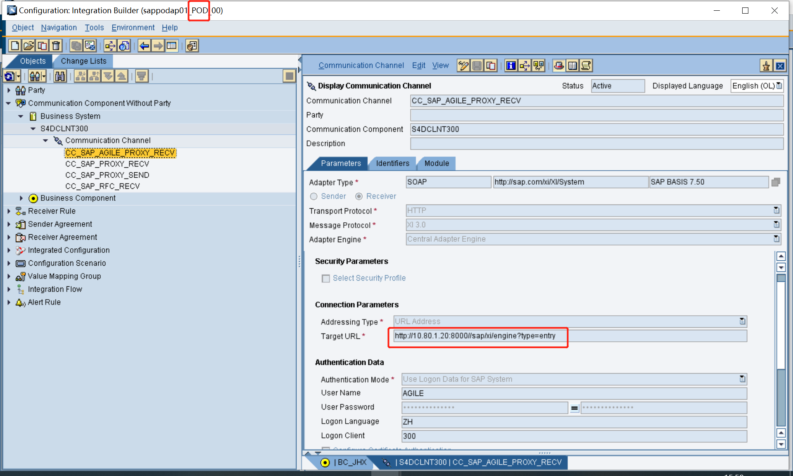
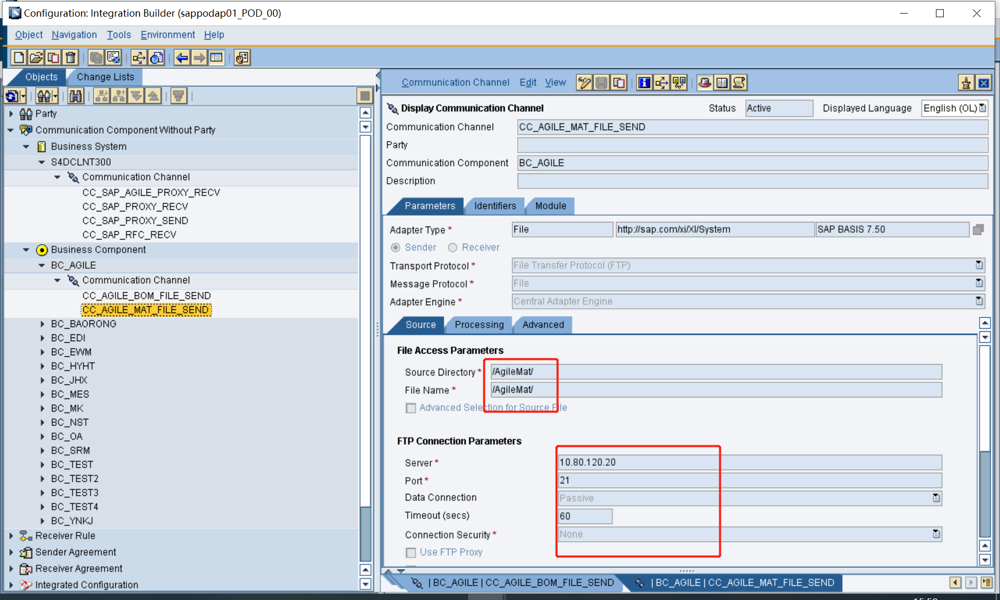
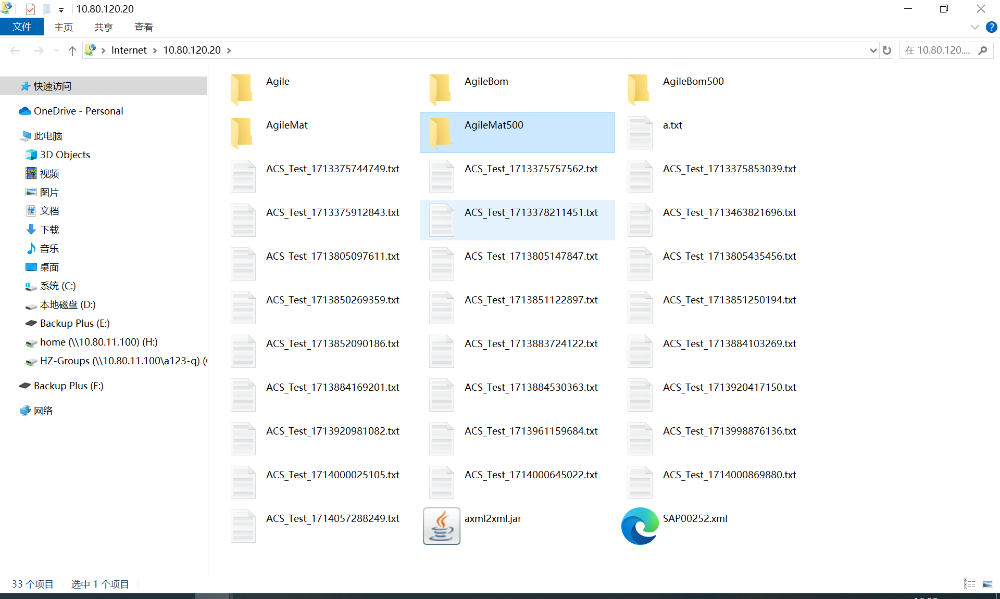

# 处理FTP文件的JavaJar脚本

<!-- more -->

## 接口路径
一个从AGILE触发，上传文件到FTP服务器，通过一个java的jar的脚本，定时解压缩文件到特定的文件夹，通过PO接收后删除该文件，PO接口通过代理在SAP，由SAP创建物料和BOM。

因为测试环境和开发环境取的是一个FTP服务器的同一个文件夹里的数据，所以测试数据有时会到测试环境有时会到开发环境，故我在测试环境FTP服务器上新建了文件夹把测试和开发文件夹区分了。通过IDEA软件的Jar Editor修改了操作FTP服务器解压缩的java jar脚本。




有时候数据进入到SAP也不出发接口，是因为分配的随机队列，在SMQ2中卡住了（先前的进程有卡住）。

## 代码功能
这段Java代码是一个用于处理FTP文件上传和删除的程序。它使用了Apache Commons Net库来处理FTP连接和文件传输。下面是对代码主要功能的解释：

1. FTP连接：
FTPUtils.getFTPClient方法用于创建一个FTP客户端连接到指定的FTP服务器。
2. 上传文件：
upload方法首先检查本地的两个临时文件夹是否存在，如果不存在则创建它们。
然后，它使用FTPUtils.FTPdownDir方法从FTP服务器下载指定路径下的文件到本地的C:\\AXMLtemp目录。
下载的文件是ZIP格式的，程序会遍历这些ZIP文件，如果是.AXML文件，它会解压并将其中的文件保存到C:\\XMLtemp目录。
解压后的.xml文件会通过FTPUtils.uploadFile方法上传到FTP服务器的指定路径。
3. 删除FTP文件：
deleteFtpFile方法用于删除FTP服务器上指定路径下的所有.AXML和.XML文件。
它首先列出当前工作目录下的所有文件，然后检查文件名是否包含.AXML或.XML，如果是，则删除这些文件。
4. 删除本地文件：
deleteFile方法用于递归删除指定目录下的所有文件和子目录。
辅助方法：
newFile方法用于创建一个新的文件，同时检查该文件是否在目标目录下，以防止路径遍历攻击。
FTPUtils.FTPClose方法用于关闭FTP连接。
5. 主方法：
main方法是程序的入口点，它调用upload方法上传三个不同路径下的文件，然后调用deleteFtpFile方法删除根目录下的所有.AXML和.XML文件。
整体来看，这个程序的主要功能是管理FTP服务器上的文件，包括上传和删除特定类型的文件。它还处理了本地文件的创建和删除，以及ZIP文件的解压和内容的处理。


## java jar 代码
```java
//
// Source code recreated from a .class file by IntelliJ IDEA
// (powered by FernFlower decompiler)
//

package com.wx;

import java.io.File;
import java.io.FileInputStream;
import java.io.FileOutputStream;
import java.io.IOException;
import java.nio.charset.StandardCharsets;
import java.util.zip.ZipEntry;
import java.util.zip.ZipInputStream;
import org.apache.commons.net.ftp.FTPClient;
import org.apache.commons.net.ftp.FTPFile;

public class Main {
    public Main() {
    }

    public static void main(String[] args) {
        String ftpPath = "/Agile";
        upload(ftpPath);
        ftpPath = "/AgileBom500";
        upload(ftpPath);
        ftpPath = "/AgileMat500";
        upload(ftpPath);
        ftpPath = "/AgileBom";
        upload(ftpPath);
        ftpPath = "/AgileMat";
        upload(ftpPath);
        deleteFtpFile("/");
    }

    public static void deleteFtpFile(String pathName) {
        FTPClient ftpClient = FTPUtils.getFTPClient("服务器地址", 端口号, "账号", "密码");
        ftpClient.enterLocalPassiveMode();
        FTPFile[] files = new FTPFile[0];

        try {
            ftpClient.changeWorkingDirectory(new String(pathName.getBytes(), StandardCharsets.ISO_8859_1));
            files = ftpClient.listFiles();
        } catch (IOException var10) {
            IOException var9 = var10;
            IOException e = var9;
            throw new RuntimeException(e);
        }

        FTPFile[] var10 = files;
        int var4 = files.length;

        for(int var5 = 0; var5 < var4; ++var5) {
            FTPFile file = var10[var5];
            if (file.isFile() && (file.getName().contains(".AXML") || file.getName().contains(".XML"))) {
                try {
                    ftpClient.deleteFile(file.getName());
                } catch (IOException var9) {
                    IOException var8 = var9;
                    IOException e = var8;
                    throw new RuntimeException(e);
                }
            }
        }

        FTPUtils.FTPClose(ftpClient);
    }

    public static void upload(String ftpPath) {
        File file1 = new File("C:\\AXMLtemp");
        if (!file1.exists()) {
            file1.mkdirs();
        }

        File file2 = new File("C:\\XMLtemp");
        if (!file2.exists()) {
            file2.mkdirs();
        }

        FTPClient ftpClient = FTPUtils.getFTPClient("******", 21, "******", "******");
        FTPUtils.FTPdownDir(ftpClient, "C:\\AXMLtemp", "//", 60);
        String path = "C:\\AXMLtemp";
        File file = new File(path);
        File[] fs = file.listFiles();
        String fileZip = "";
        byte[] buffer = new byte[1024];
        String str = "";
        String str2 = "";

        try {
            File[] var20 = fs;
            int var12 = fs.length;

            for(int var13 = 0; var13 < var12; ++var13) {
                File f = var20[var13];
                if (!f.isDirectory()) {
                    fileZip = String.valueOf(f);
                }

                if (fileZip.contains(".AXML")) {
                    ZipInputStream zis = new ZipInputStream(new FileInputStream(fileZip));

                    for(ZipEntry zipEntry = zis.getNextEntry(); zipEntry != null; zipEntry = zis.getNextEntry()) {
                        str2 = f.getName();
                        str = "C:\\XMLtemp\\" + str2.substring(0, str2.indexOf(".")) + ".xml";
                        FileOutputStream fos = new FileOutputStream(str);

                        int len;
                        while((len = zis.read(buffer)) > 0) {
                            fos.write(buffer, 0, len);
                        }

                        fos.close();
                    }

                    zis.closeEntry();
                    zis.close();
                    FileInputStream in = new FileInputStream(new File(str));
                    FTPUtils.uploadFile(ftpPath, ftpClient, str2.substring(0, str2.indexOf(".")) + ".xml", in);
                    System.out.println(str);
                }
            }
        } catch (IOException var19) {
            IOException var19 = var19;
            IOException e = var19;
            e.printStackTrace();
        }

        FTPUtils.FTPClose(ftpClient);
        if (deleteFile(file1)) {
            System.out.println("AXML缓存文件删除成功！");
        }

        if (deleteFile(file2)) {
            System.out.println("XML缓存文件删除成功！");
        }

    }

    public static File newFile(File destinationDir, ZipEntry zipEntry) throws IOException {
        File destFile = new File(destinationDir, zipEntry.getName());
        String destDirPath = destinationDir.getCanonicalPath();
        String destFilePath = destFile.getCanonicalPath();
        if (!destFilePath.startsWith(destDirPath + File.separator)) {
            throw new IOException("Entry is outside of the target dir: " + zipEntry.getName());
        } else {
            return destFile;
        }
    }

    public static Boolean deleteFile(File file) {
        if (file != null && file.exists()) {
            File[] files = file.listFiles();
            File[] var2 = files;
            int var3 = files.length;

            for(int var4 = 0; var4 < var3; ++var4) {
                File f = var2[var4];
                if (f.isDirectory()) {
                    deleteFile(f);
                } else {
                    f.delete();
                }
            }

            file.delete();
            return true;
        } else {
            System.out.println("文件删除失败,请检查文件是否存在以及文件路径是否正确");
            return false;
        }
    }
}

```

## 参考资料
[IDEA](https://www.exception.site/article/1777)