# PO接口类型
记录一下自己碰到过的PO接口类型及怎样配置与传输顺序。在其他东西已经由basis配置好的情况下。
<!-- more -->
## 外部系统调用SAP-RFC
* 先在SAP写好RFC接口
* PO-ESR(一般正式PO都是传输) 
  * 在对应的软件组件里导入SAP的函数模块
  * 我是一个命名空间一个接口，在软件组件下面创建命名空间
  * 在命名空间下面分别创建SI(RFC Message),MM-REQ,MM-RES,OM(SI外部系统->SAP;MM;SAP函数接口)
* PO-ID(通道的参数有些需要正式和测试环境不同，可以修改或者传输)
  * Business Compponent下外部系统CC-SOAP通道，Business System下SAP CC SOAP 接收通道(需要不同的接口创建人可以创建多个CC因为是使用账号验证的账号)
  * 创建IC
* 根据IC的WSDL，去测试软件SOAPUI测试(POSTMAN也可以比较麻烦，POST需要里面的地址)
* 编写开发说明书
* 传输时要先传SAP的函数请求，再传输PO-ESR导入的函数和其他的SI,MM,OM,然后是PO-ID:CC,IC
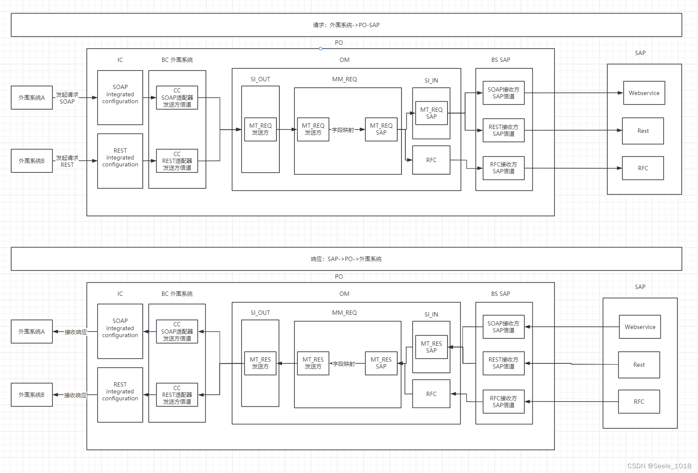
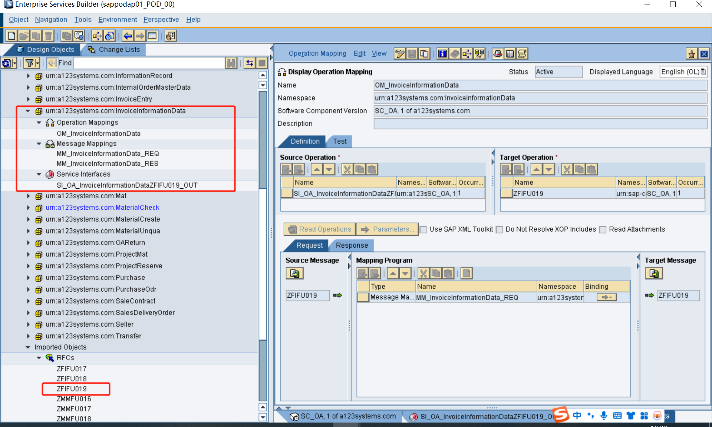
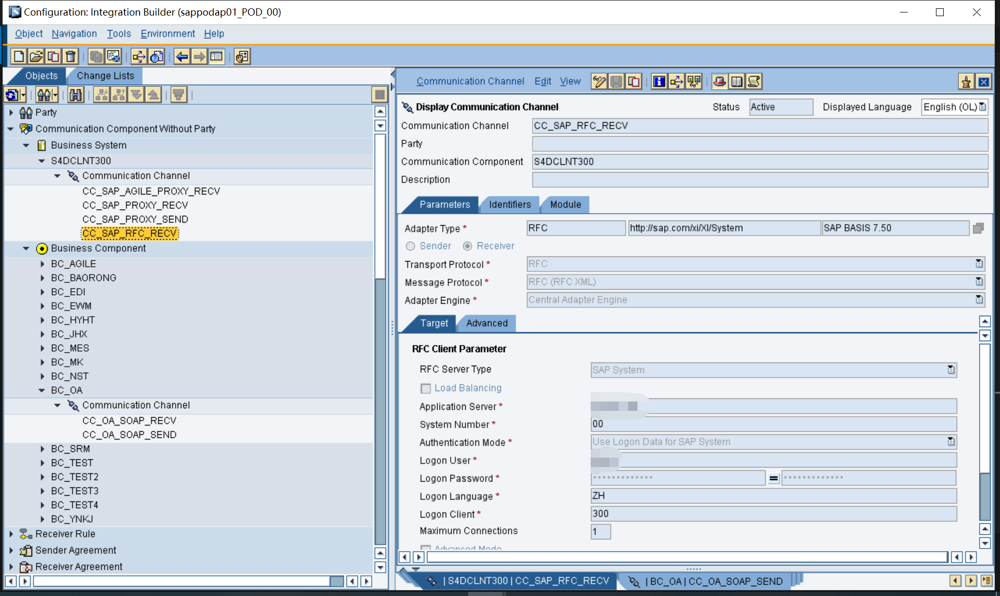
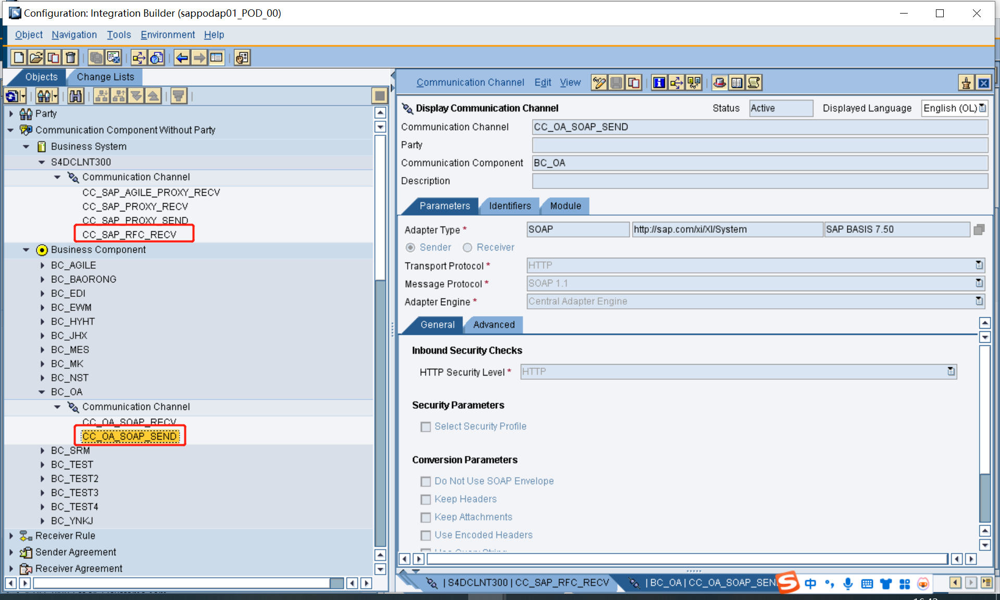
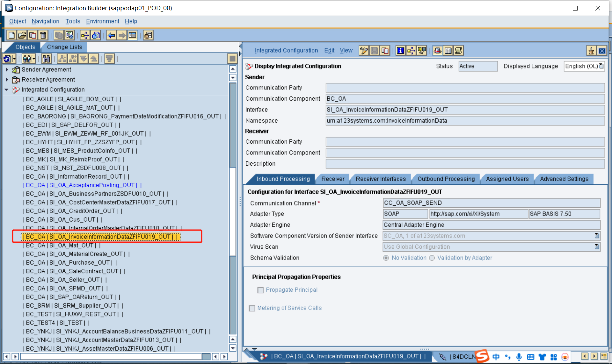

## SAP调用外部系统-代理
* PO-ESR
  * 由外部系统提供WSDL(ED),ED导入PO
  * 创建外部系统SI-IN，和SAP的SI-OUT(RFC Message使用上述ED里的方法)
  * 分别创建MM-REQ,MM-RES,OM(SAP的SI-OUT;MM;外部系统SI-IN)
* PO-ID
  * 创建Business System下SAP CC:CC_SAP_PROXY_SEND
  * 创建Business Compponent下外部系统 CC:CC_外部系统_SOAP_RECV
  * 创建IC
* SAP 
  * 在SAP事务代码SPROXY里ESR浏览器的SAP的SI-OUT生成代理
  * 在函数模块或者增强里调用代理
* 传输时要先传PO，再传输SAP

  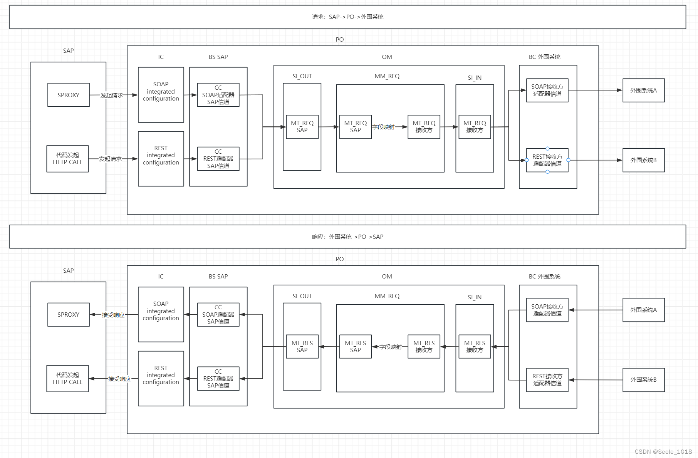
  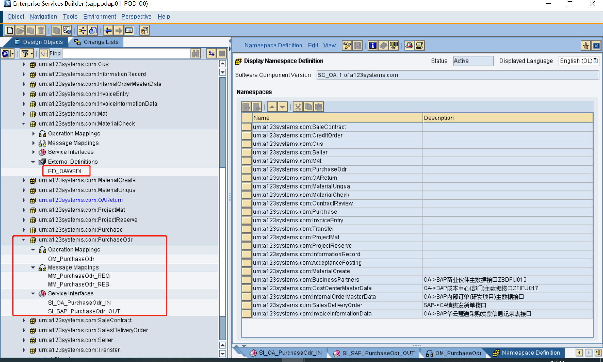
  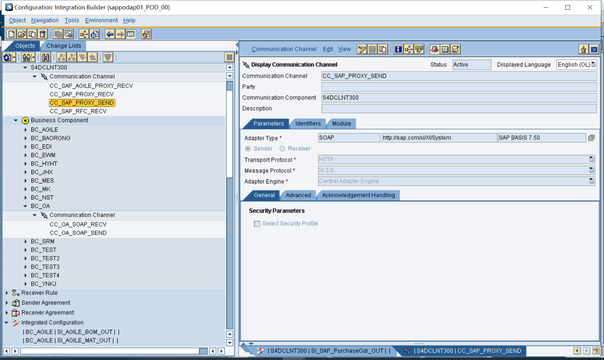
  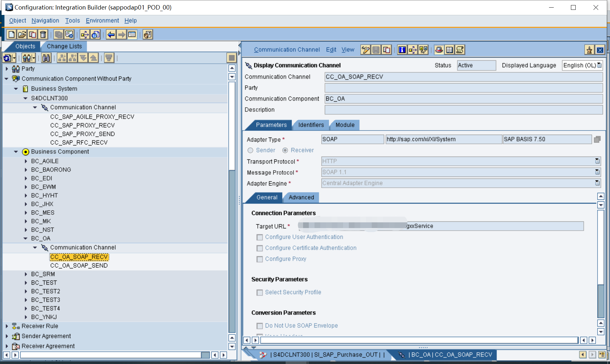
  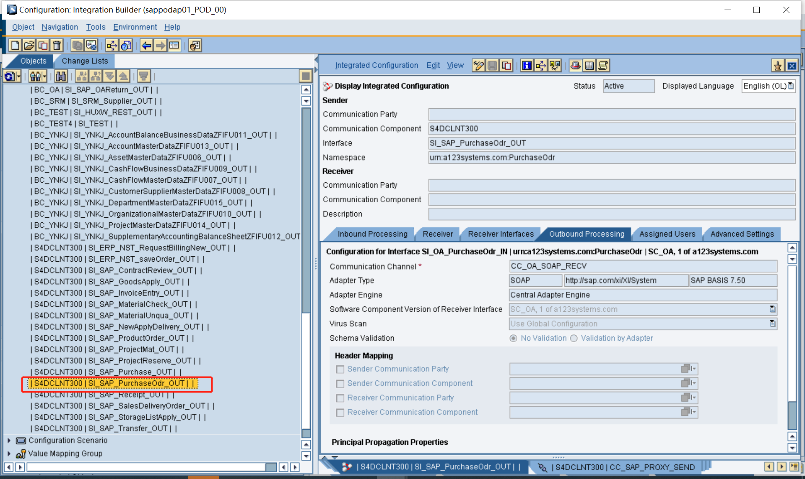
  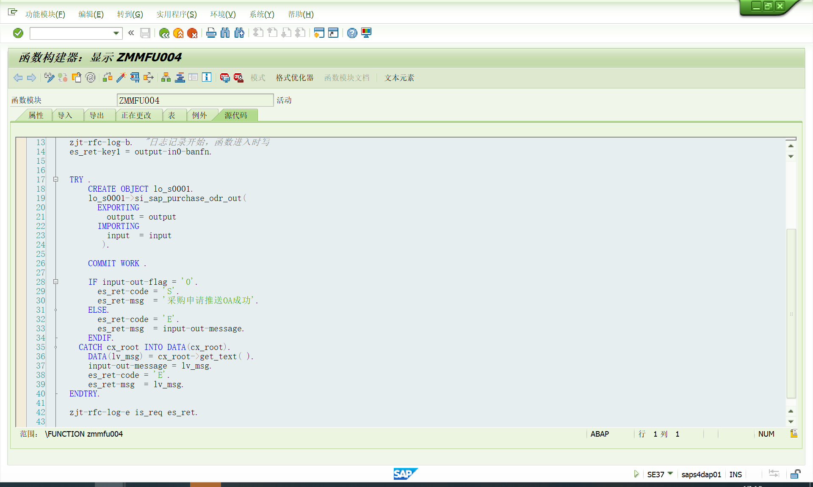

## 外部系统调用SAP-JDBC数据库处理
直接处理数据库，设置定时任务处理数据库数据库->SAP，再更新数据库数据
* PO-ESR
  * 根据交互字段创建Data Types
  * 导入Data Types生成Message Types
  * 创建外部系统SI-OUT，和SAP的SI-IN(使用上述Message Type)
  * 分别创建MM-REQ,MM-RES(使用上述Message Type),OM(外部系统SI-OUT;MM;SAP的SI-IN)
* PO-ID
  * 创建Business System下SAP CC:CC_SAP_PROXY_RECV
  * 创建Business Compponent下外部系统 CC:CC_外部系统_JDBC_SEND
  * 创建IC
* SAP 
  * 在SAP事务代码SPROXY里ESR浏览器的SAP的SI-IN生成代理
  * 在函数模块或者增强里调用代理
* 传输时要先传PO，再传输SAP
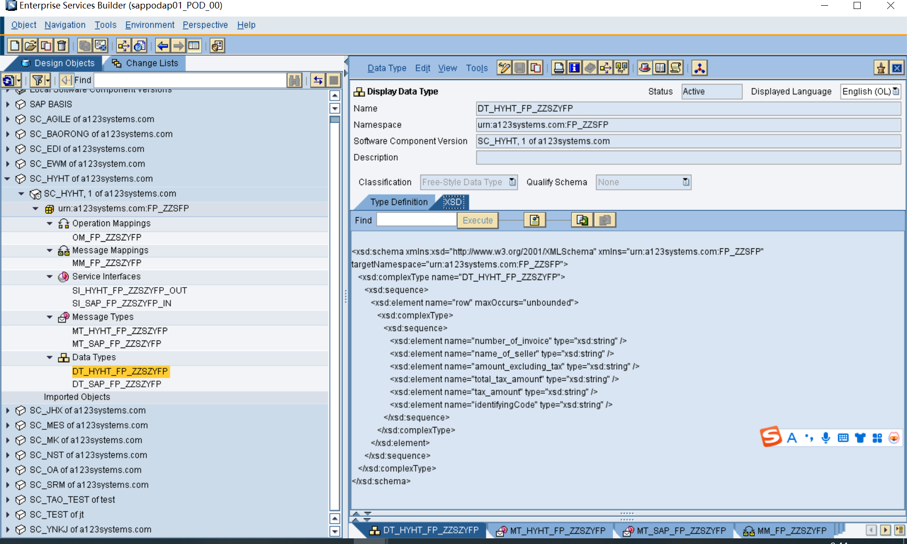
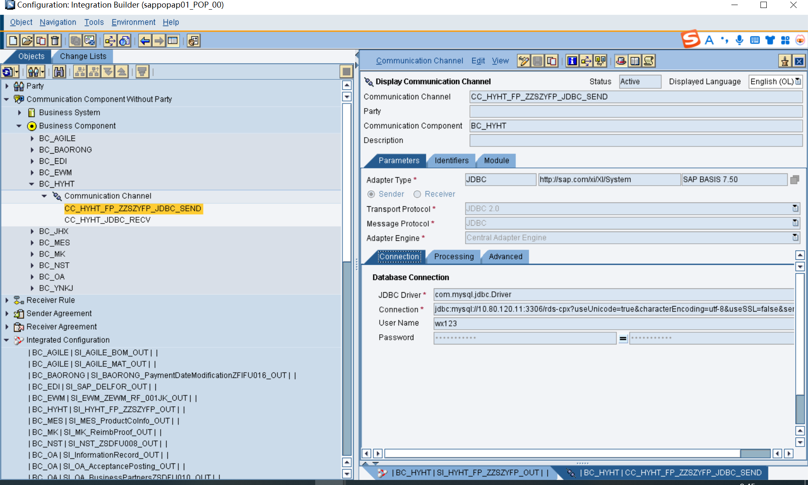
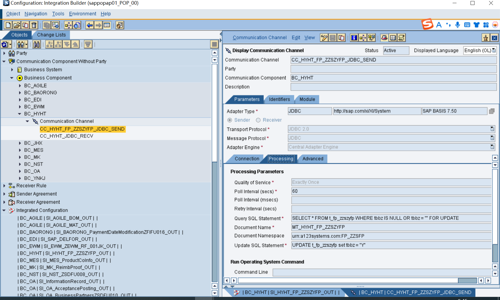
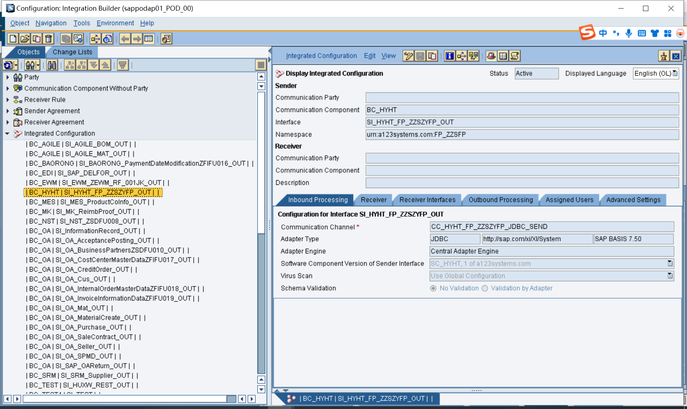

## 外部系统调用SAP-aglie
其他和外部系统调用SAP-RFC差不多,用RFC作为接收的改用自己用ED(XML文档)生成的SAP_SI-IN,MM也用ED里的

## 参考文献
[PO 发布外围系统REST-＞SAP RFC同步接口-Seele_1018](https://blog.csdn.net/qq_44826887/article/details/134922069)
[PO 发布SAP SProxy-＞外围系统 WebService-Seele_1018](https://blog.csdn.net/qq_44826887/article/details/135170299)