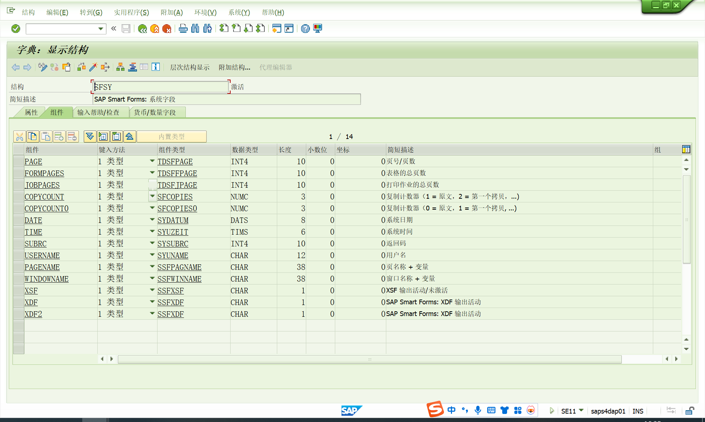

# SMARTFORMS
<!-- more -->
我自己理解他也是一个接口有输入输出，然后就是画图调下位置。
货币和数量字段需要在SMARTFORMS里声明类型。
## 内容
[上传LOGO，SE78](https://blog.csdn.net/wuzhong369/article/details/101677020)
标准SMARTFOEMS结构-SFSY，可输出页码等

## 参考文献
[SAP上传图片LOGO(SE78/SMW0)](https://blog.csdn.net/wuzhong369/article/details/101677020)
