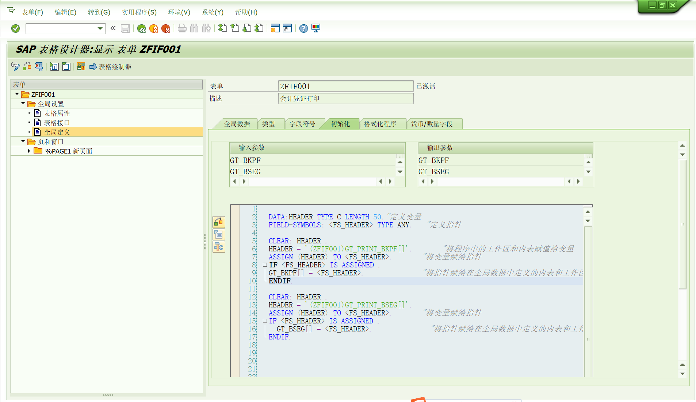
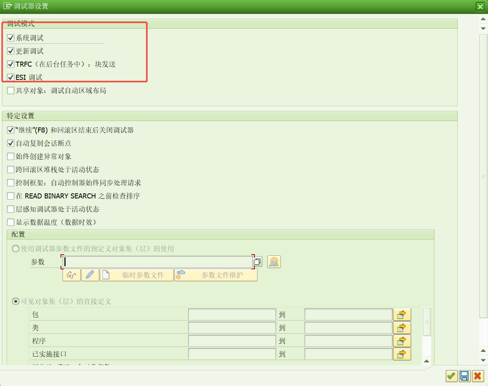

# 我觉得好用的语法
<!-- more -->

## 内容
### 1. 获取字段的值的值
可以少用点if :smile_cat:
``` ABAP 
  DATA: LT_FIELDS TYPE TABLE OF CHAR32,
        LS_FIELD  LIKE LINE OF LT_FIELDS.
*公司名称及地址
  SELECT SINGLE * INTO @DATA(GS_T001W) FROM T001W WHERE WERKS = @ES_HEAD-BUKRS.
  ES_HEAD-NAME1 = GS_T001W-NAME1.
*  ES_HEAD-STRAS = GS_T001W-ORT01 && ` ` && GS_T001W-REGIO && ` ` &&  GS_T001W-LAND1.
  CLEAR LT_FIELDS.
  REFRESH LT_FIELDS.
  LT_FIELDS = VALUE #(
( 'GS_T001W-ORT01' )   ( 'GS_T001W-REGIO' ) ( 'GS_T001W-LAND1' ) ).
*遍历字段数组
  LOOP AT LT_FIELDS INTO LS_FIELD.
    ASSIGN (LS_FIELD) TO <FLV_SYMBOL>.
    IF <FLV_SYMBOL> IS NOT INITIAL.
      IF ES_HEAD-STRAS IS INITIAL.
        ES_HEAD-STRAS = <FLV_SYMBOL>.
      ELSE.
        IF <FLV_SYMBOL> = 'US'.
          ES_HEAD-STRAS = ES_HEAD-STRAS && ` `&& 'UNITED STATES'.
        ELSE.
          ES_HEAD-STRAS = ES_HEAD-STRAS && ` `&& <FLV_SYMBOL>.
        ENDIF.
      ENDIF.
    ENDIF.
  ENDLOOP.
```

### 2. 分组处理LOOP GROUP取代at end of啥的
``` ABAP 
  SORT GT_DATA1 BY RCNTR RACCT.
    LOOP AT GT_DATA1 INTO DATA(GS_DATA1)
      GROUP BY ( RCNTR = GS_DATA1-RCNTR RACCT = GS_DATA1-RACCT )."按括号里的条件进行分组
      GS_ITEM = CORRESPONDING #( GS_DATA1
                       EXCEPT HSL
                       ).
      LOOP AT GROUP GS_DATA1 INTO DATA(MEMBER)."按分组后进行组员的访问
*    GS_DATA1-HSL = P_MENGE + MEMBER-WKURS."这里就是对同一组的进行某个字段的汇总
        GS_ITEM-HSL = GS_ITEM-HSL + MEMBER-HSL.
      ENDLOOP.
      APPEND GS_ITEM TO GT_ITEM1[].
    ENDLOOP.
```

### 3. 前导0，OUT转换为外围,IN转换为SAP
``` ABAP 
LS_G_AFP-AUFNR = |{ LS_G_AFP-AUFNR ALPHA = OUT }|.
```
### 4. 赋值内表/工作区
``` ABAP
  LT_E_MAILDATANONADDRESS = VALUE #( (
      STD_NO    = 'X'                        "表中的部分字段
      E_MAIL    = PS_ALV-SMTP_ADDR2 ) ).     "独立通讯E-mail
```

``` ABAP
  R_RACCT = VALUE #( SIGN = 'I' OPTION = 'EQ'
  ( LOW = '6601010600' )
  ( LOW = '6601010700' )
  ( LOW = '6601010800' )
  ( LOW = '6601010900' )
  ( LOW = '6601011000' )
  ( LOW = '6601510000' )
  ( LOW = '6601520000' )
 ).
```

``` ABAP
    GS_DATA = CORRESPONDING #( GS_OUT2
                     MAPPING
                     TEXT = TYPE
                     EXCEPT REPVAL
                     ZBS
                     ).
```
### 5. 能将程序中的内表和工作区传递给另一个程序还是啥？
这是我看到的一个smartforms的应用方式，实际我还没操作过


### 6. API消息输出？没用过不知道
``` ABAP 
*API环境初始化
  CALL FUNCTION 'CALO_INIT_API'
    EXPORTING
      FLAG_DB_LOG_ON           = 'X'      "Database Logging On
      FLAG_MSG_ON              = 'X'      "Transfer Messages to Internal Tables
      FLAG_API_API_CALL_ON     = ''      "API Called by API -> Collect Messages
      FLAG_COLLECT_MSG_ON      = ''      "Collect Messages and Output via FM CALO...
      EXTERNAL_LOG_NO          = 'API'    "External Log Number (See Transaction SLG1)
      DEL_LOG_AFTER_DAYS       = '10'     "DB Log Will Be Deleted After * Days
      DATA_RESET_SIGN          = '!'      "Initial Value
    EXCEPTIONS
      LOG_OBJECT_NOT_FOUND     = 1
      LOG_SUB_OBJECT_NOT_FOUND = 2
      OTHERS                   = 3.

**这里正常的调用function，bapi，函数啥的好像是一个东西吧

*在CAPI日志中输入收集的消息
  CALL FUNCTION 'CALO_MSG_APPEND_DB_LOG'
    EXCEPTIONS
      LOG_OBJECT_NOT_FOUND    = 1
      LOG_SUBOBJECT_NOT_FOUND = 2
      LOG_INTERNAL_ERROR      = 3
      OTHERS                  = 4.

*Read Messages from Current Log Entry
  CALL FUNCTION 'CALO_LOG_READ_MESSAGES'
    EXPORTING
      LANGUAGE                = SY-LANGU
    TABLES
      MESSAGES_AND_PARAMETERS = LT_MESSAGES
    EXCEPTIONS
      WARNING                 = 1
      ERROR                   = 2
      OTHERS                  = 3.

  SELECT * FROM
     @LT_MESSAGES AS A
    WHERE MSG_TYPE = 'A'
    OR MSG_TYPE = 'E'
    INTO @DATA(WA_MESSAGES1).
  ENDSELECT.
```
### 7. 查询ABAP代码的标准工具
程序RS_ABAP_SOURCE_SCAN

后台进程想打断点可以先输入/H然后设置更新调试


### 8. ALV的fieldcat自动生成
根据结构或者内表
``` ABAP 
CALL FUNCTION 'LVC_FIELDCATALOG_MERGE'
 EXPORTING
*   I_BUFFER_ACTIVE              =
   I_STRUCTURE_NAME             = 'KAEP_COAC'
*   I_CLIENT_NEVER_DISPLAY       = 'X'
*   I_BYPASSING_BUFFER           =
*   I_INTERNAL_TABNAME           =
  CHANGING
    CT_FIELDCAT                  = FIELDCAT[]
* EXCEPTIONS
*   INCONSISTENT_INTERFACE       = 1
*   PROGRAM_ERROR                = 2
*   OTHERS                       = 3
          .
```
## 参考文献
感谢我大慈大悲的猫哥提供的帮助
<!-- D:\Documents\code\MyGitee\blog-source-main\src\.vuepress\public\file\abap新语法.docx 好像生成dist html文件时可能通过配置直接在D:\Documents\code\MyGitee\blog-source-main\dist\file里了-->
[下载abap新语法文档](/file/abap新语法.docx '下载文档')