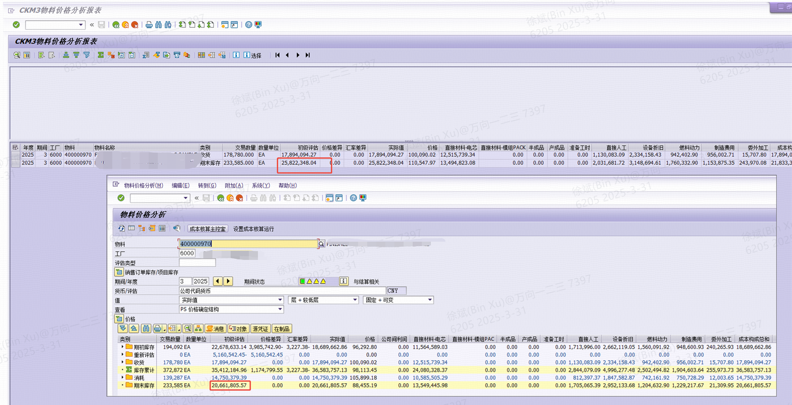

# CKM3物料价格分析报表
<!-- more -->

## 和参考文献中不同点
期初+ZU收货+PC重新评估(因标准价格修改进行重新评估价格更改的标准成本)-VN消耗=期末标准成本


我的期初标准成本计算方法为：(按文章里的直接取不太对)
```abap
    DATA GV_DATE TYPE SY-DATUM.
      GV_DATE = S_GJAHR-LOW && S_POPER-LOW+1(2) && '01'.
      CALL FUNCTION 'CCM_GO_BACK_MONTHS'
        EXPORTING
          CURRDATE   = GV_DATE
          BACKMONTHS = '001'
        IMPORTING
          NEWDATE    = GV_DATE.
      SELECT SINGLE * INTO @DATA(GS_CKMLCR)
        FROM CKMLCR
       WHERE KALNR = @<FS_OUT>-KALN1
         AND BDATJ = @GV_DATE+0(4)
         AND POPER = @GV_DATE+4(2).
      <FS_OUT>-STVAL = <FS_OUT>-QUANT * GS_CKMLCR-STPRS / GS_CKMLCR-PEINH.
```
CKMLCR表中上个月的标准价格乘以期初数量除以上个月的价格单位
## 实际代码
```abap
*&---------------------------------------------------------------------*
*& Report ZFIR041
*&---------------------------------------------------------------------*
*&
*&---------------------------------------------------------------------*
REPORT ZFIR041.
*
*SELECT
*  SUM( MLDOC~QUANT ) AS SL,MLDOC~MEINS
*  FROM MBEW
*           LEFT JOIN MLDOC
*  ON MLDOC~JAHRPER = '2022012'
*  AND MLDOC~KALNR = MBEW~KALN1
*  AND MLDOC~CATEG = 'ZU'
*           WHERE MBEW~MATNR = '000000000400000001'
*             AND MBEW~BWKEY = '6000'
*GROUP BY MEINS
*            INTO TABLE @DATA(LT)
*            .
*CL_DEMO_OUTPUT=>DISPLAY( LT  ).


TABLES:MBEW,ACDOCA.

TYPES:BEGIN OF TYP_OUT,
        GJAHR  TYPE ACDOCA-GJAHR,    "年度
        POPER  TYPE ACDOCA-POPER,     "期间
        BWKEY  TYPE MBEW-BWKEY,     "工厂
        MATNR  TYPE MBEW-MATNR, "物料
        MAKTX  TYPE MAKT-MAKTX, "物料描述
        ZTYPE  TYPE CHAR10, "类别
        QUANT  TYPE MLDOC-QUANT, "交易数量
        MEINS  TYPE MLDOC-MEINS, "数量单位
        STVAL  TYPE MLDOC-STVAL, "初级评估
        PRD    TYPE MLDOC-PRD, "价格差异
        KDM    TYPE MLDOC-KDM, "汇率差异
        TOTAL  TYPE FCML4H_LIST_S-TOTAL, "实际值=初级评估+价格差异+汇率差异
        PRICE  TYPE FCML4H_LIST_S-PRICE, "价格=实际值/数量*成本核算批量
        ELM10  TYPE MLDOCCCS-TOT, "直接材料-电芯
        ELM11  TYPE MLDOCCCS-TOT, "直接材料-模组PACK
        ELM12  TYPE MLDOCCCS-TOT, "半成品
        ELM13  TYPE MLDOCCCS-TOT, "产成品
        ELM14  TYPE MLDOCCCS-TOT, "准备工时
        ELM15  TYPE MLDOCCCS-TOT, "直接人工
        ELM16  TYPE MLDOCCCS-TOT, "设备折旧
        ELM17  TYPE MLDOCCCS-TOT, "燃料动力
        ELM18  TYPE MLDOCCCS-TOT, "制造费用
        ELM19  TYPE MLDOCCCS-TOT, "委外加工
        ELM    TYPE MLDOCCCS-TOT, "成本构成总和
        CLR    TYPE CHAR4, "可以控制行颜色
        SEL(1) TYPE C,
        KALN1  TYPE MBEW-KALN1, "成本估算编号
        NUM(1) TYPE C, "类别排序
      END OF TYP_OUT.
DATA:GS_OUT TYPE TYP_OUT,
     GT_OUT TYPE TABLE OF TYP_OUT.
DATA:GV_JAHRPER TYPE MLDOC-JAHRPER.

DATA:FIELDCAT TYPE LVC_T_FCAT WITH HEADER LINE.
DATA:I_SORT   TYPE LVC_T_SORT WITH HEADER LINE.
DATA:WA_LAYOUT   TYPE LVC_S_LAYO.
DATA:GT_EVENT TYPE SLIS_T_EVENT WITH HEADER LINE.
DATA:IS_VARIANT LIKE DISVARIANT.
DATA:G_GRID TYPE REF TO CL_GUI_ALV_GRID.
DATA:REF_GRID TYPE REF TO CL_GUI_ALV_GRID.

*-----------------------------------------------------------------------
* SCREEN DECLARATION: PARAMETERS & SELECT-OPTIONS *
*-----------------------------------------------------------------------
SELECTION-SCREEN BEGIN OF BLOCK BL1 WITH FRAME TITLE TEXT-001.

  SELECT-OPTIONS:S_MATNR FOR MBEW-MATNR, "物料
                 S_BWKEY FOR MBEW-BWKEY, "估价范围
                 S_GJAHR FOR ACDOCA-GJAHR NO-EXTENSION NO INTERVALS OBLIGATORY DEFAULT SY-DATUM+0(4),"会计年度
                 S_POPER FOR ACDOCA-POPER NO-EXTENSION NO INTERVALS OBLIGATORY.               "期间


  PARAMETERS:P_R1 TYPE C AS CHECKBOX DEFAULT 'X', "收货
             P_R2 TYPE C AS CHECKBOX. "期末库存

SELECTION-SCREEN END OF BLOCK BL1.


*-----------------------------------------------------------------------
* Definition *
*-----------------------------------------------------------------------
DEFINE FILL_FIELD.
  CLEAR fieldcat.
  fieldcat-fieldname     = &1.
  fieldcat-scrtext_l     = &2.
  fieldcat-cfieldname    = &3.
  fieldcat-outputlen     = &4.
  fieldcat-decimals      = &5.
  fieldcat-no_zero       = &6.
  fieldcat-ref_table     = &7.
  fieldcat-ref_field     = &8.
  fieldcat-edit          = &9.
  APPEND fieldcat.
END-OF-DEFINITION.

*-----------------------------------------------------------------------
* INITIALIZE PARAMETER TO DEFAULT VALUE *
*-----------------------------------------------------------------------
INITIALIZATION.

*======================================================================*
*                        At Selection Screen
*======================================================================*
AT SELECTION-SCREEN.

  PERFORM FRM_AUTH_CHECK.
*======================================================================*
*                        At Selection Screen Output
*======================================================================*
AT SELECTION-SCREEN OUTPUT .

*-----------------------------------------------------------------------
* MAIN SELECTION LOGIC *
*-----------------------------------------------------------------------
START-OF-SELECTION.
  PERFORM FRM_DATA_GET.
*-----------------------------------------------------------------------
* HANDLING END OF PROGRAM LOGIC *
*-----------------------------------------------------------------------
END-OF-SELECTION.
  IF GT_OUT[] IS INITIAL.
    MESSAGE '没有合适的数据,请检查你的输入!' TYPE 'I'.
  ELSEIF GT_OUT[] IS NOT INITIAL.
    PERFORM FRM_DISPLAY_DATA.
  ENDIF.
*&---------------------------------------------------------------------*
*& Form FRM_AUTH_CHECK
*&---------------------------------------------------------------------*
*& text
*&---------------------------------------------------------------------*
*& -->  p1        text
*& <--  p2        text
*&---------------------------------------------------------------------*
FORM FRM_AUTH_CHECK .

ENDFORM.
*&---------------------------------------------------------------------*
*& Form FRM_DATA_GET
*&---------------------------------------------------------------------*
*& text
*&---------------------------------------------------------------------*
*& -->  p1        text
*& <--  p2        text
*&---------------------------------------------------------------------*
FORM FRM_DATA_GET .

  DEFINE FILL_JAH.
    CLEAR GV_JAHRPER.
    GV_JAHRPER = &1 && &2.
  END-OF-DEFINITION.
  FILL_JAH S_GJAHR-LOW S_POPER-LOW.
  IF P_R1 = 'X' OR P_R2 = 'X'..
    SELECT
      SUM( MLDOC~QUANT ) AS QUANT,MLDOC~MEINS,MBEW~BWKEY,MBEW~MATNR,SUM( MLDOC~STVAL ) AS STVAL,
      SUM( MLDOC~PRD ) AS PRD,SUM( MLDOC~KDM ) AS KDM,MBEW~KALN1,'2' AS NUM
               FROM MBEW
               LEFT JOIN MLDOC
      ON MLDOC~JAHRPER = @GV_JAHRPER
      AND MLDOC~KALNR = MBEW~KALN1
      AND MLDOC~CATEG = 'ZU'
               WHERE MBEW~MATNR IN @S_MATNR
                 AND MBEW~BWKEY IN @S_BWKEY
                 GROUP BY MATNR,MEINS,BWKEY,MBEW~KALN1
                INTO CORRESPONDING FIELDS OF TABLE @GT_OUT.

    IF GT_OUT[] IS NOT INITIAL.
*      SELECT MLDOCCCS~DOCREF,MLDOCCCS~ELEMENT,MLDOCCCS~TOT,MLDOC~KALNR INTO TABLE @DATA(GT_MLDOCCCS)
*        FROM MLDOC
*        LEFT JOIN MLDOCCCS
*          ON MLDOC~DOCREF = MLDOCCCS~DOCREF
*         FOR ALL ENTRIES IN @GT_OUT
*       WHERE MLDOC~KALNR = @GT_OUT-KALN1
*         AND MLDOC~JAHRPER = @GV_JAHRPER
*         AND MLDOC~CATEG = 'ZU'.

      SELECT MATNR,MAKTX,SPRAS INTO TABLE @DATA(GT_MAKT)
        FROM MAKT
         FOR ALL ENTRIES IN @GT_OUT
       WHERE MATNR = @GT_OUT-MATNR.
      SORT GT_MAKT BY MATNR SPRAS.

    ENDIF.


    LOOP AT GT_OUT ASSIGNING FIELD-SYMBOL(<FS_OUT>).
      READ TABLE GT_MAKT INTO DATA(GS_MAKT) WITH KEY MATNR = <FS_OUT>-MATNR SPRAS = SY-LANGU BINARY SEARCH.
      IF SY-SUBRC = 0.
        <FS_OUT>-MAKTX = GS_MAKT-MAKTX.
      ENDIF.
      <FS_OUT>-MATNR = |{ <FS_OUT>-MATNR ALPHA = OUT }|.
      <FS_OUT>-GJAHR = S_GJAHR-LOW.
      <FS_OUT>-POPER = S_POPER-LOW.
      <FS_OUT>-ZTYPE = '收货'.
      <FS_OUT>-TOTAL = <FS_OUT>-STVAL + <FS_OUT>-PRD + <FS_OUT>-KDM.
      SELECT SINGLE PEINH INTO @DATA(LV_PEINH)
        FROM CKMLCR WHERE KALNR = @<FS_OUT>-KALN1
         AND BDATJ = @S_GJAHR-LOW
         AND POPER = @S_POPER-LOW.
      IF <FS_OUT>-QUANT IS NOT INITIAL.
        <FS_OUT>-PRICE = <FS_OUT>-TOTAL / <FS_OUT>-QUANT *  LV_PEINH.
      ENDIF.


      SELECT MLDOCCCS~DOCREF,MLDOCCCS~ELEMENT,MLDOCCCS~TOT,MLDOC~KALNR INTO TABLE @DATA(GT_MLDOCCCS)
        FROM MLDOC
        LEFT JOIN MLDOCCCS
          ON MLDOC~DOCREF = MLDOCCCS~DOCREF
       WHERE MLDOC~KALNR = @<FS_OUT>-KALN1
         AND MLDOC~JAHRPER = @GV_JAHRPER
         AND MLDOC~CATEG = 'ZU'.
      SORT GT_MLDOCCCS BY DOCREF ELEMENT.
      LOOP AT GT_MLDOCCCS INTO DATA(GS_MLDOCCCS)
        GROUP BY ( DOCREF = GS_MLDOCCCS-DOCREF ELEMENT = GS_MLDOCCCS-ELEMENT )."按括号里的条件进行分组
        LOOP AT GROUP GS_MLDOCCCS INTO DATA(MEMBER)."按分组后进行组员的访问,这里就是对同一组的进行某个字段的汇总
          CHECK MEMBER-KALNR = <FS_OUT>-KALN1.
          IF MEMBER-ELEMENT = '010'.
            <FS_OUT>-ELM10 = <FS_OUT>-ELM10 + MEMBER-TOT.
          ELSEIF MEMBER-ELEMENT = '011'.
            <FS_OUT>-ELM11 = <FS_OUT>-ELM11 + MEMBER-TOT.
          ELSEIF MEMBER-ELEMENT = '012'.
            <FS_OUT>-ELM12 = <FS_OUT>-ELM12 + MEMBER-TOT.
          ELSEIF MEMBER-ELEMENT = '013'.
            <FS_OUT>-ELM13 = <FS_OUT>-ELM13 + MEMBER-TOT.
          ELSEIF MEMBER-ELEMENT = '014'.
            <FS_OUT>-ELM14 = <FS_OUT>-ELM14 + MEMBER-TOT.
          ELSEIF MEMBER-ELEMENT = '015'.
            <FS_OUT>-ELM15 = <FS_OUT>-ELM15 + MEMBER-TOT.
          ELSEIF MEMBER-ELEMENT = '016'.
            <FS_OUT>-ELM16 = <FS_OUT>-ELM16 + MEMBER-TOT.
          ELSEIF MEMBER-ELEMENT = '017'.
            <FS_OUT>-ELM17 = <FS_OUT>-ELM17 + MEMBER-TOT.
          ELSEIF MEMBER-ELEMENT = '018'.
            <FS_OUT>-ELM18 = <FS_OUT>-ELM18 + MEMBER-TOT.
          ELSEIF MEMBER-ELEMENT = '019'.
            <FS_OUT>-ELM19 = <FS_OUT>-ELM19 + MEMBER-TOT.
          ENDIF.
        ENDLOOP.
        <FS_OUT>-ELM = <FS_OUT>-ELM10 + <FS_OUT>-ELM11 + <FS_OUT>-ELM12 + <FS_OUT>-ELM13 +
        <FS_OUT>-ELM14 + <FS_OUT>-ELM15 + <FS_OUT>-ELM16 + <FS_OUT>-ELM17 + <FS_OUT>-ELM18 + <FS_OUT>-ELM19.
      ENDLOOP.
    ENDLOOP.
  ENDIF.


  IF P_R2 = 'X'.
    SELECT
       SUM( MLDOC~QUANT ) AS QUANT,MLDOC~MEINS,MBEW~BWKEY,MBEW~MATNR,
       MBEW~KALN1,'期初' AS ZTYPE,'1' AS NUM
                FROM MBEW
                LEFT JOIN MLDOC
       ON MLDOC~JAHRPER < @GV_JAHRPER
       AND MLDOC~KALNR = MBEW~KALN1
*      AND MLDOC~CATEG = 'AB'
                WHERE MBEW~MATNR IN @S_MATNR
                  AND MBEW~BWKEY IN @S_BWKEY
                  GROUP BY MATNR,MEINS,BWKEY,MBEW~KALN1
                 APPENDING CORRESPONDING FIELDS OF TABLE @GT_OUT.
    LOOP AT GT_OUT ASSIGNING <FS_OUT> WHERE ZTYPE = '期初'.
      SELECT SUM( MLDOC~PRD ) AS PRD,SUM( MLDOC~KDM ) AS KDM INTO ( @<FS_OUT>-PRD,@<FS_OUT>-KDM )
        FROM MLDOC WHERE JAHRPER = @GV_JAHRPER AND KALNR = @<FS_OUT>-KALN1
         AND CATEG = 'AB'.

*      DATA LV_GJAHR TYPE ACDOCA-GJAHR.
*      DATA LV_POPER TYPE ACDOCA-POPER.
*      IF S_POPER-LOW = '010'.
*        LV_GJAHR = S_GJAHR-LOW - 1.
*        LV_POPER = '012'.
*      ELSE.
*        LV_GJAHR = S_GJAHR-LOW.
*        LV_POPER = S_POPER-LOW - 1.
*      ENDIF.
*      SELECT SINGLE CKMLCR~SALK3 INTO @<FS_OUT>-STVAL
*        FROM CKMLCR
*       WHERE KALNR = @<FS_OUT>-KALN1
**         AND BDATJ = @LV_GJAHR
**         AND POPER = @LV_POPER.
*         AND BDATJ = @S_GJAHR-LOW
*         AND POPER = @S_POPER-LOW
*         AND VPRSV = 'S'.
      DATA GV_DATE TYPE SY-DATUM.
      GV_DATE = S_GJAHR-LOW && S_POPER-LOW+1(2) && '01'.
      CALL FUNCTION 'CCM_GO_BACK_MONTHS'
        EXPORTING
          CURRDATE   = GV_DATE
          BACKMONTHS = '001'
        IMPORTING
          NEWDATE    = GV_DATE.
      SELECT SINGLE * INTO @DATA(GS_CKMLCR)
        FROM CKMLCR
       WHERE KALNR = @<FS_OUT>-KALN1
         AND BDATJ = @GV_DATE+0(4)
         AND POPER = @GV_DATE+4(2).
      <FS_OUT>-STVAL = <FS_OUT>-QUANT * GS_CKMLCR-STPRS / GS_CKMLCR-PEINH.
    ENDLOOP.
    IF GT_OUT[] IS NOT INITIAL.

*      SELECT MLDOCCCS_EXTRACT~ELEMENT,MLDOCCCS_EXTRACT~TOT,MLDOCCCS_EXTRACT~KALNR INTO TABLE @DATA(GT_MLDOCCCS_EXTRACT)
*        FROM MLDOCCCS_EXTRACT
*         FOR ALL ENTRIES IN @GT_OUT
*       WHERE MLDOCCCS_EXTRACT~KALNR = @GT_OUT-KALN1
*         AND MLDOCCCS_EXTRACT~JAHRPER < @GV_JAHRPER.

      SELECT MATNR,MAKTX,SPRAS INTO TABLE @GT_MAKT
        FROM MAKT
         FOR ALL ENTRIES IN @GT_OUT
       WHERE MATNR = @GT_OUT-MATNR.
      SORT GT_MAKT BY MATNR SPRAS.

    ENDIF.


    LOOP AT GT_OUT ASSIGNING <FS_OUT> WHERE ZTYPE = '期初'..

      READ TABLE GT_MAKT INTO GS_MAKT WITH KEY MATNR = <FS_OUT>-MATNR SPRAS = SY-LANGU BINARY SEARCH.
      IF SY-SUBRC = 0.
        <FS_OUT>-MAKTX = GS_MAKT-MAKTX.
      ENDIF.
      <FS_OUT>-MATNR = |{ <FS_OUT>-MATNR ALPHA = OUT }|.
      <FS_OUT>-GJAHR = S_GJAHR-LOW.
      <FS_OUT>-POPER = S_POPER-LOW.
*      <FS_OUT>-ZTYPE = '期初'.
      <FS_OUT>-TOTAL = <FS_OUT>-STVAL + <FS_OUT>-PRD + <FS_OUT>-KDM.
      SELECT SINGLE PEINH INTO @LV_PEINH
        FROM CKMLCR WHERE KALNR = @<FS_OUT>-KALN1
         AND BDATJ = @S_GJAHR-LOW
         AND POPER = @S_POPER-LOW.
      IF <FS_OUT>-QUANT IS NOT INITIAL.
        <FS_OUT>-PRICE = <FS_OUT>-TOTAL / <FS_OUT>-QUANT *  LV_PEINH.
      ENDIF.

      SELECT MLDOCCCS_EXTRACT~ELEMENT,MLDOCCCS_EXTRACT~TOT,MLDOCCCS_EXTRACT~KALNR INTO TABLE @DATA(GT_MLDOCCCS_EXTRACT)
        FROM MLDOCCCS_EXTRACT
       WHERE MLDOCCCS_EXTRACT~KALNR = @<FS_OUT>-KALN1
         AND MLDOCCCS_EXTRACT~JAHRPER < @GV_JAHRPER.
      SORT GT_MLDOCCCS_EXTRACT BY KALNR ELEMENT.
      LOOP AT GT_MLDOCCCS_EXTRACT INTO DATA(GS_MLDOCCCS_EXTRACT)
        GROUP BY ( KALNR = GS_MLDOCCCS_EXTRACT-KALNR ELEMENT = GS_MLDOCCCS_EXTRACT-ELEMENT )."按括号里的条件进行分组
        LOOP AT GROUP GS_MLDOCCCS_EXTRACT INTO DATA(MEMBER_EXTRACT)."按分组后进行组员的访问,这里就是对同一组的进行某个字段的汇总
          CHECK MEMBER_EXTRACT-KALNR = <FS_OUT>-KALN1.
          IF MEMBER_EXTRACT-ELEMENT = '010'.
            <FS_OUT>-ELM10 = <FS_OUT>-ELM10 + MEMBER_EXTRACT-TOT.
          ELSEIF MEMBER_EXTRACT-ELEMENT = '011'.
            <FS_OUT>-ELM11 = <FS_OUT>-ELM11 + MEMBER_EXTRACT-TOT.
          ELSEIF MEMBER_EXTRACT-ELEMENT = '012'.
            <FS_OUT>-ELM12 = <FS_OUT>-ELM12 + MEMBER_EXTRACT-TOT.
          ELSEIF MEMBER_EXTRACT-ELEMENT = '013'.
            <FS_OUT>-ELM13 = <FS_OUT>-ELM13 + MEMBER_EXTRACT-TOT.
          ELSEIF MEMBER_EXTRACT-ELEMENT = '014'.
            <FS_OUT>-ELM14 = <FS_OUT>-ELM14 + MEMBER_EXTRACT-TOT.
          ELSEIF MEMBER_EXTRACT-ELEMENT = '015'.
            <FS_OUT>-ELM15 = <FS_OUT>-ELM15 + MEMBER_EXTRACT-TOT.
          ELSEIF MEMBER_EXTRACT-ELEMENT = '016'.
            <FS_OUT>-ELM16 = <FS_OUT>-ELM16 + MEMBER_EXTRACT-TOT.
          ELSEIF MEMBER_EXTRACT-ELEMENT = '017'.
            <FS_OUT>-ELM17 = <FS_OUT>-ELM17 + MEMBER_EXTRACT-TOT.
          ELSEIF MEMBER_EXTRACT-ELEMENT = '018'.
            <FS_OUT>-ELM18 = <FS_OUT>-ELM18 + MEMBER_EXTRACT-TOT.
          ELSEIF MEMBER_EXTRACT-ELEMENT = '019'.
            <FS_OUT>-ELM19 = <FS_OUT>-ELM19 + MEMBER_EXTRACT-TOT.
          ENDIF.
        ENDLOOP.
        <FS_OUT>-ELM = <FS_OUT>-ELM10 + <FS_OUT>-ELM11 + <FS_OUT>-ELM12 + <FS_OUT>-ELM13 +
        <FS_OUT>-ELM14 + <FS_OUT>-ELM15 + <FS_OUT>-ELM16 + <FS_OUT>-ELM17 + <FS_OUT>-ELM18 + <FS_OUT>-ELM19.
      ENDLOOP.
    ENDLOOP.

    SELECT
  SUM( MLDOC~QUANT ) AS QUANT,MLDOC~MEINS,MBEW~BWKEY,MBEW~MATNR,SUM( MLDOC~STVAL ) AS STVAL,
  SUM( MLDOC~PRD ) AS PRD,SUM( MLDOC~KDM ) AS KDM,MBEW~KALN1,'消耗' AS ZTYPE,'3' AS NUM
           FROM MBEW
           LEFT JOIN MLDOC
  ON MLDOC~JAHRPER = @GV_JAHRPER
  AND MLDOC~KALNR = MBEW~KALN1
  AND MLDOC~CATEG = 'VN'
           WHERE MBEW~MATNR IN @S_MATNR
             AND MBEW~BWKEY IN @S_BWKEY
             GROUP BY MATNR,MEINS,BWKEY,MBEW~KALN1
            APPENDING CORRESPONDING FIELDS OF TABLE @GT_OUT.

    IF GT_OUT[] IS NOT INITIAL.
*      SELECT MLDOCCCS~DOCREF,MLDOCCCS~ELEMENT,MLDOCCCS~TOT,MLDOC~KALNR INTO TABLE @GT_MLDOCCCS
*        FROM MLDOC
*        LEFT JOIN MLDOCCCS
*          ON MLDOC~DOCREF = MLDOCCCS~DOCREF
*         FOR ALL ENTRIES IN @GT_OUT
*       WHERE MLDOC~KALNR = @GT_OUT-KALN1
*         AND MLDOC~JAHRPER = @GV_JAHRPER
*         AND MLDOC~CATEG = 'VN'.

      SELECT MATNR,MAKTX,SPRAS INTO TABLE @GT_MAKT
        FROM MAKT
         FOR ALL ENTRIES IN @GT_OUT
       WHERE MATNR = @GT_OUT-MATNR.
      SORT GT_MAKT BY MATNR SPRAS.

    ENDIF.


    LOOP AT GT_OUT ASSIGNING <FS_OUT>  WHERE ZTYPE = '消耗'...
      <FS_OUT>-QUANT = <FS_OUT>-QUANT * -1.


      READ TABLE GT_MAKT INTO GS_MAKT WITH KEY MATNR = <FS_OUT>-MATNR SPRAS = SY-LANGU BINARY SEARCH.
      IF SY-SUBRC = 0.
        <FS_OUT>-MAKTX = GS_MAKT-MAKTX.
      ENDIF.
      <FS_OUT>-MATNR = |{ <FS_OUT>-MATNR ALPHA = OUT }|.
      <FS_OUT>-GJAHR = S_GJAHR-LOW.
      <FS_OUT>-POPER = S_POPER-LOW.
      <FS_OUT>-TOTAL = <FS_OUT>-STVAL + <FS_OUT>-PRD + <FS_OUT>-KDM.
      SELECT SINGLE PEINH INTO @LV_PEINH
        FROM CKMLCR WHERE KALNR = @<FS_OUT>-KALN1
         AND BDATJ = @S_GJAHR-LOW
         AND POPER = @S_POPER-LOW.
      IF <FS_OUT>-QUANT IS NOT INITIAL.
        <FS_OUT>-PRICE = <FS_OUT>-TOTAL / <FS_OUT>-QUANT *  LV_PEINH.
      ENDIF.

      SELECT MLDOCCCS~DOCREF,MLDOCCCS~ELEMENT,MLDOCCCS~TOT,MLDOC~KALNR INTO TABLE @GT_MLDOCCCS
        FROM MLDOC
        LEFT JOIN MLDOCCCS
          ON MLDOC~DOCREF = MLDOCCCS~DOCREF
       WHERE MLDOC~KALNR = @<FS_OUT>-KALN1
         AND MLDOC~JAHRPER = @GV_JAHRPER
         AND MLDOC~CATEG = 'VN'.
      SORT GT_MLDOCCCS BY DOCREF ELEMENT.
      LOOP AT GT_MLDOCCCS INTO GS_MLDOCCCS
        GROUP BY ( DOCREF = GS_MLDOCCCS-DOCREF ELEMENT = GS_MLDOCCCS-ELEMENT )."按括号里的条件进行分组
        LOOP AT GROUP GS_MLDOCCCS INTO MEMBER."按分组后进行组员的访问,这里就是对同一组的进行某个字段的汇总
          CHECK MEMBER-KALNR = <FS_OUT>-KALN1.
          IF MEMBER-ELEMENT = '010'.
            <FS_OUT>-ELM10 = <FS_OUT>-ELM10 + MEMBER-TOT.
          ELSEIF MEMBER-ELEMENT = '011'.
            <FS_OUT>-ELM11 = <FS_OUT>-ELM11 + MEMBER-TOT.
          ELSEIF MEMBER-ELEMENT = '012'.
            <FS_OUT>-ELM12 = <FS_OUT>-ELM12 + MEMBER-TOT.
          ELSEIF MEMBER-ELEMENT = '013'.
            <FS_OUT>-ELM13 = <FS_OUT>-ELM13 + MEMBER-TOT.
          ELSEIF MEMBER-ELEMENT = '014'.
            <FS_OUT>-ELM14 = <FS_OUT>-ELM14 + MEMBER-TOT.
          ELSEIF MEMBER-ELEMENT = '015'.
            <FS_OUT>-ELM15 = <FS_OUT>-ELM15 + MEMBER-TOT.
          ELSEIF MEMBER-ELEMENT = '016'.
            <FS_OUT>-ELM16 = <FS_OUT>-ELM16 + MEMBER-TOT.
          ELSEIF MEMBER-ELEMENT = '017'.
            <FS_OUT>-ELM17 = <FS_OUT>-ELM17 + MEMBER-TOT.
          ELSEIF MEMBER-ELEMENT = '018'.
            <FS_OUT>-ELM18 = <FS_OUT>-ELM18 + MEMBER-TOT.
          ELSEIF MEMBER-ELEMENT = '019'.
            <FS_OUT>-ELM19 = <FS_OUT>-ELM19 + MEMBER-TOT.
          ENDIF.
        ENDLOOP.
        <FS_OUT>-ELM = <FS_OUT>-ELM10 + <FS_OUT>-ELM11 + <FS_OUT>-ELM12 + <FS_OUT>-ELM13 +
        <FS_OUT>-ELM14 + <FS_OUT>-ELM15 + <FS_OUT>-ELM16 + <FS_OUT>-ELM17 + <FS_OUT>-ELM18 + <FS_OUT>-ELM19.
      ENDLOOP.
      FILL_FIELD 'STVAL'   '初级评估' '' '25' '' '' '' '' ''.
      FILL_FIELD 'PRD'   '价格差异' '' '25' '' '' '' '' ''.
      FILL_FIELD 'KDM'   '汇率差异' '' '25' '' '' '' '' ''.
      FILL_FIELD 'TOTAL'   '实际值' '' '25' '' '' '' '' ''.
      FILL_FIELD 'PRICE'   '价格' '' '25' '' '' '' '' ''.
      FILL_FIELD 'ELM10'   '直接材料-电芯' '' '25' '' '' '' '' ''.
      FILL_FIELD 'ELM11'   '直接材料-模组PACK' '' '25' '' '' '' '' ''.
      FILL_FIELD 'ELM12'   '半成品' '' '25' '' '' '' '' ''.
      FILL_FIELD 'ELM13'   '产成品' '' '25' '' '' '' '' ''.
      FILL_FIELD 'ELM14'   '准备工时' '' '25' '' '' '' '' ''.
      FILL_FIELD 'ELM15'   '直接人工' '' '25' '' '' '' '' ''.
      FILL_FIELD 'ELM16'   '设备折旧' '' '25' '' '' '' '' ''.
      FILL_FIELD 'ELM17'   '燃料动力' '' '25' '' '' '' '' ''.
      FILL_FIELD 'ELM18'   '制造费用' '' '25' '' '' '' '' ''.
      FILL_FIELD 'ELM19'   '委外加工' '' '25' '' '' '' '' ''.
      FILL_FIELD 'ELM'   '成本构成总和' '' '25' '' '' '' '' ''.
      <FS_OUT>-STVAL = <FS_OUT>-STVAL * -1.
      <FS_OUT>-PRD = <FS_OUT>-PRD * -1.
      <FS_OUT>-KDM = <FS_OUT>-KDM * -1.
      <FS_OUT>-TOTAL = <FS_OUT>-TOTAL * -1.
      <FS_OUT>-PRICE = <FS_OUT>-PRICE * -1.
      <FS_OUT>-ELM10 = <FS_OUT>-ELM10 * -1.
      <FS_OUT>-ELM11 = <FS_OUT>-ELM11 * -1.
      <FS_OUT>-ELM12 = <FS_OUT>-ELM12 * -1.
      <FS_OUT>-ELM13 = <FS_OUT>-ELM13 * -1.
      <FS_OUT>-ELM14 = <FS_OUT>-ELM14 * -1.
      <FS_OUT>-ELM15 = <FS_OUT>-ELM15 * -1.
      <FS_OUT>-ELM16 = <FS_OUT>-ELM16 * -1.
      <FS_OUT>-ELM17 = <FS_OUT>-ELM17 * -1.
      <FS_OUT>-ELM18 = <FS_OUT>-ELM18 * -1.
      <FS_OUT>-ELM19 = <FS_OUT>-ELM19 * -1.
      <FS_OUT>-ELM = <FS_OUT>-ELM * -1.
    ENDLOOP.

    SELECT
   MLDOC~MEINS,MBEW~BWKEY,MBEW~MATNR,
   SUM( MLDOC~PRD ) AS PRD,SUM( MLDOC~KDM ) AS KDM,MBEW~KALN1,'期末库存' AS ZTYPE,'4' AS NUM
            FROM MBEW
            LEFT JOIN MLDOC
   ON MLDOC~JAHRPER = @GV_JAHRPER
   AND MLDOC~KALNR = MBEW~KALN1
   AND MLDOC~CATEG = 'EB'
            WHERE MBEW~MATNR IN @S_MATNR
              AND MBEW~BWKEY IN @S_BWKEY
              GROUP BY MATNR,MEINS,BWKEY,MBEW~KALN1
             APPENDING CORRESPONDING FIELDS OF TABLE @GT_OUT.


    LOOP AT GT_OUT ASSIGNING <FS_OUT>  WHERE ZTYPE = '期末库存'.
      <FS_OUT>-PRD = <FS_OUT>-PRD * -1.
      <FS_OUT>-KDM = <FS_OUT>-KDM * -1.
      READ TABLE GT_MAKT INTO GS_MAKT WITH KEY MATNR = <FS_OUT>-MATNR SPRAS = SY-LANGU BINARY SEARCH.
      IF SY-SUBRC = 0.
        <FS_OUT>-MAKTX = GS_MAKT-MAKTX.
      ENDIF.
      <FS_OUT>-MATNR = |{ <FS_OUT>-MATNR ALPHA = OUT }|.
      <FS_OUT>-GJAHR = S_GJAHR-LOW.
      <FS_OUT>-POPER = S_POPER-LOW.

      READ TABLE GT_OUT INTO DATA(LS_OUT1) WITH KEY
      ZTYPE = '期初' GJAHR = <FS_OUT>-GJAHR POPER = <FS_OUT>-POPER BWKEY = <FS_OUT>-BWKEY MATNR = <FS_OUT>-MATNR.
      READ TABLE GT_OUT INTO DATA(LS_OUT2) WITH KEY
      ZTYPE = '收货' GJAHR = <FS_OUT>-GJAHR POPER = <FS_OUT>-POPER BWKEY = <FS_OUT>-BWKEY MATNR = <FS_OUT>-MATNR.
      READ TABLE GT_OUT INTO DATA(LS_OUT3) WITH KEY
      ZTYPE = '消耗' GJAHR = <FS_OUT>-GJAHR POPER = <FS_OUT>-POPER BWKEY = <FS_OUT>-BWKEY MATNR = <FS_OUT>-MATNR.
      IF LS_OUT1-MEINS IS NOT INITIAL.
        <FS_OUT>-MEINS = LS_OUT1-MEINS.
      ELSEIF LS_OUT2-MEINS IS NOT INITIAL.
        <FS_OUT>-MEINS = LS_OUT2-MEINS.
      ELSEIF LS_OUT3-MEINS IS NOT INITIAL.
        <FS_OUT>-MEINS = LS_OUT3-MEINS.
      ENDIF.
      <FS_OUT>-QUANT = LS_OUT1-QUANT + LS_OUT2-QUANT - LS_OUT3-QUANT .
*期末库存减去因标准价格修改进行重新评估价格更改的标准成本:期初+ZU收货+PC重新评估-VN消耗=期末
      SELECT SINGLE KALN1 INTO @DATA(GV_KALN1) FROM MBEW
       WHERE MATNR IN @S_MATNR
         AND BWKEY IN @S_BWKEY.
      SELECT SUM( STVAL ) INTO @DATA(GV_PC) FROM MLDOC
       WHERE KALNR = @GV_KALN1
         AND CATEG = 'PC'
         AND JAHRPER = @GV_JAHRPER.
      <FS_OUT>-STVAL = LS_OUT1-STVAL + LS_OUT2-STVAL - LS_OUT3-STVAL + GV_PC.
      <FS_OUT>-ELM10 = LS_OUT1-ELM10 + LS_OUT2-ELM10 - LS_OUT3-ELM10 .
      <FS_OUT>-ELM11 = LS_OUT1-ELM11 + LS_OUT2-ELM11 - LS_OUT3-ELM11 .
      <FS_OUT>-ELM12 = LS_OUT1-ELM12 + LS_OUT2-ELM12 - LS_OUT3-ELM12 .
      <FS_OUT>-ELM13 = LS_OUT1-ELM13 + LS_OUT2-ELM13 - LS_OUT3-ELM13 .
      <FS_OUT>-ELM14 = LS_OUT1-ELM14 + LS_OUT2-ELM14 - LS_OUT3-ELM14 .
      <FS_OUT>-ELM15 = LS_OUT1-ELM15 + LS_OUT2-ELM15 - LS_OUT3-ELM15 .
      <FS_OUT>-ELM16 = LS_OUT1-ELM16 + LS_OUT2-ELM16 - LS_OUT3-ELM16 .
      <FS_OUT>-ELM17 = LS_OUT1-ELM17 + LS_OUT2-ELM17 - LS_OUT3-ELM17 .
      <FS_OUT>-ELM18 = LS_OUT1-ELM18 + LS_OUT2-ELM18 - LS_OUT3-ELM18 .
      <FS_OUT>-ELM19 = LS_OUT1-ELM19 + LS_OUT2-ELM19 - LS_OUT3-ELM19 .
      <FS_OUT>-ELM = LS_OUT1-ELM + LS_OUT2-ELM - LS_OUT3-ELM .

      <FS_OUT>-TOTAL = <FS_OUT>-STVAL + <FS_OUT>-PRD + <FS_OUT>-KDM.
      SELECT SINGLE PEINH INTO @LV_PEINH
        FROM CKMLCR WHERE KALNR = @<FS_OUT>-KALN1
         AND BDATJ = @S_GJAHR-LOW
         AND POPER = @S_POPER-LOW.
      IF <FS_OUT>-QUANT IS NOT INITIAL.
        <FS_OUT>-PRICE = <FS_OUT>-TOTAL / <FS_OUT>-QUANT *  LV_PEINH.
      ENDIF.

    ENDLOOP.
  ENDIF.
  DELETE GT_OUT WHERE ( NUM = '1' OR NUM = '3' ).
  IF P_R1 = '' AND P_R2 = 'X'.
    DELETE GT_OUT WHERE NUM = '2'.
  ENDIF.
  SORT GT_OUT BY GJAHR POPER BWKEY MATNR NUM .
ENDFORM.
*&---------------------------------------------------------------------*
*& Form FRM_DISPLAY_DATA
*&---------------------------------------------------------------------*
*& text
*&---------------------------------------------------------------------*
*& -->  p1        text
*& <--  p2        text
*&---------------------------------------------------------------------*
FORM FRM_DISPLAY_DATA .
  PERFORM FRM_LAYOUT.
  PERFORM FRM_FILL_FIELD.
  PERFORM FRM_ALV_DISPLAY.
ENDFORM.
*&---------------------------------------------------------------------*
*& Form FRM_LAYOUT
*&---------------------------------------------------------------------*
*& text
*&---------------------------------------------------------------------*
*& -->  p1        text
*& <--  p2        text
*&---------------------------------------------------------------------*
FORM FRM_LAYOUT .
  CLEAR: WA_LAYOUT."它用来定义ALV报表的整体属性
  WA_LAYOUT-CWIDTH_OPT     = 'X'."优化列宽选项是否设置
  WA_LAYOUT-BOX_FNAME      = 'SEL'.
  WA_LAYOUT-INFO_FNAME     = 'CLR'.  "行颜色代码的字段
ENDFORM.
*&---------------------------------------------------------------------*
*& Form FRM_FILL_FIELD
*&---------------------------------------------------------------------*
*& text
*&---------------------------------------------------------------------*
*& -->  p1        text
*& <--  p2        text
*&---------------------------------------------------------------------*
FORM FRM_FILL_FIELD .
  CLEAR:FIELDCAT.REFRESH:FIELDCAT.

  FILL_FIELD 'GJAHR'   '年度' '' '25' '' '' '' '' ''.
  FILL_FIELD 'POPER'   '期间' '' '25' '' '' '' '' ''.
  FILL_FIELD 'BWKEY'   '工厂' '' '25' '' '' '' '' ''.
  FILL_FIELD 'MATNR'   '物料' '' '25' '' '' '' '' ''.
  FILL_FIELD 'MAKTX'   '物料名称' '' '25' '' '' '' '' ''.
  FILL_FIELD 'ZTYPE'   '类别' '' '25' '' '' '' '' ''.
  FILL_FIELD 'QUANT'   '交易数量' '' '25' '' '' '' '' ''.
  FILL_FIELD 'MEINS'   '数量单位' '' '25' '' '' '' '' ''.
  FILL_FIELD 'STVAL'   '初级评估' '' '25' '' '' '' '' ''.
  FILL_FIELD 'PRD'   '价格差异' '' '25' '' '' '' '' ''.
  FILL_FIELD 'KDM'   '汇率差异' '' '25' '' '' '' '' ''.
  FILL_FIELD 'TOTAL'   '实际值' '' '25' '' '' '' '' ''.
  FILL_FIELD 'PRICE'   '价格' '' '25' '' '' '' '' ''.
  FILL_FIELD 'ELM10'   '直接材料-电芯' '' '25' '' '' '' '' ''.
  FILL_FIELD 'ELM11'   '直接材料-模组PACK' '' '25' '' '' '' '' ''.
  FILL_FIELD 'ELM12'   '半成品' '' '25' '' '' '' '' ''.
  FILL_FIELD 'ELM13'   '产成品' '' '25' '' '' '' '' ''.
  FILL_FIELD 'ELM14'   '准备工时' '' '25' '' '' '' '' ''.
  FILL_FIELD 'ELM15'   '直接人工' '' '25' '' '' '' '' ''.
  FILL_FIELD 'ELM16'   '设备折旧' '' '25' '' '' '' '' ''.
  FILL_FIELD 'ELM17'   '燃料动力' '' '25' '' '' '' '' ''.
  FILL_FIELD 'ELM18'   '制造费用' '' '25' '' '' '' '' ''.
  FILL_FIELD 'ELM19'   '委外加工' '' '25' '' '' '' '' ''.
  FILL_FIELD 'ELM'   '成本构成总和' '' '25' '' '' '' '' ''.

ENDFORM.
*&---------------------------------------------------------------------*
*& Form FRM_ALV_DISPLAY
*&---------------------------------------------------------------------*
*& text
*&---------------------------------------------------------------------*
*& -->  p1        text
*& <--  p2        text
*&---------------------------------------------------------------------*
FORM FRM_ALV_DISPLAY .
  CLEAR:IS_VARIANT.
*      IS_VARIANT-REPORT = 'ZFIR022'.
*      IS_VARIANT-HANDLE = '1'.
  CALL FUNCTION 'REUSE_ALV_GRID_DISPLAY_LVC'
    EXPORTING
      I_CALLBACK_PROGRAM          = SY-REPID
      I_CALLBACK_USER_COMMAND     = 'USER_COMMAND'
      I_CALLBACK_PF_STATUS_SET    = 'PF_STATUS_ZKSSJ'
      IS_LAYOUT_LVC               = WA_LAYOUT
      IT_FIELDCAT_LVC             = FIELDCAT[]
      I_CALLBACK_HTML_TOP_OF_PAGE = 'ALV_TOP_OF_PAGE'
*     it_sort_lvc                 = i_sort[]
      I_DEFAULT                   = 'X'
      I_SAVE                      = 'A'
      IT_EVENTS                   = GT_EVENT[]
      IS_VARIANT                  = IS_VARIANT
    TABLES
      T_OUTTAB                    = GT_OUT[]
    EXCEPTIONS
      OTHERS                      = 2.
  IF SY-SUBRC <> 0.
  ENDIF.
ENDFORM.

*&---------------------------------------------------------------------*
*&      Form  PF_STATUS
*&---------------------------------------------------------------------*
*       text
*----------------------------------------------------------------------*
*      -->LT_EXTAB   text
*----------------------------------------------------------------------*
FORM PF_STATUS_ZKSSJ USING LT_EXTAB.
  SET PF-STATUS 'MENU'.
ENDFORM.                    "PF_STATUS

FORM USER_COMMAND USING I_UCOMM LIKE SY-UCOMM
      IS_SELFIELD TYPE SLIS_SELFIELD.
ENDFORM.


FORM ALV_TOP_OF_PAGE USING CL_DD TYPE REF TO CL_DD_DOCUMENT.
**form alv_top_of_page using cl_dd type ref to cl_dd_document.
*  DATA: M_P TYPE I.
*  DATA: M_BUFF  TYPE STRING.
*  DATA:LV_MESSAGE TYPE CHAR255.
*
*  M_BUFF = '<html>'.
*  CALL METHOD CL_DD->HTML_INSERT
*    EXPORTING
*      CONTENTS = M_BUFF
*    CHANGING
*      POSITION = M_P.
*
*  CLEAR:LV_MESSAGE.
*  IF S_YEPER-HIGH = S_YEPER-LOW.
*    CONCATENATE S_YEPER-LOW+0(4) '年' S_YEPER-LOW+5(2) '月' '客户余额表' INTO LV_MESSAGE.
*  ELSEIF S_YEPER-HIGH <> S_YEPER-LOW.
*    CONCATENATE S_YEPER-LOW+0(4) '年' S_YEPER-LOW+5(2) '月' '至' S_YEPER-HIGH+0(4) '年' S_YEPER-HIGH+5(2) '月' '客户余额表' INTO LV_MESSAGE.
*  ENDIF.
*
*  M_BUFF = '<p align="center"><span style="font-family: 黑体"><font size="6">' && LV_MESSAGE && '</var></font></span><P>'.
*
*  CALL METHOD CL_DD->HTML_INSERT
*    EXPORTING
*      CONTENTS = M_BUFF
*    CHANGING
*      POSITION = M_P.

ENDFORM.
```

## 参考文献
[物料价格分析CKM3底表取数逻辑-瑶啊瑶啊](https://blog.csdn.net/weixin_43828234/article/details/130986453)