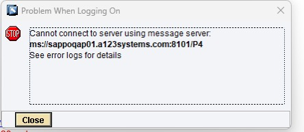
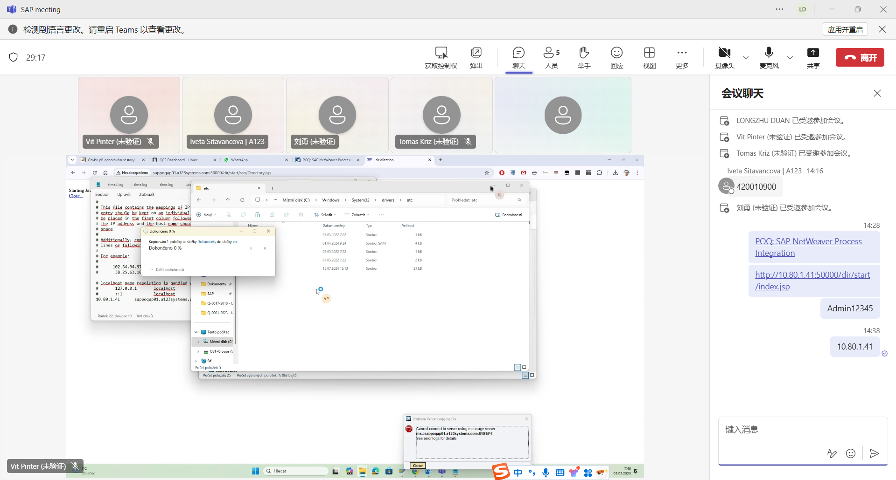

# 端口
<!-- more -->
刚刚PO捷克登录不上
我们内网可以登录内网不限制端口？啥无端
端口我们开了之后，对面也要开，是双向的，他们是一个一个开的
分别开8101和50004端口就可以了

SAP ABAP系统常用的端口
3200 3201 3300 
HTTP常用的端口8000 44300 50000等等
这些端口 和系统编号、参数有关系 需要开通时联系我们一起查一下系统设置就可以确定
## 参考文献
[PO 登录报错 8101/P4](https://blog.csdn.net/weixin_43176021/article/details/130411478)