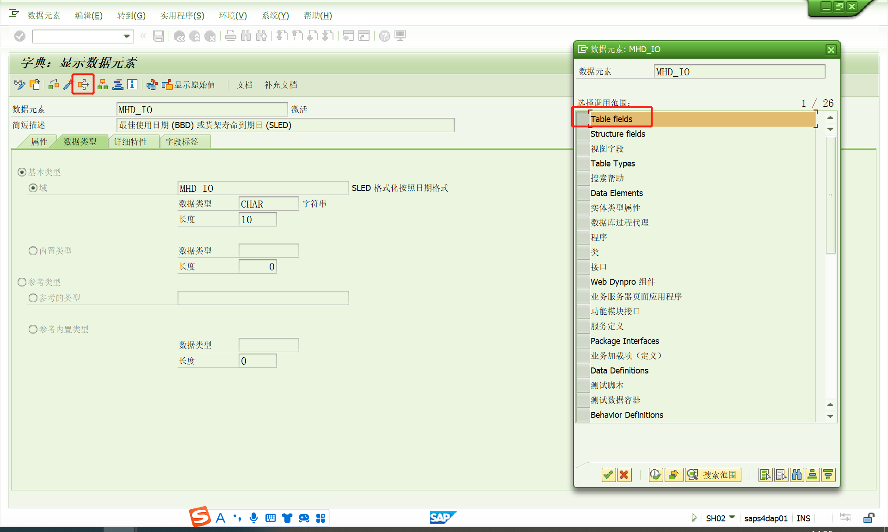

# 查找数据存在的表
这里记录一下我已知的怎么查找前台字段存在后台的那个数据库表里。
<!-- more -->

<!-- <Catalog base='/' hideHeading/> -->

## F1直接查看表
选中前台字段，按F1→技术信息，表类别是透明表的数据就直接存在那里。

## 使用ST05来追踪表
如果表类别是结构的，你可以修改一下他
1. ST05 Activate Trace
2. 修改前台数据
3. ST05 Deactivate Trace
4. Dispaly Trace查看该字段存在于哪个表(可能操作了多个表自己判断一下)

## 根据数据元素查找
有时候根据第一种方法找出的表名是结构类型的，这时可以用字段对应的元素继续查找。

有可能没有，有可能有并且需要自己判断下是哪个表

## 通过SM12查看
对于可编辑状态的事务，进入到屏幕之后系统会锁定相关的后台表，这样通过SM12就可以查看到该事务所对应的一些表了。但此方法不能将所有的表都罗列出来，例如表QPMT

## 通过字段对应的搜索帮助进行查找

## 根据经验查找
比如你在前台me23n看到的字段，一般可以根据经验在EKKO和EKPO表中。

## 参考资料
[ST05查找并判断SAP前台屏幕表字段](https://zhuanlan.zhihu.com/p/652011447)
[SAP中根据字段查找对应表的方法-悲秋廿四](https://blog.csdn.net/aa11437/article/details/122740266?spm=1001.2014.3001.5502)

