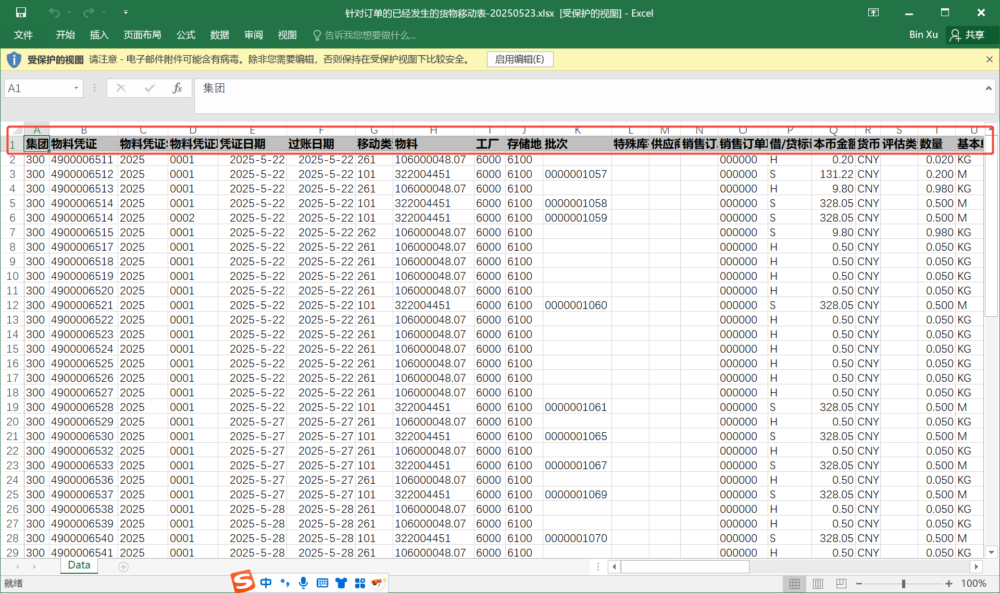
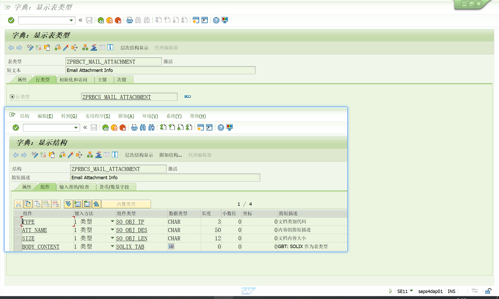
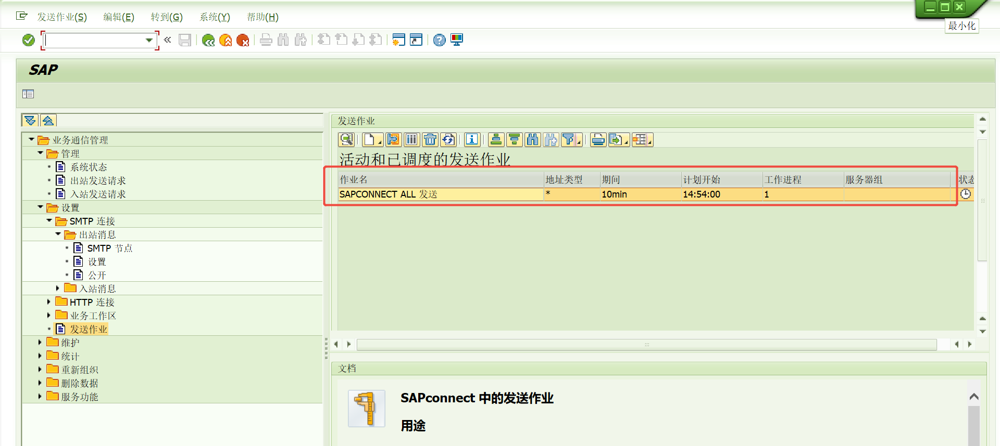
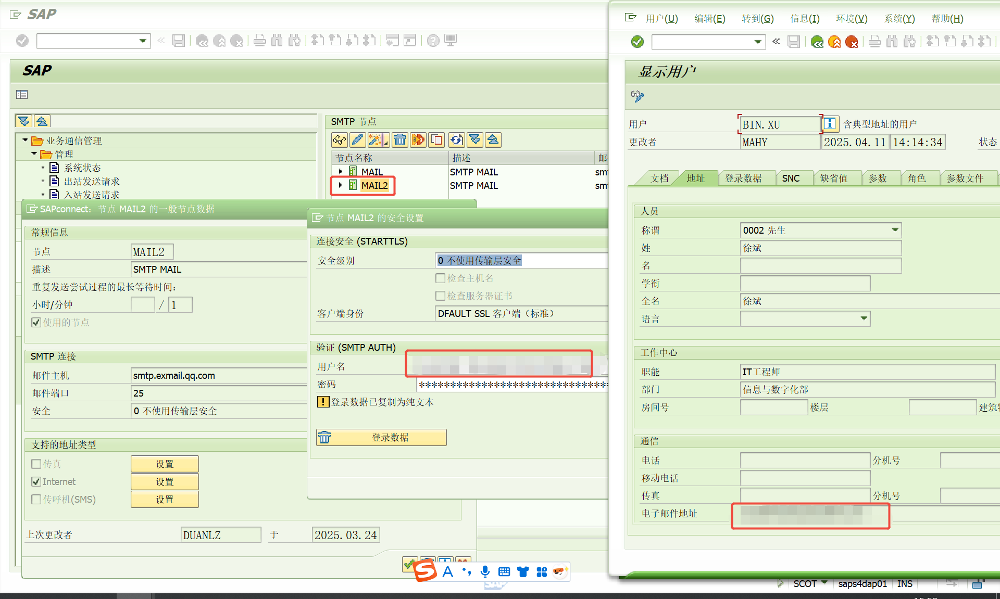
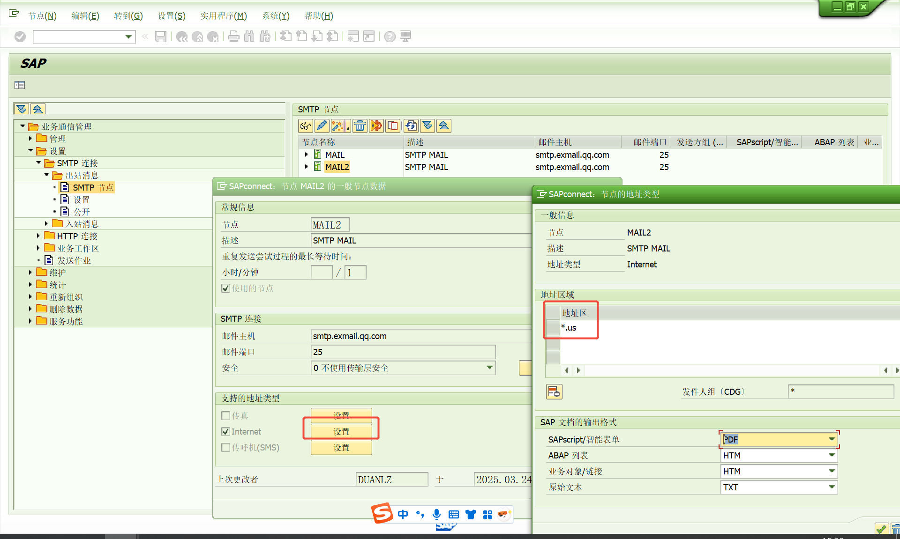

# SMARTFORMS和内表转附件 发送邮件 
<!-- more -->
## 1.背景
基于CL_BCS，将SAP Smartforms和内表分别转为PDF和xlsx格式的附件发送邮件。
## 2.准备工作
确保SAP能发送邮件，参考这个大佬的文章进行配置[2019.11.29 SAP SMTP郵件服務器配置 發送端 QQ郵箱-TAB_Zhu](https://www.cnblogs.com/jxzhu/p/11957516.html)

## 3.可能相关事务代码
SICF           HTTP 服务层次结构维护
SPROXY         ABAP Procy Generation
SMICM          ICM 监控器
RZ10           维护参数文件参数
SBWP           SAP 业务工作台(发送邮件功能)
SCOT           SAP connect 管理
SOST           SAP 连接发送请求(所有待发送的邮件清单，也可以监视邮件发送状态，也可以在此页面发送邮件！)
SE78           表格图形管理
SMARTFORMSSAP  智能表格
SE71           SAP script 格式
SFP            表格构建器(adobe)
NACE           WFMC：初始定制屏幕
ME9F           消息输出: 采购订单

## 4.Smartforms转PDF并添加为邮件附件

### 4.1获取Smartforms的XSTRING文件

获取加密函数模块名，调用Smartforms
主要参数为以下三个参数：
no_dialog：       保证不显示弹窗
tdnewid：          设置创建假脱机请求
user_settings：置空，保证上面两个参数生效

```ABAP
  DATA: FM_NAME       TYPE RS38L_FNAM.
  DATA: GWA_RESULT    TYPE SSFCRESCL,
        GWA_OUTPUT    TYPE SSFCOMPOP,
        GWA_CONTROL   TYPE SSFCTRLOP.
*DATA: LS_HEAD TYPE ZMMS010, "定义表头内表
*      LT_ITEM TYPE TABLE OF ZMMS010 WITH HEADER LINE. "定义表值内表
  DATA: GV_SIZE       TYPE I,
        GZ_LINES      TYPE TABLE OF TLINE,
        GS_LINES      TYPE SOLIX_TAB,
        LV_XSTRING    TYPE XSTRING.                 "pdf附件


  "调用Smartforms，获取加密函数模块名
  CALL FUNCTION 'SSF_FUNCTION_MODULE_NAME'
    EXPORTING
     FORMNAME           = 'ZTEST01' "表单名
*     VARIANT            = ' '
*     DIRECT_CALL        = ' '
    IMPORTING
      FM_NAME            = FM_NAME
    EXCEPTIONS
      NO_FORM            = 1
      NO_FUNCTION_MODULE = 2
      OTHERS             = 3.
  IF SY-SUBRC <> 0.
* Implement suitable error handling here
  ENDIF.
```
```ABAP
  "附件PDF参数
  GWA_CONTROL-NO_DIALOG = 'X'. "不显示弹窗
  GWA_CONTROL-NO_CLOSE = ' '.
  GWA_CONTROL-PREVIEW = ' '.
  GWA_CONTROL-GETOTF = 'X'.
  GWA_CONTROL-LANGU     = SY-LANGU.
  GWA_OUTPUT-TDNEWID   = 'X'. "设置创建假脱机请求
  GWA_OUTPUT-TDIMMED   = 'X'.
  GWA_OUTPUT-TDDELETE   = 'X'.
  GWA_OUTPUT-TDDEST  = 'LP01'.

  CALL FUNCTION FM_NAME
    EXPORTING
      CONTROL_PARAMETERS = GWA_CONTROL
      OUTPUT_OPTIONS     = GWA_OUTPUT
      USER_SETTINGS      = '' "置空，保证上面两个参数生效
      GS_HEAD            = IS_HEAD  "看你SMARTFORMS需要
    IMPORTING
      JOB_OUTPUT_INFO    = GWA_RESULT
    TABLES
      GT_ITEM            = GT_ITEM[] "传值进入smartforms，看你SMARTFORMS需要
    EXCEPTIONS
      FORMATTING_ERROR   = 1
      INTERNAL_ERROR     = 2
      SEND_ERROR         = 3
      USER_CANCELED      = 4
      OTHERS             = 5.
  IF SY-SUBRC <> 0.
* Implement suitable error handling here
  ENDIF.  
```

### 4.2调用CONVERT_OTFSPOOLJOB_2_PDF将打印池中的信息转换为PDF
SAP标准参考程序：RSTXPDFT4
之后你想把PDF附件以什么形式传给CL_BCS，就把XTRING转成对应格式，我这里转成二进制
```ABAP
Convert OTF to PDF
  CALL FUNCTION 'CONVERT_OTF'
    EXPORTING
      FORMAT                = 'PDF'
      PDF_PREVIEW           = 'X' "PDF预览
    IMPORTING
      BIN_FILESIZE          = GV_SIZE
      BIN_FILE              = LV_XSTRING
    TABLES
      OTF                   = GWA_RESULT-OTFDATA
      LINES                 = GZ_LINES
    EXCEPTIONS
      ERR_MAX_LINEWIDTH     = 1
      ERR_FORMAT            = 2
      ERR_CONV_NOT_POSSIBLE = 3
      ERR_BAD_OTF           = 4
      OTHERS                = 5.

  IF SY-SUBRC <> 0.
    MESSAGE ID SY-MSGID TYPE SY-MSGTY NUMBER SY-MSGNO
            WITH SY-MSGV1 SY-MSGV2 SY-MSGV3 SY-MSGV4.
  ENDIF.

  "转换二进制
  CALL FUNCTION 'SCMS_XSTRING_TO_BINARY'
    EXPORTING
      BUFFER     = LV_XSTRING
    TABLES
      BINARY_TAB = GS_LINES.
```

### 4.3添加附件,可以添加多个附件

```ABAP
*     附件长度
  L_FILE_SIZE_CHAR = GV_SIZE.
*     添加附件,可以添加多个附件
  CALL METHOD LO_DOC_BCS->ADD_ATTACHMENT
    EXPORTING
      I_ATTACHMENT_TYPE    = 'BIN'
*      I_ATTACHMENT_SUBJECT = '邮件测试' && '.PDF'
      I_ATTACHMENT_SIZE    = L_FILE_SIZE_CHAR
      I_ATT_CONTENT_HEX    = GS_LINES.
```

##  5.内表转xslx并添加为邮件附件
BCS框架提供的文件扩展名是3位字符的，所以像xlsx，docx之类的内容将无法直接添附，如果需要添附4位扩展名的文件作为附件，需要使用关键字"&SO_FILENAME="来确定附件名称和类型。
生成的xslx文件的首行描述根据你数据元素的字段标签生成，当然你的fieldcat也可以自己手动创建


```ABAP
DATA GT_AUFM LIKE TABLE OF AUFM.
* 1.  准备内表数据
  SELECT * INTO CORRESPONDING FIELDS OF TABLE GT_AUFM
    FROM AUFM
   WHERE AUFNR IN S_AUFNR.

* 2.将内表转换为xslx格式
PERFORM FRM_GET_IT_XSLX_SOLIX CHANGING LS_ATTCH-BODY_CONTENT LS_ATTCH-SIZE.


* 3.添加附件,可以添加多个附件
  CALL METHOD LO_DOC_BCS->ADD_ATTACHMENT
    EXPORTING
      I_ATTACHMENT_TYPE    = 'BIN'
      I_ATTACHMENT_SUBJECT = '测试文件.XSLX'
      I_ATTACHMENT_SIZE    = LS_ATTCH-SIZE
      I_ATTACHMENT_HEADER  = '&SO_FILENAME=测试文件.XSLX'
      I_ATT_CONTENT_HEX    = LS_ATTCH-BODY_CONTENT.

```

```ABAP
FORM FRM_GET_IT_XSLX_SOLIX    CHANGING CS_ATTCH_BODY_CONTENT TYPE SOLIX_TAB
                                     CS_ATTCH_SIZE TYPE SO_OBJ_LEN
.
  TYPES:
    BEGIN OF TY_TEST,
      USERID   TYPE STRING,
      USERNAME TYPE STRING,
    END OF TY_TEST,
    TT_TEST TYPE STANDARD TABLE OF TY_TEST.
  DATA:
    LT_TEST     TYPE TT_TEST,
    LV_XSTRING  TYPE XSTRING,
    LV_STRING   TYPE STRING,
    LV_CODEPAGE TYPE CPCODEPAGE.
  DATA:
    LO_BCS TYPE REF TO CX_BCS.

* 添加附件,可以添加多个附件
  FIELD-SYMBOLS <FS_TAB> TYPE STANDARD TABLE.
    DATA(LT_DATA) = REF #( GT_AUFM ).
    ASSIGN LT_DATA->* TO <FS_TAB>.
  TRY.
      TRY.
          CALL METHOD CL_SALV_TABLE=>FACTORY
            EXPORTING
              LIST_DISPLAY = IF_SALV_C_BOOL_SAP=>FALSE
*             R_CONTAINER  =
*             CONTAINER_NAME =
            IMPORTING
              R_SALV_TABLE = DATA(SALV_TABLE)
            CHANGING
              T_TABLE      = <FS_TAB>.
        CATCH CX_SALV_MSG.
          RETURN.
      ENDTRY.


      DATA(LT_FCAT) =  CL_SALV_CONTROLLER_METADATA=>GET_LVC_FIELDCATALOG(
                         R_COLUMNS      = SALV_TABLE->GET_COLUMNS( )
                         R_AGGREGATIONS = SALV_TABLE->GET_AGGREGATIONS( )
                 )
                         .
    CATCH CX_SALV_MSG.
      RETURN.
  ENDTRY.
CL_SALV_BS_LEX=>EXPORT_FROM_RESULT_DATA_TABLE(
         EXPORTING
           IS_FORMAT                     = IF_SALV_BS_LEX_FORMAT=>MC_FORMAT_XLSX
           IR_RESULT_DATA_TABLE          = CL_SALV_EX_UTIL=>FACTORY_RESULT_DATA_TABLE(
           R_DATA = LT_DATA
           T_FIELDCATALOG = LT_FCAT "fieldcat
           )
*      IR_FORMATTING_DESCRIPTORS     =
*      IRT_HEADER_FORMAT_DESCRIPTORS =
*      IR_APPENDIX_BLOCKS            =
*      IV_GROUP_HANDLES_ENABLED      = ABAP_FALSE
*      IV_THEME                      =
*      IV_GUIDELINE                  =
*      IO_STREAMING_TASK             =
         IMPORTING
           ER_RESULT_FILE                = LV_XSTRING ).
*      ET_EXPORT_ERRORS              =
*      ES_FILENAME                   =
*      ES_MIMETYPE                   =
*      ES_FILE_EXTENSION             =
    .
    TRY.
        CL_BCS_CONVERT=>XSTRING_TO_SOLIX(
        EXPORTING
          IV_XSTRING = LV_XSTRING
        RECEIVING
          ET_SOLIX = CS_ATTCH_BODY_CONTENT
        ).
        CS_ATTCH_SIZE = XSTRLEN( LV_XSTRING ).
      CATCH CX_BCS INTO LO_BCS.
    ENDTRY.
    ENDFORM.
```

## 6.SE37 SMARTFORMS转PDF完整Demo
```ABAP
FUNCTION ZMMFU021.
*"----------------------------------------------------------------------
*"*"本地接口：
*"  IMPORTING
*"     VALUE(IV_SFORM) TYPE  NA_FNAME OPTIONAL
*"     VALUE(IS_HEAD) TYPE  ZMMS021 OPTIONAL
*"  TABLES
*"      GT_ITEM STRUCTURE  ZMMS021 OPTIONAL
*"----------------------------------------------------------------------

  DATA: FM_NAME      TYPE RS38L_FNAM.
  DATA: GWA_RESULT  TYPE SSFCRESCL,
        GWA_OUTPUT  TYPE SSFCOMPOP,
        GWA_CONTROL TYPE SSFCTRLOP.
  DATA: GV_SIZE       TYPE I.
  DATA: GZ_LINES      TYPE TABLE OF TLINE.
  DATA: GS_LINES      TYPE SOLIX_TAB .
  DATA:LV_XSTRING     TYPE XSTRING.                 "pdf附件
  DATA: LO_BCS        TYPE REF TO CL_BCS,
        LO_DOC_BCS    TYPE REF TO CL_DOCUMENT_BCS,
        L_SENDER      TYPE REF TO CL_SAPUSER_BCS,
        L_SEND_RESULT TYPE OS_BOOLEAN,
        L_SUBJECT     TYPE SO_OBJ_DES.


  DATA: LO_RECIPIENT   TYPE REF TO IF_RECIPIENT_BCS. "收件人
  DATA: L_TO TYPE ADR6-SMTP_ADDR."收件人地址
  DATA: L_FILE_SIZE_CHAR TYPE SO_OBJ_LEN.

  DATA: LT_SOLISTI1 TYPE  SOLI_TAB ,         "定义邮件内容
        LS_SOLISTI1 TYPE SOLI.
  DATA : LO_MIME_HELPER    TYPE REF TO CL_GBT_MULTIRELATED_SERVICE.


  CREATE OBJECT LO_DOC_BCS.

* 邮件标题
  L_SUBJECT = '邮件标题'.


* 邮件正文
  LS_SOLISTI1 = '<html xmlns="http://www.w3.org/1999/xhtml" xmlns:xfa="http://www.xfa.org/schema/xfa-template/2.1/"> <head> <meta http-equiv = "Content-Type" content = "text/html; charset = utf-8"></head>'.
  APPEND LS_SOLISTI1 TO LT_SOLISTI1.
  LS_SOLISTI1 = '<BODY>'.
  APPEND LS_SOLISTI1 TO LT_SOLISTI1.
  CLEAR LS_SOLISTI1.
  LS_SOLISTI1  = '<SPAN style="font-family:Calibri;font-size:小四;">'.
  APPEND LS_SOLISTI1 TO LT_SOLISTI1.
*  CONCATENATE  '备注:'  '<BR><BR>' INTO LS_SOLISTI1.
  CONCATENATE  'Remark:'  '<BR><BR>' INTO LS_SOLISTI1.
  APPEND LS_SOLISTI1 TO LT_SOLISTI1.
*  CONCATENATE  '重要提示：此邮件及附件具有保密性质，包含商业秘密，受法律保护不得泄露.'  '<BR><BR>' INTO LS_SOLISTI1.
  CONCATENATE  'Please confirm receipt of this purchase order. Should you have any questions, please do not hesitate to contact us.'  '<BR><BR>' INTO LS_SOLISTI1.
  APPEND LS_SOLISTI1 TO LT_SOLISTI1.
  CLEAR LS_SOLISTI1.
  LS_SOLISTI1 ='</SPAN>'.
  APPEND LS_SOLISTI1 TO LT_SOLISTI1.


*CREATE THE DOCUMENT WITH CONTENTS
  CREATE OBJECT LO_MIME_HELPER.
  CALL METHOD LO_MIME_HELPER->SET_MAIN_HTML
    EXPORTING
      CONTENT     = LT_SOLISTI1
      DESCRIPTION = 'Automatic payment'.  "title


  LO_DOC_BCS = CL_DOCUMENT_BCS=>CREATE_FROM_MULTIRELATED( I_SUBJECT = L_SUBJECT I_MULTIREL_SERVICE = LO_MIME_HELPER I_LANGUAGE = SY-LANGU I_IMPORTANCE = '1' ).


  "附件PDF参数
  GWA_CONTROL-NO_DIALOG = 'X'.
  GWA_CONTROL-NO_CLOSE = ' '.
  GWA_CONTROL-PREVIEW = ' '.
  GWA_CONTROL-GETOTF = 'X'.
  GWA_CONTROL-LANGU     = SY-LANGU.
  GWA_OUTPUT-TDNEWID   = 'X'.
  GWA_OUTPUT-TDIMMED   = 'X'.
  GWA_OUTPUT-TDDELETE   = 'X'.
  GWA_OUTPUT-TDDEST  = 'LP01'.


  "调用smartforms
  CALL FUNCTION 'SSF_FUNCTION_MODULE_NAME'
    EXPORTING
*     FORMNAME           = 'ZMMF001'
*     FORMNAME           = 'ZTEST01'
*     FORMNAME           = 'ZMMF004'
      FORMNAME           = IV_SFORM
*     VARIANT            = ' '
*     DIRECT_CALL        = ' '
    IMPORTING
      FM_NAME            = FM_NAME
    EXCEPTIONS
      NO_FORM            = 1
      NO_FUNCTION_MODULE = 2
      OTHERS             = 3.
  IF SY-SUBRC <> 0.
* Implement suitable error handling here
  ENDIF.


  CALL FUNCTION FM_NAME
    EXPORTING
      CONTROL_PARAMETERS = GWA_CONTROL
      OUTPUT_OPTIONS     = GWA_OUTPUT
      USER_SETTINGS      = ''
      GS_HEAD            = IS_HEAD
    IMPORTING
      JOB_OUTPUT_INFO    = GWA_RESULT
    TABLES
      GT_ITEM            = GT_ITEM[] ""传值进入smartforms
    EXCEPTIONS
      FORMATTING_ERROR   = 1
      INTERNAL_ERROR     = 2
      SEND_ERROR         = 3
      USER_CANCELED      = 4
      OTHERS             = 5.
  IF SY-SUBRC <> 0.
* Implement suitable error handling here
  ENDIF.


*Convert OTF to PDF
  CALL FUNCTION 'CONVERT_OTF'
    EXPORTING
      FORMAT                = 'PDF'
      PDF_PREVIEW           = 'X' "PDF预览
    IMPORTING
      BIN_FILESIZE          = GV_SIZE
      BIN_FILE              = LV_XSTRING
    TABLES
      OTF                   = GWA_RESULT-OTFDATA
      LINES                 = GZ_LINES
    EXCEPTIONS
      ERR_MAX_LINEWIDTH     = 1
      ERR_FORMAT            = 2
      ERR_CONV_NOT_POSSIBLE = 3
      ERR_BAD_OTF           = 4
      OTHERS                = 5.

  IF SY-SUBRC <> 0.
    MESSAGE ID SY-MSGID TYPE SY-MSGTY NUMBER SY-MSGNO
            WITH SY-MSGV1 SY-MSGV2 SY-MSGV3 SY-MSGV4.
  ENDIF.

  "转换二进制
  CALL FUNCTION 'SCMS_XSTRING_TO_BINARY'
    EXPORTING
      BUFFER     = LV_XSTRING
    TABLES
      BINARY_TAB = GS_LINES.

*     附件长度
  L_FILE_SIZE_CHAR = GV_SIZE.

*     添加附件,可以添加多个附件
  CALL METHOD LO_DOC_BCS->ADD_ATTACHMENT
    EXPORTING
      I_ATTACHMENT_TYPE    = 'BIN'
*     I_ATTACHMENT_SUBJECT = 'PO' && LS_HEAD-EBELN && '.PDF'
*      I_ATTACHMENT_SUBJECT = '邮件测试' && '.PDF'
      I_ATTACHMENT_SUBJECT = 'Systems Purchase Order Number ' && IS_HEAD-EBELN && '.PDF'
      I_ATTACHMENT_SIZE    = L_FILE_SIZE_CHAR
      I_ATT_CONTENT_HEX    = GS_LINES.


  LO_BCS = CL_BCS=>CREATE_PERSISTENT( ).
  L_SENDER = CL_SAPUSER_BCS=>CREATE( SY-UNAME ).


  CALL METHOD LO_BCS->SET_SENDER
    EXPORTING
      I_SENDER = L_SENDER.


  DATA:LF_ERROR TYPE REF TO CX_ADDRESS_BCS.


  "设置接收人\抄送人邮箱
*IF GX_ZMMF010-ZZEMAIL IS NOT INITIAL.
  TRY.
*      L_TO = '6666@systems.com'."邮箱地址
      L_TO = IS_HEAD-LIFNR_SMTP_ADDR."邮箱地址
      LO_RECIPIENT = CL_CAM_ADDRESS_BCS=>CREATE_INTERNET_ADDRESS( L_TO ).
      LO_BCS->ADD_RECIPIENT( I_RECIPIENT  = LO_RECIPIENT
                             I_EXPRESS    = 'X'
                             I_COPY       = ' '"设置是否抄送
                             I_BLIND_COPY = ' '
                             I_NO_FORWARD = ' ' ).

      L_TO = IS_HEAD-ERNAM_SMTP_ADDR."邮箱地址
      LO_RECIPIENT = CL_CAM_ADDRESS_BCS=>CREATE_INTERNET_ADDRESS( L_TO ).
      LO_BCS->ADD_RECIPIENT( I_RECIPIENT  = LO_RECIPIENT
                             I_EXPRESS    = 'X'
                             I_COPY       = 'X'"设置是否抄送
                             I_BLIND_COPY = ' '
                             I_NO_FORWARD = ' ' ).

    CATCH   CX_ADDRESS_BCS INTO LF_ERROR .
      MESSAGE '邮件地址异常!' TYPE 'I'.
      RETURN.
  ENDTRY.

*ENDIF.


  " 将发送请求与业务工作台的发件箱关联
  LO_BCS->SEND_REQUEST->SET_LINK_TO_OUTBOX( 'X' ).

  "提交邮件发送申请
  LO_BCS->SET_DOCUMENT( I_DOCUMENT = LO_DOC_BCS ).
  CALL METHOD LO_BCS->SEND(
    EXPORTING
      I_WITH_ERROR_SCREEN = 'X'
    RECEIVING
      RESULT              = L_SEND_RESULT
  ).

  IF L_SEND_RESULT = 'X'.
    COMMIT WORK AND WAIT.
    IF SY-LANGU = '1'.
      MESSAGE '邮件发送成功' TYPE 'S'.
    ELSE.
      MESSAGE 'Email sent successfully' TYPE 'S'.
    ENDIF.

*  CLEAR LS_MODIFY_EMAIL.
  ELSE.
    ROLLBACK WORK.
    IF SY-LANGU = '1'.
      MESSAGE '邮件发送失败' TYPE 'S'.
    ELSE.
      MESSAGE 'Mail delivery failure' TYPE 'S'.
    ENDIF.

  ENDIF.


*  WAIT UP TO 2 SECONDS.
*
*  SUBMIT RSCONN01 WITH MODE = 'INT'
*          WITH OUTPUT = 'X'
*          AND RETURN.


ENDFUNCTION.
```
## 7.SE38 内表转XSLX完整Demo

```ABAP
*&---------------------------------------------------------------------*
*& Report Z13_27
*&---------------------------------------------------------------------*
*&
*&---------------------------------------------------------------------*
REPORT Z13_27.
DATA GT_AUFM LIKE TABLE OF AUFM.
DATA ZTEXT TYPE CHAR255.

PERFORM FRM_SEND_MAIL.
*&---------------------------------------------------------------------*
*& Form FRM_SEND_MAIL
*&---------------------------------------------------------------------*
*& text
*&---------------------------------------------------------------------*
*& -->  p1        text
*& <--  p2        text
*&---------------------------------------------------------------------*
FORM FRM_SEND_MAIL .
  DATA: LO_BCS        TYPE REF TO CL_BCS,
        LO_DOC_BCS    TYPE REF TO CL_DOCUMENT_BCS,
        L_SENDER      TYPE REF TO CL_SAPUSER_BCS,
        L_SEND_RESULT TYPE OS_BOOLEAN,
        L_SUBJECT     TYPE SO_OBJ_DES.
  DATA: LT_SOLISTI1 TYPE  SOLI_TAB ,         "定义邮件内容
        LS_SOLISTI1 TYPE SOLI.
  DATA : LO_MIME_HELPER    TYPE REF TO CL_GBT_MULTIRELATED_SERVICE.

  DATA: L_TO TYPE ADR6-SMTP_ADDR."收件人地址
  DATA: LO_RECIPIENT   TYPE REF TO IF_RECIPIENT_BCS. "收件人

  DATA:
    LT_ATTCH     TYPE ZPRBCT_MAIL_ATTACHMENT,
    LS_ATTCH     TYPE ZPRBCS_MAIL_ATTACHMENT,
    LV_TEXT_LINE TYPE SOLI,
    LT_ATT_HEAD  TYPE SOLI_TAB,
    LV_FILENAME  TYPE STRING.

  DATA LV_NUM TYPE N."多个附件情况

  CREATE OBJECT LO_DOC_BCS.


* 邮件标题
  CLEAR ZTEXT.
  ZTEXT ='标题111' .
  L_SUBJECT = ZTEXT.
* 邮件正文
  LS_SOLISTI1 = '<html xmlns="http://www.w3.org/1999/xhtml" xmlns:xfa="http://www.xfa.org/schema/xfa-template/2.1/"> <head> <meta http-equiv = "Content-Type" content = "text/html; charset = utf-8"></head>'.
  APPEND LS_SOLISTI1 TO LT_SOLISTI1.
  LS_SOLISTI1 = '<BODY>'.
  APPEND LS_SOLISTI1 TO LT_SOLISTI1.
  CLEAR LS_SOLISTI1.
  LS_SOLISTI1  = '<SPAN style="font-family:Calibri;font-size:小四;">'.
  APPEND LS_SOLISTI1 TO LT_SOLISTI1.
  CONCATENATE  '备注:'  '<BR><BR>' INTO LS_SOLISTI1.
  APPEND LS_SOLISTI1 TO LT_SOLISTI1.
  CLEAR ZTEXT.
  ZTEXT ='系统产出报工' && '，具体内容请查看附件，有问题请联系'.
  CONCATENATE  ZTEXT  '<BR><BR>' INTO LS_SOLISTI1.
  APPEND LS_SOLISTI1 TO LT_SOLISTI1.
  CLEAR LS_SOLISTI1.
  LS_SOLISTI1 ='</SPAN>'.
  APPEND LS_SOLISTI1 TO LT_SOLISTI1.
*CREATE THE DOCUMENT WITH CONTENTS
  CREATE OBJECT LO_MIME_HELPER.
  CALL METHOD LO_MIME_HELPER->SET_MAIN_HTML
    EXPORTING
      CONTENT     = LT_SOLISTI1
      DESCRIPTION = 'Automatic payment'.  "title


  LO_DOC_BCS = CL_DOCUMENT_BCS=>CREATE_FROM_MULTIRELATED( I_SUBJECT = L_SUBJECT I_MULTIREL_SERVICE = LO_MIME_HELPER I_LANGUAGE = SY-LANGU I_IMPORTANCE = '1' ).


* 1.  准备内表数据

  SELECT * INTO CORRESPONDING FIELDS OF TABLE GT_AUFM
    FROM AUFM
   .


* 2.  Email Attachment - Xlsx -> From internal table

  LS_ATTCH-TYPE     = 'BIN'.
  CLEAR ZTEXT.
  ZTEXT = '针对订单的已经发生的货物移动表.xlsx'.
*  LS_ATTCH-ATT_NAME = 'TestXLSX_InternalTable.xlsx'.
  LS_ATTCH-ATT_NAME = ZTEXT.
  LV_NUM = '2'.
  PERFORM FRM_GET_IT_XSLX_SOLIX USING LV_NUM CHANGING LS_ATTCH-BODY_CONTENT LS_ATTCH-SIZE.
  APPEND LS_ATTCH TO LT_ATTCH.


* 3.添加附件,可以添加多个附件
  LV_FILENAME = LS_ATTCH-ATT_NAME.
  CONCATENATE '&SO_FILENAME=' LV_FILENAME INTO LV_TEXT_LINE.
  APPEND LV_TEXT_LINE TO LT_ATT_HEAD.

  CALL METHOD LO_DOC_BCS->ADD_ATTACHMENT
    EXPORTING
      I_ATTACHMENT_TYPE    = LS_ATTCH-TYPE
      I_ATTACHMENT_SUBJECT = LS_ATTCH-ATT_NAME
      I_ATTACHMENT_SIZE    = LS_ATTCH-SIZE
      I_ATTACHMENT_HEADER  = LT_ATT_HEAD
      I_ATT_CONTENT_HEX    = LS_ATTCH-BODY_CONTENT.
  CLEAR: LS_ATTCH,LV_FILENAME,LV_TEXT_LINE.
  REFRESH LT_ATT_HEAD.


  LO_BCS = CL_BCS=>CREATE_PERSISTENT( )."邮件发送请求将被保存在数据库中，即使发送过程中出现错误，也可以稍后重新发送请求。
  L_SENDER = CL_SAPUSER_BCS=>CREATE( SY-UNAME ).
  CALL METHOD LO_BCS->SET_SENDER
    EXPORTING
      I_SENDER = L_SENDER.


  DATA:LF_ERROR TYPE REF TO CX_ADDRESS_BCS.

  "设置接收人\抄送人邮箱
*IF GX_ZMMF010-ZZEMAIL IS NOT INITIAL.
  TRY.
      L_TO = '11111.com'."邮箱地址
      LO_RECIPIENT = CL_CAM_ADDRESS_BCS=>CREATE_INTERNET_ADDRESS( L_TO ).
      LO_BCS->ADD_RECIPIENT( I_RECIPIENT  = LO_RECIPIENT
                             I_EXPRESS    = 'X'
                             I_COPY       = ' '"设置是否抄送
                             I_BLIND_COPY = ' '
                             I_NO_FORWARD = ' ' ).

*      L_TO = '22222.com'."邮箱地址
*      LO_RECIPIENT = CL_CAM_ADDRESS_BCS=>CREATE_INTERNET_ADDRESS( L_TO ).
*      LO_BCS->ADD_RECIPIENT( I_RECIPIENT  = LO_RECIPIENT
*                             I_EXPRESS    = 'X'
*                             I_COPY       = 'X'"设置是否抄送
*                             I_BLIND_COPY = ' '
*                             I_NO_FORWARD = ' ' ).


    CATCH   CX_ADDRESS_BCS INTO LF_ERROR .
      MESSAGE '邮件地址异常!' TYPE 'I'.
      RETURN.
  ENDTRY.

*ENDIF.


  "提交邮件发送申请
  LO_BCS->SET_DOCUMENT( I_DOCUMENT = LO_DOC_BCS ).

  CALL METHOD LO_BCS->SEND(
    EXPORTING
      I_WITH_ERROR_SCREEN = 'X'
    RECEIVING
      RESULT              = L_SEND_RESULT
  ).

  IF L_SEND_RESULT = 'X'.
    COMMIT WORK AND WAIT.
    MESSAGE '邮件发送成功' TYPE 'S'.
*  CLEAR LS_MODIFY_EMAIL.
  ELSE.
    ROLLBACK WORK.
    MESSAGE '邮件发送失败' TYPE  'E'.
  ENDIF.


  WAIT UP TO 2 SECONDS.

  SUBMIT RSCONN01 WITH MODE = 'INT'
          WITH OUTPUT = 'X'
          AND RETURN.
ENDFORM.
*&---------------------------------------------------------------------*
*& Form FRM_GET_IT_XSLX_SOLIX
*&---------------------------------------------------------------------*
*& text
*&---------------------------------------------------------------------*
*&      --> LV_NUM
*&      <-- LS_ATTCH_BODY_CONTENT
*&      <-- LS_ATTCH_SIZE
*&---------------------------------------------------------------------*
FORM FRM_GET_IT_XSLX_SOLIX  USING    PV_NUM
                            CHANGING CS_ATTCH_BODY_CONTENT
                                     CS_ATTCH_SIZE.
  TYPES:
    BEGIN OF TY_TEST,
      USERID   TYPE STRING,
      USERNAME TYPE STRING,
    END OF TY_TEST,
    TT_TEST TYPE STANDARD TABLE OF TY_TEST.
  DATA:
    LT_TEST     TYPE TT_TEST,
    LV_XSTRING  TYPE XSTRING,
    LV_STRING   TYPE STRING,
    LV_CODEPAGE TYPE CPCODEPAGE.
  DATA:
    LO_BCS TYPE REF TO CX_BCS.

* 添加附件,可以添加多个附件
  FIELD-SYMBOLS <FS_TAB> TYPE STANDARD TABLE.
  IF PV_NUM = '1'.
  ELSEIF PV_NUM = '2'.
    DATA(LT_DATA) = REF #( GT_AUFM )."对个附件的下面的R_DATA = LT_DATA要分别对应这个创建的内表名如LT_DATA
    ASSIGN LT_DATA->* TO <FS_TAB>.
  ELSEIF PV_NUM = '3'.
  ENDIF.


  TRY.
      TRY.
          CALL METHOD CL_SALV_TABLE=>FACTORY
            EXPORTING
              LIST_DISPLAY = IF_SALV_C_BOOL_SAP=>FALSE
*             R_CONTAINER  =
*             CONTAINER_NAME =
            IMPORTING
              R_SALV_TABLE = DATA(SALV_TABLE)
            CHANGING
              T_TABLE      = <FS_TAB>.
        CATCH CX_SALV_MSG.
          RETURN.
      ENDTRY.


      DATA(LT_FCAT) =  CL_SALV_CONTROLLER_METADATA=>GET_LVC_FIELDCATALOG(
                         R_COLUMNS      = SALV_TABLE->GET_COLUMNS( )
                         R_AGGREGATIONS = SALV_TABLE->GET_AGGREGATIONS( )
                 )
                         .
    CATCH CX_SALV_MSG.
      RETURN.
  ENDTRY.

* Convert table to xstring


    CL_SALV_BS_LEX=>EXPORT_FROM_RESULT_DATA_TABLE(
        EXPORTING
          IS_FORMAT                     = IF_SALV_BS_LEX_FORMAT=>MC_FORMAT_XLSX
          IR_RESULT_DATA_TABLE          = CL_SALV_EX_UTIL=>FACTORY_RESULT_DATA_TABLE(
          R_DATA = LT_DATA
          T_FIELDCATALOG = LT_FCAT
          )
*      IR_FORMATTING_DESCRIPTORS     =
*      IRT_HEADER_FORMAT_DESCRIPTORS =
*      IR_APPENDIX_BLOCKS            =
*      IV_GROUP_HANDLES_ENABLED      = ABAP_FALSE
*      IV_THEME                      =
*      IV_GUIDELINE                  =
*      IO_STREAMING_TASK             =
        IMPORTING
          ER_RESULT_FILE                = LV_XSTRING ).
*      ET_EXPORT_ERRORS              =
*      ES_FILENAME                   =
*      ES_MIMETYPE                   =
*      ES_FILE_EXTENSION             =
    .
    TRY.
        CL_BCS_CONVERT=>XSTRING_TO_SOLIX(
        EXPORTING
          IV_XSTRING = LV_XSTRING
        RECEIVING
          ET_SOLIX = CS_ATTCH_BODY_CONTENT
        ).
        CS_ATTCH_SIZE = XSTRLEN( LV_XSTRING ).
      CATCH CX_BCS INTO LO_BCS.
    ENDTRY.

ENDFORM.
```
## 8.小Tips
* 设置定时任务来发送请求


* XS 812 501 mail from address must be same as authorization user。发送邮件的用户的电子邮件地址(标准号码)设置必须和节点地址相同


* 可以设置不同收件人用不同的发件人，通过节点的地址区域设置不同，比如下图设置了收件人地址是.us的就会走MAIL2节点，发件人SAP账号的地址需要设置MAIL2节点验证账号


* 发送邮件状态与重发。在Scot-管理-出站发送请求中查看邮件发送的状态，错误信息等。也可以对其进行重发


## 9.参考文献
[SAP SMTP郵件服務器配置 發送端 QQ郵箱 ](https://www.cnblogs.com/jxzhu/p/11957516.html)
[ABAP 发送带EXCEL邮件-Seele_1018](https://blog.csdn.net/qq_44826887/article/details/136294662?spm=1001.2014.3001.5502)
[ABAP-发送PDF附件邮件-LiXiangChen](https://www.cnblogs.com/lixiangchen/p/17798077.html)
[SAP ABAP 基于 CL_BCS 发送邮件-DeveloperMrMeng](https://blog.csdn.net/DeveloperMrMeng/article/details/131806801)
[2019.11.29 SAP SMTP郵件服務器配置 發送端 QQ郵箱-TAB_Zhu](https://www.cnblogs.com/jxzhu/p/11957516.html)