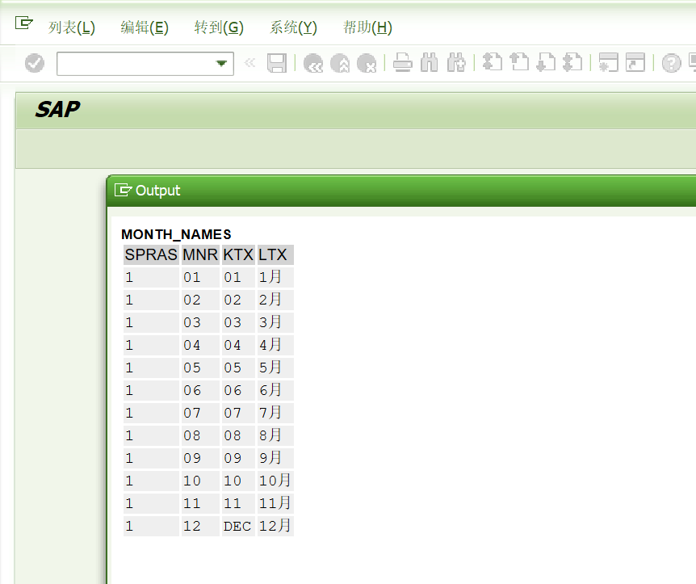

# ABAP 日期函数
<!-- more -->


### 1. 获取输入日期当前月份最后一天的日期
LAST_DAY_OF_MONTHS
```ABAP
DATA GV_DATA TYPE SY-DATUM.
*获取输入日期当前月份最后一天的日期
CALL FUNCTION 'LAST_DAY_OF_MONTHS'
  EXPORTING
    DAY_IN                  = '20250601'
 IMPORTING
   LAST_DAY_OF_MONTH       = GV_DATA  "20250630
* EXCEPTIONS
*   DAY_IN_NO_DATE          = 1
*   OTHERS                  = 2
          .
IF SY-SUBRC <> 0.
* Implement suitable error handling here
ELSE.
  WRITE GV_DATA.
ENDIF.
```
### 2.  获取输入日期过去N月的日期
CCM_GO_BACK_MONTHS
```ABAP
DATA GV_DATA TYPE SY-DATUM.
*获取输入日期过去N月的日期
CALL FUNCTION 'CCM_GO_BACK_MONTHS'
  EXPORTING
    CURRDATE         = '20250601'
    BACKMONTHS       = 7
 IMPORTING
   NEWDATE          = GV_DATA "20241101
          .
WRITE GV_DATA.
```

### 3. 获取输入日期后来N月的日期
MONTH_PLUS_DETERMINE
```ABAP
DATA GV_DATA TYPE SY-DATUM.
*获取输入日期后来N月的日期
CALL FUNCTION 'MONTH_PLUS_DETERMINE'
  EXPORTING
    MONTHS  = 7
    OLDDATE = '20250601'
  IMPORTING
    NEWDATE = GV_DATA. "20260101
WRITE GV_DATA.
```


### 4. 获取输入日期该天是星期几/周几
DAY_IN_WEEK
```ABAP
DATA GV_WOTNR TYPE P.
*获取输入日期该天是星期几/周几
CALL FUNCTION 'DAY_IN_WEEK'
  EXPORTING
    DATUM         = '20250601'
 IMPORTING
   WOTNR         = GV_WOTNR"7  => 周日
          .
WRITE GV_WOTNR.
```

### 5. 将标准日期格式转换为内部数字格式
日期的格式与用户参数有关，转化为内部数字格式时，都为：YYYYMMDD.
```ABAP
DATA GV_DATE TYPE SY-DATUM.
*将标准日期格式转换为内部数字格式
CALL FUNCTION 'CONVERT_DATE_TO_INTERNAL'
  EXPORTING
    DATE_EXTERNAL                  = '2025.06.01'
*   ACCEPT_INITIAL_DATE            =
 IMPORTING
   DATE_INTERNAL                  = GV_DATE
* EXCEPTIONS
*   DATE_EXTERNAL_IS_INVALID       = 1
*   OTHERS                         = 2
          .
IF SY-SUBRC <> 0.
* Implement suitable error handling here
ENDIF.
WRITE GV_DATE.
```

### 6. 比较两个日期大小，返回结果是关系操作符：GT、EQ、LT
比较两个日期大小，返回结果是关系操作符：GT、EQ、LT
```ABAP
TYPE-POOLS TRFF.
DATA LOG_OP TYPE TRFF_TYPE_C_2.
*比较两个日期大小，返回结果是关系操作符：GT、EQ、LT
CALL FUNCTION 'FIMA_DATE_COMPARE'
  EXPORTING
    I_FLG_INTRADAY = ' '
    I_DATE         = '20250601'
    I_TIME         = '000000'
    I_SINCL        = '0'
    I_SULT         = ' '
    I_COMP_DATE    = '20250623'
    I_COMP_TIME    = '000000'
    I_COMP_SINCL   = '0'
    I_COMP_SULT    = ' '
  IMPORTING
    E_LOG_OP       = LOG_OP."LT

WRITE LOG_OP.
```

### 7. 获取所有的月份名字信息
获取所有的月份名字信息
```ABAP
*获取所有的月份名字信息
DATA RETURN_CODE TYPE SY-SUBRC.
DATA MONTH_NAMES TYPE STANDARD TABLE OF T247.
CALL FUNCTION 'MONTH_NAMES_GET'
 EXPORTING
   LANGUAGE                    = SY-LANGU
 IMPORTING
   RETURN_CODE                 = RETURN_CODE
  TABLES
    MONTH_NAMES                 = MONTH_NAMES
 EXCEPTIONS
   MONTH_NAMES_NOT_FOUND       = 1
   OTHERS                      = 2
          .
IF SY-SUBRC <> 0.
* Implement suitable error handling here
ENDIF.
CL_DEMO_OUTPUT=>DISPLAY( MONTH_NAMES ).
```


### 8. 为 F4 帮助显示日历，弹出日历对话框，供用户选择日期
```ABAP
*为 F4 帮助显示日历，弹出日历对话框，供用户选择日期
PARAMETERS:P1(8) TYPE C.

AT SELECTION-SCREEN ON VALUE-REQUEST FOR P1.

  DATA: L_DATE TYPE SY-DATUM.
  CALL FUNCTION 'F4_DATE'
    EXPORTING
      DATE_FOR_FIRST_MONTH = SY-DATUM
*     DISPLAY              = ' '
*     FACTORY_CALENDAR_ID  = ' '
*     GREGORIAN_CALENDAR_FLAG            = ' '
*     HOLIDAY_CALENDAR_ID  = ' '
*     PROGNAME_FOR_FIRST_MONTH           = ' '
*     DATE_POSITION        = ' '
    IMPORTING
      SELECT_DATE          = L_DATE "用户选择后返回的日期
*     SELECT_WEEK          =
*     SELECT_WEEK_BEGIN    =
*     SELECT_WEEK_END      =
*   EXCEPTIONS
*     CALENDAR_BUFFER_NOT_LOADABLE       = 1
*     DATE_AFTER_RANGE     = 2
*     DATE_BEFORE_RANGE    = 3
*     DATE_INVALID         = 4
*     FACTORY_CALENDAR_NOT_FOUND         = 5
*     HOLIDAY_CALENDAR_NOT_FOUND         = 6
*     PARAMETER_CONFLICT   = 7
*     OTHERS               = 8
    .
  IF SY-SUBRC <> 0.
* Implement suitable error handling here
  ENDIF.
  P1 = L_DATE.
```

### 9. 为 F4 帮助显示时间，弹出时间对话框，供用户选择时间
```ABAP
*为 F4 帮助显示时间，弹出时间对话框，供用户选择时间
PARAMETERS:P1(6) TYPE C.

AT SELECTION-SCREEN ON VALUE-REQUEST FOR P1.
  DATA L_TIME TYPE SY-UZEIT.
  CALL FUNCTION 'F4_CLOCK'
   EXPORTING
     START_TIME          = SY-UZEIT
     DISPLAY             = ' '
   IMPORTING
     SELECTED_TIME       = L_TIME
            .

  P1 = L_TIME.
```


## 参考文献