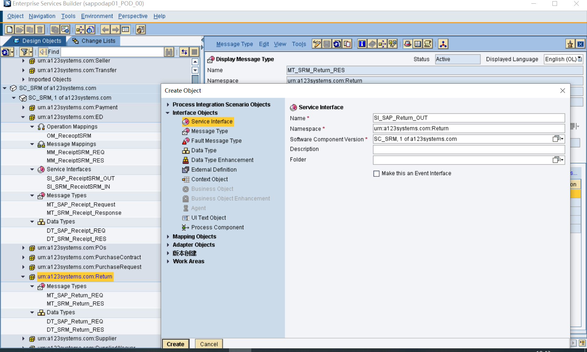

# SAP->外围系统调用外部RESTful接口
<!-- more -->
* 进入 PO 集成引擎的消息必须是 XML（这是 PI/PO 内部统一的消息格式）。
* 但“外围系统→PO”这一段可以发 JSON、CSV、EDI、纯文本等，只要在 Sender 通道里选对适配器并开好 Content Conversion/JSON-to-XML 转换；PO 会在通道级别先转成 XML，再往后走。
* 因此：SAP 端通过 PO 接收到的永远是 XML，而外围系统不一定非得发 XML。
事物代码  SXI_MONITOR  XI:消息监控
## 1.名词解释
Message Mapping-消息映射(简写MM)
Service Interfaces-服务接口(简写SI)
Operation Mapping-操作映射(简写OM)
External Definition-外部定义(简写ED)
DaTa Types-数据类型(简写DT)
Message Type-消息类型(简写MT)

Integrated Configuration-集成配置(简写IC)
Communication Channel-通信通道(简写CC)
Adapter Type-适配器类型(简写AT)
Business System-业务系统(简写BS)
Business ComPonent-业务组件(简写BC)

Enterprise Services Repository-企业服务仓库(简写ESR)
Integration Directory-集成目录(简写ID)

## 2.通信概览图
**个人整理所得，可能有误，欢迎指正**

一开始先用POSTMAN或者SOAPUI调用看看对方提供的接口是否能正常调通
## 3.PO端接口配置步骤

PO端配置完全后，去SAP SPROXY生成SI_SAP_OUT的代理，代码编写进行调用

### 3.1 ESR-在软件组件下创建命名空间

### 3.2 ESR-在命名空间下创建接口对象-数据类型DT

### 3.3 ESR-在命名空间下创建接口对象-消息类型MT
引用参考上面建的数据类型DT
如果有WSDL文件，可以直接导入成外部定义ED类似这里的MT

### 3.4 ESR-创建接口对象-服务接口SI

### 3.5 ESR-创建映射对象-消息映射MM

引用参考上面建的消息类型MT，创建两边对应的映射关系
如果没有特殊的映射关系，直接一一对应两边拉一下

### 3.6 ESR-创建映射对象-操作映射OM

四个地方，SI_OUT，SI_IN，MM_REQ，MM_RES。

### 3.7 ID-创建通信通道CC-业务系统BS
在对应的CC下面创建，比如我这里的SAP-S4DCLNT300

### 3.8 ID-创建通信通道CC-业务组件BC
在对应的CC下面创建，比如我这里的外围系统-BC_SRM

适配器类型选择REST，选择Receiver

在REST URL页签填写对应对方系统提供的接口地址

在REST Operation页签填写对应对方系统提供的接口操作HTTP动词

在DATA Format数据格式页签填写对应的传出传入数据格式和Custom XML/JSON Conversion Rules自定义数据转换格式
传出XML->JSON（传出格式）

传入JSON（传入格式）->XML

自定义数据格式，这三个参数是数组

### 3.9 ID-创建集成配置IC

### 3.10 SAP-PROXY创建对应代理，测试
创建并激活

测试

替换成对方提供的测试传入报文

成功完结撒花:relaxed:
后面用的话就是调用这个代理类ZCO_SI_SAP_RETURN_OUT