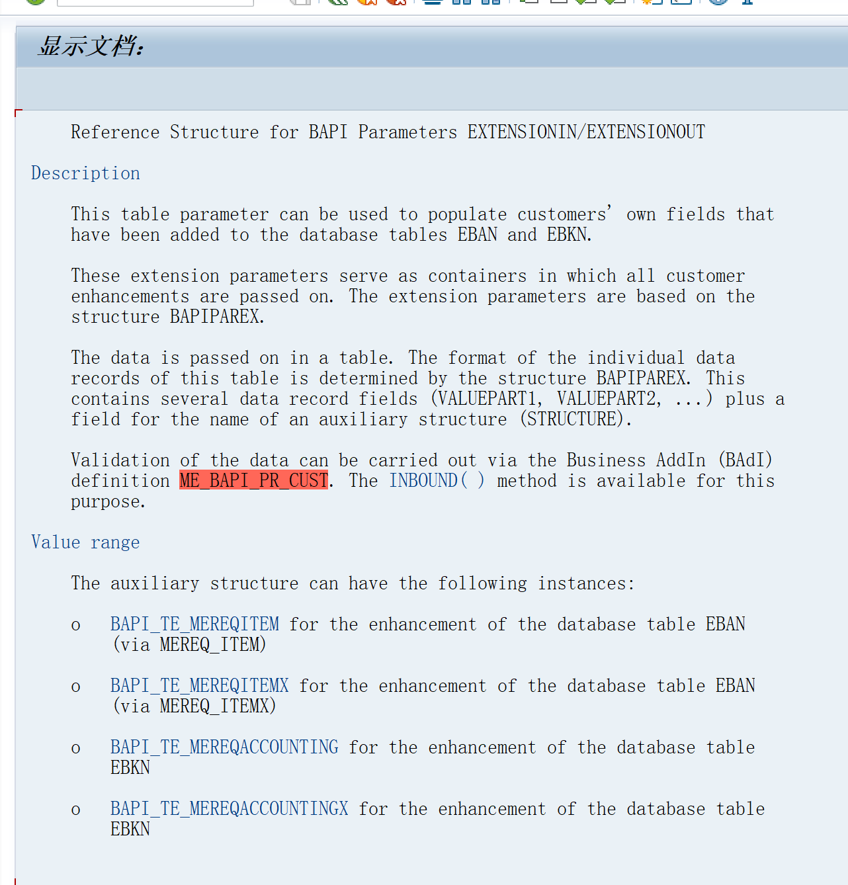

主要介绍采购申请bapi增强字段如何传入
<!-- more -->
# 采购申请的BAPI
BAPI_PR_CHANGE
BAPI_PR_CREATE
BAPI_REQUISITION_CREATE
## 
```ABAP
*&---------------------------------------------------------------------*
*& Report ZTEST_057
*&---------------------------------------------------------------------*
*&
*&---------------------------------------------------------------------*
REPORT ztest_057.
DATA gs_pritem TYPE bapimereqitemimp.
DATA gt_pritem LIKE TABLE OF bapimereqitemimp.

DATA gs_pritemx TYPE bapimereqitemx.
DATA gt_pritemx LIKE TABLE OF bapimereqitemx.

DATA ls_extensionin TYPE bapiparex.
DATA lt_extensionin LIKE TABLE OF bapiparex.
DATA: ls_req_item  TYPE bapi_te_mereqitem,
      ls_req_itemx TYPE bapi_te_mereqitemx.


DATA gt_return LIKE TABLE OF bapiret2.

gs_pritem-preq_item = '00010'.
gs_pritem-tax_code = 'J4'.
APPEND gs_pritem TO gt_pritem.

gs_pritemx-preq_item = '00010'.
gs_pritemx-tax_code = 'X'.
APPEND gs_pritemx TO gt_pritemx.

*GS_EXTENSIONIN-STRUCTURE = ''.
*GS_EXTENSIONIN-VALUEPART1 = ''.
*GS_EXTENSIONIN-VALUEPART2 = ''.
*GS_EXTENSIONIN-VALUEPART3 = ''.
*GS_EXTENSIONIN-VALUEPART4 = ''.
*APPEND GS_EXTENSIONIN TO GT_EXTENSIONIN.
"---- 1. 拼 960 位 -------------------------------------------------

CLEAR ls_extensionin.
CLEAR ls_req_item.
ls_req_item-preq_item = '00010'.
ls_req_item-zbrand = '23'.
ls_req_item-zlowestpr = '4.00'.
ls_req_item-zlowestdt = sy-datum.
ls_req_item-zlastpr = '5.00'.
ls_extensionin-structure = 'BAPI_TE_MEREQITEM'.
PERFORM transfer_to_extensionin USING ls_req_item CHANGING ls_extensionin.
ls_extensionin-valuepart1+181(11) = ls_req_item-zlowestpr.
ls_extensionin-valuepart1+192(8) = ls_req_item-zlowestdt.
ls_extensionin-valuepart1+200(11) = ls_req_item-zlastpr.
ls_extensionin-valuepart1+211(8) = ls_req_item-zlastdt.
APPEND ls_extensionin TO lt_extensionin.

CLEAR ls_extensionin.
CLEAR ls_req_itemx.
ls_req_itemx-preq_item = '00010'.
ls_req_itemx-zbrand = 'X'.
ls_req_itemx-zlowestpr = 'X'.
ls_req_itemx-zlastpr = 'X'.
ls_req_itemx-zlowestdt = 'X'.
ls_extensionin-structure = 'BAPI_TE_MEREQITEMX'.

PERFORM transfer_to_extensionin USING ls_req_itemx CHANGING ls_extensionin.
APPEND ls_extensionin TO lt_extensionin.


CALL FUNCTION 'BAPI_PR_CHANGE'
  EXPORTING
    number      = '0010014144'
*   PRHEADER    =
*   PRHEADERX   =
*   TESTRUN     =
* IMPORTING
*   PRHEADEREXP =
  TABLES
    return      = gt_return
    pritem      = gt_pritem
    pritemx     = gt_pritemx
*   PRITEMEXP   =
*   PRITEMSOURCE                 =
*   PRACCOUNT   =
*   PRACCOUNTPROITSEGMENT        =
*   PRACCOUNTX  =
*   PRADDRDELIVERY               =
*   PRITEMTEXT  =
*   PRHEADERTEXT                 =
    extensionin = lt_extensionin
*   EXTENSIONOUT                 =
*   PRVERSION   =
*   PRVERSIONX  =
*   ALLVERSIONS =
*   PRCOMPONENTS                 =
*   PRCOMPONENTSX                =
*   SERVICEOUTLINE               =
*   SERVICEOUTLINEX              =
*   SERVICELINES                 =
*   SERVICELINESX                =
*   SERVICELIMIT                 =
*   SERVICELIMITX                =
*   SERVICECONTRACTLIMITS        =
*   SERVICECONTRACTLIMITSX       =
*   SERVICEACCOUNT               =
*   SERVICEACCOUNTX              =
*   SERVICELONGTEXTS             =
*   SERIALNUMBER                 =
*   SERIALNUMBERX                =
  .
CALL FUNCTION 'BAPI_TRANSACTION_COMMIT'
*                      EXPORTING
*                        WAIT          =
*                      IMPORTING
*                        RETURN        =
  .


FORM transfer_to_extensionin
USING
is_bapi_extensionin TYPE any
CHANGING
cs_bapiparex TYPE bapiparex.
  DATA l_distance_characters TYPE i.
  FIELD-SYMBOLS <any> TYPE any.

  DESCRIBE DISTANCE BETWEEN cs_bapiparex-structure
  AND cs_bapiparex-valuepart1
  INTO l_distance_characters
  IN CHARACTER MODE.

  ASSIGN cs_bapiparex+l_distance_characters(*) TO <any>
  CASTING LIKE is_bapi_extensionin.
  <any> = is_bapi_extensionin.

ENDFORM.
```

参数要都是CHAR类型，不然会报错吗测下


EXTENSIONIN-STRUCTURE在BAPI里查看选哪个

