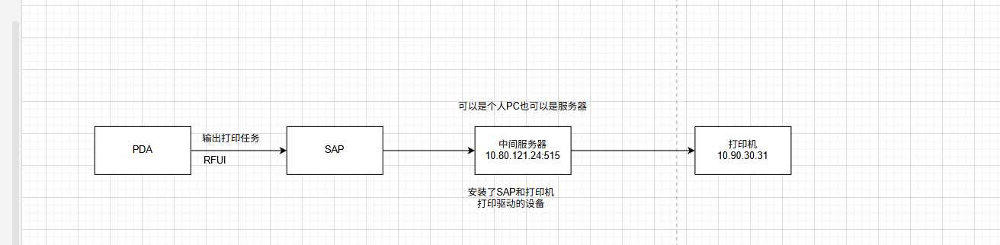
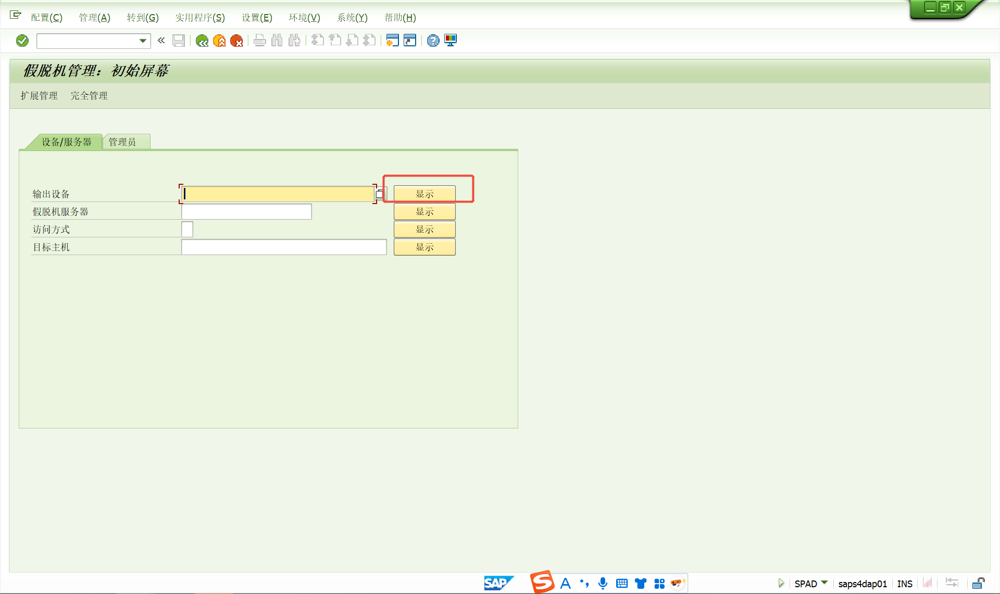
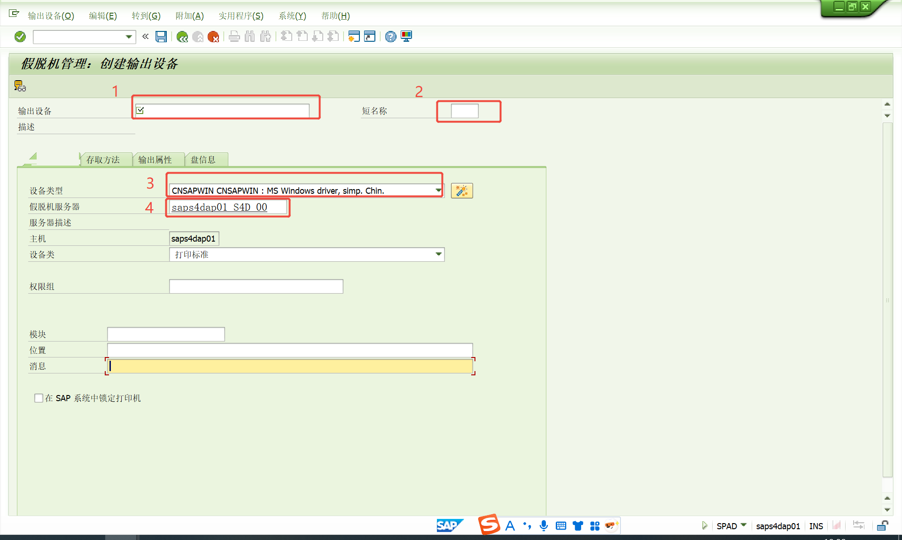
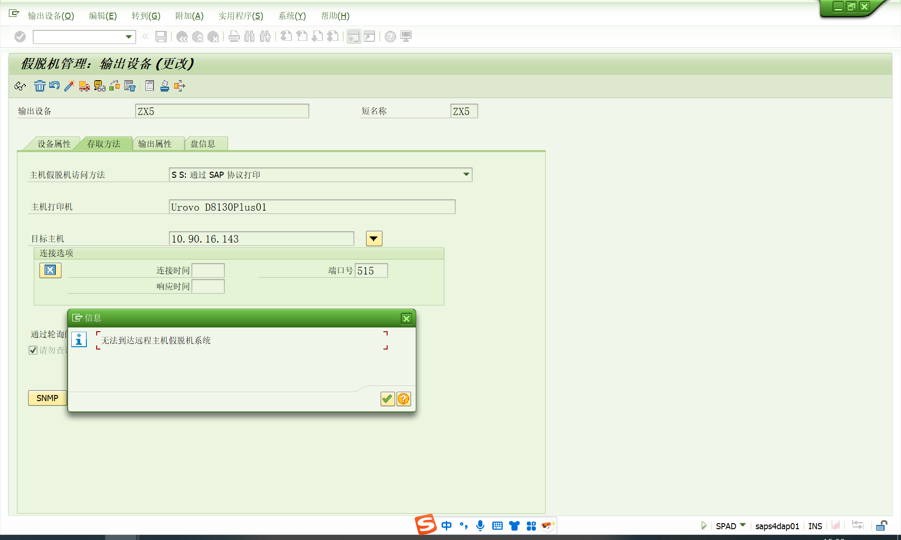
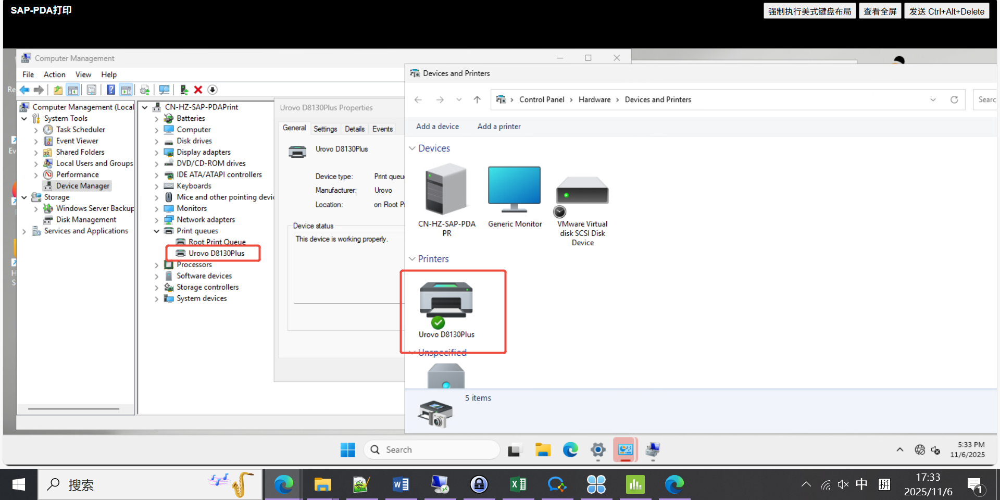

# 标签打印机配置
<!-- more -->
实现效果：PDA点击打印HU，对应的标签打印机直接打印托盘号。

RFUI框架与ITS服务\PDA,无线射频(RF)设备/终端
PDA登录SAP网页，打印HU托盘号连接打印机进行输出

## 配置步骤
SAP连接的固定IP的电脑(或者服务器)，电脑(或者服务器)上配置打印服务和PDA要的标签规格，PDA通过SAP网页发生打印指令到电脑(或者服务器)再到打印机打印
SAP打印机服务(驱动)：sapsprint.exe
打印机连接服务器，在服务器上下载SAP打印驱动和打印机打印驱动，运行固定IP的电脑(或者服务器)上安装的sapsprint.exe服务时看定义的端口号是多少，将IP和端口号提供给SAP

事务代码 SPAD

点击编辑，点击创建

1.	输入创建设备标识
2.	文字描述设备标识
3.	下拉选择此项
4.	点击选择此项

1．	下拉选择此项
2．	打印机在本地设备的名称
3．	连接打印机电脑的IP
4．	端口 ：515

1. 点击检查连接
2. 可用后保存

事务代码 SU01
找到需添加的人，编辑

## 配置遇到的问题

可能是测试网段和生产网段不在同一个网段。或者可能是网络问题：测试LinuxSAP服务器到那台10.80.121.24(上图是10.90.16.143)端口515通不通

那配置不同的就可以实现我上面的了咯，服务器绑定多个打印机，这里根据主机打印机名称由服务器判断具体由哪台打印机实现？

sap打印驱动

打印机驱动

## 参考文献
- [SAP配置网络打印机-斌将军](https://www.cnblogs.com/BinGeneral/p/18600808)
- [下载SAP标签打印机配置手册](/file/SAP标签打印机配置.docx '下载文档')
- [下载SAP前端打印配置手册](/file/SAP前端打印配置设置.docx '下载文档')
