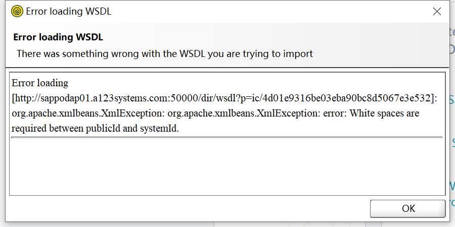

<!-- more -->

## 问题

 - SAP系统有EWM，内向交货单从SAP层传递向EWM层是没有问题，EWM层点击收货，交货单过账状态从EWM层传向SAP层时因为DUMP导致卡在SMQ2，ST22有很多dump记录
 - SAP生产订单报工CO11N时，有一部分物料也会出现DUMP

好像是获取价格的时候插入内表主键重复导致
出现原因未知

### 问题截图

### 代码分析（我猜的）
函数MLCCS_READ_PR，经过行556和585两个插入后台表，导致主键重复DUMP。585行已经打过note。
AI说565的插入是从内表t_dyn_prkek
(后台缓存表动态推导的数据如通过CKML_F_DETERMINE_NEXT_PERIOD 生成的未来期间数据)
585插入是从后台表CKMLPRKEKO取的

### 相关后台表
CKMLPRKEKO	物料分类帐; 价格的成本组件分割 (标题)头表
CKMLPRKEPH	物料分类帐: 价格的成本组件分割 (要素0行表
### 解决方法
打了note
3447665 - ITAB_DUPLICATE_KEY_ERROR in function module MLCCS_READ_PR

