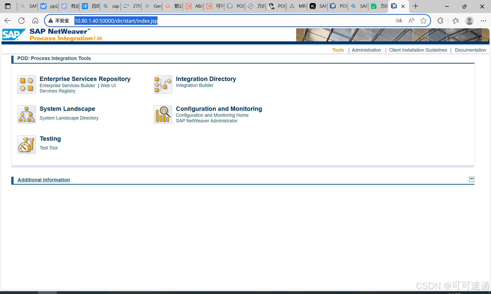
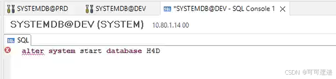

<!-- more -->

# POD系统无法登陆 S4Q系统dump STMS传输失效
### 出现问题

 1. 通过PO和外围系统有交互的SAP业务操作跳出

 2. POD系统无法登录，所有的账号密码都登不上
 
 
 3.  STMS传输系统S4Q无法进入

 4. S4Q系统挂了无法进入
 5. 外围系统传入SAP的接口失效，无法通讯

### 出现原因和解决方法
SSH登录OS看一下服务

开发、测试数据库里多个数据库没有运行了 导致应用因无法连接数据库而出现异常情况 S4开发因为端口被占用 无法启动 只能重启OS释放端口 再启动数据库 对于单个库的启动 可以用这个命令来启动 H4D是S4的开发库 H4Q是测试库 HOD是PO开发库 HOQ是测试库 这几个库都正常运行 业务才是正常的

