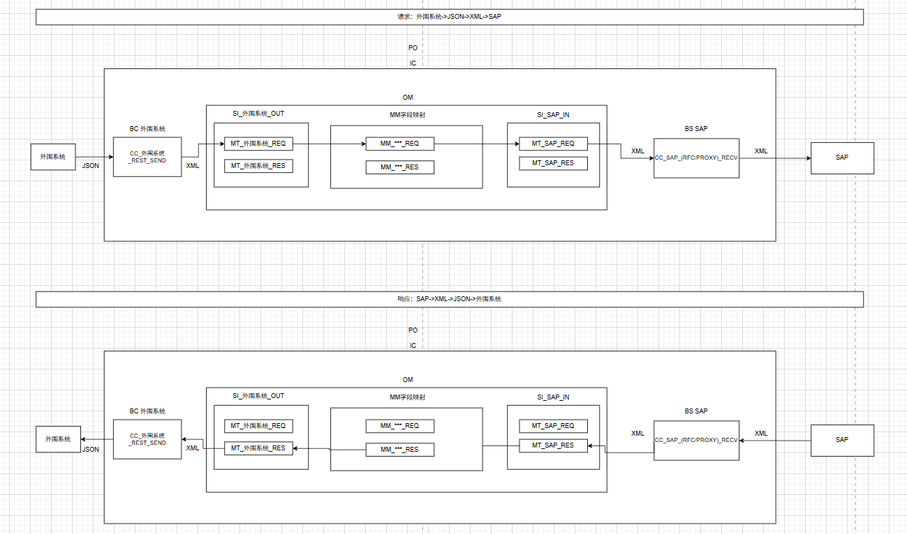
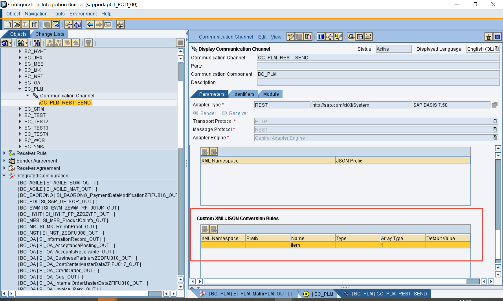
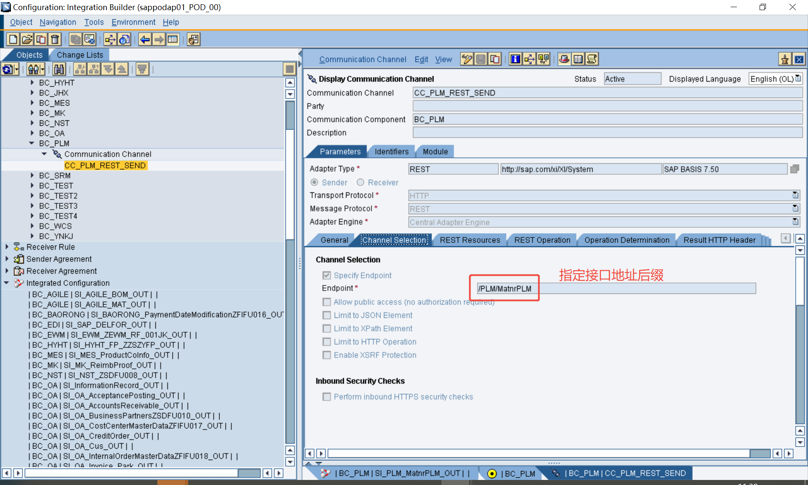
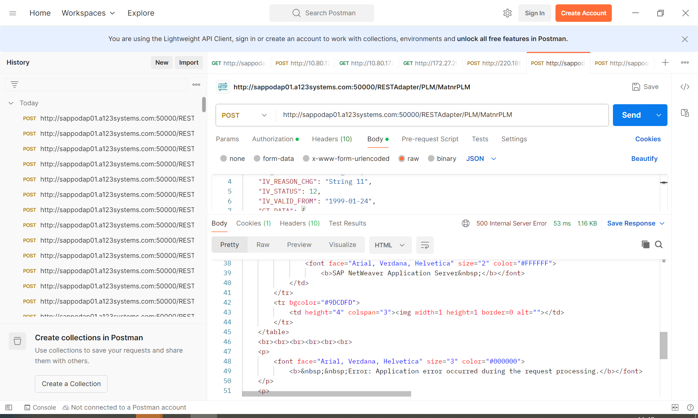
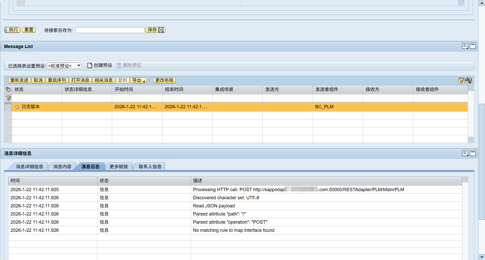
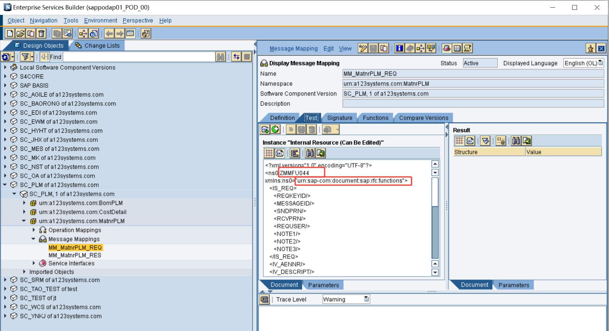
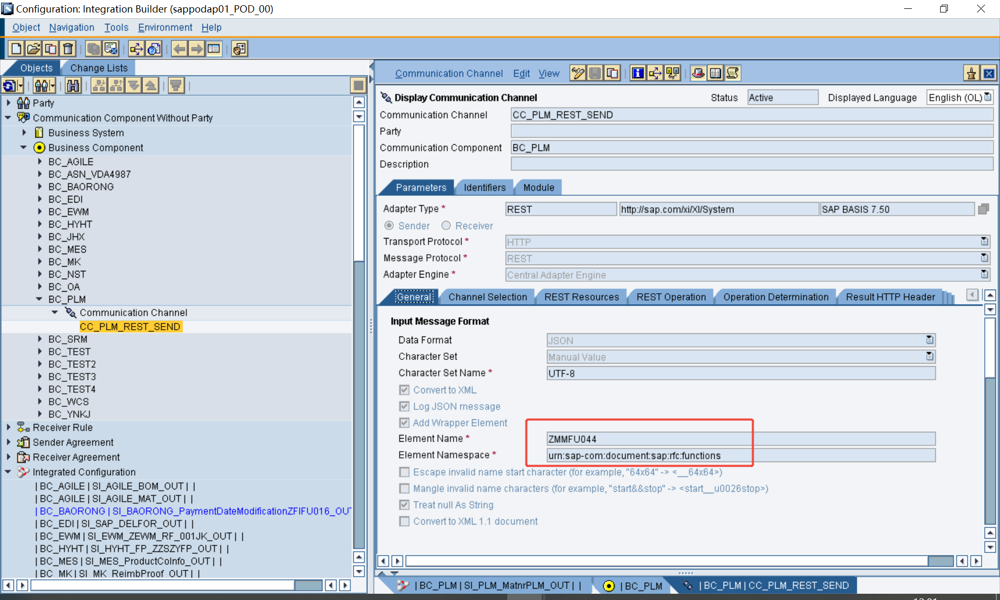
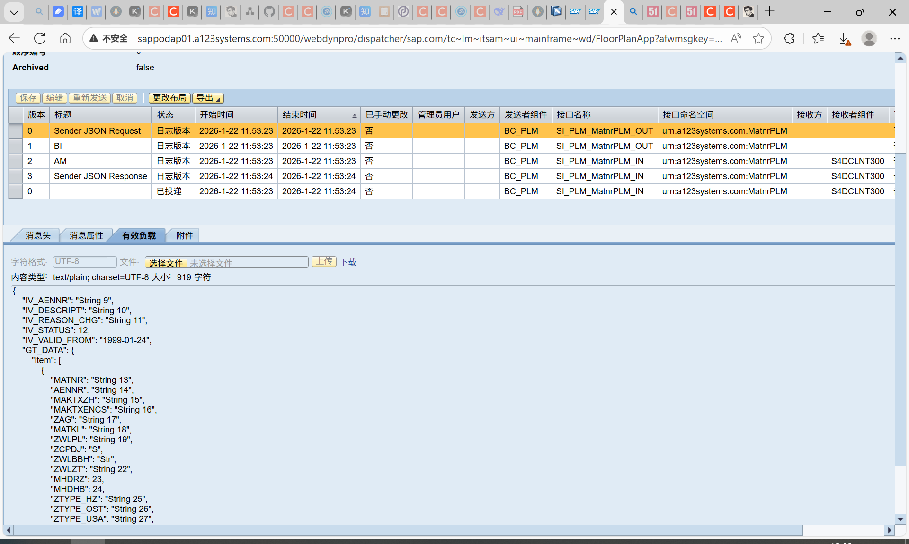
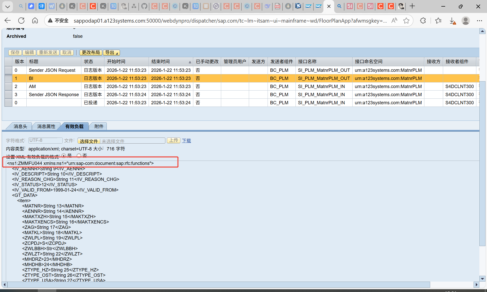

# 外围系统->SAP的RESTful接口
<!-- more -->
* 进入 PO 集成引擎的消息必须是 XML（这是 PI/PO 内部统一的消息格式）。
* 但“外围系统→PO”这一段可以发 JSON、CSV、EDI、纯文本等，只要在 Sender 通道里选对适配器并开好 Content Conversion/JSON-to-XML 转换；PO 会在通道级别先转成 XML，再往后走。
* 因此：SAP 端通过 PO 接收到的永远是 XML，而外围系统不一定非得发 XML。
事物代码  SXI_MONITOR  XI:消息监控
## 1.名词解释
Message Mapping-消息映射(简写MM)
Service Interfaces-服务接口(简写SI)
Operation Mapping-操作映射(简写OM)
External Definition-外部定义(简写ED)
DaTa Types-数据类型(简写DT)
Message Type-消息类型(简写MT)

Integrated Configuration-集成配置(简写IC)
Communication Channel-通信通道(简写CC)
Adapter Type-适配器类型(简写AT)
Business System-业务系统(简写BS)
Business ComPonent-业务组件(简写BC)

Enterprise Services Repository-企业服务仓库(简写ESR)
Integration Directory-集成目录(简写ID)

## 2.通信概览图
**个人整理所得，可能有误，欢迎指正**

一开始先用POSTMAN或者SOAPUI调用看接口是否能正常调通，REST接口的话还是用POSTMAN比较方便。

## 3.注意事项

1. XML/JSON转换规则最好不要填命名空间因为实际是什么命名空间不太知道
2. 接口服务地址格式：http://server:port(或者域名)/RESTAdapter/自己配置的后缀名
SAP通过PO发布的RESTful接口，地址除了后缀前面的都是固定的

3. 报错：No matching rule to map interface found

因为Communication Channel-通信通道(简写CC)的Custom XML/JSON Conversion Rule配置错了，可能命名空间填错了不填就行
4. 因为是JSON转XML，对应抬头的信息要配置上元素名称和元素命名空间

## 参考文献
[abap通过po平台实现rest json的接收](https://blog.51cto.com/u_12929412/4801052)
[SAP PO发布REST接口配置](https://blog.csdn.net/Star_SAP/article/details/123532078)
[PO发布RESTful接口](https://blog.csdn.net/weixin_44911062/article/details/121810167)
[PI发布rest，json接口](https://www.cnblogs.com/sapSB/p/18556196)