# ABAP培训
<!-- more -->

## 1. SAP快捷操作与基本配置
### 1.1 设置技术名称
修改前
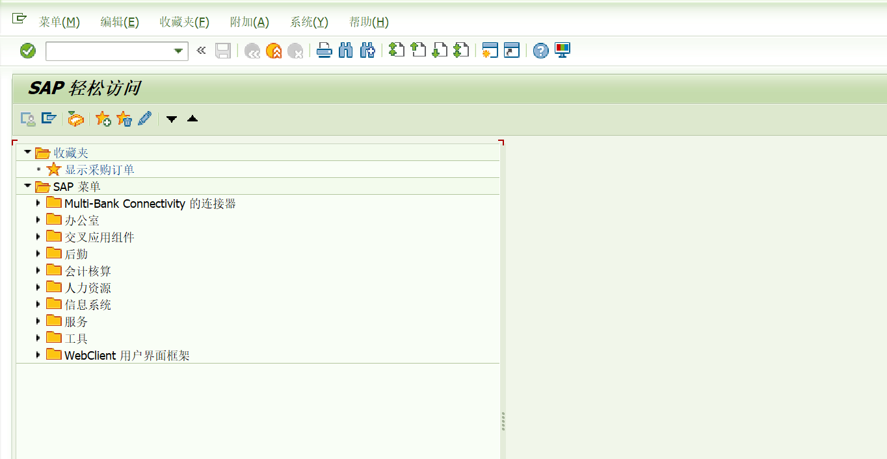
修改后
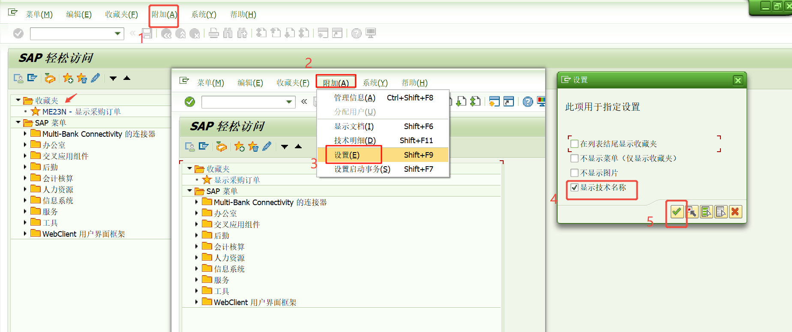
### 1.2 设置主题
修改前
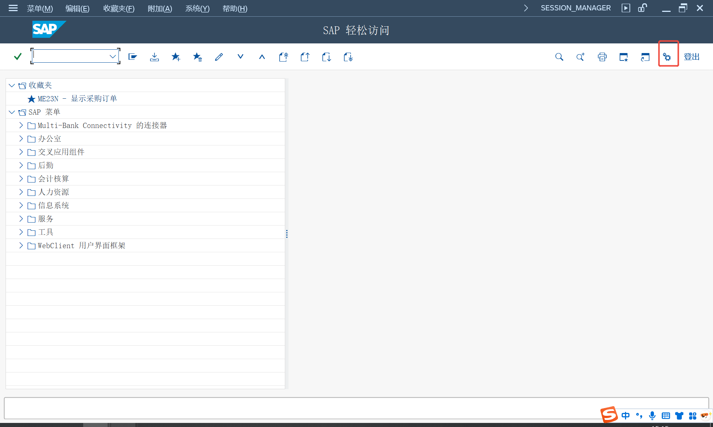
修改后
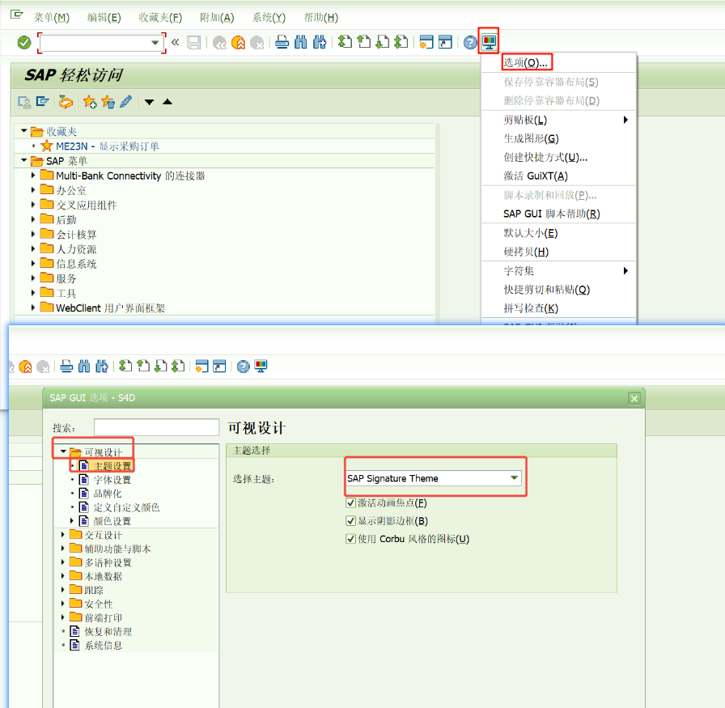
改好之后点应用再点确认
### 1.3 设置下拉框显示键
修改前
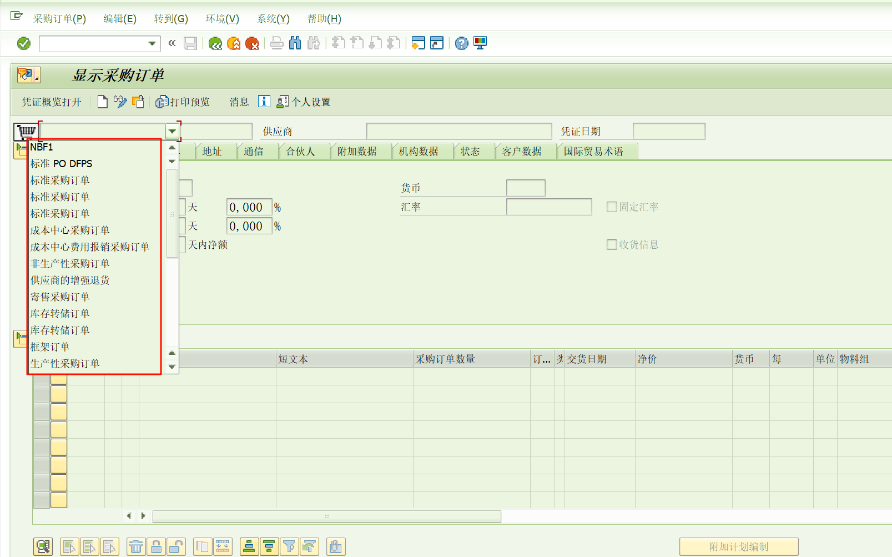
修改后
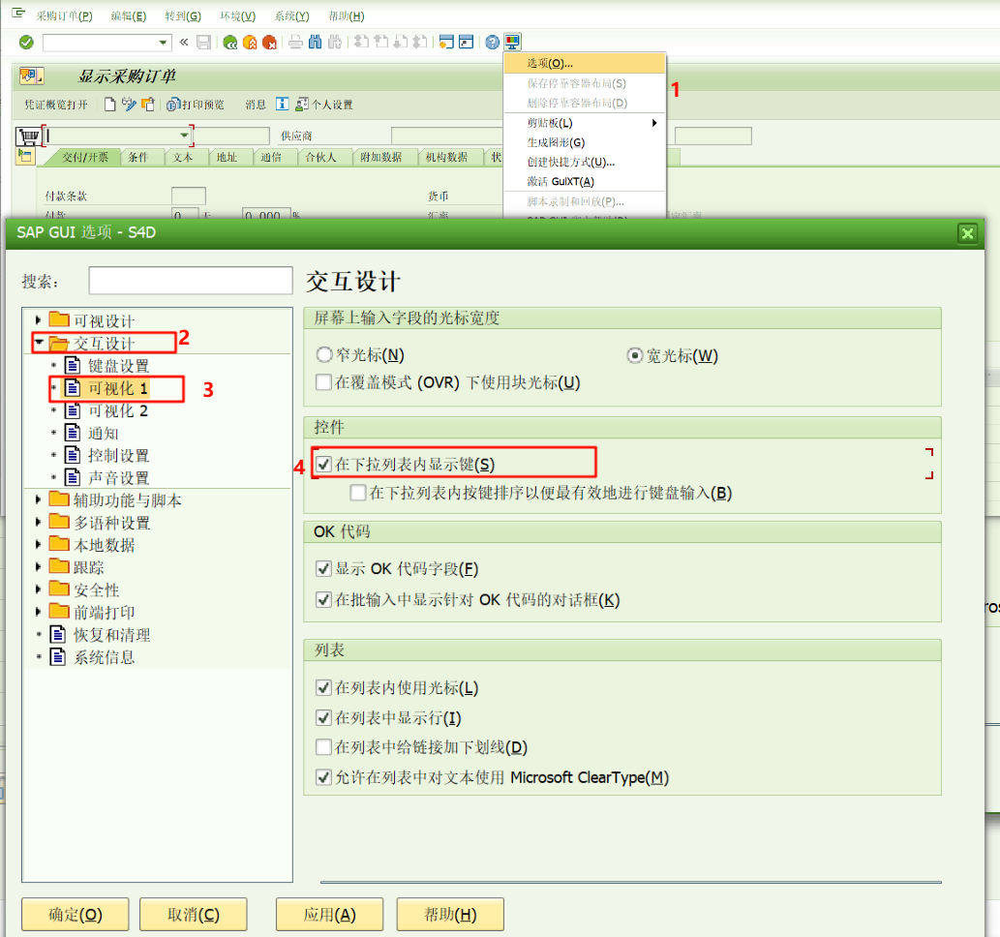
改好之后点应用再点确认
### 1.4 栅格操作，复制
AP GUI中有大量的栅格操作，可将Word里的表格、Excel中的数据复制到剪切板，再粘贴至GUI中。如果是将GUI栅格中的数据复制到剪切板，方法则是先将鼠标放到栅格区域的任意位置，按下CTRL+Y键显示出十字光标如下图所示，将鼠标放至需要栅格复制区域的左上角，再拉动鼠标至复制区域右下角，区域选定，还需按下CTRL+C键，栅格内容就复制到剪切板中。
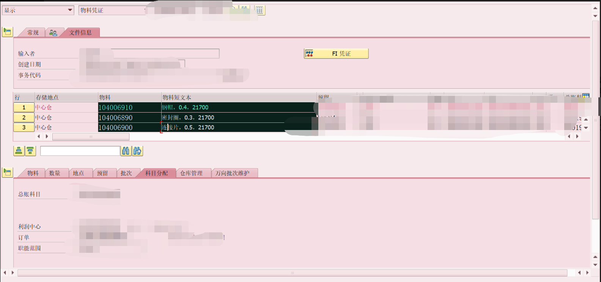
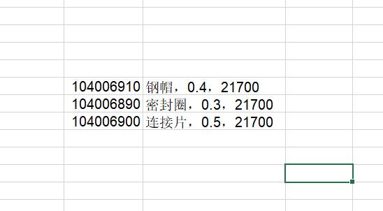

### 1.5 F1、F4
F1帮助键就像用户的导师，当遇到不熟悉的字段含义时，按下F1键即可弹出相关帮助信息，这对于理解字段功能和操作流程极其关键。
F4选择键则用于显示字段的完整选项列表，当需要查找特定输入项时，这个快捷键能显著提高效率。

## 2. ABAP常用事务代码
| 常用表 | 描述 |
| --------- | ---- |
| `SE11` |  ABAP字典 |
| `SE16N` | 常规表显示|
| `SE38 ` | ABAP程序编辑器|
| `SE80` | 对象导航器|
| `SE37 ` | 函数构建器-函数创建，接口开发|
| `SE09/SE10` | 传输组织器|
| `STMS` | 传输管理系统-请求接收|
| `SE93` | 维护事物代码|
| ... | ... |

### 2.1 SAP透明表后台存储的值与前台显示值有差异
SE16N透明表中前台显示和后台实际存的值可能有差异
以MARA物料主数据表为例
1、前导0  000000000163100028  163100028
2、单位转换 ST  PC
可能影响：
给外围系统的值的时候需要进行内外值转换
进行SQL取数的时候因为使用的是前台显示的值而不是后台存的实际值导致取不到数

#### 2.1.1 转换函数
转换函数在对应字段的数据元素的域下面
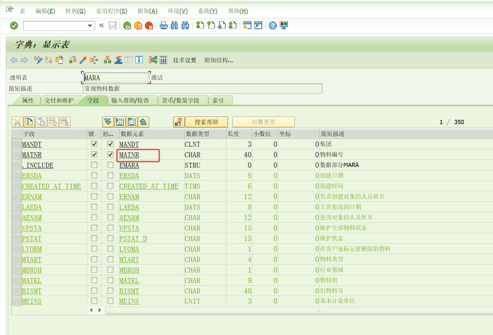
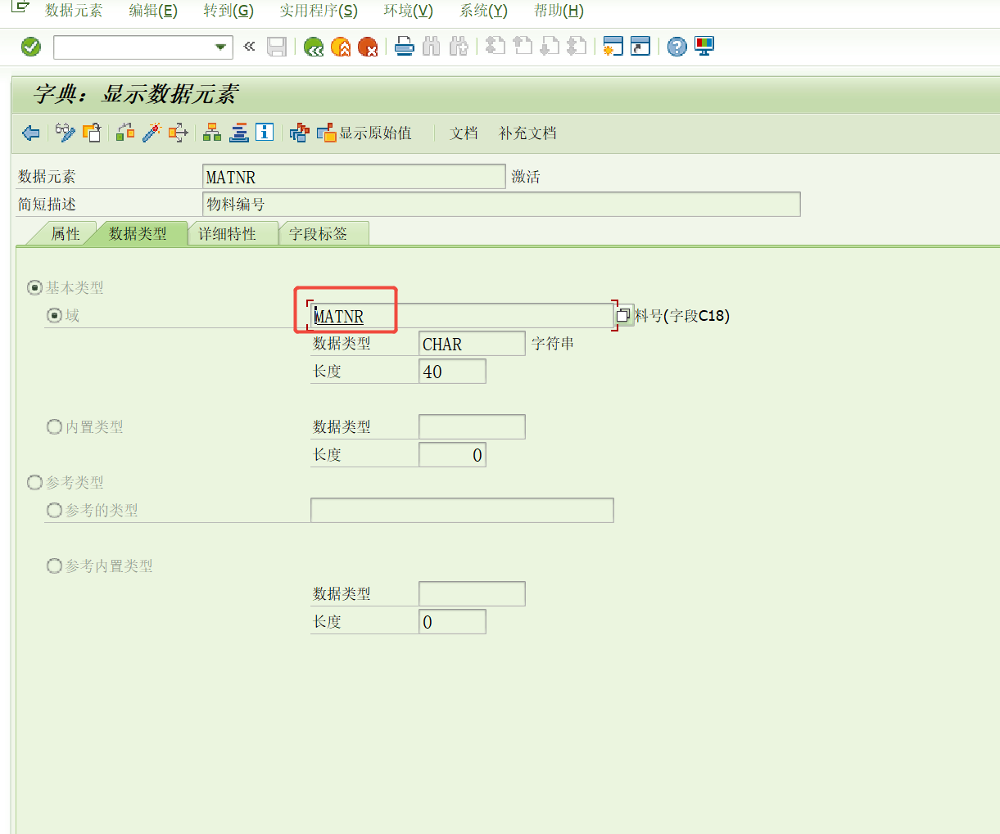
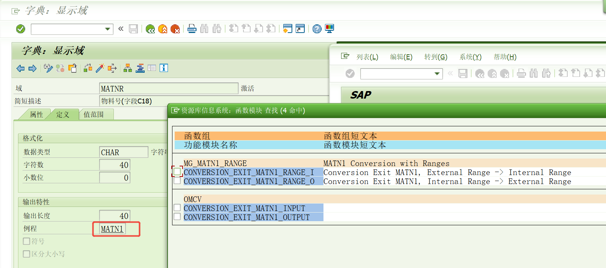

## 3. 域、数据元素、结构和表
用于在ABAP字典中定义数据的三个基本对象是域，数据元素和表。
域用于表字段的技术定义，例如字段类型和长度；
数据元素用于语义定义(简短描述)。 数据元素描述了特定业务环境中的域的含义。 它主要包含字段帮助和屏幕中的字段标签。
域被分配给数据元素，数据元素又被分配给表字段或结构字段。 例如，将MATNR域(CHAR材料号)分配给诸如MATNR_N，MATNN和MATNR_D的数据元素，并且将这些分配给许多表域和结构域。

## 3.1 命名规则
报表 REPORT
功能 FUNCTION
自开发的所有内容Z开头加模块加内容加序列号
以已存在的自开发内容命名规则为准

### 3.1.1 程序变量
| 类型             | 规则    | 说明                           |
| :------------- | :---- | :--------------------------- |
| 全局变量           | GV\_  | 以'G\_'开头，Global              |
| 局部变量           | LV\_  | 以'L\_'开头，Local               |
| 常量             | GC\_  | Constant                     |
| 类型             | TY\_  | 自定义类型，Type                   |
| 全局内表           | GT\_  | 带抬头的内表原则上不可使用，Internal Table |
| 本地内表           | LT\_  | Local Internal Table         |
| 全局工作区          | GS\_  | Work Area                    |
| 本地工作区          | LS\_  | Local Work Area              |
| 子程序－变量参数       | PV\_  | 子程序中的变量参数以'PV\_'开头           |
| 子程序－工作区参数      | PS\_  | 子程序中的变量参数以'PS\_'开头           |
| 子程序－内表参数       | PT\_  | 子程序中的变量参数以'PT\_'开头           |
| PARAMETERS     | P\_   | 报表程序中选择屏幕的PARAMETER项         |
| SELECT-OPTIONS | S\_   | 报表程序中选择屏幕的SELECT-OPTION      |
| 范围变量           | R\_   | Range                        |
| 函数-IMPORT参数    | I\_   | Function中的IMPORT参数           |
| 函数-EXPORT参数    | E\_   | Function中的EXPORT参数           |
| 函数-CHANGING参数  | C\_   | Function中的CHANGE参数           |
| 函数-TABLES参数    | T\_   | Function中的TABLES参数           |
| 参照变量           | REF\_ | Refer to                     |
| 字段符号           | FS\_  | Field Symbol                 |

### 3.1.2	代码重排(Pretty Printer)
请按照如下截图进行设置，所有代码必须使用Pretty Printer进行排版。
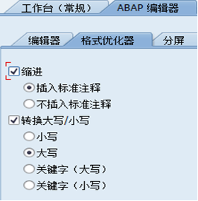

## 4. 断点调试
* 会话断点
* 用户断点
* 一些后台任务前两个都加不了，/H->更新调试，然后打会话/用户断点进行调试。
* 前三种都不行，把东西卡在SMQ2里，再进调试

## 5. 接口编写
以市场部报表接口为例

## 参考资料
[下载SAP_ABAP开发规范](/file/SAP_ABAP开发规范.doc '下载文档')
[下载abap新语法.docx](/file/abap新语法.docx '下载文档')