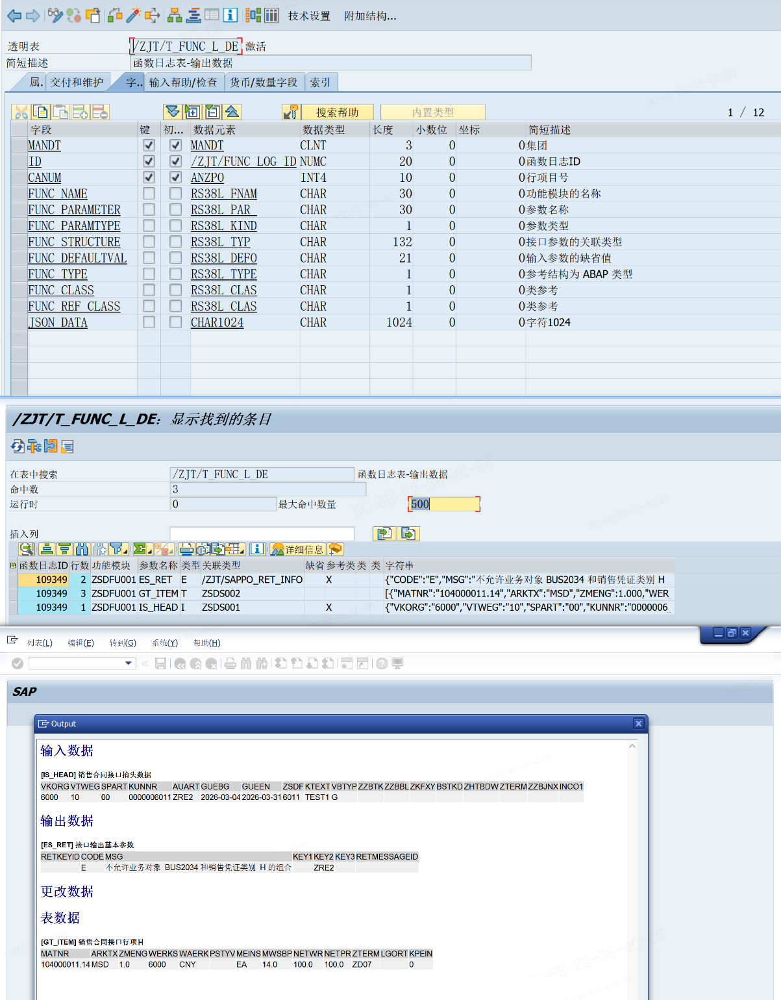

# ABAP_json美化展示
<!-- more -->

## 1. SAP快捷操作与基本配置
### 1.1 设置技术名称
```ABAP
*&---------------------------------------------------------------------*
*& Report ZTXBTEST_001
*&---------------------------------------------------------------------*
*&
*&---------------------------------------------------------------------*
REPORT ztxbtest_001.
PERFORM frm_display_return_json.
FORM frm_display_return_json.
  DATA: ls_data TYPE /zjt/t_func_l_di,
        lt_data TYPE TABLE OF /zjt/t_func_l_di.
  FIELD-SYMBOLS: <ls_data> TYPE /zjt/t_func_l_di.
  DATA: lv_json_string TYPE string.

  SELECT *
    INTO CORRESPONDING FIELDS OF TABLE lt_data
    FROM /zjt/t_func_l_de
    WHERE id = '109349'.
  READ TABLE lt_data INTO ls_data INDEX 1.
  IF sy-subrc = 0.
    "读取函数名称
    SELECT *
      INTO TABLE @DATA(lt_funct)
      FROM funct
      WHERE funcname = @ls_data-func_name
        AND spras = @sy-langu.
  ENDIF.


  "为了合并数据，使用at end of
  SORT lt_data BY canum.
  LOOP AT lt_data INTO ls_data.
    CLEAR: ls_data-canum .
    MODIFY lt_data FROM ls_data.
  ENDLOOP.

  PERFORM frm_write_json TABLES lt_data lt_funct USING `输入数据` 'I'.
  PERFORM frm_write_json TABLES lt_data lt_funct USING `输出数据` 'E'.
  PERFORM frm_write_json TABLES lt_data lt_funct USING `更改数据` 'C'.
  PERFORM frm_write_json TABLES lt_data lt_funct USING `表数据` 'T'.

  cl_demo_output=>end_section( ).
  cl_demo_output=>display( ).
ENDFORM.
FORM frm_write_json TABLES it_data STRUCTURE /zjt/t_func_l_di
                           it_funct STRUCTURE funct
                     USING iv_name TYPE string
                          iv_paramtype TYPE char01.
  DATA: lv_name TYPE string.

  DATA: lv_json_string TYPE string.
  cl_demo_output=>next_section( iv_name ).
  LOOP AT it_data ASSIGNING FIELD-SYMBOL(<ls_data>) WHERE func_paramtype = iv_paramtype.
    lv_json_string = lv_json_string && <ls_data>-json_data.
    AT END OF func_parameter.


      READ TABLE it_funct INTO DATA(ls_funct) WITH KEY parameter = <ls_data>-func_parameter.
      IF sy-subrc = 0.
        lv_name = `[` && ls_funct-parameter && `] ` && ls_funct-stext.
      ENDIF.

      PERFORM frm_transdisplay_data USING <ls_data> lv_name lv_json_string.
      CLEAR: lv_json_string.
    ENDAT.
  ENDLOOP.
ENDFORM.

FORM frm_transdisplay_data USING iv_data TYPE /zjt/t_func_l_di
                                 iv_name TYPE string
                                 iv_json_data TYPE string.
  "动态创建工作区、内表
  DATA           object     TYPE REF TO data.
  FIELD-SYMBOLS  <fs_aber>    TYPE any.

  IF iv_data-func_type = 'X'.
    CREATE DATA object TYPE (iv_data-func_structure).
    ASSIGN object->* TO <fs_aber>.
  ELSE.
    CREATE DATA object TYPE TABLE OF (iv_data-func_structure).
    ASSIGN object->* TO <fs_aber>.
  ENDIF.

  /ui2/cl_json=>deserialize( EXPORTING json = iv_json_data
*                                       pretty_name = /ui2/cl_json=>pretty_mode-camel_case "update by luf
                             CHANGING  data = <fs_aber> ).
  cl_demo_output=>write_data( value = <fs_aber> name = iv_name ).
ENDFORM.

```

## 参考资料
<!-- [下载SAP_ABAP开发规范](/file/SAP_ABAP开发规范.doc '下载文档')
[下载abap新语法.docx](/file/abap新语法.docx '下载文档') -->