# 屏幕嵌套EXCEL形式报表DOI
<!-- more -->
事务代码OAOR-业务文档服务:文档
Class Name：HRFPM_EXCEL_STANDARD、SOFFICEINTEGRATION、PICTURES等        （根据不同情况、自己挑一个）
Class Type： OT        （固定）
Object key：Y、Z开头，自己定义

## 1. ABAP_EXCEL_上传数据DOI展示
## 1.1 OAOR excel 模板上传
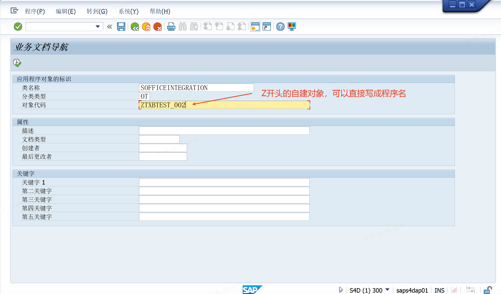
左下角创建页签->标准文档类型->表模板导入

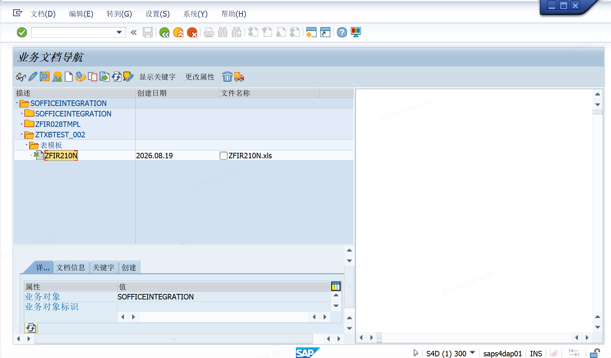

## 1.2 自封装类DOI写入
### 1.2.1 属性
I_FIRST	Instance Attribute	Public	Type	I
I_LAST	Instance Attribute	Public	Type	I
GO_CONTAINER	Instance Attribute	Private	Type Ref To	CL_GUI_CUSTOM_CONTAINER
GO_CONTROL	Instance Attribute	Private	Type Ref To	I_OI_CONTAINER_CONTROL
GO_DOCUMENT	Instance Attribute	Private	Type Ref To	I_OI_DOCUMENT_PROXY
GO_SPREADSHEET	Instance Attribute	Private	Type Ref To	I_OI_SPREADSHEET
GO_ERROR	Instance Attribute	Private	Type Ref To	I_OI_ERROR
G_SELECTED_SHEET_NAME	Instance Attribute	Private	Type	CHAR30
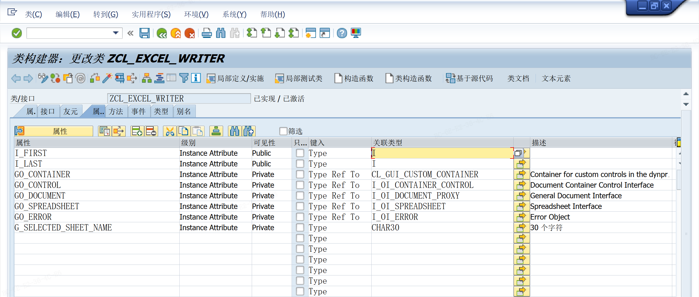
### 1.2.2 方法
CONSTRUCTOR	Instance Method	Public
EXECUTE_MACRO	Instance Method	Public
FILL_CELL	Instance Method	Public
FILL_HEADER	Instance Method	Public
FILL_ITEMS	Instance Method	Public
FREE	Instance Method	Public
RAISE_MESSAGE	Instance Method	Public
SELECT_SHEET	Instance Method	Public
GET_CELL	Instance Method	Public
INSERT_LINE	Instance Method	Public
HIDE_COLUMNS	Instance Method	Public
GROUP_RANGE	Instance Method	Public
COPY_RANGE	Instance Method	Public
MERGE_RANGE	Instance Method	Public
SET_COLOR	Instance Method	Public
CREATE_BASIC_OBJECTS	Instance Method	Private
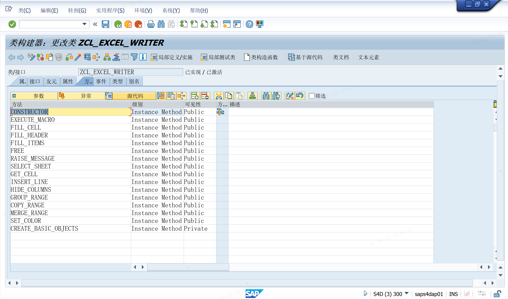

### 1.2.3 CREATE_BASIC_OBJECTS
参数
I_APP_NAME	Importing	Type	STRING
I_CLASSNAME	Importing	Type	SBDST_CLASSNAME
I_CLASSTYPE	Importing	Type	SBDST_CLASSTYPE
I_OBJECT_KEY	Importing	Type	SBDST_OBJECT_KEY
I_CONTAINER_NAME	Importing	Type	C
I_DOCNAME	Importing	Type	STRING
E_ERROR	Exporting	Type Ref To	I_OI_ERROR
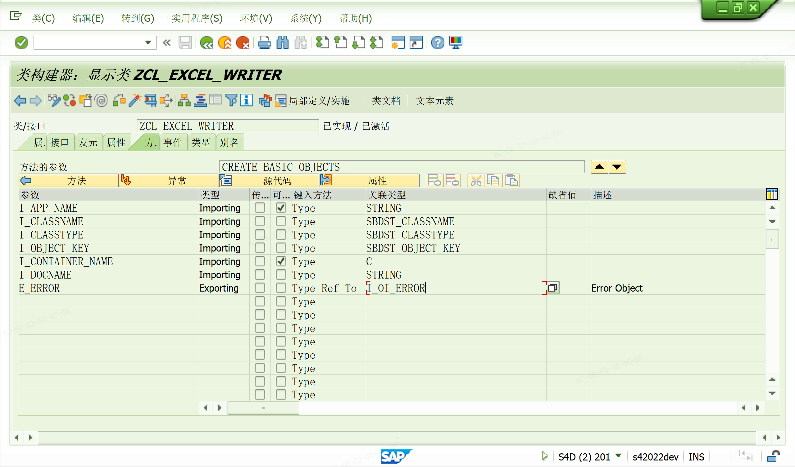

CREATE_BASIC_OBJECTS
```ABAP
METHOD CREATE_BASIC_OBJECTS.
  DATA  L_APP_NAME(200).
  DATA: LO_BDS_INSTANCE      TYPE REF TO CL_BDS_DOCUMENT_SET.
  DATA: LDOC_SIGNATURE    TYPE SBDST_SIGNATURE,
        LWA_DOC_SIGNATURE LIKE LINE OF LDOC_SIGNATURE,
        LS_DOC_COMPONENTS TYPE SBDST_COMPONENTS,
        LT_DOC_URIS       TYPE SBDST_URI,
        LWA_DOC_URIS      LIKE LINE OF LT_DOC_URIS.

  DATA: LHAS TYPE I.
  DATA:L_CONTAINER_NAME TYPE CHAR20 VALUE 'CONTAINER'.

  CLEAR E_ERROR.
* first get the SAP DOI i_oi_container_control interface
  CALL METHOD C_OI_CONTAINER_CONTROL_CREATOR=>GET_CONTAINER_CONTROL
    IMPORTING
      CONTROL = GO_CONTROL
      ERROR   = E_ERROR.

* check no errors occured
  IF E_ERROR IS NOT INITIAL.
    CHECK E_ERROR->HAS_SUCCEEDED EQ 'X'.
  ENDIF.

  IF I_CONTAINER_NAME IS SUPPLIED.
    L_CONTAINER_NAME = I_CONTAINER_NAME.
  ENDIF.

  CREATE OBJECT GO_CONTAINER
    EXPORTING
      CONTAINER_NAME = L_CONTAINER_NAME.

  IF I_APP_NAME IS INITIAL.
    L_APP_NAME = 'Excel报表输出数据'.
  ELSE.
    L_APP_NAME = I_APP_NAME.
  ENDIF.
*& 重构 Begin of modification by ey_chenxh 2026.04.22
*& 如果屏幕里面没有container设置，则默认当前屏幕作为容器
  IF I_CONTAINER_NAME IS NOT INITIAL.
    CALL METHOD GO_CONTROL->INIT_CONTROL
      EXPORTING
        R3_APPLICATION_NAME      = L_APP_NAME
        INPLACE_ENABLED          = 'X'
        INPLACE_SCROLL_DOCUMENTS = 'X'
        PARENT                   = GO_CONTAINER
        REGISTER_ON_CLOSE_EVENT  = 'X'
        REGISTER_ON_CUSTOM_EVENT = 'X'
        NO_FLUSH                 = 'X'
      IMPORTING
        ERROR                    = E_ERROR.
  ELSE.
    CALL METHOD GO_CONTROL->INIT_CONTROL
      EXPORTING
        R3_APPLICATION_NAME      = L_APP_NAME
        INPLACE_ENABLED          = 'X'
        INPLACE_SCROLL_DOCUMENTS = 'X'
        PARENT                   = CL_GUI_CUSTOM_CONTAINER=>DEFAULT_SCREEN
        REGISTER_ON_CLOSE_EVENT  = 'X'
        REGISTER_ON_CUSTOM_EVENT = 'X'
        NO_FLUSH                 = 'X'
      IMPORTING
        ERROR                    = E_ERROR.
  ENDIF.
*& 重构 End of modification by ey_chenxh 2026.04.22
* check no errors occured
  IF E_ERROR IS NOT INITIAL.
    CHECK E_ERROR->HAS_SUCCEEDED EQ 'X'.
  ENDIF.

*  gdocument_type = cns_excel.
  LWA_DOC_SIGNATURE-PROP_VALUE = I_DOCNAME.

  APPEND LWA_DOC_SIGNATURE TO LDOC_SIGNATURE.
  CREATE OBJECT LO_BDS_INSTANCE.
  CALL METHOD LO_BDS_INSTANCE->GET_INFO
    EXPORTING
      CLASSNAME  = I_CLASSNAME
      CLASSTYPE  = I_CLASSTYPE
      OBJECT_KEY = I_OBJECT_KEY
    CHANGING
      COMPONENTS = LS_DOC_COMPONENTS
      SIGNATURE  = LDOC_SIGNATURE.

  CALL METHOD LO_BDS_INSTANCE->GET_WITH_URL
    EXPORTING
      CLASSNAME  = I_CLASSNAME
      CLASSTYPE  = I_CLASSTYPE
      OBJECT_KEY = I_OBJECT_KEY
    CHANGING
      URIS       = LT_DOC_URIS
      SIGNATURE  = LDOC_SIGNATURE.

  FREE LO_BDS_INSTANCE.
  READ TABLE LT_DOC_URIS INTO LWA_DOC_URIS INDEX 1.

* ask the SAP DOI container for a i_oi_document_proxy for Excel
  CLEAR E_ERROR.
  CALL METHOD GO_CONTROL->GET_DOCUMENT_PROXY
    EXPORTING
      DOCUMENT_TYPE  = 'Excel.Sheet'
      NO_FLUSH       = 'X'
    IMPORTING
      DOCUMENT_PROXY = GO_DOCUMENT
      ERROR          = E_ERROR.
* check no errors occured
  IF E_ERROR IS NOT INITIAL.
    CHECK E_ERROR->HAS_SUCCEEDED EQ 'X'.
  ENDIF.

* open a document saved in business document service.
  CALL METHOD GO_DOCUMENT->OPEN_DOCUMENT
    EXPORTING
      OPEN_INPLACE = 'X'
      DOCUMENT_URL = LWA_DOC_URIS-URI.

  CALL METHOD GO_DOCUMENT->HAS_SPREADSHEET_INTERFACE
    EXPORTING
      NO_FLUSH     = ''
    IMPORTING
      IS_AVAILABLE = LHAS
      ERROR        = E_ERROR.
* check no errors occured
  IF E_ERROR IS NOT INITIAL.
    CHECK E_ERROR->HAS_SUCCEEDED EQ 'X'.
  ENDIF.

  CALL METHOD GO_DOCUMENT->GET_SPREADSHEET_INTERFACE
    EXPORTING
      NO_FLUSH        = ''
    IMPORTING
      SHEET_INTERFACE = GO_SPREADSHEET
      ERROR           = E_ERROR.

ENDMETHOD.
```
### 1.2.4 CONSTRUCTOR
I_APP_NAME	Type	STRING	                                                                                                                                    
I_CLASSNAME	Type	SBDST_CLASSNAME	'SOFFICEINTEGRATION'
I_CLASSTYPE	Type	SBDST_CLASSTYPE	'OT'
I_OBJECT_KEY	Type	SBDST_OBJECT_KEY	                                                                                                                                    
I_CONTAINER_NAME	Type	C	                                                                                                                                    
I_DOCNAME	Type	STRING	                                                                                                                                    
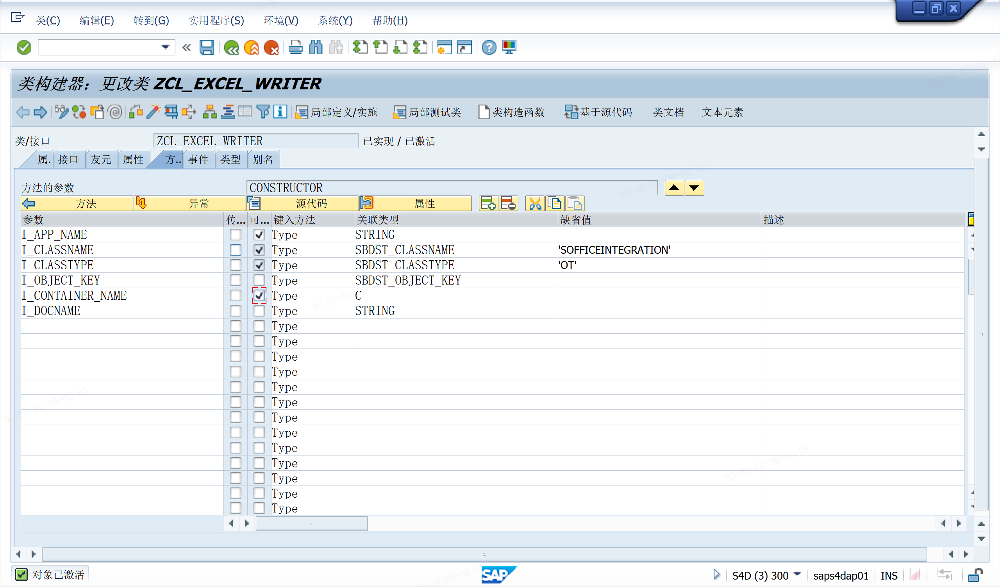

```ABAP
  METHOD constructor.
*===================================
* 初始化基本对象
*===================================
  me->create_basic_objects(
    EXPORTING
      i_app_name       = i_app_name
      i_classname      = i_classname
      i_classtype      = i_classtype
      i_object_key     = i_object_key
      i_container_name = i_container_name
      i_docname        = i_docname
    IMPORTING
      e_error          = go_error
         ).
  ENDMETHOD.
```

### 1.2.5 SELECT_SHEET
I_SHEET_NAME	Importing	Type	CHAR30
E_ERROR	Exporting	Type Ref To	I_OI_ERROR
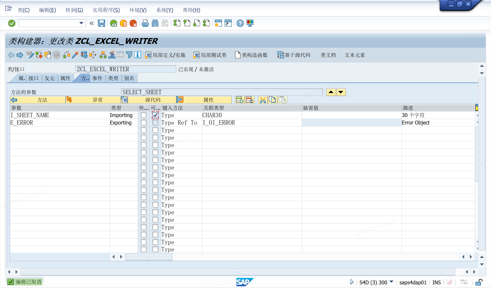
```ABAP
  METHOD select_sheet.
*===================================
* 检查对象是否已初始化
*===================================
    CHECK go_spreadsheet IS NOT INITIAL.

    IF i_sheet_name IS SUPPLIED.
      g_selected_sheet_name = i_sheet_name.
    ENDIF.

*===================================
* 调用类方法，选择指定sheet
*===================================
    go_spreadsheet->select_sheet(
      EXPORTING
        name     = g_selected_sheet_name
      IMPORTING
        error    = e_error
           ).
  ENDMETHOD.
```

### 1.2.6 EXECUTE_MACRO
MACRO_STRING	Importing	Type	C
PARAM1	Importing	Type	ANY
PARAM2	Importing	Type	ANY
PARAM3	Importing	Type	ANY
PARAM4	Importing	Type	ANY
PARAM5	Importing	Type	ANY
PARAM6	Importing	Type	ANY
PARAM7	Importing	Type	ANY
PARAM8	Importing	Type	ANY
PARAM9	Importing	Type	ANY
PARAM10	Importing	Type	ANY
PARAM11	Importing	Type	ANY
PARAM12	Importing	Type	ANY
PARAM_COUNT	Importing	Type	I
SHEET_NAME	Importing	Type	C
ERROR	Exporting	Type Ref To	I_OI_ERROR
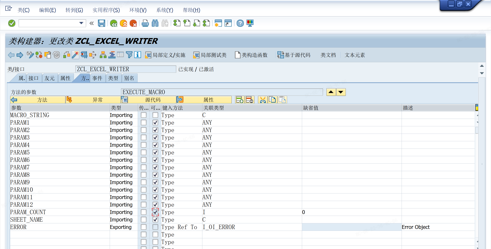

```ABAP
  METHOD execute_macro.
*===================================
* 检查对象是否被初始化
*===================================
    CHECK go_document IS NOT INITIAL.

*===================================
* 选择指定sheet来执行宏
*===================================
    IF sheet_name IS SUPPLIED.
      g_selected_sheet_name = sheet_name.
    ENDIF.

    me->select_sheet(
      EXPORTING
        i_sheet_name = g_selected_sheet_name
      IMPORTING
        e_error      = error
           ).
    IF error IS NOT INITIAL.
      CHECK error->has_succeeded EQ 'X'.
    ENDIF.

*===================================
* 调用类方法执行宏
*===================================
    go_document->execute_macro(
      EXPORTING
        macro_string = macro_string
        param1       = param1
        param10      = param10
        param11      = param11
        param12      = param12
        param2       = param2
        param3       = param3
        param4       = param4
        param5       = param5
        param6       = param6
        param7       = param7
        param8       = param8
        param9       = param9
        param_count  = param_count
      IMPORTING
        error        = error
           ).

  ENDMETHOD.
```

### 1.2.7 FILL_CELL
I_SHEET_NAME	Importing	Type	STRING
I_ROW	Importing	Type	CHAR4
I_COL	Importing	Type	CHAR4
I_VALUE	Importing	Type	CHAR256
E_ERROR	Exporting	Type Ref To	I_OI_ERROR
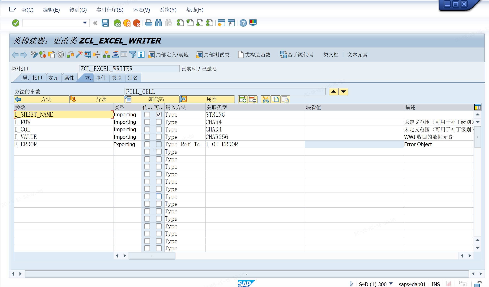

```ABAP
METHOD fill_cell.
  DATA: lt_ranges       TYPE soi_range_list.
  DATA: lwa_range     LIKE LINE OF lt_ranges.

  DATA: lt_contents     TYPE soi_generic_table.
  DATA: lwa_content     LIKE LINE OF lt_contents.
  DATA:l_row TYPE i,
       l_col TYPE i.

  CHECK go_spreadsheet IS NOT INITIAL.
*===================================
* 选择sheet
*===================================
  IF i_sheet_name IS SUPPLIED.
    g_selected_sheet_name = i_sheet_name.
  ENDIF.

  me->select_sheet(
    EXPORTING
      i_sheet_name = g_selected_sheet_name
    IMPORTING
      e_error      = e_error
         ).

  IF e_error IS NOT INITIAL.
    CHECK e_error->has_succeeded EQ 'X'.
  ENDIF.

*===================================
* 插入range
*===================================
  MOVE i_row TO l_row.
  MOVE i_col TO l_col.
* 选择区域
  CALL METHOD go_spreadsheet->set_selection
    EXPORTING
*     坐标
      top     = l_row  "行
      left    = l_col  "列
*     行数和列数
      rows    = 1  "行数
      columns = 1. "列数

* 创建Range
  CALL METHOD go_spreadsheet->insert_range
    EXPORTING
      name     = 'CELL'
      rows     = 1
      columns  = 1
      no_flush = ''
    IMPORTING
      error    = e_error.

  IF e_error IS NOT INITIAL.
    CHECK e_error->has_succeeded EQ 'X'.
  ENDIF.

* 区域以及位置坐标
  CLEAR lt_ranges[].
  lwa_range-name = 'CELL'.  "Range名称
  lwa_range-rows = 1.        "行数
  lwa_range-columns = 1.     "列数
  APPEND lwa_range TO lt_ranges.

*===================================
* 填充range
*===================================
  lwa_content-row = i_row.
  lwa_content-column = i_col.
  lwa_content-value = i_value.
  APPEND lwa_content TO lt_contents.

  CALL METHOD go_spreadsheet->set_ranges_data
    EXPORTING
      ranges   = lt_ranges
      contents = lt_contents
    IMPORTING
      error    = e_error.

  CLEAR:lt_ranges[], lt_contents[].
ENDMETHOD.
```

### 1.2.8 FILL_HEADER
IT_HEADERS	Importing	Type	SOI_GENERIC_TABLE
I_SHEET_NAME	Importing	Type	STRING
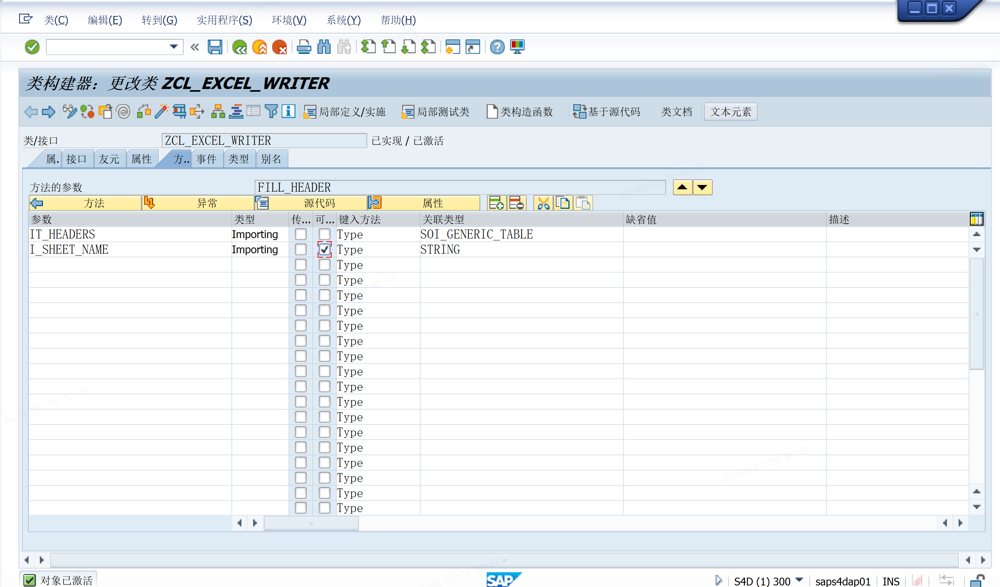

```ABAP
METHOD fill_header.
  DATA:lwa_headers LIKE LINE OF it_headers.
  DATA:l_error TYPE REF TO i_oi_error.

*===================================
* 选择sheet
*===================================
  IF i_sheet_name IS SUPPLIED.
    g_selected_sheet_name = i_sheet_name.
  ENDIF.

  me->select_sheet(
    EXPORTING
      i_sheet_name = g_selected_sheet_name
    IMPORTING
      e_error      = l_error
         ).
  IF l_error IS NOT INITIAL.
    CHECK l_error->has_succeeded EQ 'X'.
  ENDIF.

*===================================
* 逐个单元格填充表头
*===================================
  LOOP AT it_headers INTO lwa_headers.
    me->fill_cell(
    EXPORTING
        i_row        = lwa_headers-row
        i_col        = lwa_headers-column
        i_value      = lwa_headers-value
   IMPORTING
        e_error      = l_error
           ).
*    APPEND l_error TO et_error.
  ENDLOOP.
ENDMETHOD.
```

### 1.2.9 FILL_ITEMS
SHEET_NAME	Importing	Type	CHAR30
BEGIN_ROW	Importing	Type	I
BEGIN_COL	Importing	Type	I
ROW_COUNT	Importing	Type	I
COL_COUNT	Importing	Type	I
IT_OUT	Importing	Type	STANDARD TABLE
E_ERROR	Exporting	Type Ref To	I_OI_ERROR
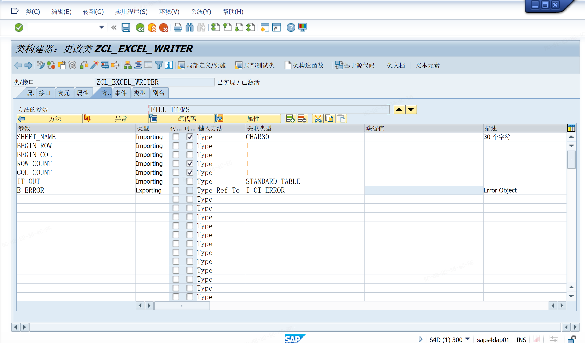

```ABAP
METHOD fill_items.
  DATA: lv_linecnt TYPE i,
        lv_cols TYPE i.
  DATA  l_retcode       TYPE soi_ret_string .
  DATA: lt_ftab        TYPE TABLE OF rfc_fields.

  CHECK go_spreadsheet IS NOT INITIAL.

*===================================
* 选择sheet
*===================================
  IF sheet_name IS SUPPLIED.
    g_selected_sheet_name = sheet_name.
  ENDIF.

  me->select_sheet(
    EXPORTING
      i_sheet_name = g_selected_sheet_name
    IMPORTING
      e_error      = e_error
         ).

  IF e_error IS NOT INITIAL.
    CHECK e_error->has_succeeded EQ 'X'.
  ENDIF.

*===================================
* 得到总行数
*===================================
  IF row_count IS SUPPLIED.
    lv_linecnt = row_count.
  ELSE.
    DESCRIBE TABLE it_out LINES lv_linecnt.
  ENDIF.


  CHECK lv_linecnt GT 0.

*===================================
* 得到it_out的结构
*===================================
  CALL FUNCTION 'DP_GET_FIELDS_FROM_TABLE'
    TABLES
      data   = it_out
      fields = lt_ftab.

  IF col_count IS SUPPLIED.
    lv_cols = col_count.
  ELSE.
    DESCRIBE TABLE lt_ftab LINES lv_cols.
  ENDIF.

*===================================
* 插入range范围
*===================================
  CLEAR e_error.
  CALL METHOD go_spreadsheet->insert_range_dim
    EXPORTING
      name     = 'RANGE1'
      no_flush = 'X'
      top      = begin_row
      left     = begin_col
      rows     = lv_linecnt
      columns  = lv_cols
    IMPORTING
      error    = e_error.

*  IF e_error IS NOT INITIAL.
*    CHECK e_error->has_succeeded EQ 'X'.
*  ENDIF.

*===================================
* 填入数据
*===================================
  CALL METHOD go_spreadsheet->insert_one_table
    EXPORTING
      data_table   = it_out
      fields_table = lt_ftab
      rangename    = 'RANGE1'
      no_flush     = 'X'
      wholetable   = 'X'
    IMPORTING
      error        = e_error
      retcode      = l_retcode.
  .
ENDMETHOD.
```

### 1.2.10 FREE
```ABAP
  METHOD free.
    FREE       :go_container,
                go_control,
                go_document,
                go_spreadsheet.
  ENDMETHOD.
```

### 1.2.11 RAISE_MESSAGE
TYPE	Importing	Type	C
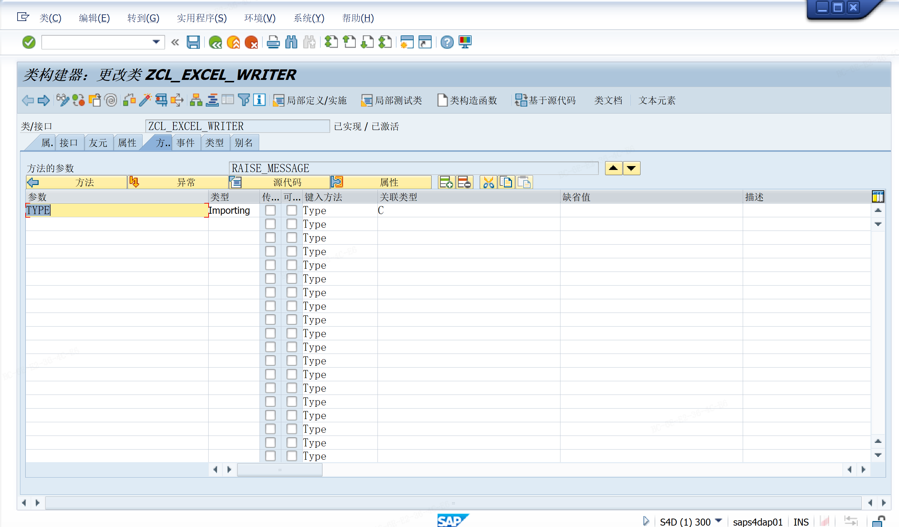
```ABAP
  METHOD raise_message.
    CHECK go_error IS NOT INITIAL.
    go_error->raise_message(
      EXPORTING
        type           = type

           ).
  ENDMETHOD.
```

### 1.2.12 GET_CELL
I_SHEET_NAME	Importing	Type	STRING
I_ROW	Importing	Type	CHAR4
I_COL	Importing	Type	CHAR4
I_VALUE	Exporting	Type	CHAR256
E_ERROR	Exporting	Type Ref To	I_OI_ERROR
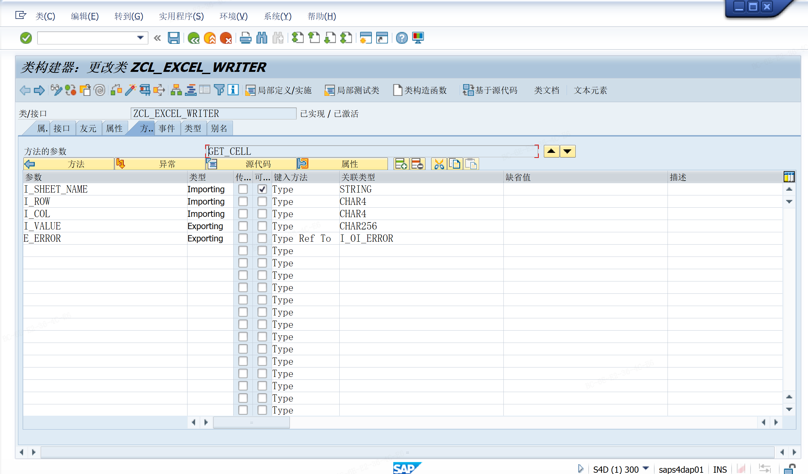

```ABAP
```

### 1.2.13 INSERT_LINE
I_LINE	Importing	Type	I
I_TOP	Importing	Type	I
I_LEFT	Importing	Type	I
I_ROW	Importing	Type	I
I_COL	Importing	Type	I
E_ERROR	Exporting	Type Ref To	I_OI_ERROR
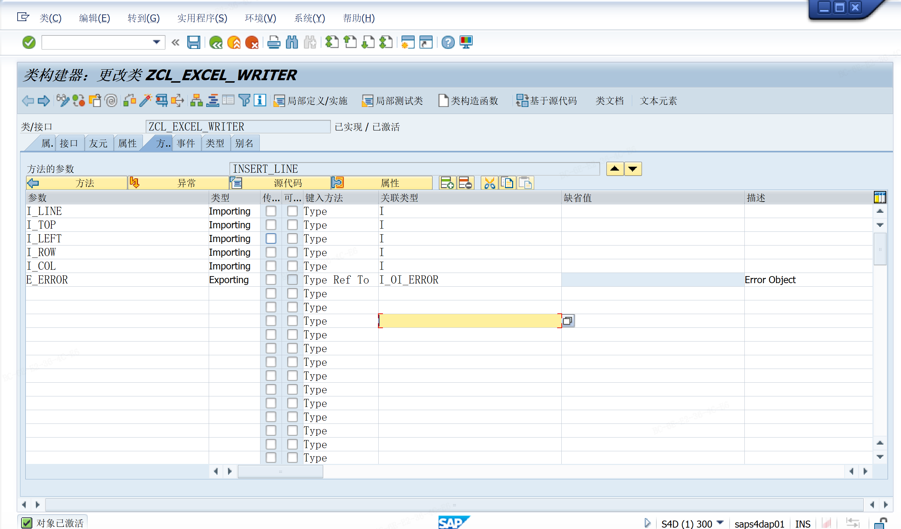
```ABAP
  METHOD insert_line.

    CALL METHOD go_spreadsheet->insert_range_dim
      EXPORTING
        name     = 'cell'
        no_flush = 'X'
        top      = i_top
        left     = i_left
        rows     = i_row
        columns  = i_col
      IMPORTING
        error    = e_error.

    CALL METHOD go_spreadsheet->hide_rows
      EXPORTING
        name     = 'cell'
        no_flush = 'X'
      IMPORTING
        error    = e_error.

  ENDMETHOD.
```

### 1.2.14 HIDE_COLUMNS
I_FIRST	Importing	Type	I
I_LAST	Importing	Type	I
E_ERROR	Exporting	Type Ref To	I_OI_ERROR
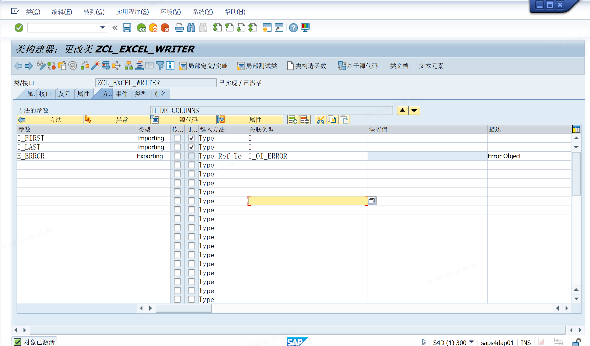
```ABAP
  METHOD hide_columns.

    CALL METHOD go_spreadsheet->hide_columns
      EXPORTING
        name     = 'cell'
        no_flush = 'X'
        first    = i_first
        last     = i_last
      IMPORTING
        error    = e_error.
  ENDMETHOD.
```

### 1.2.15 GROUP_RANGE
SHEET_NAME	Importing	Type	CHAR30
BEGIN_ROW	Importing	Type	I
BEGIN_COL	Importing	Type	I
ROW_COUNT	Importing	Type	I
COL_COUNT	Importing	Type	I
E_ERROR	Exporting	Type Ref To	I_OI_ERROR
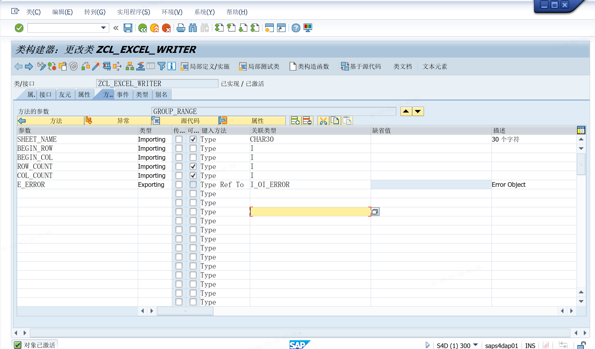

```ABAP
  METHOD group_range.
    DATA: rt_code  TYPE soi_ret_string,
          lv_times TYPE i.
    CHECK go_spreadsheet IS NOT INITIAL.

*===================================
* 选择sheet
*===================================
    IF sheet_name IS SUPPLIED.
      g_selected_sheet_name = sheet_name.
    ENDIF.

    me->select_sheet(
    EXPORTING
      i_sheet_name = g_selected_sheet_name
    IMPORTING
      e_error      = e_error
      ).

    IF e_error IS NOT INITIAL.
      CHECK e_error->has_succeeded EQ 'X'.
    ENDIF.

*===================================
* range范围
*===================================
    CLEAR e_error.
    CALL METHOD go_spreadsheet->insert_range_dim
      EXPORTING
        name     = 'RANGE1'
        no_flush = 'X'
        top      = begin_row
        left     = begin_col
        rows     = row_count
        columns  = col_count
      IMPORTING
        error    = e_error.

*===================================
*  选定range范围
*===================================
    CLEAR e_error.
    CALL METHOD go_spreadsheet->select_range
      EXPORTING
        rangename = 'RANGE1'
        no_flush  = 'X'
      IMPORTING
        error     = e_error.

*===================================
*  复制选定区域
*===================================
    CLEAR e_error.

    CALL METHOD go_document->execute_macro
      EXPORTING
        macro_string = '模块3.GROUP_RANGE'
        no_flush     = ' '
      IMPORTING
        error        = e_error
        retcode      = rt_code.

  ENDMETHOD.
```
### 1.2.16 COPY_RANGE
SHEET_NAME	Importing	Type	CHAR30
BEGIN_ROW	Importing	Type	I
BEGIN_COL	Importing	Type	I
ROW_COUNT	Importing	Type	I
COL_COUNT	Importing	Type	I
COPY_TIMES	Importing	Type	I
E_ERROR	Exporting	Type Ref To	I_OI_ERROR
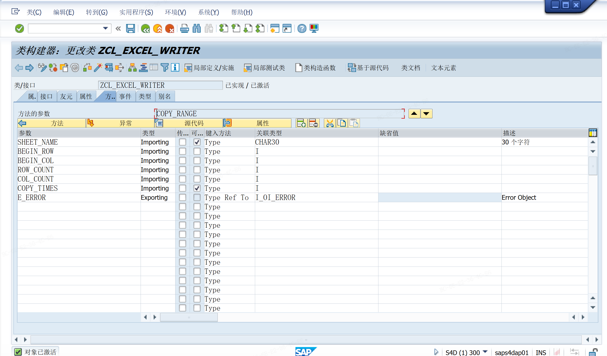

```ABAP
  METHOD copy_range.
    DATA: rt_code  TYPE soi_ret_string,
          lv_times TYPE i.
    CHECK go_spreadsheet IS NOT INITIAL.

*===================================
* 选择sheet
*===================================
    IF sheet_name IS SUPPLIED.
      g_selected_sheet_name = sheet_name.
    ENDIF.

    me->select_sheet(
    EXPORTING
      i_sheet_name = g_selected_sheet_name
    IMPORTING
      e_error      = e_error
      ).

    IF e_error IS NOT INITIAL.
      CHECK e_error->has_succeeded EQ 'X'.
    ENDIF.

*===================================
* range范围
*===================================
    CLEAR e_error.
    CALL METHOD go_spreadsheet->insert_range_dim
      EXPORTING
        name     = 'RANGE1'
        no_flush = 'X'
        top      = begin_row
        left     = begin_col
        rows     = row_count
        columns  = col_count
      IMPORTING
        error    = e_error.

*===================================
*  选定range范围
*===================================
    CLEAR e_error.
    CALL METHOD go_spreadsheet->select_range
      EXPORTING
        rangename = 'RANGE1'
        no_flush  = 'X'
      IMPORTING
        error     = e_error.

*===================================
*  复制选定区域
*===================================
    CLEAR e_error.

    IF copy_times IS NOT SUPPLIED.
      lv_times = 1.
    ELSE.
      lv_times = copy_times.
    ENDIF.

    DO lv_times TIMES.
      CALL METHOD go_document->execute_macro
        EXPORTING
          macro_string = '模块1.COPY_RANGE'
          no_flush     = ' '
        IMPORTING
          error        = e_error
          retcode      = rt_code.
    ENDDO.

  ENDMETHOD.
```

### 1.2.17 MERGE_RANGE
SHEET_NAME	Importing	Type	CHAR30
BEGIN_ROW	Importing	Type	I
BEGIN_COL	Importing	Type	I
ROW_COUNT	Importing	Type	I
COL_COUNT	Importing	Type	I
E_ERROR	Exporting	Type Ref To	I_OI_ERROR
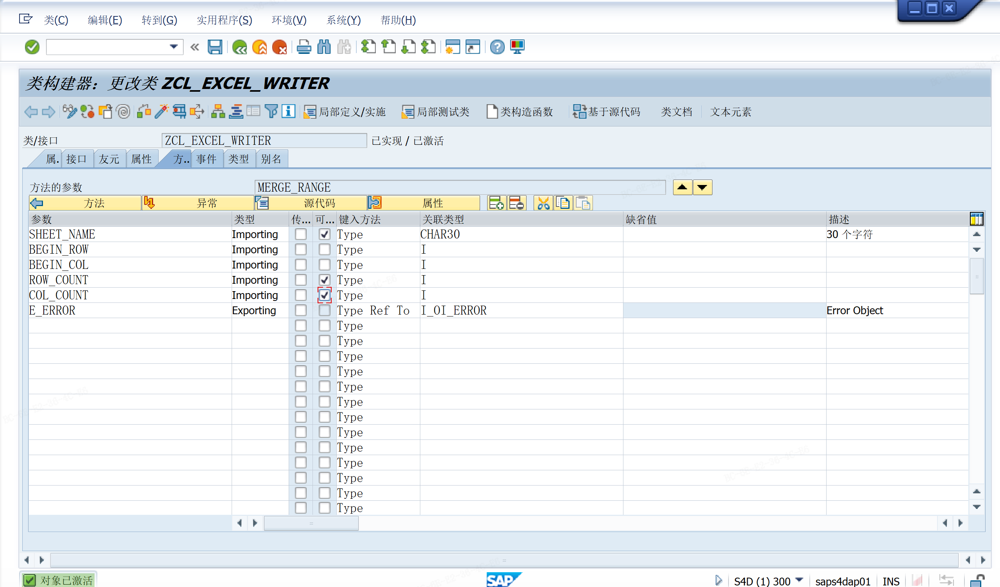

```ABAP
  METHOD merge_range.
    DATA: rt_code  TYPE soi_ret_string,
          lv_times TYPE i.
    CHECK go_spreadsheet IS NOT INITIAL.

*===================================
* 选择sheet
*===================================
    IF sheet_name IS SUPPLIED.
      g_selected_sheet_name = sheet_name.
    ENDIF.

    me->select_sheet(
    EXPORTING
      i_sheet_name = g_selected_sheet_name
    IMPORTING
      e_error      = e_error
      ).

    IF e_error IS NOT INITIAL.
      CHECK e_error->has_succeeded EQ 'X'.
    ENDIF.

*===================================
* range范围
*===================================
    CLEAR e_error.
    CALL METHOD go_spreadsheet->insert_range_dim
      EXPORTING
        name     = 'RANGE1'
        no_flush = 'X'
        top      = begin_row
        left     = begin_col
        rows     = row_count
        columns  = col_count
      IMPORTING
        error    = e_error.

*===================================
*  选定range范围
*===================================
    CLEAR e_error.
    CALL METHOD go_spreadsheet->select_range
      EXPORTING
        rangename = 'RANGE1'
        no_flush  = 'X'
      IMPORTING
        error     = e_error.

*===================================
*  复制选定区域
*===================================
    CLEAR e_error.

    CALL METHOD go_document->execute_macro
      EXPORTING
        macro_string = '模块2.MERGE_CELL'
        no_flush     = ' '
      IMPORTING
        error        = e_error
        retcode      = rt_code.
  ENDMETHOD.
```

### 1.2.18 SET_COLOR
SHEET_NAME	Importing	Type	CHAR30	                                                                                                                                    
BEGIN_ROW	Importing	Type	I	                                                                                                                                    
BEGIN_COL	Importing	Type	I	                                                                                                                                    
ROW_COUNT	Importing	Type	I	                                                                                                                                    
COL_COUNT	Importing	Type	I	                                                                                                                                    
FRONT	Importing	Type	INT4	0
BACK	Importing	Type	INT4	0
E_ERROR	Exporting	Type Ref To	I_OI_ERROR	                                                                                                                                    
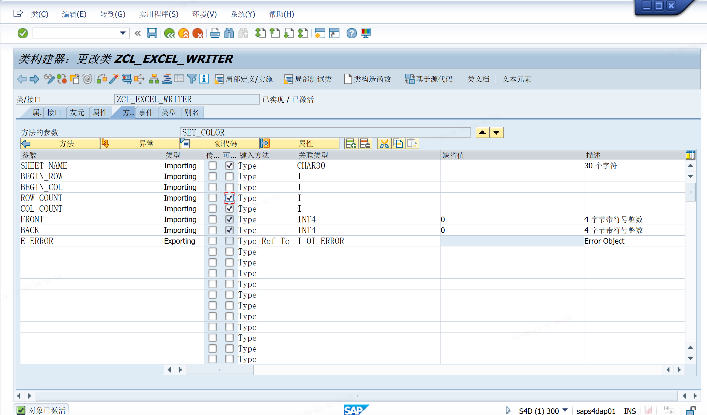

```ABAP
  METHOD set_color.
    DATA: rt_code  TYPE soi_ret_string,
          lv_times TYPE i.
    CHECK go_spreadsheet IS NOT INITIAL.

*===================================
* 选择sheet
*===================================
    IF sheet_name IS SUPPLIED.
      g_selected_sheet_name = sheet_name.
    ENDIF.

    me->select_sheet(
    EXPORTING
      i_sheet_name = g_selected_sheet_name
    IMPORTING
      e_error      = e_error
      ).

    IF e_error IS NOT INITIAL.
      CHECK e_error->has_succeeded EQ 'X'.
    ENDIF.

*===================================
* range范围
*===================================
    CLEAR e_error.
    CALL METHOD go_spreadsheet->insert_range_dim
      EXPORTING
        name     = 'RANGE1'
        no_flush = 'X'
        top      = begin_row
        left     = begin_col
        rows     = row_count
        columns  = col_count
      IMPORTING
        error    = e_error.

*===================================
*  选定range范围
*===================================
    CLEAR e_error.
    CALL METHOD go_spreadsheet->select_range
      EXPORTING
        rangename = 'RANGE1'
        no_flush  = 'X'
      IMPORTING
        error     = e_error.

*===================================
*  复制选定区域
*===================================
    CLEAR e_error.

    CALL METHOD go_spreadsheet->set_color
      EXPORTING
        rangename = 'RANGE1'
        front     = front
        back      = back
      IMPORTING
        error     = e_error
        retcode   = rt_code.
  ENDMETHOD.
```
## 1.3 se38 示例代码

画个屏幕100，加个定制控制，名称为CONTAINER
如果OAOR导入的excel文件有工作薄保护等，会导致锁定进而无法更改excel里内容，取消各种保护后导入相关模板
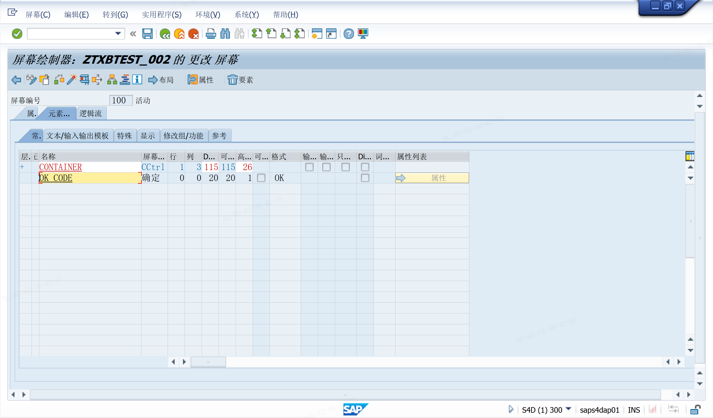
屏幕逻辑流
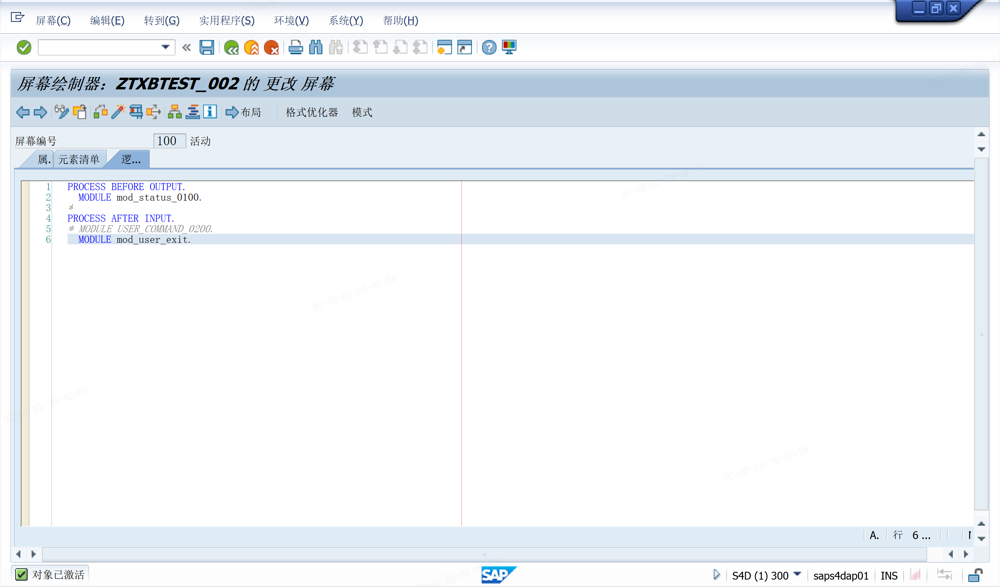

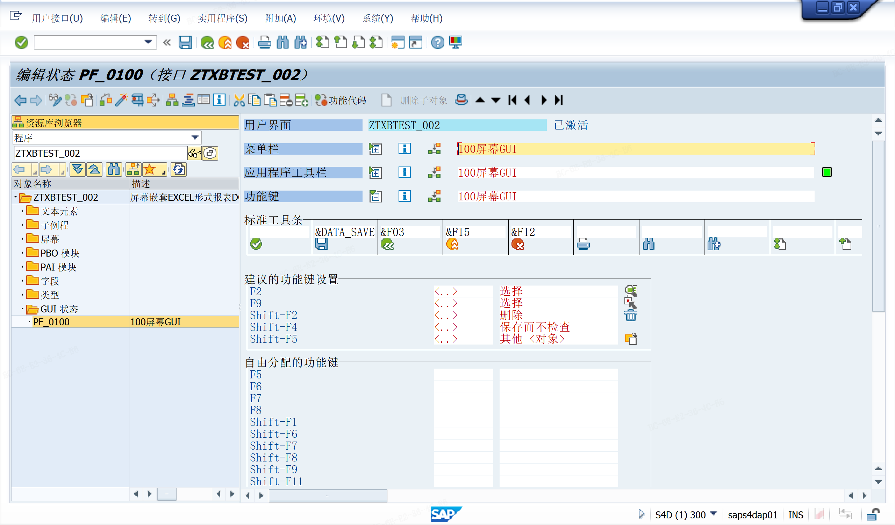
```ABAP
*&---------------------------------------------------------------------*
*& Report ZTXBTEST_002
*&---------------------------------------------------------------------*
*&
*&---------------------------------------------------------------------*
REPORT ztxbtest_002.
DATA:
  ok_code          TYPE sy-ucomm,
  gcl_excel_writer TYPE REF TO zcl_excel_writer.

TYPES:
  BEGIN OF gty_out,
    hsl_month(16)     TYPE p DECIMALS 2,
    hsl_lastmonth(16) TYPE p DECIMALS 2,
    hsl_year(16)      TYPE p DECIMALS 2,
    hsl_lastyear(16)  TYPE p DECIMALS 2,
  END OF gty_out.

DATA: gt_out TYPE TABLE OF gty_out,
      ls_out TYPE gty_out.

PERFORM frm_out_data.
*&---------------------------------------------------------------------*
*& Form FRM_OUT_DATA
*&---------------------------------------------------------------------*
*& text
*&---------------------------------------------------------------------*
*& -->  p1        text
*& <--  p2        text
*&---------------------------------------------------------------------*
FORM frm_out_data .
  CALL SCREEN 100.
ENDFORM.
*&---------------------------------------------------------------------*
*& Module MOD_STATUS_0100 OUTPUT
*&---------------------------------------------------------------------*
*&
*&---------------------------------------------------------------------*
MODULE mod_status_0100 OUTPUT.

  SET PF-STATUS 'PF_0100'.

  DATA: l_error TYPE REF TO i_oi_error.
  DATA: l_value  TYPE char256,
        l_value0 TYPE char256,
        l_row    TYPE i,
        l_top    TYPE i,
        l_line   TYPE i,
        l_from   TYPE char4,
        lv_waers TYPE t001-waers.

  CLEAR ls_out.

  CREATE OBJECT gcl_excel_writer
    EXPORTING
      i_app_name       = 'ZFIR210N'
      i_classname      = 'SOFFICEINTEGRATION' "类名
      i_classtype      = 'OT' "类型
      i_object_key     = 'ZTXBTEST_002' "对象名称
      i_container_name = 'CONTAINER'
*     I_DOCNAME        = 'ZFI210'.
      i_docname        = 'ZFIR210N'."描述

  CALL METHOD gcl_excel_writer->select_sheet
    EXPORTING
      i_sheet_name = 'Sheet1'
    IMPORTING
      e_error      = l_error.

  DATA(v_butxt) = '11公司'.
  CALL METHOD gcl_excel_writer->fill_cell
    EXPORTING
      i_sheet_name = 'Sheet1'
      i_row        = '2'
      i_col        = '1'
      i_value      = '编制单位:' && v_butxt
    IMPORTING
      e_error      = l_error.

  DATA  v_date           TYPE char256.
  v_date = 'A20260824'.
  CALL METHOD gcl_excel_writer->fill_cell
    EXPORTING
      i_sheet_name = 'Sheet1'
      i_row        = '2'
      i_col        = '4'
      i_value      = v_date
    IMPORTING
      e_error      = l_error.

  CALL METHOD gcl_excel_writer->fill_cell
    EXPORTING
      i_sheet_name = 'Sheet1'
      i_row        = '9'
      i_col        = '4'
      i_value      = '1'
    IMPORTING
      e_error      = l_error.

  DATA: lt_out  LIKE gt_out,
        lss_out TYPE gty_out.

  gt_out = VALUE #( ( hsl_month = '1.1' hsl_lastmonth = '2'
     hsl_year = '10' hsl_lastyear = '20') ).
  DESCRIBE TABLE gt_out LINES l_row.


  CALL METHOD gcl_excel_writer->fill_items
    EXPORTING
      sheet_name = 'Sheet1'
      begin_row  = '4'
      begin_col  = '4'
      row_count  = l_row
      col_count  = '3'
      it_out     = gt_out
    IMPORTING
      e_error    = l_error.
ENDMODULE.
*&---------------------------------------------------------------------*
*&      Module  MOD_USER_EXIT  INPUT
*&---------------------------------------------------------------------*
*       text
*----------------------------------------------------------------------*
MODULE mod_user_exit INPUT.
  CASE ok_code.
    WHEN '&F12'.
      CALL METHOD gcl_excel_writer->free.
      LEAVE PROGRAM.
    WHEN '&F15'.
      CALL METHOD gcl_excel_writer->free.
      LEAVE TO SCREEN 0.
    WHEN '&F03'.
      CALL METHOD gcl_excel_writer->free.
      LEAVE TO SCREEN 0.
    WHEN OTHERS.
  ENDCASE.
ENDMODULE.
```
## 参考资料
[ABAP DOI模板上传 OAOR](https://blog.csdn.net/JYH1999/article/details/117414994)
[Excel 下载](https://yemaojun99.github.io/2023/05/20/ABAP/Excel-%E4%B8%8B%E8%BD%BD/Excel%E4%B8%8B%E8%BD%BD/#%E4%BA%94%E3%80%81DOI%E4%B8%8B%E8%BD%BD)
[下载ZFIR210N.xls](/file/ZFIR210N.xls '下载文档')