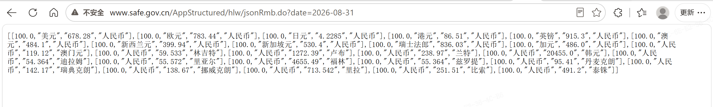
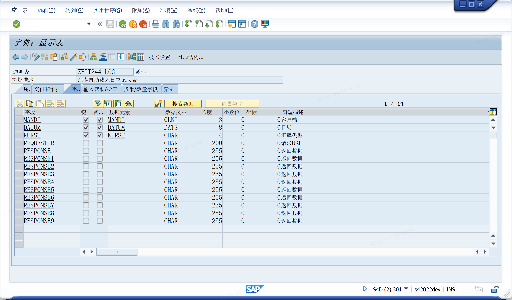
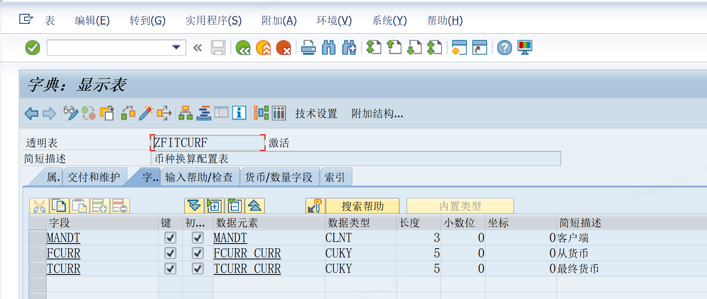
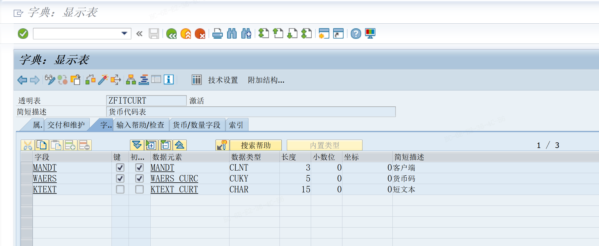

# 汇率自动维护
<!-- more -->
月末从国家外汇管理局门户网站获取汇率数据，更新I，M类型汇率。根据自建表ZFITCURF
币种换算配置表决定维护哪些汇率，结果存日志表zfit244_log






## 获取月末 I 汇率
```ABAP
*&---------------------------------------------------------------------*
*& REPORT ZFIR244I
*&---------------------------------------------------------------------*
*&---------------------------------------------------------------------*
*& DEVELOPER            < 开  发>: 
*& CREATE ON            <创建日期>:  20240218
*& FS NUMBER            <FS 编号>:
*& FUNCTIONAL CONSULTANT<功能顾问>:
*& DESCRIPTION          <FS 中业务需求概述>:
*& 汇率自动载入(I型) -- 20240218 -- by kangdh --
*&---------------------------------------------------------------------*
*              MODIFICATION LOG<程序修改日志,创建时不要填写>
*<版本>       <日期>        <开发者>     <功能顾问>   任务编号    <请求号>
*VERSION      DATE        PROGRAMMER   CORR. #       IL#        TRANSPORT
*   1         YYYY/MM/DD
*DESCRIPTION<程序逻辑修改 版本1> :
*
*DESCRIPTION<程序逻辑修改 版本2> :
*
*&---------------------------------------------------------------------*
REPORT zfir244i.

TYPES:BEGIN OF ty_data,
        ls TYPE char50,
      END OF ty_data.
TYPES:BEGIN OF ty_main,
        s1 TYPE char8,
        s2 TYPE char8,
        s3 TYPE char8,
        s4 TYPE char8,
      END OF ty_main.

DATA:
  gv_strurl         TYPE string,
  gt_data           TYPE TABLE OF ty_data,
  gt_main           TYPE TABLE OF ty_main,
  gt_main_e         TYPE TABLE OF ty_main,
  gv_date           TYPE datum,
  gv_lastdate       TYPE datum,
  gt_tcurr          TYPE TABLE OF tcurr,
  gwa_tcurr         LIKE LINE OF gt_tcurr,
  gv_gdatu          TYPE char10,
  gv_month_lastdate TYPE datum,    "本月最后一天维护 I 汇率
  gs_244log         TYPE zfit244_log.
TYPES: tt_main TYPE TABLE OF ty_main.

DATA: gt_mail_addr TYPE TABLE OF zsfi_mail_addr WITH HEADER LINE,
      gt_mail_cont TYPE TABLE OF zsfi_mail_cont WITH HEADER LINE.

*  取月末最后一天
CALL FUNCTION 'BKK_GET_MONTH_LASTDAY'
  EXPORTING
    i_date = sy-datum
  IMPORTING
    e_date = gv_month_lastdate.

CALL FUNCTION 'DATE_CONVERT_TO_FACTORYDATE'
  EXPORTING
    correct_option      = '-'
    date                = gv_month_lastdate
    factory_calendar_id = 'CN' "-- 'HK' -- modified by kangdh -- 20240407 --
  IMPORTING
    date                = gv_lastdate.

gv_strurl = 'http://www.safe.gov.cn/AppStructured/hlw/jsonRmb.do?date='
&& gv_lastdate+0(4) && '-' && gv_lastdate+4(2) && '-' && gv_lastdate+6(2).


gv_gdatu+0(1) = 9 - sy-datum+0(1).
gv_gdatu+1(1) = 9 - sy-datum+1(1).
gv_gdatu+2(1) = 9 - sy-datum+2(1).
gv_gdatu+3(1) = 9 - sy-datum+3(1).
gv_gdatu+4(1) = 9 - sy-datum+4(1).
gv_gdatu+5(1) = 9 - sy-datum+5(1).
gv_gdatu+6(1) = 9 - sy-datum+6(1).
gv_gdatu+7(1) = 9 - sy-datum+7(1).
*CALL FUNCTION 'CONVERSION_EXIT_INVDT_INPUT'
*  EXPORTING
*    input  = sy-datum
*  IMPORTING
*    output = gv_gdatu.

START-OF-SELECTION.

*  PERFORM http_get. "-- commented by kangdh -- 20240219 --
  PERFORM http_get_new.


FORM http_get_new.
  DATA: lo_http_client   TYPE REF TO if_http_client,
        lv_service       TYPE string,
        lv_result        TYPE string,
        lo_ixml          TYPE REF TO if_ixml,
        lo_streamfactory TYPE REF TO if_ixml_stream_factory,
        lo_istream       TYPE REF TO if_ixml_istream,
        lo_document      TYPE REF TO if_ixml_document,
        lo_parser        TYPE REF TO if_ixml_parser,
        ls_data          TYPE ty_data,
        ls_main          TYPE ty_main,
        ls_main2         TYPE ty_main,
        lv_ok            TYPE char01.
  DATA: ls_tcurf TYPE tcurf.
  DATA: lv_json TYPE string.
  DATA: len        TYPE i,
        lv_rate(8) TYPE p DECIMALS 5,
        ls_tcurr   LIKE gwa_tcurr.
  DATA: lt_relog  TYPE TABLE OF char128 WITH HEADER LINE,
        lv_rename TYPE char9.

  cl_http_client=>create_by_url(
  EXPORTING
    url                = gv_strurl
  IMPORTING
    client             = lo_http_client
  EXCEPTIONS
    argument_not_found = 1
    plugin_not_active  = 2
    internal_error     = 3
    OTHERS             = 4 ).

  lo_http_client->propertytype_logon_popup = lo_http_client->co_disabled.
  CALL METHOD lo_http_client->authenticate(
    EXPORTING
*     client   = ''
*     proxy_authentication = 'X'
      username = ''
      password = ''
*     LANGUAGE = 'E'
  ).
  CALL METHOD lo_http_client->request->set_header_field
    EXPORTING
      name  = 'Content-Type'
      value = 'application/json; charset=utf-8'.
  CALL METHOD lo_http_client->request->set_method( if_http_request=>co_request_method_get ). "GET
  lo_http_client->send(
  EXCEPTIONS
    http_communication_failure = 1
    http_invalid_state         = 2 ).

  lo_http_client->receive(
  EXCEPTIONS
    http_communication_failure = 1
    http_invalid_state         = 2
    http_processing_failed     = 3 ).

  lv_result = lo_http_client->response->get_cdata( ).
*  日志记录 --S
  gs_244log-kurst = 'I'.
  gs_244log-datum = sy-datum.
  gs_244log-requesturl = gv_strurl.
  IF lv_result = '[]'.
    gs_244log-response = '无数据'.
  ELSE.
    CALL FUNCTION 'SCMS_STRING_TO_FTEXT'
      EXPORTING
        text      = lv_result
      TABLES
        ftext_tab = lt_relog.
    LOOP AT lt_relog.
      lv_rename = 'RESPONSE' && sy-tabix.
      ASSIGN COMPONENT lv_rename OF STRUCTURE gs_244log TO FIELD-SYMBOL(<fs_field>).
      IF sy-subrc = 0.
        <fs_field> = lt_relog.
      ENDIF.
    ENDLOOP.
  ENDIF.

  CALL METHOD lo_http_client->close.

  MODIFY zfit244_log FROM gs_244log.
  COMMIT WORK AND WAIT.
*  日志记录 --E
  REPLACE ALL OCCURRENCES OF '"' IN lv_result WITH ''.
  SPLIT lv_result AT '],[' INTO TABLE gt_data.
  LOOP AT gt_data INTO ls_data.
    CLEAR ls_main.
    REPLACE ALL OCCURRENCES OF '[' IN ls_data-ls WITH ''.
    REPLACE ALL OCCURRENCES OF ']' IN ls_data-ls WITH ''.
    SPLIT ls_data-ls AT ',' INTO ls_main-s1 ls_main-s2 ls_main-s3 ls_main-s4.
    APPEND ls_main TO gt_main.
  ENDLOOP.

*   月末 I 汇率---------------------------------------------------------
  IF sy-datum = gv_month_lastdate.
    "-- process -- begin --
    CLEAR: gt_main_e.
    "-- 1. 将币别文本替换成代码  --
    SELECT *
      FROM
      zfitcurt
      INTO TABLE @DATA(lt_zfitcurt).
    SORT lt_zfitcurt BY ktext.

    LOOP AT gt_main ASSIGNING FIELD-SYMBOL(<fs_main>).
      READ TABLE lt_zfitcurt INTO DATA(ls_zfitcurt)
        WITH KEY ktext = <fs_main>-s2 BINARY SEARCH.
      IF sy-subrc = 0.
        <fs_main>-s2 = ls_zfitcurt-waers.
      ELSE.
        "-- error --
        CLEAR ls_main.
        ls_main = <fs_main>.
        CLEAR: ls_main-s4.
        APPEND ls_main TO gt_main_e.
      ENDIF.
      CLEAR: ls_zfitcurt.

      READ TABLE lt_zfitcurt INTO ls_zfitcurt
        WITH KEY ktext = <fs_main>-s4 BINARY SEARCH.
      IF sy-subrc = 0.
        <fs_main>-s4 = ls_zfitcurt-waers.
      ELSE.
        "-- error --
        CLEAR ls_main.
        ls_main = <fs_main>.
        CLEAR: ls_main-s2.
        APPEND ls_main TO gt_main_e.
      ENDIF.
      CLEAR: ls_zfitcurt.
    ENDLOOP.
    SORT gt_main BY s2 s4.
    "-- 2. 取 币种换算配置 --
    SELECT *
      FROM zfitcurf
      INTO TABLE @DATA(lt_zfitcurf).
    SORT lt_zfitcurf BY fcurr tcurr.

*   FCURR -- TCURR
    LOOP AT lt_zfitcurf INTO DATA(ls_zfitcurf).
      CLEAR: gwa_tcurr, ls_main.
      READ TABLE gt_main INTO ls_main
        WITH KEY s2 = ls_zfitcurf-fcurr
                 s4 = ls_zfitcurf-tcurr
                 BINARY SEARCH.
      IF sy-subrc = 0.
        SELECT SINGLE *
          INTO @ls_tcurf
          FROM tcurf
          WHERE  fcurr = @ls_zfitcurf-fcurr
            AND  tcurr = @ls_zfitcurf-tcurr
            AND  kurst = 'I'.
        IF sy-subrc = 0.
          lv_rate = ls_main-s3 / ls_main-s1 * ls_tcurf-ffact / ls_tcurf-tfact.  "-- 情景1： 美元兑人民币
          gwa_tcurr-gdatu = gv_gdatu.
          gwa_tcurr-fcurr = ls_zfitcurf-fcurr.
          gwa_tcurr-tcurr = ls_zfitcurf-tcurr.
          gwa_tcurr-kurst = 'I'.
          gwa_tcurr-ffact = 0.
          gwa_tcurr-tfact = 0.
          gwa_tcurr-ukurs = lv_rate.
          APPEND gwa_tcurr TO gt_tcurr.
        ELSE.
          "-- error --
          CLEAR ls_main.
          ls_main-s2 = ls_zfitcurf-fcurr.
          ls_main-s4 = ls_zfitcurf-tcurr.
          APPEND ls_main TO gt_main_e.
        ENDIF.
      ELSE.
        READ TABLE gt_main INTO ls_main
          WITH KEY s2 = ls_zfitcurf-tcurr
                   s4 = ls_zfitcurf-fcurr
                   BINARY SEARCH.
        IF sy-subrc = 0.
          SELECT SINGLE *
            INTO @ls_tcurf
            FROM tcurf
            WHERE  fcurr = @ls_zfitcurf-fcurr
              AND  tcurr = @ls_zfitcurf-tcurr
              AND  kurst = 'I'.
          IF sy-subrc = 0.
            lv_rate = ls_main-s1 / ls_main-s3 * ls_tcurf-ffact / ls_tcurf-tfact. "-- 情景2： 人民币 兑 美元
            gwa_tcurr-gdatu = gv_gdatu.
            gwa_tcurr-fcurr = ls_zfitcurf-fcurr.
            gwa_tcurr-tcurr = ls_zfitcurf-tcurr.
            gwa_tcurr-kurst = 'I'.
            gwa_tcurr-ffact = 0.
            gwa_tcurr-tfact = 0.
            gwa_tcurr-ukurs = lv_rate.
            APPEND gwa_tcurr TO gt_tcurr.
          ELSE.
            "-- error --
            CLEAR ls_main.
            ls_main-s2 = ls_zfitcurf-fcurr.
            ls_main-s4 = ls_zfitcurf-tcurr.
            APPEND ls_main TO gt_main_e.
          ENDIF.
        ELSE.
          READ TABLE gt_main INTO ls_main
            WITH KEY s2 = ls_zfitcurf-fcurr
                     s4 = 'CNY' "-- ls_zfitcurf-tcurr
                     BINARY SEARCH.
          IF sy-subrc = 0.
            CLEAR:ls_main2,lv_ok.
            PERFORM frm_get_from_to_currency TABLES gt_main USING ls_main-s4 ls_zfitcurf-tcurr CHANGING ls_main2 lv_ok.
            IF lv_ok = 'X'.
              SELECT SINGLE *
                INTO @ls_tcurf
                FROM tcurf
                WHERE  fcurr = @ls_zfitcurf-fcurr
                  AND  tcurr = @ls_zfitcurf-tcurr
                  AND  kurst = 'I'.
              IF sy-subrc = 0.
                lv_rate = ( ls_main-s3 / ls_main-s1 ) * ( ls_main2-s3 / ls_main2-s1 ) * ls_tcurf-ffact / ls_tcurf-tfact. "-- 情景3：美元兑韩元 = 美元兑人民币 * 人民币兑韩元
                gwa_tcurr-gdatu = gv_gdatu.
                gwa_tcurr-fcurr = ls_zfitcurf-fcurr.
                gwa_tcurr-tcurr = ls_zfitcurf-tcurr.
                gwa_tcurr-kurst = 'I'.
                gwa_tcurr-ffact = 0.
                gwa_tcurr-tfact = 0.
                gwa_tcurr-ukurs = lv_rate.
                APPEND gwa_tcurr TO gt_tcurr.
              ELSE.
                "-- error --
                CLEAR ls_main.
                ls_main-s2 = ls_zfitcurf-fcurr.
                ls_main-s4 = ls_zfitcurf-tcurr.
                APPEND ls_main TO gt_main_e.
              ENDIF.
            ELSE.
              PERFORM frm_get_from_to_currency TABLES gt_main USING ls_zfitcurf-tcurr ls_main-s4 CHANGING ls_main2 lv_ok.
              IF lv_ok = 'X'.
                SELECT SINGLE *
                  INTO @ls_tcurf
                  FROM tcurf
                  WHERE  fcurr = @ls_zfitcurf-fcurr
                    AND  tcurr = @ls_zfitcurf-tcurr
                    AND  kurst = 'I'.
                IF sy-subrc = 0.
                  lv_rate = ( ls_main-s3 / ls_main-s1 ) / ( ls_main2-s3 / ls_main2-s1 ) * ls_tcurf-ffact / ls_tcurf-tfact.  "-- 情景4：美元兑港币 = 美元兑人民币 / 港币兑人民币
                  gwa_tcurr-gdatu = gv_gdatu.
                  gwa_tcurr-fcurr = ls_zfitcurf-fcurr.
                  gwa_tcurr-tcurr = ls_zfitcurf-tcurr.
                  gwa_tcurr-kurst = 'I'.
                  gwa_tcurr-ffact = 0.
                  gwa_tcurr-tfact = 0.
                  gwa_tcurr-ukurs = lv_rate.
                  APPEND gwa_tcurr TO gt_tcurr.
                ELSE.
                  "-- error --
                  CLEAR ls_main.
                  ls_main-s2 = ls_zfitcurf-fcurr.
                  ls_main-s4 = ls_zfitcurf-tcurr.
                  APPEND ls_main TO gt_main_e.
                ENDIF.
              ELSE.
                "-- error --
                CLEAR ls_main.
                ls_main-s2 = ls_zfitcurf-fcurr.
                ls_main-s4 = ls_zfitcurf-tcurr.
                APPEND ls_main TO gt_main_e.
              ENDIF.
            ENDIF.
          ELSE.
            READ TABLE gt_main INTO ls_main
              WITH KEY s2 = 'CNY' "-- ls_zfitcurf-tcurr
                       s4 = ls_zfitcurf-fcurr
                       BINARY SEARCH.
            IF sy-subrc = 0.
*            lv_rate = ls_main-s1 / ls_main-s3.
              CLEAR:ls_main2,lv_ok.
              PERFORM frm_get_from_to_currency TABLES gt_main USING ls_main-s2 ls_zfitcurf-tcurr CHANGING ls_main2 lv_ok.
              IF lv_ok = 'X'.
                SELECT SINGLE *
                  INTO @ls_tcurf
                  FROM tcurf
                  WHERE  fcurr = @ls_zfitcurf-fcurr
                    AND  tcurr = @ls_zfitcurf-tcurr
                    AND  kurst = 'I'.
                IF sy-subrc = 0.
                  lv_rate = ( ls_main-s1 / ls_main-s3 ) * ( ls_main2-s3 / ls_main2-s1 ) * ls_tcurf-ffact / ls_tcurf-tfact. "-- 情景5：美元兑韩元 = 人民币兑美元 的 倒数 * 人民币兑韩元
                  gwa_tcurr-gdatu = gv_gdatu.
                  gwa_tcurr-fcurr = ls_zfitcurf-fcurr.
                  gwa_tcurr-tcurr = ls_zfitcurf-tcurr.
                  gwa_tcurr-kurst = 'I'.
                  gwa_tcurr-ffact = 0.
                  gwa_tcurr-tfact = 0.
                  gwa_tcurr-ukurs = lv_rate.
                  APPEND gwa_tcurr TO gt_tcurr.
                ELSE.
                  "-- error --
                  CLEAR ls_main.
                  ls_main-s2 = ls_zfitcurf-fcurr.
                  ls_main-s4 = ls_zfitcurf-tcurr.
                  APPEND ls_main TO gt_main_e.
                ENDIF.
              ELSE.
                PERFORM frm_get_from_to_currency TABLES gt_main USING ls_zfitcurf-tcurr ls_main-s2 CHANGING ls_main2 lv_ok.
                IF lv_ok = 'X'.
                  SELECT SINGLE *
                    INTO @ls_tcurf
                    FROM tcurf
                    WHERE  fcurr = @ls_zfitcurf-fcurr
                      AND  tcurr = @ls_zfitcurf-tcurr
                      AND  kurst = 'I'.
                  IF sy-subrc = 0.
                    lv_rate = ( ls_main-s1 / ls_main-s3 ) / ( ls_main2-s3 / ls_main2-s1 ) * ls_tcurf-ffact / ls_tcurf-tfact.  "-- 情景6：美元兑港币 = 人民币兑美元 的 倒数 / 港币兑人民币
                    gwa_tcurr-gdatu = gv_gdatu.
                    gwa_tcurr-fcurr = ls_zfitcurf-fcurr.
                    gwa_tcurr-tcurr = ls_zfitcurf-tcurr.
                    gwa_tcurr-kurst = 'I'.
                    gwa_tcurr-ffact = 0.
                    gwa_tcurr-tfact = 0.
                    gwa_tcurr-ukurs = lv_rate.
                    APPEND gwa_tcurr TO gt_tcurr.
                  ELSE.
                    "-- error --
                    CLEAR ls_main.
                    ls_main-s2 = ls_zfitcurf-fcurr.
                    ls_main-s4 = ls_zfitcurf-tcurr.
                    APPEND ls_main TO gt_main_e.
                  ENDIF.
                ELSE.
                  "-- error --
                  CLEAR ls_main.
                  ls_main-s2 = ls_zfitcurf-fcurr.
                  ls_main-s4 = ls_zfitcurf-tcurr.
                  APPEND ls_main TO gt_main_e.
                ENDIF.
              ENDIF.
            ELSE.

            ENDIF.
          ENDIF.
        ENDIF.
      ENDIF.
    ENDLOOP.
    "-- process -- end --

*    IF gt_tcurr IS NOT INITIAL .
*      SELECT *
*        INTO TABLE @DATA(lt_tcurf)
*        FROM tcurf
*        FOR ALL ENTRIES IN @gt_tcurr
*        WHERE  fcurr = @gt_tcurr-fcurr
*          AND  tcurr = @gt_tcurr-tcurr
*          AND  kurst = 'I'.
*
*      LOOP AT gt_tcurr ASSIGNING FIELD-SYMBOL(<fs_tcurr>).
*        READ TABLE lt_tcurf INTO DATA(ls_tcurf) WITH KEY fcurr = <fs_tcurr>-fcurr
*                                                         tcurr = <fs_tcurr>-tcurr
*                                                         kurst = <fs_tcurr>-kurst.
*        IF sy-subrc = 0.
**        <fs_tcurr>-ukurs = <fs_tcurr>-ukurs * ls_tcurf-ffact .
*          IF ls_tcurf-tfact <> 0.
*            <fs_tcurr>-ukurs = <fs_tcurr>-ukurs * ls_tcurf-ffact / ls_tcurf-tfact.
*          ENDIF.
*        ENDIF.
*        CLEAR: ls_tcurf.
*      ENDLOOP.
*    ENDIF.

    IF gt_tcurr IS NOT INITIAL.
      MODIFY tcurr FROM TABLE gt_tcurr.
      COMMIT WORK AND WAIT.
      MESSAGE '汇率维护成功！' TYPE 'S'.
    ENDIF.

*  IF lines( gt_tcurr ) <> 19.     "
    IF gt_main_e IS NOT INITIAL OR gt_tcurr IS INITIAL.     "  "
      REFRESH: gt_mail_addr,gt_mail_cont.
*      gt_mail_addr-mail_addr = 'zhangqiao@huayou.com'.
*      APPEND gt_mail_addr.
*      gt_mail_addr-mail_addr = 'wuhy@huayou.com'.
      gt_mail_addr-mail_addr = 'chenlp@huayou.com'.
      APPEND gt_mail_addr.
*      gt_mail_addr-mail_addr = 'zjj@huayou.com'.
      gt_mail_addr-mail_addr = 'sunyj@huayou.com'.
      APPEND gt_mail_addr.
*      gt_mail_addr-mail_addr = 'rjj@huayou.com'.
*      APPEND gt_mail_addr.
      gt_mail_cont-mail_cont = '日期:' && sy-datum && '，从国家外汇网同步汇率I型时出现缺失，请及时检查。'.
      APPEND gt_mail_cont.
      CALL FUNCTION 'ZFM_FI_SEND_EMAIL' STARTING NEW TASK 'ZT_SEND_EMAIL'
        EXPORTING
          i_title      = '[ SAP汇率I型 ] 同步出现错误，请检查'
        TABLES
          it_mail_addr = gt_mail_addr[]
          it_mail_cont = gt_mail_cont[].

*      REFRESH: gt_mail_addr,gt_mail_cont.
*      gt_mail_addr-mail_addr = 'kxj@huayou.com'.
*      APPEND gt_mail_addr.
*      gt_mail_addr-mail_addr = 'wcy@huayou.com'.
*      APPEND gt_mail_addr.
*      gt_mail_cont-mail_cont = '日期:' && sy-datum && '，从国家外汇网同步汇率I型时出现缺失，请及时检查。'.
*      APPEND gt_mail_cont.
*      CALL FUNCTION 'ZFM_FI_SEND_EMAIL' STARTING NEW TASK 'ZT_SEND_EMAIL2'
*        EXPORTING
*          i_title      = '[ SAP汇率I型 ] 同步出现错误，请检查'
*        TABLES
*          it_mail_addr = gt_mail_addr[]
*          it_mail_cont = gt_mail_cont[].
    ENDIF.

  ENDIF.


ENDFORM.
*&---------------------------------------------------------------------*
*& Form FRM_GET_FROM_TO_CURRENCY
*&---------------------------------------------------------------------*
*& text
*&---------------------------------------------------------------------*
*      -->P_GT_MAIN  text
*      -->P_LS_MAIN_S4  text
*      -->P_LS_ZFITCURF_TCURR  text
*      <--P_LS_MAIN2  text
*      <--P_LV_OK  text
*&---------------------------------------------------------------------*
FORM frm_get_from_to_currency  TABLES   pt_main TYPE tt_main
                               USING    pv_fcurr
                                        pv_tcurr
                               CHANGING ps_main2
                                        pv_ok.

  CLEAR: ps_main2, pv_ok.
  READ TABLE pt_main INTO ps_main2
    WITH KEY s2 = pv_fcurr
             s4 = pv_tcurr
             BINARY SEARCH.
  IF sy-subrc = 0.
    pv_ok = 'X'.
  ELSE.

  ENDIF.
ENDFORM.
```

## 获取月末 M 汇率
```ABAP
*&---------------------------------------------------------------------*
*& REPORT ZFIR244
*&---------------------------------------------------------------------*
*&---------------------------------------------------------------------*
*& DEVELOPER            < 开  发>: 
*& CREATE ON            <创建日期>:  20240218
*& FS NUMBER            <FS 编号>:
*& FUNCTIONAL CONSULTANT<功能顾问>:
*& DESCRIPTION          <FS 中业务需求概述>:
*& 汇率自动载入(M型) -- 20240218 -- by kangdh --
*&---------------------------------------------------------------------*
*              MODIFICATION LOG<程序修改日志,创建时不要填写>
*<版本>       <日期>        <开发者>     <功能顾问>   任务编号    <请求号>
*VERSION      DATE        PROGRAMMER   CORR. #       IL#        TRANSPORT
*   1         YYYY/MM/DD
*DESCRIPTION<程序逻辑修改 版本1> :
*
*DESCRIPTION<程序逻辑修改 版本2> :
*
*&---------------------------------------------------------------------*
REPORT zfir244.
TYPES:BEGIN OF ty_data,
        ls TYPE char50,
      END OF ty_data.
TYPES:BEGIN OF ty_main,
        s1 TYPE char8,
        s2 TYPE char8,
        s3 TYPE char8,
        s4 TYPE char8,
      END OF ty_main.

DATA:
  gv_strurl   TYPE string,
  gt_data     TYPE TABLE OF ty_data,
  gt_main     TYPE TABLE OF ty_main,
  gt_main_e   TYPE TABLE OF ty_main,
  gv_date     TYPE datum,
  gv_nextdate TYPE datum,
  gt_tcurr    TYPE TABLE OF tcurr,
  gwa_tcurr   LIKE LINE OF gt_tcurr,
  gv_gdatu    TYPE char10,
  gs_244log   TYPE zfit244_log.

TYPES: tt_main TYPE TABLE OF ty_main.

DATA: gt_mail_addr TYPE TABLE OF zsfi_mail_addr WITH HEADER LINE,
      gt_mail_cont TYPE TABLE OF zsfi_mail_cont WITH HEADER LINE.

INITIALIZATION.
*   取下一个工作日的汇率
  gv_nextdate = sy-datum + 1.

*  CALL FUNCTION 'DATE_CONVERT_TO_FACTORYDATE'
*    EXPORTING
*      correct_option      = '+'
*      date                = gv_nextdate
*      factory_calendar_id = 'CN'
*    IMPORTING
*      date                = gv_nextdate.

  gv_strurl = 'http://www.safe.gov.cn/AppStructured/hlw/jsonRmb.do?date='
  && sy-datum+0(4) && '-' && sy-datum+4(2) && '-' && sy-datum+6(2).

  gv_gdatu+0(1) = 9 - gv_nextdate+0(1).
  gv_gdatu+1(1) = 9 - gv_nextdate+1(1).
  gv_gdatu+2(1) = 9 - gv_nextdate+2(1).
  gv_gdatu+3(1) = 9 - gv_nextdate+3(1).
  gv_gdatu+4(1) = 9 - gv_nextdate+4(1).
  gv_gdatu+5(1) = 9 - gv_nextdate+5(1).
  gv_gdatu+6(1) = 9 - gv_nextdate+6(1).
  gv_gdatu+7(1) = 9 - gv_nextdate+7(1).
*  CALL FUNCTION 'CONVERSION_EXIT_INVDT_INPUT'
*    EXPORTING
*      input  = gv_nextdate
*    IMPORTING
*      output = gv_gdatu.


START-OF-SELECTION.

*  PERFORM http_get. "-- commented by kangdh -- 20240218 --
  PERFORM http_get_new.

FORM http_get_new.
  DATA: lo_http_client   TYPE REF TO if_http_client,
        lv_service       TYPE string,
        lv_result        TYPE string,
        lo_ixml          TYPE REF TO if_ixml,
        lo_streamfactory TYPE REF TO if_ixml_stream_factory,
        lo_istream       TYPE REF TO if_ixml_istream,
        lo_document      TYPE REF TO if_ixml_document,
        lo_parser        TYPE REF TO if_ixml_parser,
        ls_data          TYPE ty_data,
        ls_main          TYPE ty_main,
        ls_main2         TYPE ty_main,
        lv_ok            TYPE char01.
  DATA: ls_tcurf TYPE tcurf.
  DATA: lv_json TYPE string.
  DATA: len      TYPE i,
*        lv_rate(8) TYPE p DECIMALS 5,
        lv_rate  TYPE ukurs_curr, "-- added by kangdh -- 20240218 --
        ls_tcurr LIKE gwa_tcurr.
  DATA: lt_relog  TYPE TABLE OF char128 WITH HEADER LINE,
        lv_rename TYPE char9.


  cl_http_client=>create_by_url(
  EXPORTING
    url                = gv_strurl
  IMPORTING
    client             = lo_http_client
  EXCEPTIONS
    argument_not_found = 1
    plugin_not_active  = 2
    internal_error     = 3
    OTHERS             = 4 ).

  lo_http_client->propertytype_logon_popup = lo_http_client->co_disabled.
  CALL METHOD lo_http_client->authenticate(
    EXPORTING
*     client   = ''
*     proxy_authentication = 'X'
      username = ''
      password = ''
*     LANGUAGE = 'E'
  ).
  CALL METHOD lo_http_client->request->set_header_field
    EXPORTING
      name  = 'Content-Type'
      value = 'application/json; charset=utf-8'.
  CALL METHOD lo_http_client->request->set_method( if_http_request=>co_request_method_get ). "GET
  lo_http_client->send(
  EXCEPTIONS
    http_communication_failure = 1
    http_invalid_state         = 2 ).

  lo_http_client->receive(
  EXCEPTIONS
    http_communication_failure = 1
    http_invalid_state         = 2
    http_processing_failed     = 3 ).

  lv_result = lo_http_client->response->get_cdata( ).
*  日志记录 --S
  gs_244log-kurst = 'M'.
  gs_244log-datum = sy-datum.
  gs_244log-requesturl = gv_strurl.
  IF lv_result = '[]'.
    gs_244log-response1 = '无数据'.
  ELSE.
    CALL FUNCTION 'SCMS_STRING_TO_FTEXT'
      EXPORTING
        text      = lv_result
      TABLES
        ftext_tab = lt_relog.
    LOOP AT lt_relog.
      lv_rename = 'RESPONSE' && sy-tabix.
      ASSIGN COMPONENT lv_rename OF STRUCTURE gs_244log TO FIELD-SYMBOL(<fs_field>).
      IF sy-subrc = 0.
        <fs_field> = lt_relog.
      ENDIF.
    ENDLOOP.
  ENDIF.

  CALL METHOD lo_http_client->close.

  MODIFY zfit244_log FROM gs_244log.
  COMMIT WORK AND WAIT.
*  日志记录 --E
  REPLACE ALL OCCURRENCES OF '"' IN lv_result WITH ''.
  IF lv_result = '[]'.
    EXIT.
  ENDIF.
  SPLIT lv_result AT '],[' INTO TABLE gt_data.
  LOOP AT gt_data INTO ls_data.
    CLEAR ls_main.
    REPLACE ALL OCCURRENCES OF '[' IN ls_data-ls WITH ''.
    REPLACE ALL OCCURRENCES OF ']' IN ls_data-ls WITH ''.
    SPLIT ls_data-ls AT ',' INTO ls_main-s1 ls_main-s2 ls_main-s3 ls_main-s4.
    APPEND ls_main TO gt_main.
  ENDLOOP.

  "-- process -- begin --
  CLEAR: gt_main_e.
  "-- 1. 将币别文本替换成代码  --
  SELECT *
    FROM
    zfitcurt
    INTO TABLE @DATA(lt_zfitcurt).
  SORT lt_zfitcurt BY ktext.

  LOOP AT gt_main ASSIGNING FIELD-SYMBOL(<fs_main>).
    READ TABLE lt_zfitcurt INTO DATA(ls_zfitcurt)
      WITH KEY ktext = <fs_main>-s2 BINARY SEARCH.
    IF sy-subrc = 0.
      <fs_main>-s2 = ls_zfitcurt-waers.
    ELSE.
      "-- error --
      CLEAR ls_main.
      ls_main = <fs_main>.
      CLEAR: ls_main-s4.
      APPEND ls_main TO gt_main_e.
    ENDIF.
    CLEAR: ls_zfitcurt.

    READ TABLE lt_zfitcurt INTO ls_zfitcurt
      WITH KEY ktext = <fs_main>-s4 BINARY SEARCH.
    IF sy-subrc = 0.
      <fs_main>-s4 = ls_zfitcurt-waers.
    ELSE.
      "-- error --
      CLEAR ls_main.
      ls_main = <fs_main>.
      CLEAR: ls_main-s2.
      APPEND ls_main TO gt_main_e.
    ENDIF.
    CLEAR: ls_zfitcurt.
  ENDLOOP.
  SORT gt_main BY s2 s4.
  "-- 2. 取 币种换算配置 --
  SELECT *
    FROM zfitcurf
    INTO TABLE @DATA(lt_zfitcurf).
  SORT lt_zfitcurf BY fcurr tcurr.

*   FCURR -- TCURR
  LOOP AT lt_zfitcurf INTO DATA(ls_zfitcurf).
    CLEAR: gwa_tcurr, ls_main.
    READ TABLE gt_main INTO ls_main
      WITH KEY s2 = ls_zfitcurf-fcurr
               s4 = ls_zfitcurf-tcurr
               BINARY SEARCH.
    IF sy-subrc = 0.
      SELECT SINGLE *
        INTO @ls_tcurf
        FROM tcurf
        WHERE  fcurr = @ls_zfitcurf-fcurr
          AND  tcurr = @ls_zfitcurf-tcurr
          AND  kurst = 'M'.
      IF sy-subrc = 0.
        lv_rate = ls_main-s3 / ls_main-s1 * ls_tcurf-ffact / ls_tcurf-tfact.  "-- 情景1： 美元兑人民币
        gwa_tcurr-gdatu = gv_gdatu.
        gwa_tcurr-fcurr = ls_zfitcurf-fcurr.
        gwa_tcurr-tcurr = ls_zfitcurf-tcurr.
        gwa_tcurr-kurst = 'M'.
        gwa_tcurr-ffact = 0.
        gwa_tcurr-tfact = 0.
        gwa_tcurr-ukurs = lv_rate.
        APPEND gwa_tcurr TO gt_tcurr.
      ELSE.
        "-- error --
        CLEAR ls_main.
        ls_main-s2 = ls_zfitcurf-fcurr.
        ls_main-s4 = ls_zfitcurf-tcurr.
        APPEND ls_main TO gt_main_e.
      ENDIF.
    ELSE.
      READ TABLE gt_main INTO ls_main
        WITH KEY s2 = ls_zfitcurf-tcurr
                 s4 = ls_zfitcurf-fcurr
                 BINARY SEARCH.
      IF sy-subrc = 0.
        SELECT SINGLE *
          INTO @ls_tcurf
          FROM tcurf
          WHERE  fcurr = @ls_zfitcurf-fcurr
            AND  tcurr = @ls_zfitcurf-tcurr
            AND  kurst = 'M'.
        IF sy-subrc = 0.
          lv_rate = ls_main-s1 / ls_main-s3 * ls_tcurf-ffact / ls_tcurf-tfact. "-- 情景2： 人民币 兑 美元
          gwa_tcurr-gdatu = gv_gdatu.
          gwa_tcurr-fcurr = ls_zfitcurf-fcurr.
          gwa_tcurr-tcurr = ls_zfitcurf-tcurr.
          gwa_tcurr-kurst = 'M'.
          gwa_tcurr-ffact = 0.
          gwa_tcurr-tfact = 0.
          gwa_tcurr-ukurs = lv_rate.
          APPEND gwa_tcurr TO gt_tcurr.
        ELSE.
          "-- error --
          CLEAR ls_main.
          ls_main-s2 = ls_zfitcurf-fcurr.
          ls_main-s4 = ls_zfitcurf-tcurr.
          APPEND ls_main TO gt_main_e.
        ENDIF.
      ELSE.
        READ TABLE gt_main INTO ls_main
          WITH KEY s2 = ls_zfitcurf-fcurr
                   s4 = 'CNY' "-- ls_zfitcurf-tcurr
                   BINARY SEARCH.
        IF sy-subrc = 0.
          CLEAR:ls_main2,lv_ok.
          PERFORM frm_get_from_to_currency TABLES gt_main USING ls_main-s4 ls_zfitcurf-tcurr CHANGING ls_main2 lv_ok.
          IF lv_ok = 'X'.
            SELECT SINGLE *
              INTO @ls_tcurf
              FROM tcurf
              WHERE  fcurr = @ls_zfitcurf-fcurr
                AND  tcurr = @ls_zfitcurf-tcurr
                AND  kurst = 'M'.
            IF sy-subrc = 0.
              lv_rate = ( ls_main-s3 / ls_main-s1 ) * ( ls_main2-s3 / ls_main2-s1 ) * ls_tcurf-ffact / ls_tcurf-tfact. "-- 情景3：美元兑韩元 = 美元兑人民币 * 人民币兑韩元
              gwa_tcurr-gdatu = gv_gdatu.
              gwa_tcurr-fcurr = ls_zfitcurf-fcurr.
              gwa_tcurr-tcurr = ls_zfitcurf-tcurr.
              gwa_tcurr-kurst = 'M'.
              gwa_tcurr-ffact = 0.
              gwa_tcurr-tfact = 0.
              gwa_tcurr-ukurs = lv_rate.
              APPEND gwa_tcurr TO gt_tcurr.
            ELSE.
              "-- error --
              CLEAR ls_main.
              ls_main-s2 = ls_zfitcurf-fcurr.
              ls_main-s4 = ls_zfitcurf-tcurr.
              APPEND ls_main TO gt_main_e.
            ENDIF.
          ELSE.
            PERFORM frm_get_from_to_currency TABLES gt_main USING ls_zfitcurf-tcurr ls_main-s4 CHANGING ls_main2 lv_ok.
            IF lv_ok = 'X'.
              SELECT SINGLE *
                INTO @ls_tcurf
                FROM tcurf
                WHERE  fcurr = @ls_zfitcurf-fcurr
                  AND  tcurr = @ls_zfitcurf-tcurr
                  AND  kurst = 'M'.
              IF sy-subrc = 0.
                lv_rate = ( ls_main-s3 / ls_main-s1 ) / ( ls_main2-s3 / ls_main2-s1 ) * ls_tcurf-ffact / ls_tcurf-tfact.  "-- 情景4：美元兑港币 = 美元兑人民币 / 港币兑人民币
                gwa_tcurr-gdatu = gv_gdatu.
                gwa_tcurr-fcurr = ls_zfitcurf-fcurr.
                gwa_tcurr-tcurr = ls_zfitcurf-tcurr.
                gwa_tcurr-kurst = 'M'.
                gwa_tcurr-ffact = 0.
                gwa_tcurr-tfact = 0.
                gwa_tcurr-ukurs = lv_rate.
                APPEND gwa_tcurr TO gt_tcurr.
              ELSE.
                "-- error --
                CLEAR ls_main.
                ls_main-s2 = ls_zfitcurf-fcurr.
                ls_main-s4 = ls_zfitcurf-tcurr.
                APPEND ls_main TO gt_main_e.
              ENDIF.
            ELSE.
              "-- error --
              CLEAR ls_main.
              ls_main-s2 = ls_zfitcurf-fcurr.
              ls_main-s4 = ls_zfitcurf-tcurr.
              APPEND ls_main TO gt_main_e.
            ENDIF.
          ENDIF.
        ELSE.
          READ TABLE gt_main INTO ls_main
            WITH KEY s2 = 'CNY' "-- ls_zfitcurf-tcurr
                     s4 = ls_zfitcurf-fcurr
                     BINARY SEARCH.
          IF sy-subrc = 0.
*            lv_rate = ls_main-s1 / ls_main-s3.
            CLEAR:ls_main2,lv_ok.
            PERFORM frm_get_from_to_currency TABLES gt_main USING ls_main-s2 ls_zfitcurf-tcurr CHANGING ls_main2 lv_ok.
            IF lv_ok = 'X'.
              SELECT SINGLE *
                INTO @ls_tcurf
                FROM tcurf
                WHERE  fcurr = @ls_zfitcurf-fcurr
                  AND  tcurr = @ls_zfitcurf-tcurr
                  AND  kurst = 'M'.
              IF sy-subrc = 0.
                lv_rate = ( ls_main-s1 / ls_main-s3 ) * ( ls_main2-s3 / ls_main2-s1 ) * ls_tcurf-ffact / ls_tcurf-tfact. "-- 情景5：美元兑韩元 = 人民币兑美元 的 倒数 * 人民币兑韩元
                gwa_tcurr-gdatu = gv_gdatu.
                gwa_tcurr-fcurr = ls_zfitcurf-fcurr.
                gwa_tcurr-tcurr = ls_zfitcurf-tcurr.
                gwa_tcurr-kurst = 'M'.
                gwa_tcurr-ffact = 0.
                gwa_tcurr-tfact = 0.
                gwa_tcurr-ukurs = lv_rate.
                APPEND gwa_tcurr TO gt_tcurr.
              ELSE.
                "-- error --
                CLEAR ls_main.
                ls_main-s2 = ls_zfitcurf-fcurr.
                ls_main-s4 = ls_zfitcurf-tcurr.
                APPEND ls_main TO gt_main_e.
              ENDIF.
            ELSE.
              PERFORM frm_get_from_to_currency TABLES gt_main USING ls_zfitcurf-tcurr ls_main-s2 CHANGING ls_main2 lv_ok.
              IF lv_ok = 'X'.
                SELECT SINGLE *
                  INTO @ls_tcurf
                  FROM tcurf
                  WHERE  fcurr = @ls_zfitcurf-fcurr
                    AND  tcurr = @ls_zfitcurf-tcurr
                    AND  kurst = 'M'.
                IF sy-subrc = 0.
                  lv_rate = ( ls_main-s1 / ls_main-s3 ) / ( ls_main2-s3 / ls_main2-s1 ) * ls_tcurf-ffact / ls_tcurf-tfact.  "-- 情景6：美元兑港币 = 人民币兑美元 的 倒数 / 港币兑人民币
                  gwa_tcurr-gdatu = gv_gdatu.
                  gwa_tcurr-fcurr = ls_zfitcurf-fcurr.
                  gwa_tcurr-tcurr = ls_zfitcurf-tcurr.
                  gwa_tcurr-kurst = 'M'.
                  gwa_tcurr-ffact = 0.
                  gwa_tcurr-tfact = 0.
                  gwa_tcurr-ukurs = lv_rate.
                  APPEND gwa_tcurr TO gt_tcurr.
                ELSE.
                  "-- error --
                  CLEAR ls_main.
                  ls_main-s2 = ls_zfitcurf-fcurr.
                  ls_main-s4 = ls_zfitcurf-tcurr.
                  APPEND ls_main TO gt_main_e.
                ENDIF.
              ELSE.
                "-- error --
                CLEAR ls_main.
                ls_main-s2 = ls_zfitcurf-fcurr.
                ls_main-s4 = ls_zfitcurf-tcurr.
                APPEND ls_main TO gt_main_e.
              ENDIF.
            ENDIF.
          ELSE.

          ENDIF.
        ENDIF.
      ENDIF.
    ENDIF.
  ENDLOOP.
  "-- process -- end --

*  IF gt_tcurr IS NOT INITIAL .
*    SELECT *
*      INTO TABLE @DATA(lt_tcurf)
*      FROM tcurf
*      FOR ALL ENTRIES IN @gt_tcurr
*      WHERE  fcurr = @gt_tcurr-fcurr
*        AND  tcurr = @gt_tcurr-tcurr
*        AND  kurst = 'M'.
*
*    LOOP AT gt_tcurr ASSIGNING FIELD-SYMBOL(<fs_tcurr>).
*      READ TABLE lt_tcurf INTO DATA(ls_tcurf) WITH KEY fcurr = <fs_tcurr>-fcurr
*                                                       tcurr = <fs_tcurr>-tcurr
*                                                       kurst = <fs_tcurr>-kurst.
*      IF sy-subrc = 0.
**        <fs_tcurr>-ukurs = <fs_tcurr>-ukurs * ls_tcurf-ffact .
*        IF ls_tcurf-tfact <> 0.
*          <fs_tcurr>-ukurs = <fs_tcurr>-ukurs * ls_tcurf-ffact / ls_tcurf-tfact.
*        ENDIF.
*      ENDIF.
*      CLEAR: ls_tcurf.
*    ENDLOOP.
*  ENDIF.

  IF gt_tcurr IS NOT INITIAL.
    MODIFY tcurr FROM TABLE gt_tcurr.
    COMMIT WORK AND WAIT.
    MESSAGE '汇率维护成功！' TYPE 'S'.
  ENDIF.

  IF 1 = 2.   "不执行发邮件的功能 add by hy_fjf 20250312
*  IF lines( gt_tcurr ) <> 19.     "
    IF gt_main_e IS NOT INITIAL OR gt_tcurr IS INITIAL.     "
      REFRESH: gt_mail_addr,gt_mail_cont.
*    gt_mail_addr-mail_addr = 'zhangqiao@huayou.com'.
*    APPEND gt_mail_addr.
*    gt_mail_addr-mail_addr = 'wuhy@huayou.com'.
      gt_mail_addr-mail_addr = 'chenlp@huayou.com'.
      APPEND gt_mail_addr.
*    gt_mail_addr-mail_addr = 'zjj@huayou.com'.
      gt_mail_addr-mail_addr = 'sunyj@huayou.com'.
      APPEND gt_mail_addr.
*    gt_mail_addr-mail_addr = 'rjj@huayou.com'.
*    APPEND gt_mail_addr.
      gt_mail_cont-mail_cont = '日期:' && sy-datum && '，从国家外汇网同步汇率M型时出现缺失，请及时检查。'.
      APPEND gt_mail_cont.
      CALL FUNCTION 'ZFM_FI_SEND_EMAIL' STARTING NEW TASK 'ZT_SEND_EMAIL'
        EXPORTING
          i_title      = '[ SAP汇率M型 ] 同步出现错误，请检查'
        TABLES
          it_mail_addr = gt_mail_addr[]
          it_mail_cont = gt_mail_cont[].

*    REFRESH: gt_mail_addr,gt_mail_cont.
*    gt_mail_addr-mail_addr = 'kxj@huayou.com'.
*    APPEND gt_mail_addr.
*    gt_mail_addr-mail_addr = 'wcy@huayou.com'.
*    APPEND gt_mail_addr.
*    gt_mail_cont-mail_cont = '日期:' && sy-datum && '，从国家外汇网同步汇率M型时出现缺失，请及时检查。'.
*    APPEND gt_mail_cont.
*    CALL FUNCTION 'ZFM_FI_SEND_EMAIL' STARTING NEW TASK 'ZT_SEND_EMAIL2'
*      EXPORTING
*        i_title      = '[ SAP汇率M型 ] 同步出现错误，请检查'
*      TABLES
*        it_mail_addr = gt_mail_addr[]
*        it_mail_cont = gt_mail_cont[].
    ENDIF.
  ENDIF.
ENDFORM.
*&---------------------------------------------------------------------*
*& Form FRM_GET_FROM_TO_CURRENCY
*&---------------------------------------------------------------------*
*& text
*&---------------------------------------------------------------------*
*      -->P_GT_MAIN  text
*      -->P_LS_MAIN_S4  text
*      -->P_LS_ZFITCURF_TCURR  text
*      <--P_LS_MAIN2  text
*      <--P_LV_OK  text
*&---------------------------------------------------------------------*
FORM frm_get_from_to_currency  TABLES   pt_main TYPE tt_main
                               USING    pv_fcurr
                                        pv_tcurr
                               CHANGING ps_main2
                                        pv_ok.

  CLEAR: ps_main2, pv_ok.
  READ TABLE pt_main INTO ps_main2
    WITH KEY s2 = pv_fcurr
             s4 = pv_tcurr
             BINARY SEARCH.
  IF sy-subrc = 0.
    pv_ok = 'X'.
  ELSE.

  ENDIF.
ENDFORM.
```

## 参考资料
<!-- [ABAP DOI模板上传 OAOR](https://blog.csdn.net/JYH1999/article/details/117414994)
[Excel 下载](https://yemaojun99.github.io/2023/05/20/ABAP/Excel-%E4%B8%8B%E8%BD%BD/Excel%E4%B8%8B%E8%BD%BD/#%E4%BA%94%E3%80%81DOI%E4%B8%8B%E8%BD%BD) -->