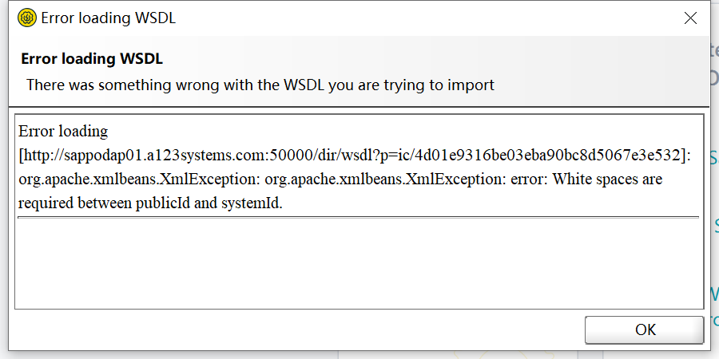
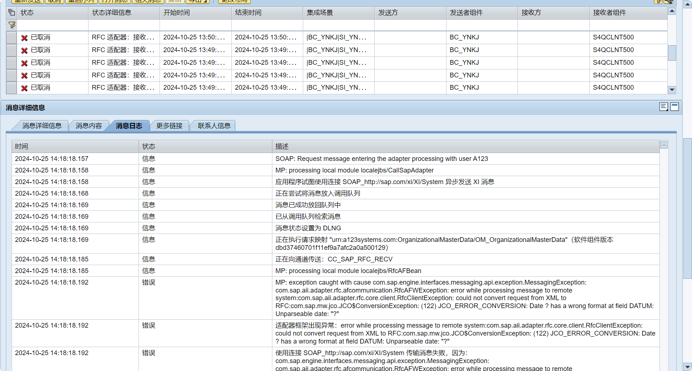
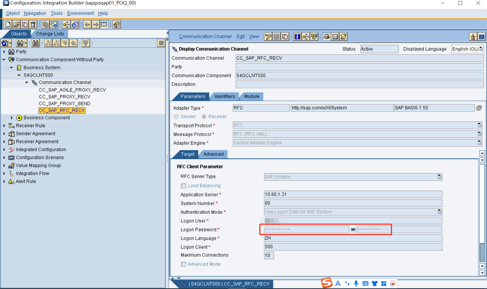
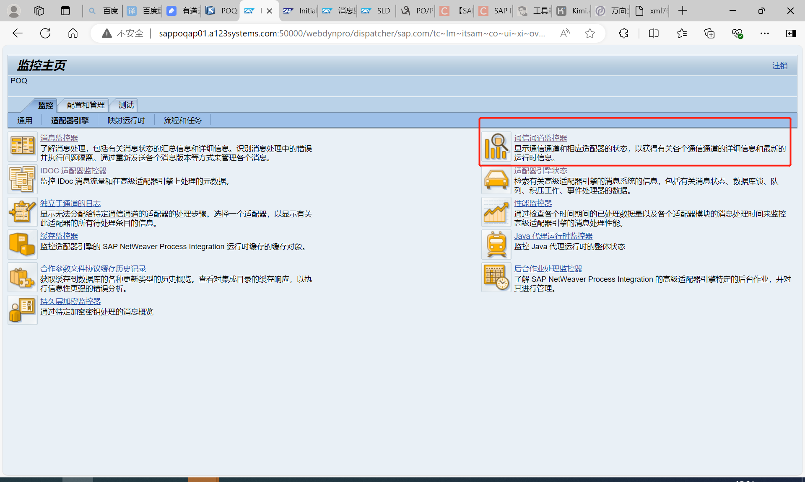
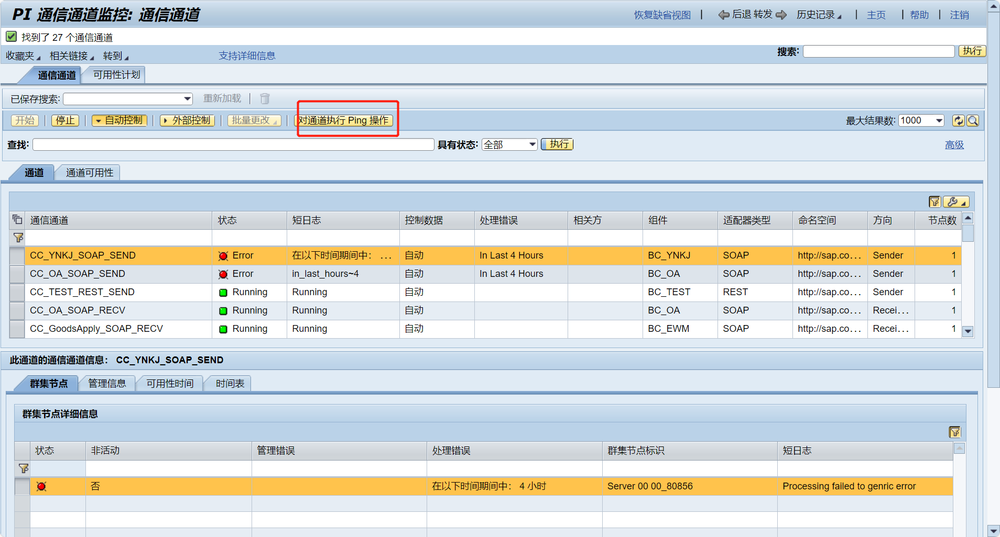
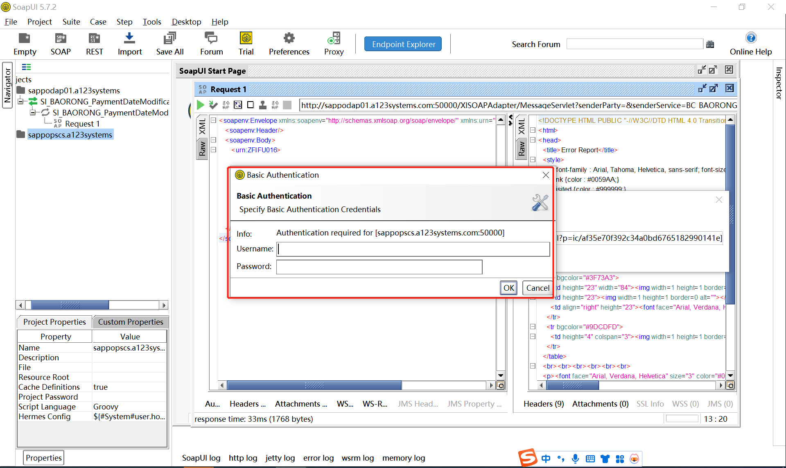
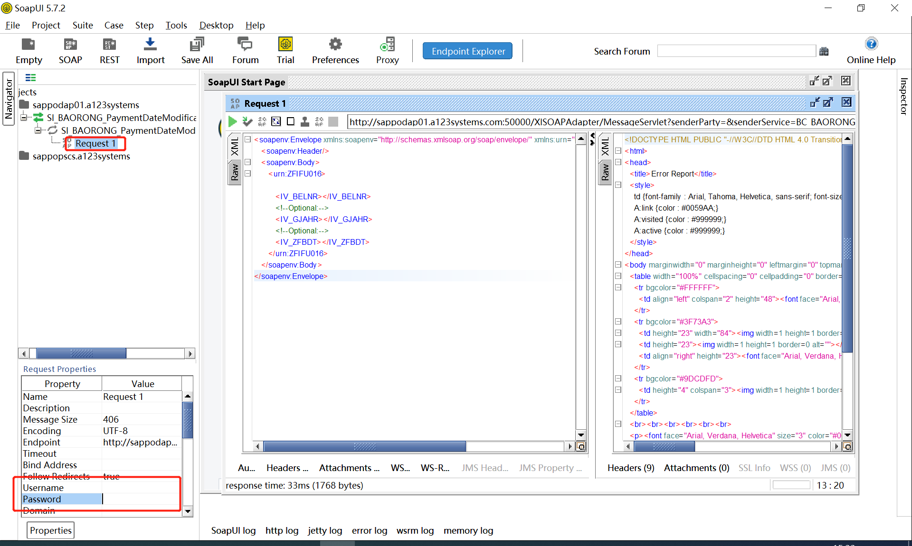
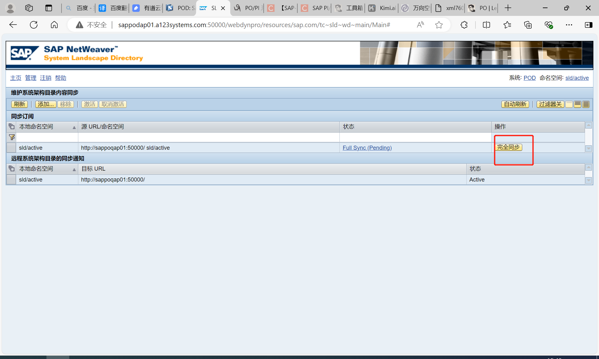
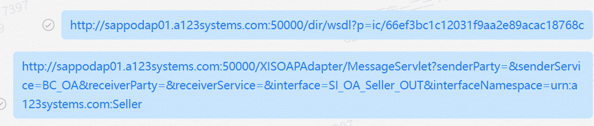

## 集成技术
SAP PO（SAP Process Orchestration）是一个集成平台，用于处理企业内部和外部系统之间的通信和数据交换。

<!-- more -->
# SAP PO中间件学习

## 新增外部系统->SAP接口
* 如果没有产品先去创建产品及产品组件
* 将产品组件分配到对应的技术系统
* PO端ESB配置:命名空间，SI,MM,OM等
* PO端IB配置:BS,BC,IC

## 注意
- 更改映射字段的时候，注意不要更改原有的functions转换。
- 需要建PO账号做登陆身份验证等

## 问题
### __1. 金额,字符串替代__
JCO_ERROR_CONVERSION:数字10780000.00不能在PREIS字段编码为长度为11、小数点后两位的BCD

字符串转换为11位然后有两位小数的金额
当10,100.00只有一个逗号可以成功，当有10,780,000.00 两个逗号时映射会失败
需要使用replaceString函数就行转换将,转换为空。

### __2. 账号未登录或者账号密码错误__
，或者HTTP/1.1 401 Unauthorized。

### __3. RFC 适配器：接收者处理错误 (RFC 适配器中存在接收者处理错误)__

RFC适配器的密码错误更新一下(SAP的账号密码)，可以在这里进行PING测试查看通道是否正常

SOAPUI中填的两次账号密码都是PO的账号不是SAP的账号密码。

### __4. 同步产品，技术系统等__

### __5. postman测试GET成功POST失败__
填写的url是webservice地址(postman里get成功，但post会报错405方法不允许)，post方法的地址需要是webservice里的普通的soap地址(saopui里输入webservice后生成的地址)。

## 参考资料
[waline 挂载域名二级地址](https://comment.yesuifeng.cc/)
[SAP PO 接口配置完整教程之一RFC服务发布](https://blog.csdn.net/XLevon/article/details/126773935?spm=1001.2101.3001.6650.7&utm_medium=distribute.pc_relevant.none-task-blog-2%7Edefault%7EBlogCommendFromBaidu%7ERate-7-126773935-blog-117328805.235%5Ev43%5Epc_blog_bottom_relevance_base6&depth_1-utm_source=distribute.pc_relevant.none-task-blog-2%7Edefault%7EBlogCommendFromBaidu%7ERate-7-126773935-blog-117328805.235%5Ev43%5Epc_blog_bottom_relevance_base6&utm_relevant_index=8)
[SAP PO 接口配置完整教程之二REST服务对接](https://blog.csdn.net/XLevon/article/details/126904513)
[PO/PI 系统蓝图(SLD),企业服务存储库(ESR),集成目录(ID)基础配置 - 女鬼的朋友 - 博客园 (cnblogs.com)](https://www.cnblogs.com/weixiaopeng/p/11888347.html)
[WSDL详解](https://blog.csdn.net/yhahaha_/article/details/93716263)
[PO 发布外围系统REST-＞SAP RFC同步接口](https://blog.csdn.net/qq_44826887/article/details/134922069)
[PO 发布SAP SProxy-＞外围系统 WebService](https://blog.csdn.net/qq_44826887/article/details/135170299)
[【SAP PO】X-DOC：SAP PO 接口配置完整教程之三REST服务发布&报文转换](https://blog.csdn.net/XLevon/article/details/129370475)
[SAP PO常用的基本组件介绍与创建](https://blog.csdn.net/JYH1999/article/details/108716107)
[下载SAP PO创建用户操作手册](/file/SapPoUserCreate.docx '下载文档')
