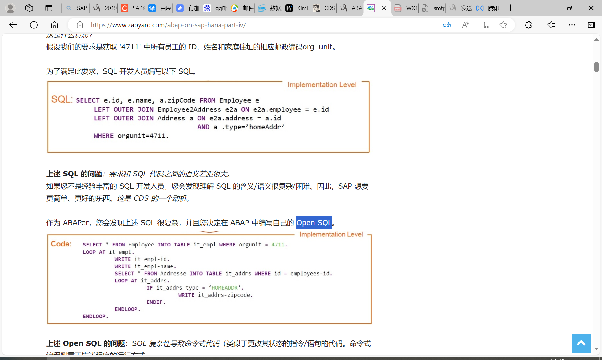

# CDS(Core data services核心数据服务)
https://www.zapyard.com/tutorials-on-core-data-services-cds/
核心数据服务是一种新的基础设施，用于在 SAP HANA 中定义和使用语义丰富的数据模型。
<!-- more -->
使用数据定义语言 （DDL）、查询语言 （QL） 和表达式语言 （EL），CDS 被设想为包含写入操作、事务语义、约束等。
CDS AMDP OpenSQL ODATA服务
* SQL 
* Open SQL
* CDS
## 简述
CDS分为ABAP CDS和HANA CDS两种类型。

## 事物代码

## 参考文献
<!-- <!-- [PO 发布外围系统REST-＞SAP RFC同步接口-Seele_1018](https://blog.csdn.net/qq_44826887/article/details/134922069) -->
[SAP Abap三种方法进行SAP ODATA数据服务发布](https://www.cnblogs.com/joeg/p/17722641.html)