# FICO运维
<!-- :::tip
::: -->
<!-- 摘要截止标签 -->
<!-- more -->

## 1.科目导入凭证报错(ZFIFU002)
BAPI:
BAPI_ACC_DOCUMENT_CHECK
BAPI_ACC_DOCUMENT_POST
表:
LFB1\KNB1
### 调节帐户*或快键*不允许
**凭证错误:BKPFF&S4PCLNT800调节帐户1122030000或快键11不允许**
调用bapi时出现，创建会计凭证
备选统驭科目没有配置客户的还是那个科目的主数据，两者都有可能的，因为也可以手工改看的
发现是客户的主数据统驭科目维护错误
可能11就是指客户？22指供应商？
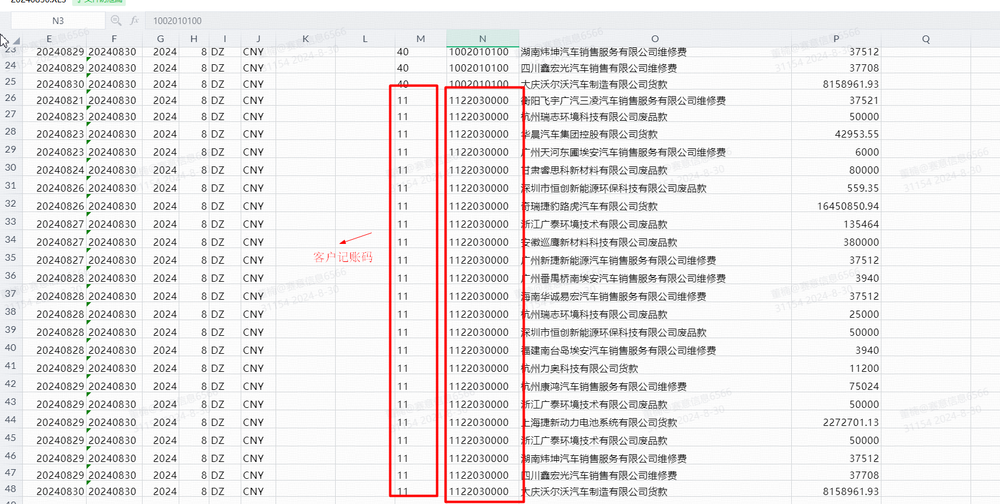
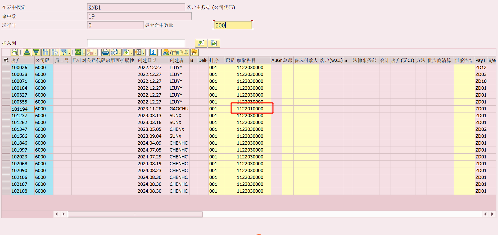
可以手工F-02建下凭证看下对应的科目是啥
[下载SAP FICO-如何添加备选统驭科目](/file/AlternativeUnifiedSubjects.pdf '下载文档')

**凭证错误:BKPFF&S4PCLNT800调节帐户2202030300或快键22不允许**
供应商既有既有经营类业务2202030100，又有投资类业务2202030200
事物代码：
S_ALR_87002480  更改视图“允许替换的调整账户”：概览(我猜这是总的)
OBYM 维护会计设置:特别总账 - 清单(我猜这是对对应的科目类型和特殊总账标志生效)
解决步骤：
1. 打开OBYM维护对应的备选统驭科目，传输配置
2. 重新创建会计凭证
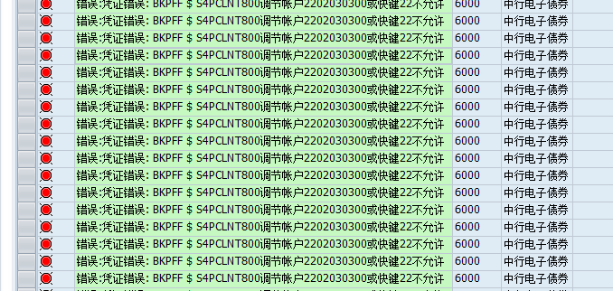
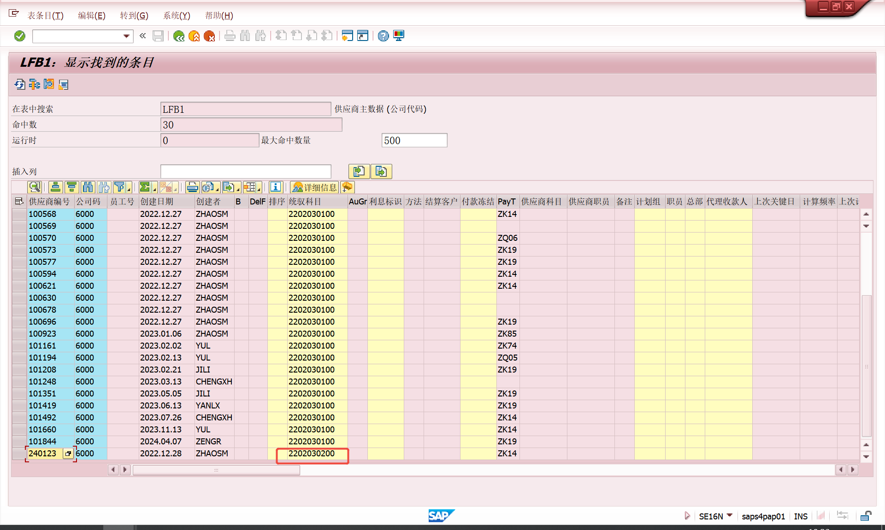
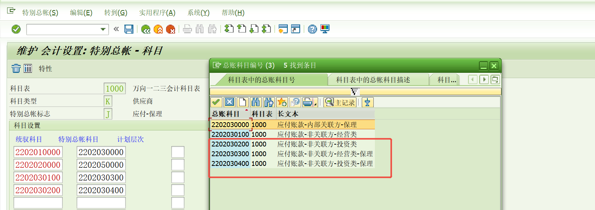
加一行2202030200   2202030300
## 2. 24年特殊期间记账，OB52和OKP1是打开的状态，资产（在建工程）
SAP AA 370 您不能过账到此固定资产;会计年度已关闭
S4好像不适用ECC的OAAR\OAAQ、AJRW、AJAB等事务代码。使用FAA_CMP、FAGLGVTR等。
报错：
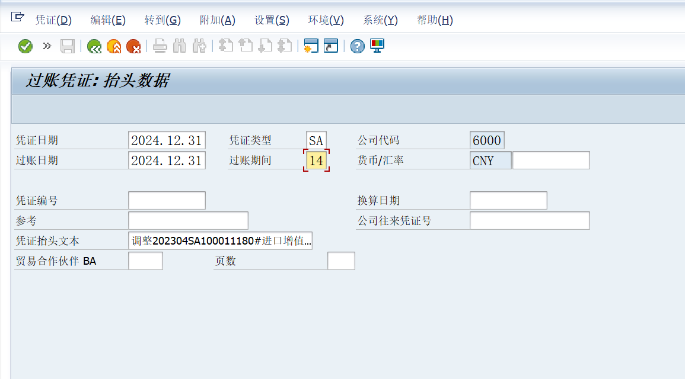
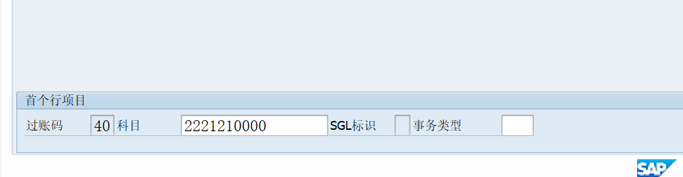
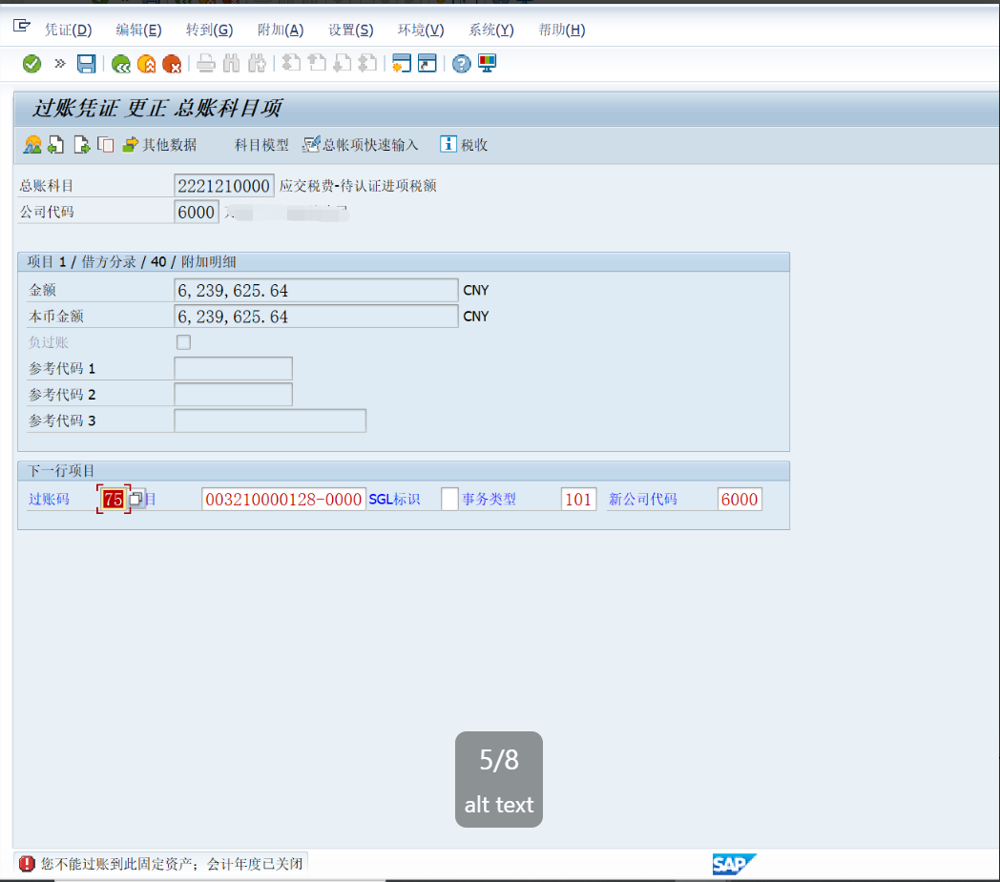

解决步骤：
1. 使用FAA_CMP打开前一年的资产会计核算年度
2. 因为这个资产不允许负记账，把负记账打开后再关上
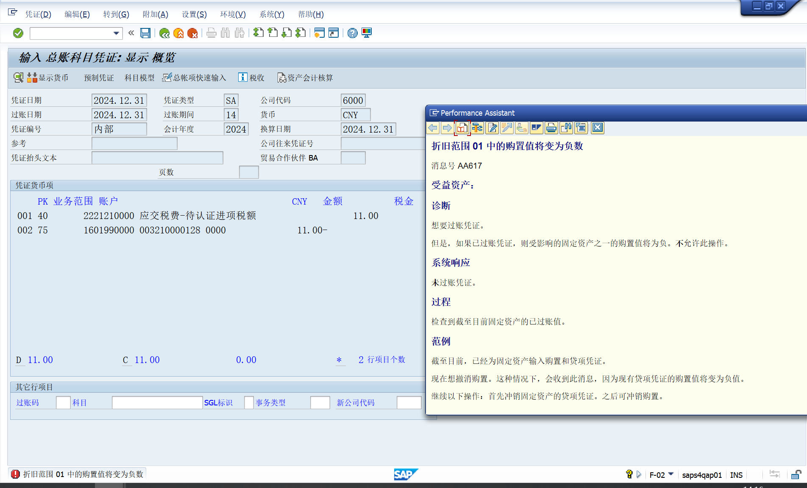
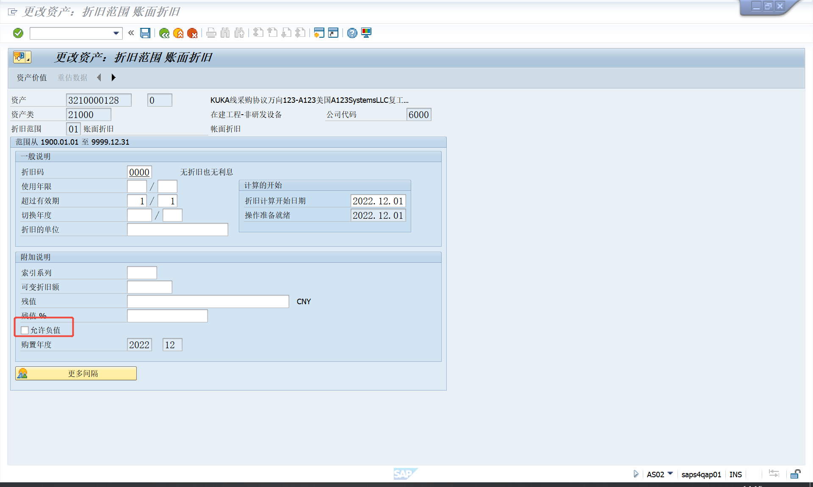
3. 成功做完凭证后使用FAA_CMP关闭前一年的资产会计核算年度
4. 执行FAGLGVTR余额转结后，使用FAGLB03查看总账科目余额，前年余额和今年年初金额。使用事务代码 FAGLB03 查看科目余额是否已成功结转到新年度。确保资产负债表科目和损益科目的余额已正确结转
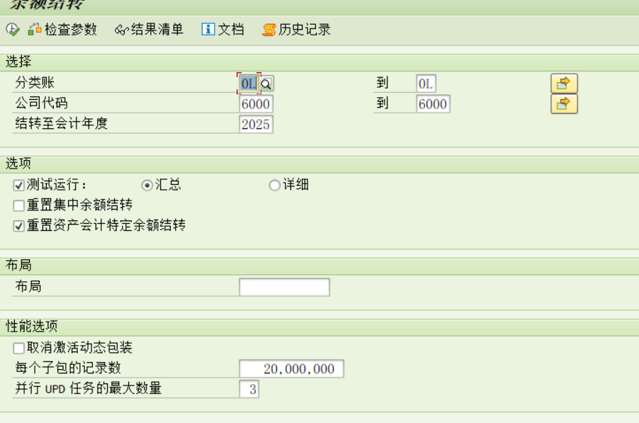
[财务年结步骤-万里潮涌](http://www.360doc.com/content/24/0110/20/78825344_1110631402.shtml)
