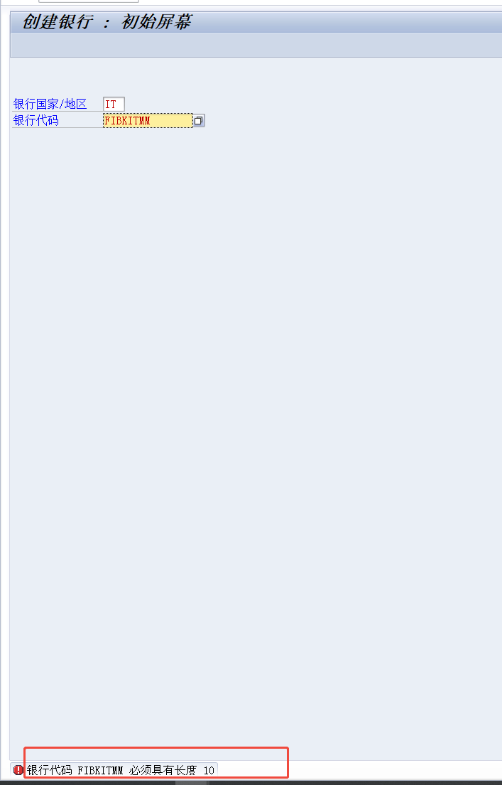

# FICO运维
<!-- :::tip
::: -->
<!-- 摘要截止标签 -->
<!-- more -->

## 1. F5 788科目导入凭证报错(ZFIFU002) 调节帐户或快键不允许
| BAPI | BAPI描述 |
|----------|----------|
| BAPI_ACC_DOCUMENT_CHECK | Accounting: Check |
| BAPI_ACC_DOCUMENT_POST | Accounting: Posting |

| 表 | 表描述 |
|----------|----------|
| LFB1 | 供应商主数据 (公司代码) |
| KNB1 | 客户主数据 (公司代码) |

**凭证错误:BKPFF&S4PCLNT800调节帐户1122030000或快键11不允许**
调用bapi时出现，创建会计凭证
备选统驭科目没有配置客户的还是那个科目的主数据，两者都有可能的，因为也可以手工改看的
发现是客户的主数据统驭科目维护错误
可能11就是指客户？22指供应商？

可以手工F-02建下凭证看下对应的科目是啥
[下载SAP FICO-如何添加备选统驭科目](/file/AlternativeUnifiedSubjects.pdf '下载文档')

**凭证错误:BKPFF&S4PCLNT800调节帐户2202030300或快键22不允许**
供应商既有既有经营类业务2202030100，又有投资类业务2202030200
事物代码：
S_ALR_87002480  更改视图“允许替换的调整账户”：概览(我猜这是总的)
OBYM 维护会计设置:特别总账 - 清单(我猜这是对对应的科目类型和特殊总账标志生效)
解决步骤：
1. 打开OBYM维护对应的备选统驭科目，传输配置
2. 重新创建会计凭证

加一行2202030200   2202030300
## 2. 24年特殊期间记账，OB52和OKP1是打开的状态，资产（在建工程）
SAP AA 370 您不能过账到此固定资产;会计年度已关闭
S4好像不适用ECC的OAAR\OAAQ、AJRW、AJAB等事务代码。使用FAA_CMP、FAGLGVTR等。
报错：

解决步骤：
1. 使用FAA_CMP打开前一年的资产会计核算年度
2. 因为这个资产不允许负记账，把负记账打开后再关上

3. 成功做完凭证后使用FAA_CMP关闭前一年的资产会计核算年度
4. 执行FAGLGVTR余额转结后，使用FAGLB03查看总账科目余额，前年余额和今年年初金额。使用事务代码 FAGLB03 查看科目余额是否已成功结转到新年度。确保资产负债表科目和损益科目的余额已正确结转

[财务年结步骤-万里潮涌](http://www.360doc.com/content/24/0110/20/78825344_1110631402.shtml)

## 3. FAGLF101 重分类点了两次导致应收应付科目余额变2倍
FAGLF101 资产负债表附录-未清项-分析

和往来账有关，应收应付预收预付
解决步骤：
手工冲销，注意本期和下期两个期间的凭证都要冲销
重分类分别批量冲销F-08。

SAP事务码FAGLF101用于应收应付重分类，其主要功能和用途如下：
功能
* 应收应付重分类：将“应收账款”的贷方余额和“应付账款”的借方余额分别调整至“预收账款”和“预付账款”账户中。
* 财务报表调整：使资产负债表能够真实反映资产和负债的情况。
用途
* 调整财务报表：确保财务报表的准确性和合规性。
* 优化财务管理：通过重分类操作，企业可以更好地管理其应收应付账款，提高财务管理的效率和准确性。
操作流程
1. 清账操作：在执行FAGLF101之前，通常需要先进行GR/IR科目的清账（事务码F.13），以确保数据的准确性。
2. 配置科目：在OBBU中配置应收应付重分类的相关科目，包括统驭科目、调整科目和目标科目。
3. 执行重分类：通过FAGLF101事务码执行重分类操作，系统会根据配置自动生成会计凭证。
4. 冲回操作：在下月初，系统会自动冲回上月末的重分类凭证。
对财务报表的影响
真实反映资产和负债：通过将不符合常规的余额调整到正确的科目，使资产负债表能够真实反映企业的财务状况。
符合会计准则：确保财务报表符合相关会计准则和法规要求。

把供应商科目(应付账款)金额为借方的金额重分类掉。负债类会计科目遵循 “贷方记增加，借方记减少” 的记账规则，贷方科目余额减少，表示债务的清偿。应付账款的正常余额是在贷方，应付账款是一种负债。
做一笔下个月初的重分类CR预付账款-重分类，DR应付账款-重分类。
做一笔这个月的      DR预付账款-重分类，CR应付账款-重分类。

## 4. FI01 SAP AR 102 银行代码 FIBKITMM 必须具有长度 10

[王小磊](https://blog.csdn.net/wangjolly/article/details/107917294)
配置事务代码 OY17

要取消勾选银行数据检查，不然报错SAP 银行帐号或银行编号不是有效长度 AR 212

[Bank account number length Error: AR212](https://community.sap.com/t5/enterprise-resource-planning-q-a/bank-account-number-length-error-ar212/qaq-p/11648664)

## 5.预留物料移动生成的会计凭证的职能范围/功能范围错误
凭证的职能范围是5301而不是制造费用（3000）。这两个凭证是预留领料生成的，预留的成本中心里我看是3000

出现原因还未知，成本中心里没改过职能范围，这个预留的职能范围只能取成本中心啊，很奇怪
损益科目或成本要素可以分配功能范围，而成本中心也可以分配功能范围，优先级-科目层次的功能范围优先级高于成本中心上的功能范围。
表：预留RKPF RESB(这里的职能范围就错了)
事物代码:MB23,MB51,FB03

解决步骤：
1. 重新手工做了张凭证，手工把功能范围错的科目通过一借一贷不同成本中心(职能范围分别为5301和3000)使公司费用明细表正确。

[优先级SAP之成本中心类型与功能范围-SAP剑客](https://saper.blog.csdn.net/article/details/47146213?spm=1001.2101.3001.6650.2&utm_medium=distribute.pc_relevant.none-task-blog-2%7Edefault%7EBlogCommendFromBaidu%7ERate-2-47146213-blog-108724576.235%5Ev43%5Epc_blog_bottom_relevance_base5&depth_1-utm_source=distribute.pc_relevant.none-task-blog-2%7Edefault%7EBlogCommendFromBaidu%7ERate-2-47146213-blog-108724576.235%5Ev43%5Epc_blog_bottom_relevance_base5&utm_relevant_index=3)

## 6. CKM3 消耗 价格差异 拆解工单 未分配
拆解工单的物料的价格差异没有分配给工单到了未分配。
事物代码:FB03,CO03,COOIS,CKM3(N)
表:MBEW(H),MLDOC,MLDOCCCS,CKMLCR

正确应该是这样滴

现在是这样滴

正确的那个差异是跑物料分类账跑出来的，产出数量成本估算是对应的物料
我猜是这里的原因

问题外思考/猜想[不一定对]:
* 物料的移动平均价根据其他物料的标准价格收货消耗报工等来，拆解工单的实际值等于工单投料物料的标准成本，可以拆解成料工费。实际值影响物料的移动平均价，价格差异由移动平均价和标准价格不一致产生。一般来说在哪个业务里差异就在哪里(收货，消耗)
* 如果是多层，1,2,3，层，3是最底层。2的实际值是根据3的标准价格来吗？那1的实际值是根据2的实际值还是2的标准价格嘞？
1的实际值根据2的实际值来的，但是分两部分   工单按照标准价还原的   ckmlcp按照材差还原的  两个加起来才是实际值
* CKM3和库存价值等只和成本有关，利润在在财务报表里或者获利分析。
利润的话会根据比如销售订单和库存价值进去一个利润科目啥的？还是根据实际银行收款？
根据开票
比如开票50块，经协商付49块，也付了，大家也都同意了这种怎么处理？重新开票吗？
开红字票，或者调账

[物料分类账 CKM3详解-SAP小白kenny](https://blog.csdn.net/weixin_42646630/article/details/111171368)
[物料分类帐不包括 not allocated/未分配 not distributed-canc3r](https://blog.itpub.net/11782589/viewspace-686934/)
[入库方向未分摊未分配](https://www.sohu.com/a/740316586_121151301)
[SAP物料账未分摊&未分配差异详解-ERP讲堂](https://zhuanlan.zhihu.com/p/689553535)
[SAP物料账未分摊差异分析-SAP财会人](https://zhuanlan.zhihu.com/p/106674501)

## *7. 某个客户FBL5N - 客户行项目 应收账款余额和 IDCNAR - 应收账龄报表（中国） 的余额不一致
情况说明:去年12月的对得上，今年1月就对不上了。
有个凭证里总账货币不一致。可能是清账的时候，把不同币种的一起清了。按理说一个凭证只会清账同一种货币。

事物代码：
fbl5n客户行项目显示
idcnar应收账款账龄报表
fd10n客户余额显示

解决方法:
1. 冲销了之前的清账凭证，但因为冲销过账日期在当月。等待月底重分类之后看看问题是否解决。