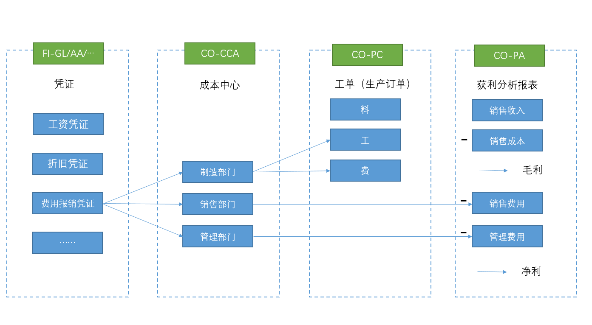
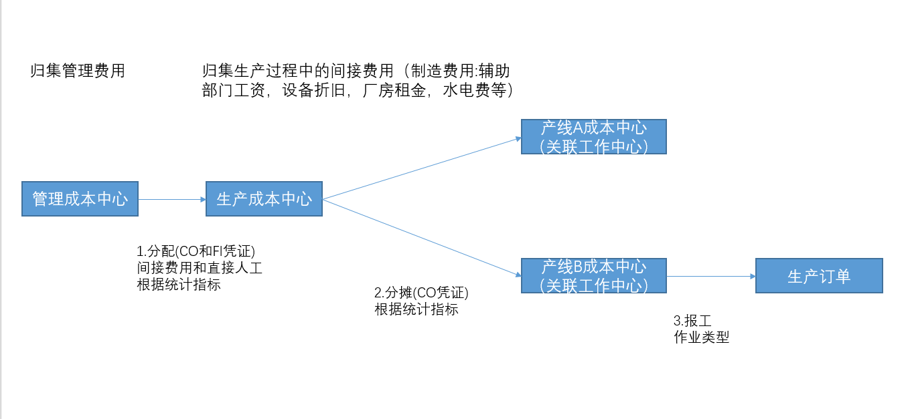

# Controlling-Cost Center Accounting    控制-成本中心会计
<!-- :::tip
::: -->
<!-- 摘要截止标签 -->
<!-- more -->

## 1. 成本中心

成本中心是企业用来核算费用的最小组织单元，相当于企业的部门，如财务部、装配车间等。
成本中心是对成本中心的费用进行计划、记账、拆分(分配或分摊)及分析。
成本中心会计模块的基本功能包括:主数据维护、成本中心计划、成本中心实际过账、月末操作等。

分配 根据统计关键指数里和分配的段里的接收方的一致，按统计比例分配发送方的费用。

辅助生产部门的所有费用通过分配转到到生产部门成本中心(制造工程部->一厂   之后是后续领料投料啥的产生的   ->一厂产线->工单->销售成本/收入)
管理部门费用直接计入管理费用

下面那个有问题；公司不规范

直接人工应该直接记在生产性成本中心，间接费用按照分配分摊从辅助性成本中心转到生产性成本中心。
| 维度          | **分摊（Assessment）** | **分配（Distribution）**       |
| ----------- | ------------------ | -------------------------- |
| **是否用统计指标** |  **必须用**（如人数、面积）  |  **不一定**，可用**固定百分比、追踪因子** |
| **费用是否打包**  |  **打包**（不保留原始科目）  |  **明细**（保留工资、水电等原始科目）     |
| **速度**      | 快（批量处理）            | 慢（逐笔）                      |
| **月结推荐度**   | ⭐⭐⭐⭐⭐（KSV5）        | ⭐⭐（KSU5，仅特殊场景）             |

分配初级成本要素->初级成本要素
分摊初级成本要素->次级成本要素

成本归集流程
直接材料：
领料时直接计入工单（真正的直接计入）
直接人工：
第一步：工资费用先归集到人力资源成本中心
第二步：通过作业类型（如"人工工时"）和作业价格进行分配
第三步：报工时记录工时消耗量，系统自动计算：作业价格 × 报工工时 → 计入工单成本
制造费用：
归集在生产性成本中心 → 通过作业类型分配到工单

## 损益类科目：
损益类科目（如收入、费用、成本等）主要用于记录企业在一定时期内的经营成果，即收入和费用的增减变动。
这些科目的余额在会计期末会结转到利润表（损益类报表）中，用于计算企业的净利润。
损益类报表（利润表）：是企业财务报表的重要组成部分，反映了企业在一定时期内的经营成果。它通过汇总损益类科目的数据，展示企业的收入、费用和利润情况。

### 成本要素类别
如果损益类科目有成本要素类别，那么它通常会与成本中心或利润中心有关，用于成本核算和利润分析。这些科目可以通过成本要素在成本中心或利润中心中进行核算和管理。
例如：
管理费用（初级成本要素）：可能分配到管理成本中心。
销售收入（次级成本要素）：可能分配到销售利润中心。
损益类科目与损益类报表：
所有损益类科目（无论是否与成本中心或利润中心关联）最终都会进入损益类报表（利润表）。
损益类报表通过汇总这些科目的数据，计算企业的净利润。

## 初级成本要素与次级成本要素
成本要素反应成本的属性(差旅费、办公费、还是某部门费用的分摊等)
初级成本要素：
直接从FI模块过账到CO模块。
与总账科目直接关联，余额直接反映在总账中。
用于记录实际发生的费用，归集到成本中心。
01：费用类初级成本要素（用于记录费用）
11：收入类初级成本要素（用于记录收入）
22：外部结算类初级成本要素（用于跨模块结算）

次级成本要素：
在CO模块内部使用，用于费用分配、分摊或结算。
不直接与总账科目关联，余额不会直接进入总账。
用于在成本中心或利润中心之间进行费用的内部处理。
次级成本要素的余额变化：在CO模块中，次级成本要素的余额会发生变化，归属的成本中心也会发生变化。
总账的反映：总账模块不会直接反映次级成本要素的余额变化，但分配和分摊的结果会通过初级成本要素间接影响总账。

