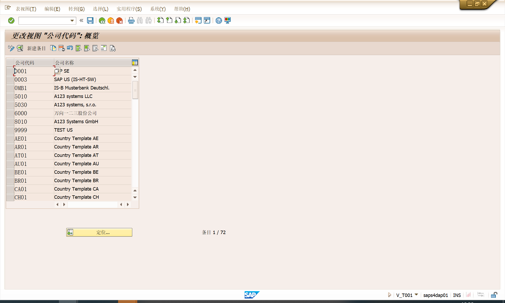
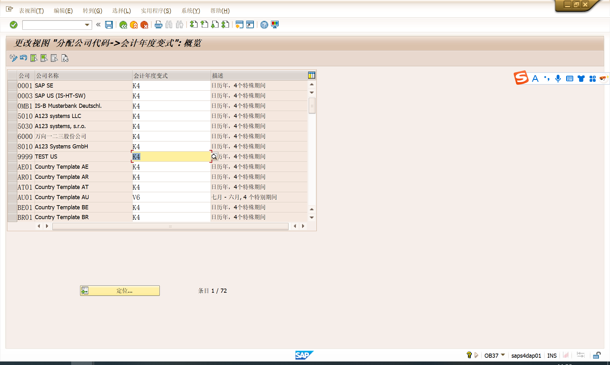
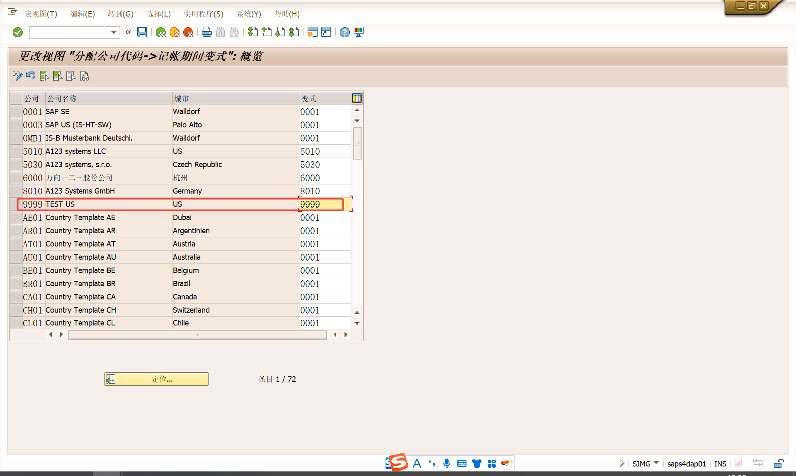
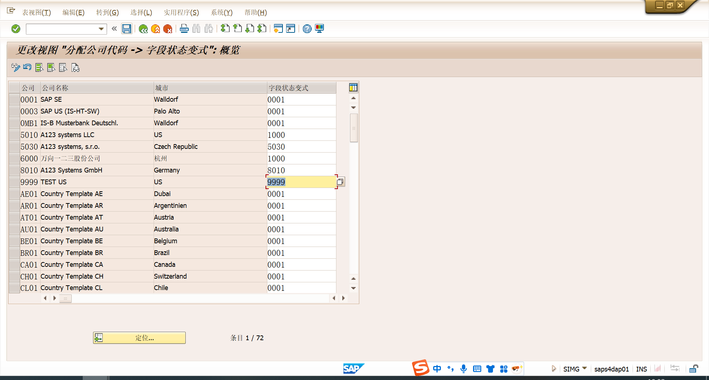
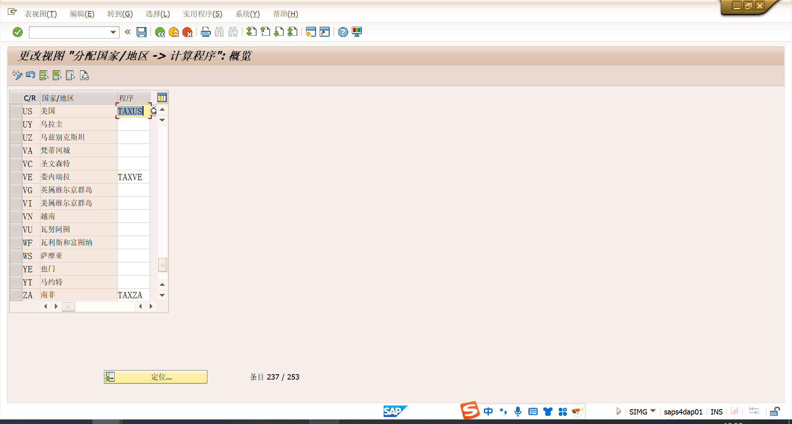

# 海外SAP推广FI配置
<!-- :::tip
::: -->
<!-- 摘要截止标签 -->
<!-- more -->

## 1. 进入配置后台
| 配置路径 |  |
| ----- | ---- |
| 事务代码 | SPRO |
| 要求传输 | :heavy_check_mark: Yes  :x: No |

## 2. 企业结构

### 2.1 定义公司
| 配置路径 | IMG>企业结构>定义>财务会计>定义公司  |
| ----- | ---- |
| 事务代码 |  |
| 要求传输 | :heavy_check_mark: Yes  :x: No |

### 2.2	编辑公司代码数据 
| 配置路径 | IMG>企业结构>定义>财务会计>编辑,复制,删除,检查公司代码>编辑公司代码数据  |
| ----- | ---- |
| 事务代码 |  |
| 要求传输 | :heavy_check_mark: Yes  :x: No |

### 2.3	给公司分配公司代码 
| 配置路径 | IMG>企业结构>分配>财务会计>给公司分配公司代码  |
| ----- | ---- |
| 事务代码 |  |
| 要求传输 | :heavy_check_mark: Yes  :x: No |

## 3. 财务会计全局设置
### 3.1 定义功能范围
| 配置路径 | IMG>企业结构>定义>财务会计>定义功能范围  |
| ----- | ---- |
| 事务代码 |  |
| 要求传输 | :heavy_check_mark: Yes  :x: No |

### 3.2 激活销售会计核算的成本
| 配置路径 | IMG>财务会计>财务会计全局设置>销售核算成本的功能范围>为准备激活销售会计核算的成本  |
| ----- | ---- |
| 事务代码 |  |
| 要求传输 | :heavy_check_mark: Yes  :x: No |

### 3.3 在成本中心类别中输入功能范围
| 配置路径 | IMG>财务会计>财务会计全局设置>销售核算成本的功能范围>输入功能范围>在成本中心类别中输入功能范围  |
| ----- | ---- |
| 事务代码 | OVT0 |
| 要求传输 | :heavy_check_mark: Yes  :x: No |

### 3.4	定义会计年度变式
| 配置路径 | IMG>财务会计>财务会计全局设置>分类帐>会计年度和过帐期间>维护会计年度变式(维护缩短的会计年度)  |
| ----- | ---- |
| 事务代码 | OB29 |
| 要求传输 | :x: Yes   :heavy_check_mark: No |

### 3.5	分配会计年度变式给公司代码
| 配置路径 | IIMG>财务会计>财务会计全局设置>分类帐>会计年度和过帐期间>向一个会计年度变式分配公司代码  |
| ----- | ---- |
| 事务代码 | OB37 |
| 要求传输 | :heavy_check_mark: Yes  :x: No |

### 3.6	定义过帐期间变式
| 配置路径 | IMG>财务会计>财务会计全局设置>分类帐>会计年度和过帐期间>记帐期间>定义未结清过帐期间变式  |
| ----- | ---- |
| 事务代码 |  |
| 要求传输 | :heavy_check_mark: Yes  :x: No |

### 3.7	分配过帐期间变式
| 配置路径 | IMG>财务会计>财务会计全局设置>分类帐>会计年度和过帐期间>记帐期间>将变式分配给公司代码  |
| ----- | ---- |
| 事务代码 |  |
| 要求传输 | :heavy_check_mark: Yes  :x: No |

### 3.8	维护过帐期间变式
| 配置路径 | IMG>财务会计>财务会计全局设置>分类帐>会计年度和过帐期间>记帐期间>打开和关闭过帐期间  |
| ----- | ---- |
| 事务代码 | OB52 |
| 要求传输 | :heavy_check_mark: Yes  :x: No |

正常年度都是当年，测试环境懒得一次次改放宽时间，方便测试

### 3.9	定义字段状态变式
| 配置路径 | IMG>财务会计>财务会计全局设置>分类帐>字段>定义字段状态变式  |
| ----- | ---- |
| 事务代码 | OBC4 |
| 要求传输 | :heavy_check_mark: Yes  :x: No |

屏幕字段是否显示，必填可选等控制

### 3.10	向字段状态变式分配公司代码
| 配置路径 | IMG>财务会计>财务会计全局设置>分类帐>字段>向字段状态变式分配公司代码  |
| ----- | ---- |
| 事务代码 |  |
| 要求传输 | :heavy_check_mark: Yes  :x: No |

### 3.11	输入公司代码的全球参数(会计科目表配置后换图)
| 配置路径 | IMG>财务会计>财务会计全局设置>分类帐>字段>向字段状态变式分配公司代码  |
| ----- | ---- |
| 事务代码 |  |
| 要求传输 | :heavy_check_mark: Yes  :x: No |

### 3.12	将公司代码设置成生产性的
| 配置路径 | IMG>财务会计>财务会计全局设置>公司代码的全球参数>将公司代码设置成生产性的  |
| ----- | ---- |
| 事务代码 |  |
| 要求传输 | :heavy_check_mark: Yes  :x: No |

为什么不勾？

### 3.13	定义条目视图的凭证编号范围（需要到测试机&生成机手工配置）
| 配置路径 | IMG>财务会计>财务会计全局设置>凭证>凭证号范围>条目视图中的凭证>定义条目视图的凭证编号范围  |
| ----- | ---- |
| 事务代码 | FBN1 |
| 要求传输 | :heavy_check_mark: Yes  :x: No |

### 3.14	定义雇员的容差组
| 配置路径 | IMG>财务会计>财务会计全局设置>凭证>容差组>定义雇员的容差组  |
| ----- | ---- |
| 事务代码 | FBN1 |
| 要求传输 | :heavy_check_mark: Yes  :x: No |

### 3.15	向计算程序分配国家
| 配置路径 | IMG>财务会计>财务会计全局设置>销售/购置税>基本设置>向计算程序分配国家  |
| ----- | ---- |
| 事务代码 |  |
| 要求传输 | :heavy_check_mark: Yes  :x: No |

### 3.16	定义销售/采购税代码-未配置(没有传输,需要手工在测试、生成机配置)
| 配置路径 | IMG>财务会计>财务会计全局设置>销售/购置税>计算>定义销售/采购税代码  |
| ----- | ---- |
| 事务代码 | FTXP |
| 要求传输 | :heavy_check_mark: Yes  :x: No |

### 3.17	定义税务科目（没有传输，需要手动在系统增加）
| 配置路径 | IMG>财务会计>财务会计全局设置>销售/购置税>计算>定义销售/采购税代码  |
| ----- | ---- |
| 事务代码 |  |
| 要求传输 | :heavy_check_mark: Yes  :x: No |

### 3.18	为非征税事务分配税务代码
| 配置路径 | IMG>财务会计>财务会计全局设置>销售/购置税>过帐>为非征税事务分配税务代码  |
| ----- | ---- |
| 事务代码 | OBCL |
| 要求传输 | :heavy_check_mark: Yes  :x: No |

### 3.19	确定自定义货币
| 配置路径 | IMG>跨应用组件>欧洲货币联盟：欧元>处理货币阶段的函数和设置>确定自定义货币  |
| ----- | ---- |
| 事务代码 | EWCF |
| 要求传输 | :heavy_check_mark: Yes  :x: No |

### 3.20	检查货币代码
| 配置路径 | IMG>SAP NetWeaver>常规设置>货币>检查货币代码  |
| ----- | ---- |
| 事务代码 |  |
| 要求传输 | :heavy_check_mark: Yes  :x: No |

### 3.21	定义标准汇率报价
| 配置路径 | IMG>SAP NetWeaver>常规设置>货币>定义标准汇率报价  |
| ----- | ---- |
| 事务代码 | ONOT |
| 要求传输 | :heavy_check_mark: Yes  :x: No |

### 3.22	检查汇率类型
| 配置路径 | IMG>SAP NetWeaver>常规设置>货币>检查汇率类型  |
| ----- | ---- |
| 事务代码 |  |
| 要求传输 | :heavy_check_mark: Yes  :x: No |

### 3.23	定义货币换算的换算率
| 配置路径 | IMG>SAP NetWeaver>常规设置>货币>定义货币换算的换算率  |
| ----- | ---- |
| 事务代码 |  |
| 要求传输 | :heavy_check_mark: Yes  :x: No |

### 3.24	定义现金流量表原因代码-未配置
| 配置路径 | IMG>财务会计>应收账款和应付账款>业务交易>付款>手动付款>超收/欠收>定义原因代码手工对外支付|
| ----- | ---- |
| 事务代码 | OBBE |
| 要求传输 | :heavy_check_mark: Yes  :x: No |

## 4.	总帐会计核算

### 4.1	编辑科目表清单
| 配置路径 | IMG>财务会计>总帐会计>主数据>总帐科目>准备>编辑科目表清单|
| ----- | ---- |
| 事务代码 | OB13 |
| 要求传输 | :heavy_check_mark: Yes  :x: No |

