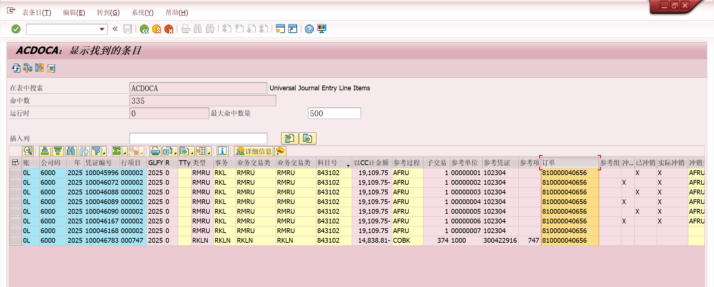
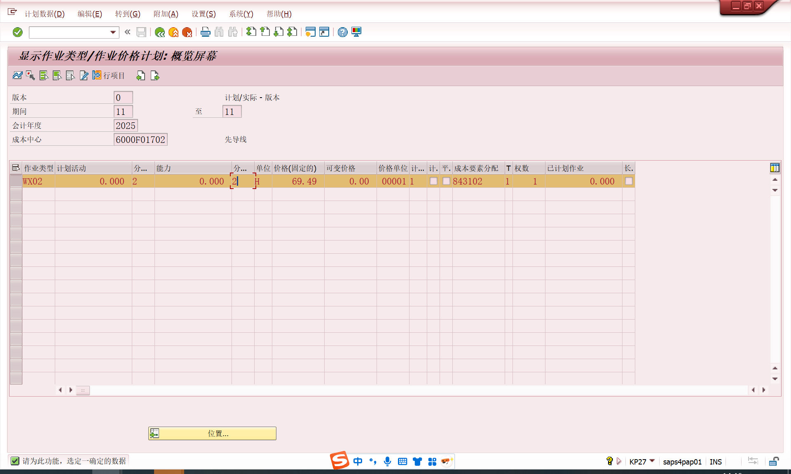

# 工单作业类型价格
<!-- more -->
## 相关事务代码和后台表
- OKZ3 生产订单成本估算的缺省值事务码配置
- CO03 显示生产订单
- KP27 显示作业类型/作业价格计划
- OKKN 显示视图"成本核算变式"物料成本估算（CK11N/CK40N）物料主数据（更新标准价格）
- OPL1 显示视图"成本核算变式"生产订单的计划成本与实际成本计算生产订单（不更新物料价格）
- FB03 显示财务会计凭证
- MM03/CK13N 查看物料价格相关
- S_ALR_87013611 成本中心：实际/计划/差异

ACDOCA

## 工单作业类型价格

生产订单计划成本和实际成本的计算逻辑取决于成本核算变式
生产订单成本估算的缺省值事务码配置-OKZ3

产品的标准成本计算和发布完成后，就可以在SAP软件中创建生产订单了，通过CO01创建，创建生产订单或下达后(由配置决定计算的时间节点)，系统会自动计算出生产订单计划成本，当生产订单有发料或报工后，系统立即更新这生产订单的实际成本，当生产订单有产出时，系统会计算这生产订单的目标成本，注意目标成本只有有产出时才能计算，它的实际数量是指收货到仓库的数量。
工单实际生产数量是530，实际人工报工工时是275
工单工序的标准值是每600个，374工时，所以目标成本 = 374 / 600 * 530 * 69.49=22957.17
实际成本的生产成本中心的总人工费/总人工工时*该工单工时
工单的实际成本 = 130846.16 / 8425 * 275=4270.94

ACDOCA中CO凭证的明细：
RKL实际内部成本分配 = 报工工时 * 计划作业价格 = 275 * 69.49 = 19109.75
RKLN重新评估实际价格 = ( 实际价格 - 计划作业价格 ) * 报工工时 = ( 130846.16/8425 - 69.49 ) * 275
= ( 15.53 - 69.49 ) * 275 = -14838.81
19109.75 - 14838.81 = 4270.94

以作业类型人工工时为例

## 参考文献
[SAP CO生产订单的标准成本、计划成本、实际成本和目标成本](https://blog.csdn.net/linda_yanzi/article/details/125703574)
[SAP财务月结](https://zhuanlan.zhihu.com/p/109274142)