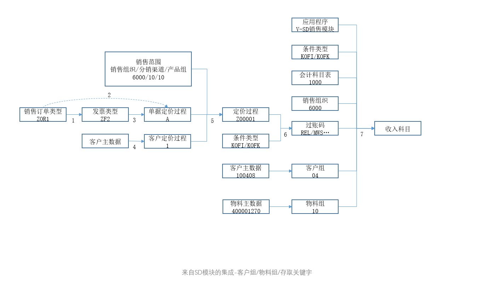
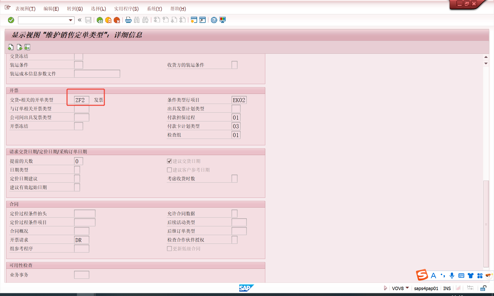
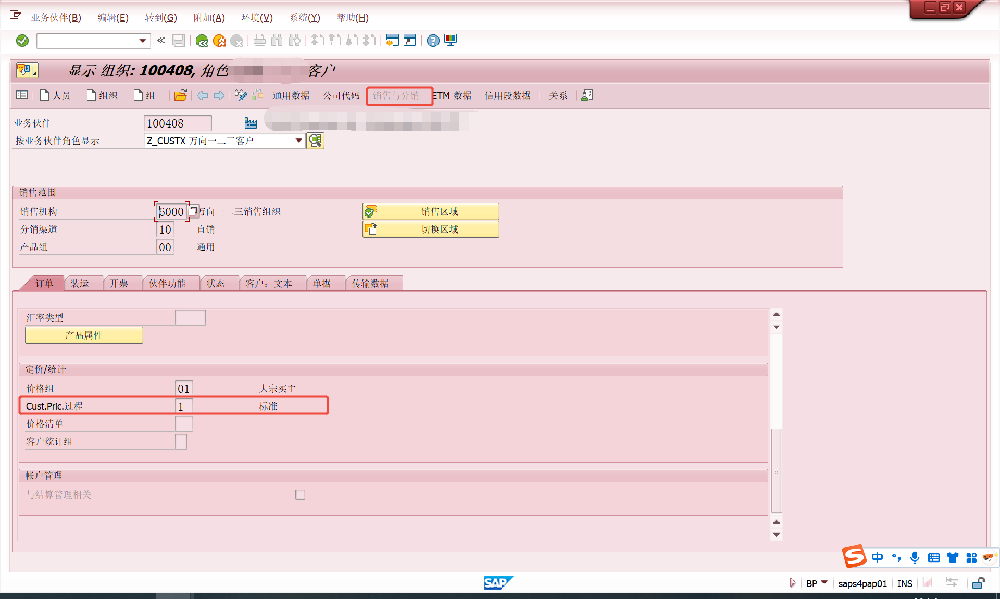
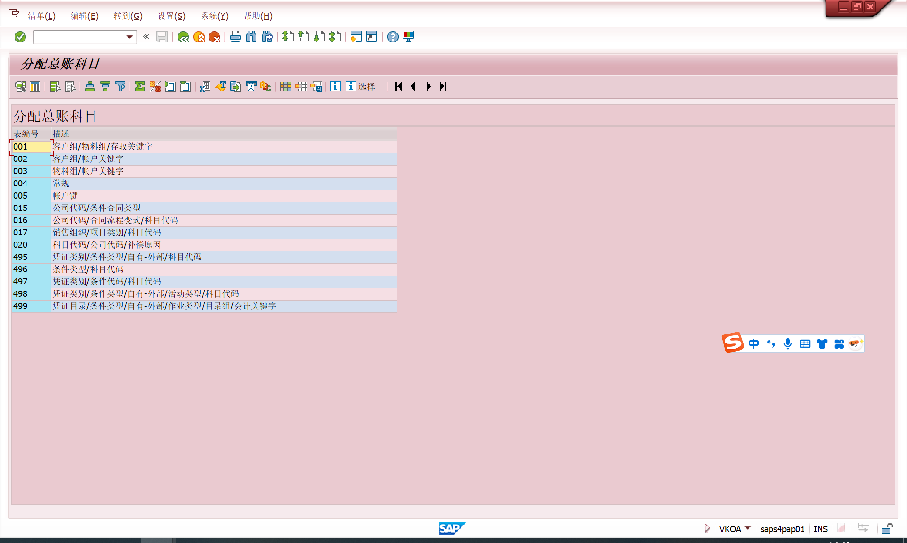
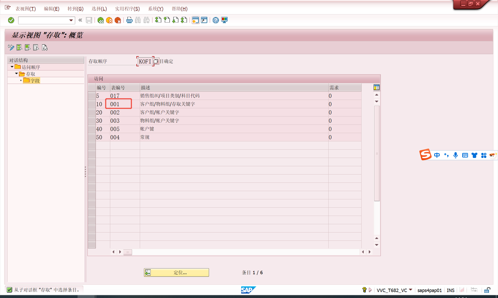

# 来自SD模块的集成-客户组/物料组/存取关键字
<!-- more -->
## 收入科目确定过程图

### ==VA03==-销售订单类型ZOR1

### 1.销售订单类型决定发票类型
销售与分销->销售->销售凭证->销售凭证抬头->定义销售凭证类型
==VOV8==-与交货相关的开票类型（发票类型ZF2）ZOR1->ZF2

### 2.由销售订单类型决定单据定价过程
销售与分销->基本功能->定价->定价控制->定义并分配定价过程->将凭证定价程序分配到订单类型
==OVKJ==-ZOR1->A标准

### 3.由发票类型决定单据定价过程
销售与分销->基本功能->定价->定价控制->定义并分配定价过程->将凭证定价程序分配到开票类型
==SM30==（表/视图V_TVFK_PR）-ZF2->空

### 4.由客户主数据决定客户定价过程
==BP==-100408客户销售视图->1标准客户定价过程

### 5.由销售范围、单据和客户定价过程决定定价过程
销售与分销->基本功能->定价->定价控制->定义并分配定价过程->设置定价程序确定
==OVKK==-6000	10	10	A	1 ->  Z00001

### 6.由定价过程和条件类型决定过账码
销售与分销->基本功能->科目分配/成本->收入账户确定->定义并分配科目代码->分配科目代码
==SM30==表/视图VV_T683S_EL_VA
Z00001->ERL收入,ZYF运费帐码(自建),MWS销售/采购税，ERS销售扣减

### 7.由应用程序，条件类型，账表，销售组织，账码，客户组，物料组确定总账科目
销售与分销->基本功能->科目分配/成本->分配总账科目
==VKOA==

### 客户组、物料组、条件类型等
条件类型，如果不将销售订单及行项目（SDI）作为结算对象，就用KOFI（实际决定，科目确定）；反之，使用KOFK（带有CO的科目确定）。
销售与分销->基本功能->科目分配/成本->收入账户确定->定义访问顺序和科目确定类型
==SM30==表/视图VVC_T682_VC

凭证结果

部分开票845个

最后有值的不是ZPR1和MWST吗。怎么凭证上的科目是2202071500不是6001040000或者2221010210？

上面的问题是因为发票里有，这是根据发票生成的会计凭证ZPR1和ZVF1