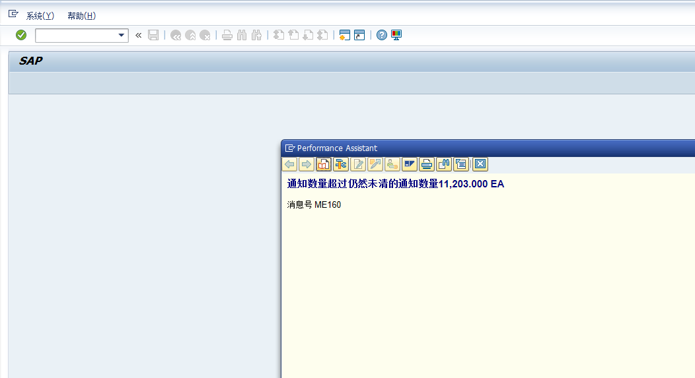
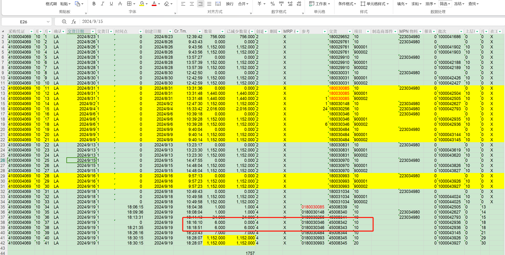
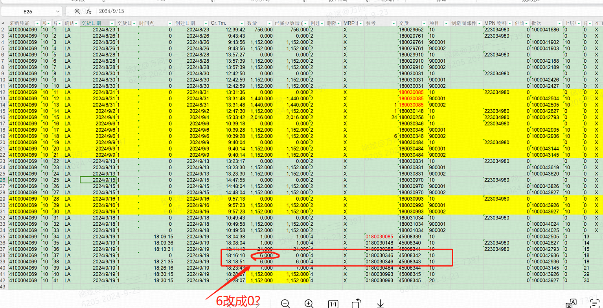

# MM运维
<!-- :::tip
::: -->
<!-- 摘要截止标签 -->
<!-- more -->

## 1.VL31N创建交货单时报错通知数量超过仍然未清的通知数量11,203.000 EA
表-EKES供应商确认
通过表EKES查看供应商确认表发现是有一笔单子数量没更新
当入库的采购订单已经收货，做退货交货出库单，一笔退货好像是突然又不退了，因为我们有内嵌的EWM，在EWM把数量改为0，但SAP的退货交货出库单里数量还是6占用了数量。他们改的表，总感觉怪怪的，觉得有其他更好的方法不用改表我猜。

解决方法：
改表EKES使MENGE按照供应商确认的数量和DABMG已减少数量 (MRP)数量一致