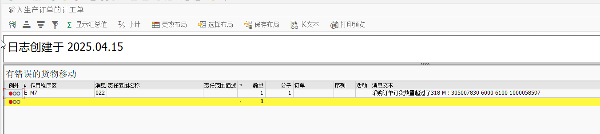
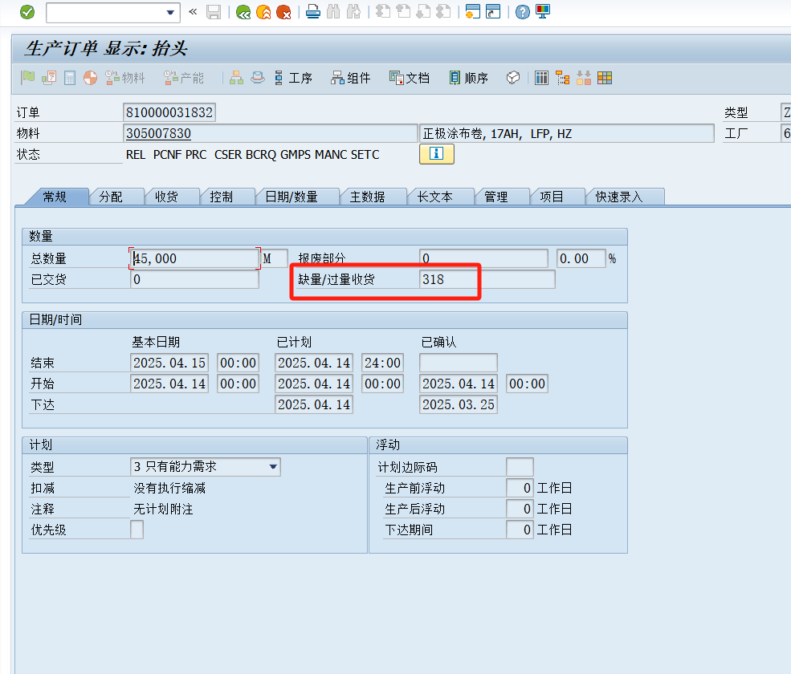
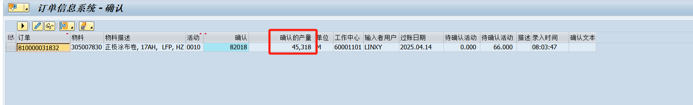
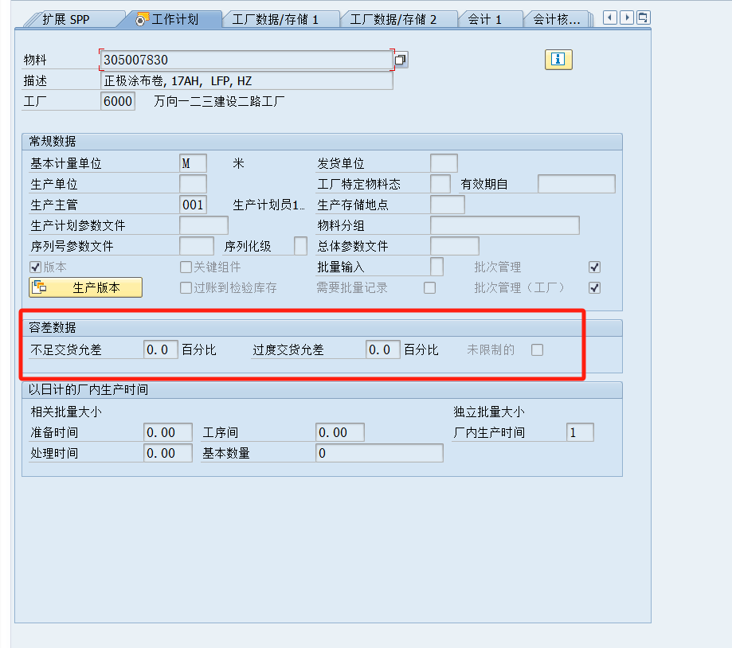
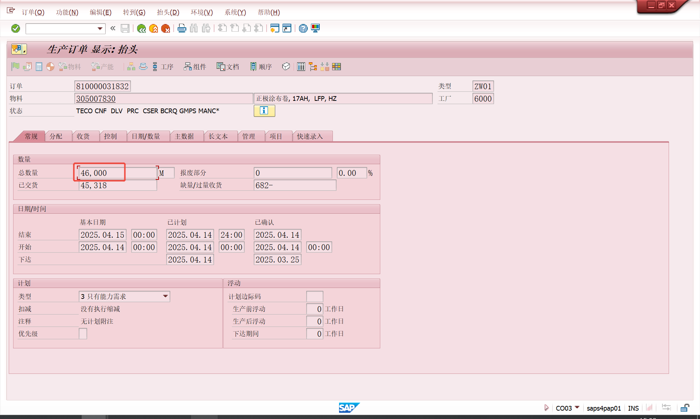
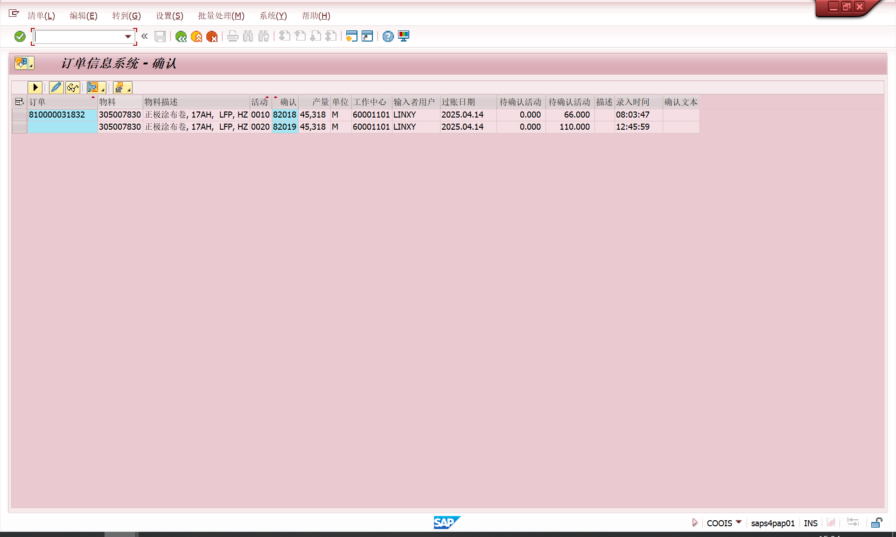
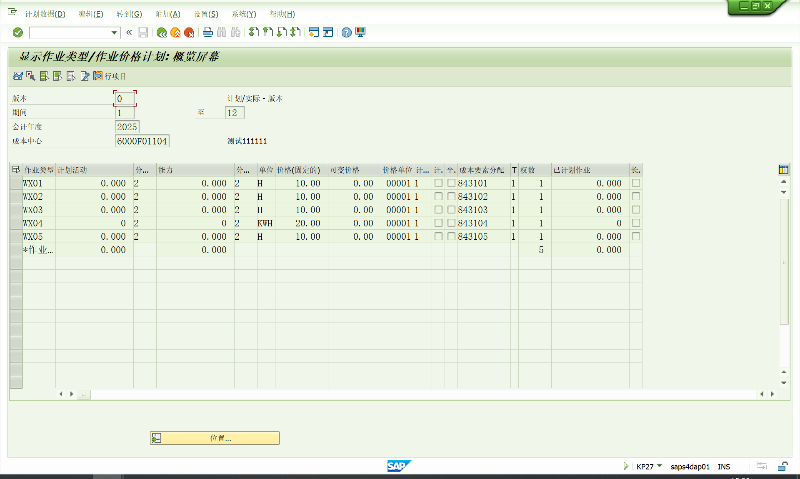
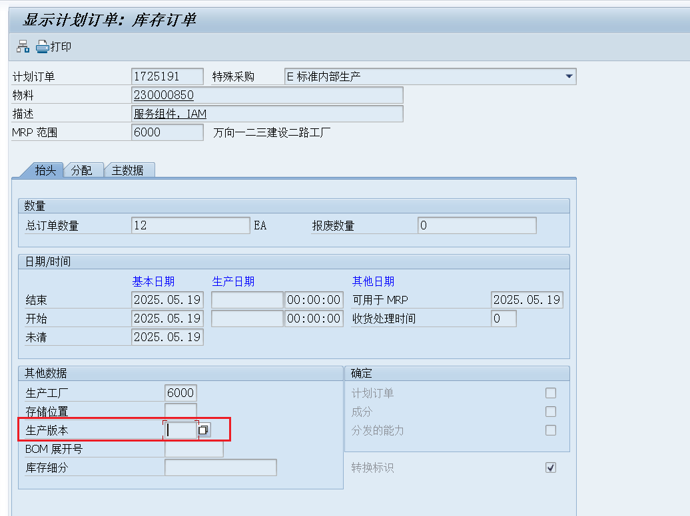
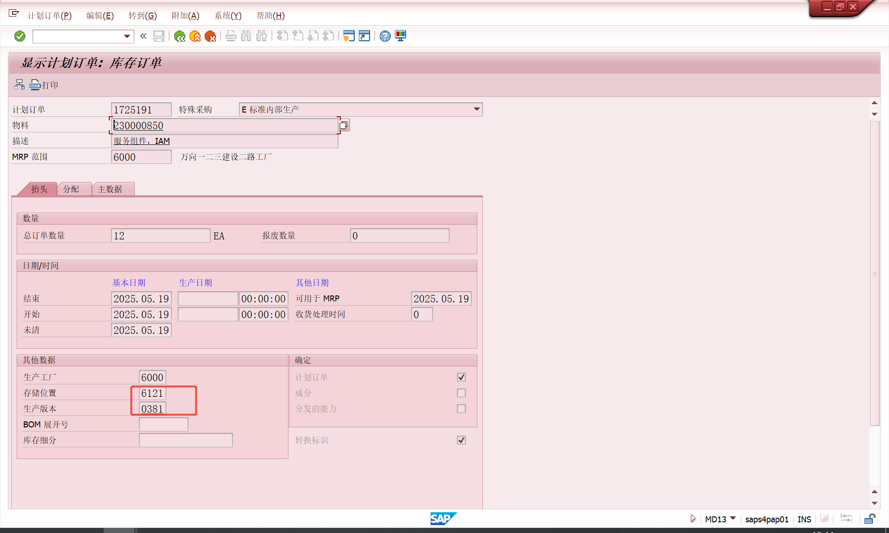

# PP运维
<!-- :::tip
::: -->
<!-- 摘要截止标签 -->
<!-- more -->

## 1. M7 022 订单81000031832在0020工序报工报错

COGI中这个错误，一般是因为生产订单已经做了收货，并且生产订单不允许过量交货，所以报了这个错，看下生产订单是不是已经入库了
报工收货？那你把报工数量改为零 只扣料

原因：报工报多了，所以入库入不了

解决方法:
1. 修改了生产订单的数量使其大于报工数量，然后再报工

<!-- [PO 发布外围系统REST-＞SAP RFC同步接口-Seele_1018](https://blog.csdn.net/qq_44826887/article/details/134922069)
[PO 发布SAP SProxy-＞外围系统 WebService-Seele_1018](https://blog.csdn.net/qq_44826887/article/details/135170299) -->

## 2. KL 023 版本 000 / 2025 作业计划/数量计划中没有 作业类型 1000/6000F01104/WX01 的控制记录
事物代码KP27
创建生产订单时报的错。但可以保存生产订单，好像报工的时候的物料移动无效，物料凭证不生成

- 参考文献
[SAP中成本核算时提示没有作业类型控制记录的实例](https://zhuanlan.zhihu.com/p/440716348)

## 3. CO 893 计划订单1不能从 1转换->记录
计划订单没有对应的生产版本。
可能是创建计划订单的时候生产版本过期了所以没有带出来。

解决方法:
1. 先修改物料的生产版本的有效期
2. MD12修改计划订单，维护生产版本

- 参考文献
[SAP中计划订单集中转换报错处理](https://blog.csdn.net/fish_yu_yu/article/details/146524425)