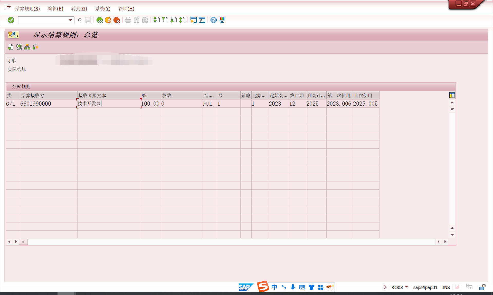
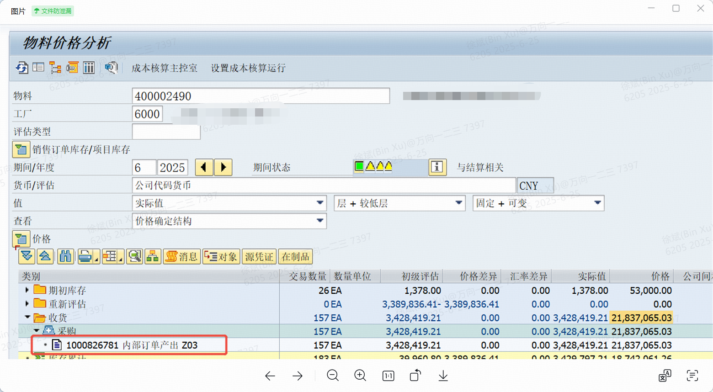

# PP学习
<!-- :::tip
::: -->
<!-- 摘要截止标签 -->
<!-- more -->

## 1. 生产订单执行
该公司的业务反正是这样的:生产订单的领料都是车间根据生产计划然后按照BOM用表格计算的领料需求，投料那个实际就是报工的时候一起做的，系统也会根据工单计算出投料数量，我的理解是工单生成的时候投料的物料需求就生成了，原材料从中心仓到线边仓移动一般都是生产的前一天，跟工单的关系其实不太大，工单我们都是提前一周或者一个月就建好，然后每周调整的

先领料411(TF库存地到库存地,中心仓->中心分仓->线边仓)再投料261(计入生产订单的生产成本)
领料是领到线边仓(从中心仓掉一堆原材料放在产线旁边，然后随着当天的生产领用，一点点的上料到产线上)
创建工单->领料->报工确认(确认工时与进行投料和收货)
创建工单时会自动创建预留，该公司是创建的261投料的预留，锁定线边仓的库存。

## 2. 内部订单
内部订单如研发订单，研发订单领料原材料物料库存价值转研发费用(没使用完一般不会退回至仓库库存)。内部订单产出类似于收货研发订单产出成品研发费用转库存价值。感觉像生产订单只是没有工艺路线和bom这种。

