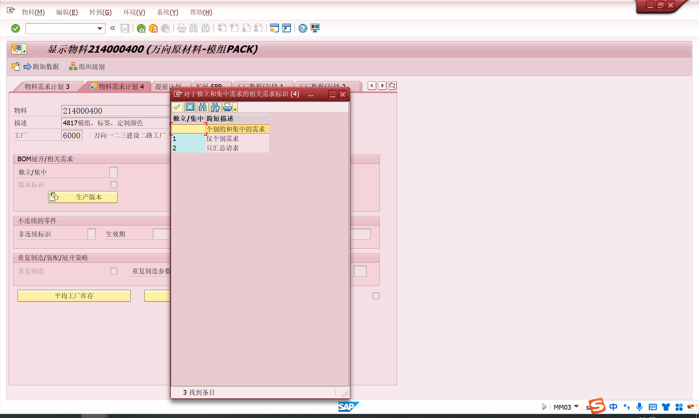
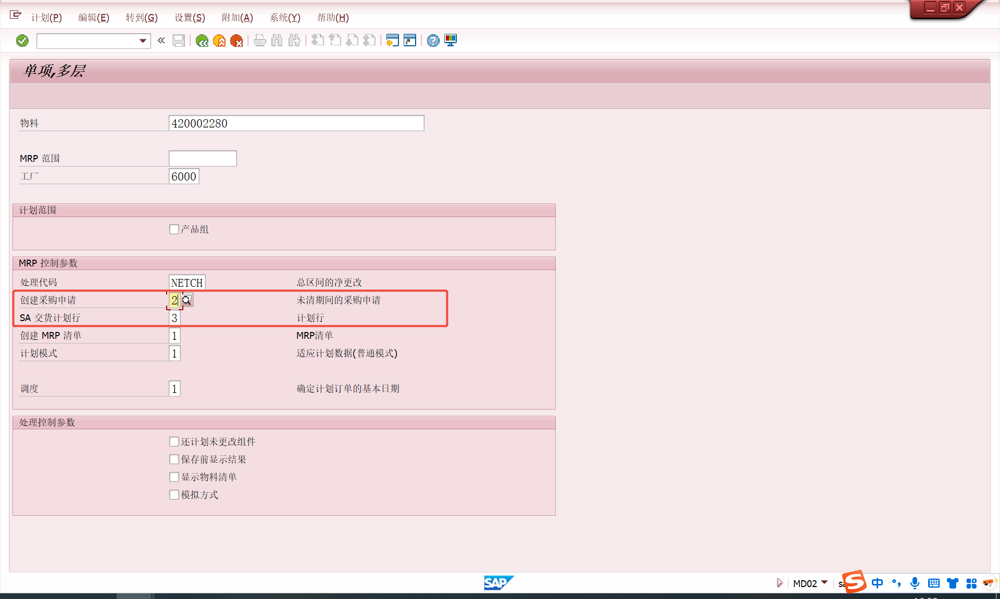
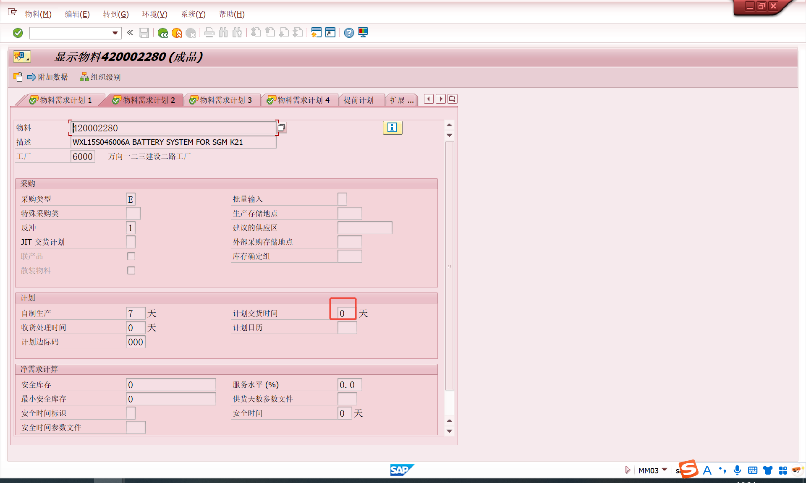

# 主数据对MRP的影响
<!-- :::tip
::: -->
<!-- 摘要截止标签 -->
<!-- more -->

## 主数据对MRP的影响

### MRP类型的定义-物料需求计划1视图
主要用于原材料、半成品
MRP过程-MRP类型：PD 使用MRP

主要用于产成品
MRP过程-MRP类型：M0/M1/M2/M3/M4 使用MPS

## 采购
### 原材料的获取方式（采购模式）-物料需求计划2视图
特殊采购类型控制MRP产生的采购申请的项目类别：正常采购/委外加工采购/寄售采购等

### 原材料的需求来源的类型-物料需求计划4视图
按库存生产（MTS）
按销售订单生产(MTO)
根据独立/集中区分原材料是按销售订单采购，还是按库存采购
如果产成品是按销售订单生产，原材料标识为独立，则原材料为按销售订单采购，采购入库后进入销售订单库存。
若原材料标识设置为集中，则原材料采购入库后，进入普通库存。
如果原材料中相关需求标识符设置为空白，则上层为MT0，原材料为独立（个别）采购，上层物料为MTS的，原材料为集中(汇总)采购。

### 采购申请的固定(Firmed)与MRP
运行MRP时，如通过MD02运行，当计划模式选择3(删除并重新创建计划数据)，系统将会删除非固定(Unfirmed)的采购申请，再根据当时的物料供给情况，决定是否产生以及如何产生新的采购申请。
采购申请审批后系统默认不会设置为固定的，可以通过配置实现已审批的PR自动为固定的。

### 采购获取建议的形式
MRP运行后，对于需要向供应商采购的物料，系统可以有三种获取建议(Procurement Proposal)类型：计划订单、采购申请、计划协议的交货行

物料是否维护MRP组-物料需求计划1视图：

MRP组里参数情况：
事物代码 OMDZ

事物代码屏幕参数以MD02为例：

| 运行方式| MRP组参数	 | 系统行为|获取建议来源|
| ---- | ---- | --- |---- |
| MD01整体运行 | 已维护且非空 | 优先级最高 |按MRP组参数生成 |
| MD01整体运行 | 未维护或为空 | 回退到屏幕参数 |按MD01界面输入生成 |
| MD02单个运行 | 任何状态 | 优先级最低 |仅按MD02界面参数生成 |
<!-- | ... | ... | ... | -->

### 采购提前期与MRP
MRP运行时，系统将根据物料的计划交货时间(采购提前期)以及物料的需求日期得到物料应该下达给供应商的时间(Release date)

采购提前期的设置：物料主数据/采购信息记录
OMDT
| 对原材料的需求日期| 采购提前期	 | 至少下达给供应商的时间|
| ---- | ---- | --- |
| 20251125 | 5天 | 20251120 |

<!-- ### 供应商确定与MRP

### 采购订单执行与MRP

### 采购订单状态与MRP -->

### 采购申请的数量
MRP运行后，系统根据需求产生获取建议(计划订单、采购申请等)，获取建议的数量主要由净需求数量结合批量类型来决定。

EX:获取建议与需求基本上是一一对应。在MTS(按库存生产)的模式下，使用EX批量，如果一天存在多个需求，系统将合并同一天的多个需求创建为一个获取建议，即批量EX按天汇总，并不会真的一一对应。

### 采购申请(计划订单)中的取整方式
- 单位的取整
- 舍入值取整
- 取整参数文件
