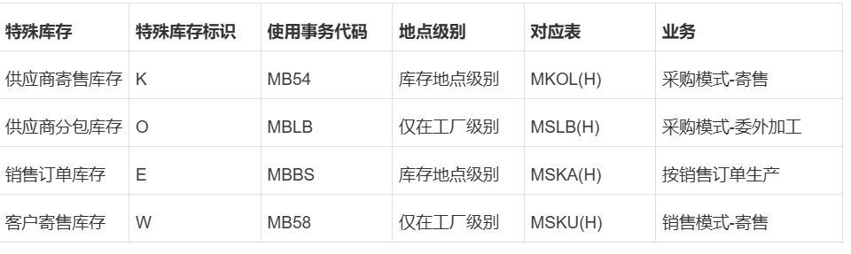

`MM`、`FICO`、`SD`等多个模块的常用表

<!-- more -->

# SAP 常用表速查

## ABAP 常用表
| 常用表 | 描述 |
| --------- | ---- |
| `TSTCT` | 事务代码文本 |
| `CDPOS` | 更改凭证项目(查看修改表的记录)|
| `CDHDR` | 更改凭证抬头|
| `E070` | 更改 & 运输系统: 请求/任务的抬头|
| `E071` | 更改 & 的传输系统: 请求/任务的对象条目|
| `E071K` | 更改 & 传输系统: 请求/任务的代码条目|
| `SETLEAF` | 组中数值|
| `ICON` | 图标表|
| `STXH` | STXD SAPscript 文本文件抬头|
| `STXL` | TXD SAPscript 文本文件行(如销售订单中的长文本)|
| `TFO05` | SAP 条形码|
| `T002` | 语言码|
| `T100` | 消息|
| `GB92` | 替代|
| `GB93` | 确认(校验)|
| `T001K` | 估价范围（工厂）和公司代码|
| `T001` | 公司代码和公司名称|
| `TVKO` | 销售组织和公司代码|
| `T024W ` | 工厂和采购组织|
| ... | ... |

## MM 常用表

在ECC中，物料凭证主要分为抬头表MKPF和行项目表MSEG来存储。另外，还有一套当前库存表（包括MARD、MSLB、MCHB等）和历史库存表（包括MARDH、MSLBH、MCHBH等）。而在S/4HANA中，所有这些物料凭证及库存、历史库存表，全部被一张MATDOC表取代了。新的MATDOC表会记录所有物料凭证数据和其他属性，不再记录在 MKPF 和 MSEG表中。实际库存数据不再记录，而是实时对照MATDOC表算出。

| 常用表 | 描述 |
| --------- | ---- |
| `T16FS` | 采购凭证审批策略底表 |
| `T16FC` | 采购凭证审批代码底表|
| `T16FG` | 采购凭证审批组底表|
| `T156` | 移动类型|
| `MKPF` | 抬头：物料凭证|
| `MSEG` | 凭证段：物料|
| `EKKO` | 采购凭证抬头|
| `EKPO` | 采购凭证项目|
| `EKES` | 供应商确认|
| `MATDOC` | Material Documents|
| ... | ... |

### MM物料相关
| 常用表 | 描述 |
| --------- | ---- |
| `MARA` | 常规物料数据 |
| `MARC` | 物料的工厂数据|
| `MARD` | 物料的仓储位置数据|
| `MVKE` | 物料销售数据|
| `MPGD_MASS` | 计划数据|
| `MLGN` | 每一仓库物料数据|
| `MAKT` | 物料描述|
| `QMAT` | 检验类型 - 物料参数(质量管理视图)|
| `MBEW` | 物料评估|
| `MARM` | 物料的计量单位|
| `MPOP` | 预测参数|
| `MLAN` | 物料的税分类|
| `MLGT` | 每一存储类型的物料数据|
| `T023T` | 物料组描述|
| `T001L` | 仓储地点|
| `BUT100` | BP：角色(业务伙伴角色)|
| `RKPF` | 凭证头：预订(预留)|
| `RESB` | 预定/相关需求|
| ... | ... |

### 库存相关(加H就是历史表)
| 常用表 | 描述 |
| --------- | ---- |
| `MKOL` | 供应商的特殊库存(供应商寄售库存) |
| `MCHB` | 批量库存(批次库存)|
| `MARD` | 物料的仓储位置数据(工厂库存/库存地点库存)|
| `MBEW` | 工厂级别库存|
| `MSKA` | 销售订单库存(销售订单库存)|
| `MSLB` | 供应商特殊库存(供应商委外库存)|
| `MSKU` | 客户的特殊库存|
| ... | ... |

### 采购相关
| 常用表 | 描述 |
| --------- | ---- |
| `EINA` | 采购信息记录-一般数据 |
| `EINE` | 采购信息记录-采购组织数据|
| `EKPO` | 采购凭证项目|
| `EKKO` | 采购凭证抬头|
| `EKKN` | 采购凭证中的帐户设置(科目分配)|
| `EKET` | 计划协议计划行(交货计划)|
| `EKBE` | 采购凭证历史|
| `EBAN` | 采购申请|
| `EBKN` | 采购申请帐户设置(科目分配)|
| `LIPS` | SD凭证:交货项目数据|
| `LIKP` | SD凭证:交货抬头数据(交货单)|
| `LFM1` | 供应商主记录购买组织数据|
| `LFM2` | 供应商主文件记录: 采购数据|
| `LFA1` | 一般层级:供应商主数据 (一般地区)|
| `LFB1` | 公司代码层数据:供应商主数据 (公司代码)|
| `LFBK` | 供应商银行账户:供应商主数据 (银行细目)|
| ... | ... |

## FICO 常用表
| 常用表 | 描述 |
| --------- | ---- |
| `SETHEADER` | 组标题的目录(GS03 集) |
| `SETLEAF` | 组中数值|
| `T005` | 国家|
| `KEKO` | 产品成本核算 - 表头数据|
| `T030K` | 确定税务科目|
| `BKPF ` | 会计核算凭证标题|
| `BSEG ` | 会计核算凭证段|
| `ACDOCA ` | Universal Journal Entry Line Items(通用日记账分录行项目)|
| `FAGLFLEXT ` | 总账汇总表|
| `TTYPT ` | 会计核算的对象类型名称(参考交易，BSEG里的AWTYP字段)|
| `T012K ` | 开户行帐户|
| `T012T ` | 开户行帐户名|
| `TCURR ` | 汇率|
| `BNKA ` | 银行主记录|
| `KNBK ` | 客户主数据 (银行细目)|
| 资产| |
| `ANLA` | 资产主记录段 |
| `ANLB` | 折旧期限|
| `ANLC` | 资产值字段|
| `ANLP` | 资产期间价值|
| 预制凭证| |
| `VBKPF` | 预制凭证的凭证抬头 |
| `VBSEGS` | 凭证预制的凭证段 - 总帐科目数据库|
| `VBSEGK` | 供应商凭证预制的凭证段|
| `VBSEGD` | 客户凭证预制的凭证段|
| `VBSEGA` | 凭证预制的凭证段 - 资产数据库|
| 已过账凭证| |
| `BKPF` | 会计核算凭证标题 |
| `BSEG` | 会计核算凭证段|
| `BSIS` | CSD视图未清账行项目，总账\客户\供应商资产凭证此表中都有|
| `BSAS` | 已清账行项目，总账\客户\供应商资产凭证此表中都有|
| `BSIK` | 未清账行项目，供应商凭证表，相比BSIS，会有供应商凭证独有的字段，比如供应商代码字段|
| `BSAK` | 已清账行项目，供应商凭证表，相比BSAS，会有供应商凭证独有的字段，比如供应商代码字段|
| `BSID` | 未清账行项目，客户凭证表，相比BSIS，会有客户凭证独有的字段，比如客户代码字段|
| `BSAK` | 已清账行项目，客户凭证表，相比BSAS，会有客户凭证独有的字段，比如客户代码字段|
| ... | ... |

### CO成本控制
| 常用表 | 描述 |
| --------- | ---- |
| `COBK` | CO凭证抬头 |
| `COEP` | CO凭证行项目表|
| `COVP` | COBK和COEP对应的视图|
| `COSS` | CO过账汇总表-内部过账（指从CO内部过账的数据，比如成本中心分配、作业报工）|
| `COSP` | CO过账汇总表-外部过账（指从外部模块过账到CO的数据，比如MM/FI）
| ... | ... |

[SAP CO成本控制 相关表-一贴灵](https://www.cnblogs.com/lrzy/p/15602769.html)

## HR 常用表

| 常用表 | 描述 |
| --------- | ---- |
| `T512T` | 工资项文本 |
| `T528T` | 职位文本 |
| `HRP9101` | 信息类型 9101 的 DB 表格 |
| `PA0015` | HR主记录:信息类型0015 (额外支付) |
| `PA0267` | 人力资源主记录: 信息类型 0267 (循环外一次性支付)年终奖啥的 |
| `PA0002` | HR 主记录: 信息类型 0002 (人员数据) |
| `PA0008` | HR 主记录: 信息类型 0008 (基本工资) |
| `PA0022` | HR主记录:信息类型0022 (教育) |
| `PA0000` | HR主记录:信息类别0000(事件) |
| `PA0023` | HR 主记录: 信息类型 0023 (其他/前雇主) |
| `PA9005` | HR 主记录: 信息类别 9005(绩效) |
| `PA0148` | HR 主记录:信息类 0148 (家庭 JP) |
| `PA0528` | 人力资源主记录: 信息类型 0528 (家庭信息) |
| `PA0002` | HR 主记录: 信息类型 0002 (人员数据)   集团工号和姓名 |
| `PA9001` | HR 主记录: 信息类别 9001(奖惩？) |
| `PA9004` | HR 主记录: 信息类别 9004(培训记录) |
| `PA2002` | HR 时间记录:  信息类型 2002 (出勤) |
| `PA0006` | HR主记录:信息类型0006(地址) |
| `PA0021` | HR 主记录: 信息类别 0021 (家庭) |
| `ADRP` | 个人（办公地址管理） （姓名）不对 |
| ... | ... |

## PP 常用表

| 常用表 | 描述 |
| --------- | ---- |
| `AUFK` | 订单主数据 |
| `AFKO` | 订单表头数据 PP 订单 |
| `AFPO` | 订单项 |
| `CRHD` | 工作中心表头 |
| `CAUFV` | 视图 "订单表头 PP/CO" |
| `COVP` | 成本控制对象: 期间和凭证抬头相关的行项目（主要有实际成本的值,虽然有WRTTP字段,但却只能看到4的值.   有5） |
| `AFWI` | 随后过帐的确认货物移动 |
| `M_CRAMA` | 生成的视图，用于 ID CRAM-A(工作中心)    |
| `CRTX` | 工作中心或生产资源/工具文本 |
| ... | ... |

### BOM/工艺路线/生产版本/成本

| 常用表 | 描述 |
| --------- | ---- |
| `MAST` | BOM 链接物料 |
| `STKO` | BOM 表头 |
| `STAS` | BOMs - 项选择 |
| `STPO` | BOM 项目 |
| `STPU` | BOM 子项目 |
| `STZU` | 永久 BOM 数据 |
| `MAPL` | 工艺路线分配任务清单到物料 |
| `PLKO` | 任务清单 - 表头 |
| `AFWI` | 随后过帐的确认货物移动 |
| `PLPO` | 任务清单 - 工序/作业    |
| `PLAS` | 任务清单 - 工序/作业选择 |
| `MKAL` | 物料的生产版本 |
| `AFFL` | Work ordersequence 加工单顺序 |
| `AFFT` | 订单-流程指令 |
| `AFFV` | 订单-流程指令值 |
| `AFRU` | 订单确认 |
| `CKHS` | 抬头：单位成本核算（控制+总计） |
| `CKHT` | CKHS 文本 |
| `CKIP` | 单位成本核算： 期间成本行项 |
| `CKIS` | 项目单位成本核算/产品成本核算分项列举 |
| `CKIT` | CKIS的文本 |
| `COER` | 销售订单值收益 |
| `CRCA` | 工作中心能力分配 |
| `CRCO` | 分配工作中心到成本中心 |
| `CRHD` | 工作中心表头 |
| `CRTX` | 工作中心或生产资源/工具文本 |
| `DOST` | BOM链接文档 |
| `EQST` | BOM链接设备 |
| `KAKO` | 能力表头段 |
| `KAKT` | 能力描述 |
| `KBED` | 能力需求记录 |
| `KEKO` | 产品成本核算 - 表头数据 |
| `KEPH` | 产品成本核算： 制造成本的成本构成 |
| ... | ... |

## SD 常用表

| 常用表 | 描述 |
| --------- | ---- |
| `MVKE` | 物料销售数据 |
| `VBFA` | 销售凭证流 |
| `KNKK` | 客户主数据信贷管理: 控制范围数据 |
| `KNVP` | 客户主记录伙伴功能 |
| `S066` | 未清订单: 信贷管理 |
| `S067` | 未清交货/发票凭证(KM)
| `A305` | 具有审批状态的客户/物料 |
| `KONH` | 条件(抬头) |
| `KONP` | 条件(项目) |
| `KONV` | 条件（事务数据） |
| `VBAP` | 销售凭证:项目数据 |
| `VBAK` | 销售凭证:抬头数据 |
| `VBEP` | 销售凭证:计划行数据 |
| `VBKD` | 销售凭证:业务数据 |
| `VBUK` | 销售凭证:抬头状态和管理数据 |
| `LIKP` | SD凭证:交货抬头数据 |
| `LIPS` | SD凭证:交货:项目数据 |
| `VBRP` | 出具发票:项数据 |
| `VBRK` | 出具发票:抬头数据 |
| `TVM1T/TVM2T/TVM3T` | 物料组1,2,3描述 |
| ... | ... |

## EWM 常用表
WM 和 EWM 不是一个东西

| 常用表 | 描述 |
| --------- | :---- |
| `T340D` | WM 缺省值 |
| `V_T340WME` | 分配仓库编号到分散 SCM 系统的仓库编号(SCM就是ewm吗) |
| `/SCWM/TMAPWHNUM` | 据仓库编号的映射 |
| `/SCWM/VTIMREAGRP` | 维护视图：原因组 |
| `/SCWM/TREASONT` | Description of Reasons 原因描述 |
| `/SCWM/ORDIM_C` | Warehouse Tasks Confirmed仓库任务已确认|
| `/SCWM/V_TMAPSTLO` | ERP 工厂存储位置的定制映射表 |
| `/SCWM/AQUA` | 可用库存 |
| `/SAPAPO/MATLWH` | 上下架策略表 |
| `/SCWM/LAGP` | 存储类型表 |
| `/SCWM/LAGPS` | 仓位排序 |
| `/SCWM/TMAPWHNUM` | 仓库编号的映射 |
| `/SCWM/RSRC` | 资源 |
| `/SCWM/ORDIM_C` | 仓库任务确认表 |
| `/SCWM/ORDIM_L` | 仓库任务日志表 |
| `/SCWM/ORDIM_O` | 未清出库任务表 |
| `/SCWM/ORDIM_H` | 仓库任务：HU移动表 |
| `VBRP` | 出具发票:项数据 |
| `VBRK` | 出具发票:抬头数据 |
| `/SCWM/HUHDR` | 处理单元抬头表 |
| `/SCWM/HUREF` | 处理单元参考 |
| `/SCWM/WHO` | 仓库订单 |
| `/SCWM/DB_ITEMWT` | 发货的仓库任务 |
| `/SCWM/DB_ITEM_TO` | 仓库发货项目 |
| `/SCDL/DB_REFDOC` | 参考文档 |
| `/SCDL/DB_STATUS` | 参考文档状态表 |
| `/SCDL/DB_DF` | 文档状态表 |
| `/SCDL/DB_PROCI_O` | 外向交货单行订单项目表 |
| `/SCDL/DB_PROCH_O` | 外向交货单订单抬头表 |
| `//SCDL/DB_PROCI_I` | 内向交货单行项目表 |
| `/SCDL/DB_PROCH_I` | 内向交货单抬头表 |
| `/SCDL/DB_DLVH_O` | 外向交货单抬头表 |
| `/SCDL/DB_DLVI_O` | 外向交货单行项目表 |
| `/LIME/PI_DCTYTXT` | 描述：EWM库存盘点 |
| `/LIME/PI_DOCTYPE` | 盘点类型设置 |
| `/LIME/PI_DOC_IT` | 盘点行项目 |
| `/LIME/PI_DOC_TB` | 盘点行项目数量 |
| `/LIME/PI_IT_BIZ` | 盘点行项目数量文档 |
| `/LIME/PI_LOGHEAD` | 盘点抬头表 |
| `/LIME/PI_LOGITEM` | 盘点日志表 |
| `/LIME/PI_PAR_BIZ` | 盘点对象表 |
| `/SCWM/T300` | 定义：仓库编号 |
| ... | ... |

[SAP EWM后台表-Ocean !](https://blog.csdn.net/Yyy911228/article/details/127915948)

以上是一些 SAP 系统中的常用表，希望对你的日常工作或学习有所帮助。
